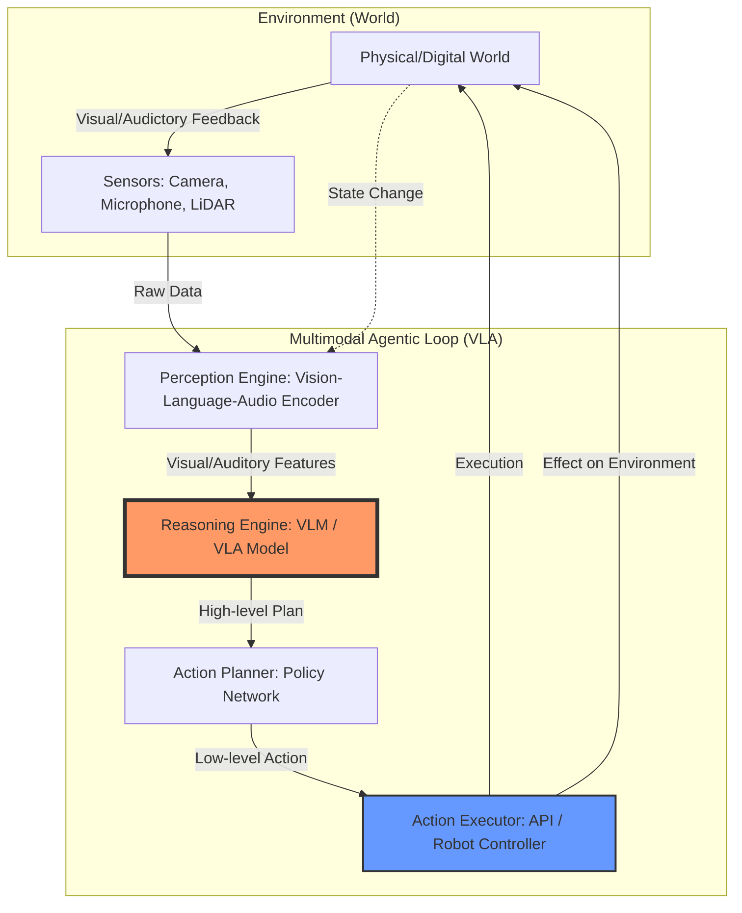

## 1. 序論：LLMからVLA（Vision-Language-Action）へのパラダイムシフト

2023年から2024年にかけて、私たちはLLM（大規模言語モデル）によるテキストベースの「推論」の可能性に驚嘆しました。しかし、2025年、そして現在（2026年）のエンジニアが直面している課題は、テキストの枠を超えた**「身体性（Embodiment）」**の獲得です。

従来のテキスト・エージェントは、外部環境の変化を「テキストによるログ」として受け取る必要がありました。しかし、次世代の**Multimodal Agentic Workflow**は、視覚（Vision）と音声（Audio）を直接的な入力（Perception）として扱い、それに基づいた物理的・デジタル的な操作（Action）を、環境からのフィードバックを受けてリアルタイムに修正する**Closed-loop（閉ループ）**な制御を目指しています。

本記事では、Vision-Language-Action (VLA) モデルを用いた自律的推論のアーキテクチャと、その実装におけるフィードバックループの構築術について、技術的な深掘りを行います。

## 2. VLAアーキテクチャの全体像

VLAエージェントの本質は、単なる「画像のキャプション生成」ではありません。視覚的特徴を、意味論的な言語空間（Language Space）と、実行可能なアクション空間（Action Space）に同時にマッピングする能力にあります。

以下のMermaid図は、感覚フィードバックを伴う自律的推論のワークフローを示しています。



### キーコンポーネントの解説
1.  **Perception Engine**: CLIPやSegment Anything (SAM) の進化系を用い、ピクセル単位のセグメンテーションと、音声のスペクトログラム解析を、単一の潜在空間（Latent Space）へ投影します。
2.  **Reasoning Engine (VLA)**: 入力されたマルチモーダル特徴量から、「何が起きているか（Understanding）」と「次に何をすべきか（Intent）」を同時に推論します。
3.  **Action Executor**: 推論結果を、Pythonスクリプト、SQL、あるいはロボットの関節角度制御（Joint Control）といった、具体的な命令セットに変換しますな。

## 3. 実装：PythonによるClosed-loop Agentic Workflowのシミュレーション

ここでは、視覚的な変化（画像入力の変化）を検知し、それに応じてアクションを修正していく、簡易的なVLAエージェントのループ構造を実装します。

```python
import asyncio
import numpy as np
from typing import List, Dict, Any
from dataclasses import dataclass

@dataclass
class PerceptionFrame:
    visual_features: np.ndarray  # 擬似的な画像特徴量
    audio_features: np.ndarray   # 擬似的な音声特徴量
    timestamp: float

class VLAAgent:
    """
    Vision-Language-Action エージェントのコアロジック
    """
    def __init__(self, model_name: str):
        self.model_name = model_name
        self.memory: List[PerceptionFrame] = []
        self.goal: str = "Pick up the red object"
        self.is_running = True

    async def perceive(self, environment_state: Dict[str, Any]) -> PerceptionFrame:
        """
        環境からセンサーデータを取得し、特徴量に変換（Encoding）
        """
        await asyncio.sleep(0.1)  # センサーの遅延をシミュレート
        # 実際にはここで ViT や Audio Transformer を使用
        visual_feat = environment_state['visual_data']
        audio_feat = environment_state['audio_data']
        return PerceptionFrame(
            visual_features=visual_feat,
            audio_features=audio_feat,
            timestamp=asyncio.get_event_loop().time()
        )

    async def reason(self, frame: PerceptionFrame) -> str:
        """
        VLAモデルによる推論プロセス
        """
        # ここで VLM (Vision-Language Model) が画像と目標を照合
        # 視覚的特徴量(visual_features)から「物体が移動したか」を判定
        action_command = "MOVE_ARM_RIGHT" # デフォルトアクション
        
        # 擬似的な推論ロジック: 赤い物体(feature index 0)の強度が低下したら停止
        if np.mean(frame.visual_features) < 0.3:
            action_command = "STOP_AND_RECALIBRATE"
        elif np.any(frame.audio_features > 0.8):
            action_command = "ALERT_DETECTED_STOP"
            
        return action_command

    async def execute(self, action: str) -> bool:
        """
        アクションの実行と、実行成功のフィードバック
        """
        print(f"[Action] Executing: {action}")
        await asyncio.sleep(0.2)
        # アクションが環境に影響を与えたかを判定（成功/失敗）
        return True

    async def run_loop(self, env_simulator):
        print(f"Starting VLA Agent: {self.model_name}")
        try:
            while self.is_running:
                # 1. Perception (Sense)
                current_state = await env_simulator.get_state()
                frame = await self.perceive(current_state)
                self.memory.append(frame)

                # 2. Reasoning (Think)
                action = await self.reason(frame)

                # 3. Action (Act)
                success = await self.execute(action)

                if not success:
                    print("Action failed. Re-planning...")
                    continue

                # 終了条件の判定（例：タスク完了）
                if action == "TASK_COMPLETE":
                    print("Goal Achieved!")
                    break
                
                # 履歴が多すぎるとメモリを圧迫するため、スライディングウィンドウを適用
                if len(self.memory) > 10:
                    self.memory.pop(0)

        except Exception as e:
            print(f"Agent Error: {e}")
        finally:
            print("Agent loop terminated.")

class EnvironmentSimulator:
    """
    エージェントの外の世界（物理・デジタル環境）
    """
    def __init__(self):
        self.visual_data = np.random.rand(64, 64)
        self.audio_data = np.random.rand(128)

    async def get_state(self):
        # 時間の経過とともに環境が変化（物体が動く、ノイズが入る等）
        self.visual_data = np.roll(self.visual_data, 1, axis=0) * 0.95 
        self.audio_data = np.random.rand(128)
        return {'visual_data': self.visual_data, 'audio_data': self.audio_data}

async def main():
    env = EnvironmentSimulator()
    agent = VLAAgent(model_name="VLA-GPT-2026-v1")
    await agent.run_loop(env)

if __name__ == "__main__":
    asyncio.run(main())
```

## 4. 技術的課題と解決策：遅延と信頼性

VLAエージェントを実用的なレベル（特にロボティクスやリアルタイムエッジコンピューティング）で運用する場合、以下の2つの壁に直面します。

### 4.1. 推論レイテンシとリアルタイム性
マルチモーダルな高次元データの処理は、計算コストが極めて高い。
- **解決策**: **Hierarchical Planning（階層型プランニング）**の導入。
    - **High-level VLM**: 数秒に一度、抽象的な目標（"Find the cup"）を生成。
    ed **Low-level Control Policy (Small VLA)**: ミリ秒単位で、視覚フィードバックに基づき動作を制御。

### 4.2. 視覚的ハルシネーション（Visual Hallucination）
存在しない物体を「ある」と誤認したり、物体の位置を誤認する問題。
- **解決策**: **Temporal Consistency Check（時間的一貫性検証）**。
    - 単一フレームの推論に頼らず、過去 $N$ フレームの時系列データをTransformerのAttention機構に流し込み、物体の一貫性を検証する。

## 5. 結論：エンジニアが次に学ぶべきこと

Multimodal Agentic Workflowへの移行は、単なるモデルのアップグレードではなく、**「ソフトウェアの設計思想」の変革**です。従来の「入力 $\to$ 出力」という決定論的なパイプラインから、「観測 $\to$ 推論 $\to$ 実行 $\to$ 修正」という、動的で確率的なループ構造への設計変更が求められます。

エンジニアは、LLMのプロンプトエンジニアリングだけでなく、**制御理論（Control Theory）**、**時系列データ解析**、そして**センサーフュージョン**の知識を組み合わせることが、次世代のAI Nativeなシステム構築の鍵となります。

---

**関連記事:**
- [Agentic Workflowの基礎：ReActプロンプティングから自律エージェントへ](/posts/2024-01-01-agentic-workflow-basics/)
- [RAGの進化：マルチモーダルな知識検索の実装手法](/posts/2024-03-15-multimodal-rag-evolution/)
- [エッジAIにおける低遅延推論の最適化テクニック](/posts/2024-06-10-edge-ai-optimization/)
