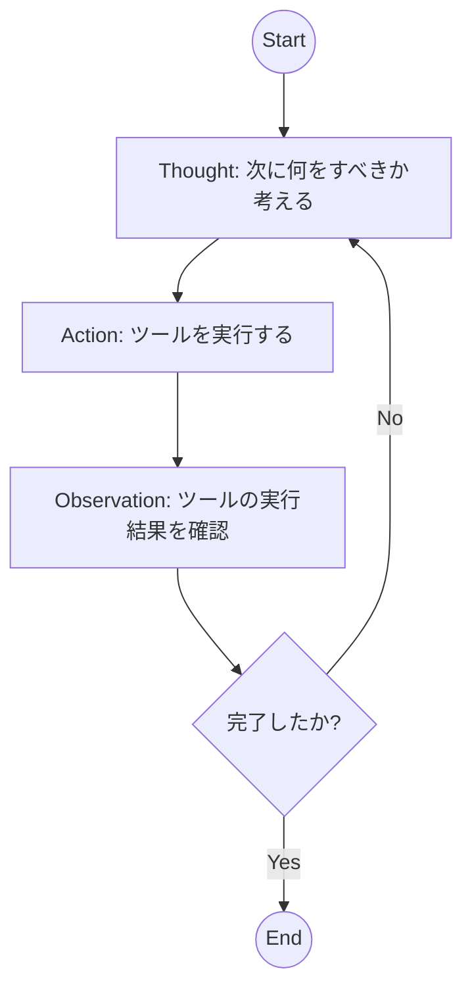
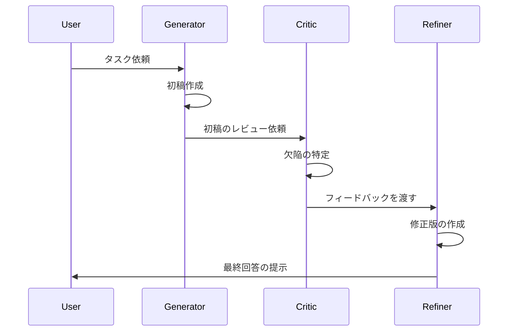

## はじめに：プロンプト・エンジニアリングから「認知アーキテクチャ」の設計へ

2024年までのLLM活用は、いかに優れた「プロンプト」を書くかという、いわば「指示の精度」に依存していました。しかし、2026年の現在、AIエンジニアに求められているのは、単発のプロンプト設計ではありません。LLMを「思考のエンジン」として捉え、その周囲に推論、検証、計画、実行のループを構築する**「認知アーキテクチャ（Cognitive Architecture）」**の設計です。

本記事では、エージェント・ワークフローの核となる3つの主要なデザインパターン（ReAct, Reflection, Plan-and-Execute）を深掘りし、これらを組み合わせた自律型エージェントの構築術を解説します。

---

## 1. ReAct (Reasoning and Acting) ：推論と行動の同期

ReActは、LLMの「推論（Reasoning）」と「外部ツールへのアクセス（Acting）」を交互に繰り返す、エージェント・ワークフローの最も基礎的なパターンです。

### 構造のメカニズム
エージェントは「Thought（思考）」→「Action（行動）」→「Observation（観察）」のサイクルを回します。これにより、LLMは自身の知識の限界を認識し、外部ツール（検索、計算機、API）を用いて不足している情報を補完できます。



### 実装例 (Python)
以下に、簡易的なReActループの構造を示します。

```python
import json

class ReActAgent:
    def __init__(self, llm_client, tools):
        self.llm = llm_client
        self.tools = tools
        self.history = []

    def run(self, prompt):
        self.history.append({"role": "user", "content": prompt})
        
        for _ in range(5):  # 最大5ステップのループ
            # 1. Thought & Action の生成
            response = self.llm.generate(self.history)
            self.history.append({"role": "assistant", "content": response})
            
            print(f"--- Thinking ---\n{response}")

            # 2. Actionの解析 (Format: Action: tool_name(args))
            if "Action:" not in response:
                break
            
            action_line = [l for lle in response.split('\n') if "Action:" in lle][0]
            tool_name, args = self._parse_action(action_line)
            
            # 3. Execution & Observation
            print(f"--- Executing: {tool_name} ---")
            observation = self.tools[tool_name](args)
            print(f"--- Observation: {observation} ---")
            
            self.history.append({"role": "system", "content": f"Observation: {observation}"})

    def _parse_action(self, action_line):
        # 簡易的なパーサー実装
        parts = action_line.replace("Action: ", "").split("(")
        name = parts[0]
        args = parts[1].replace(")", "")
        return name, args

# 使用イメージ
# tools = {"search": web_search_function, "calculator": calc_function}
# agent = ReActAgent(openai_client, tools)
# agent.run("現在の東京の気温に基づき、適切な服装を提案して。")
```

---

## 2. Reflection (Self-Correction) ：自己批判による品質向上

ReActだけでは、LLMが誤った推論（Hallucination）に陥った際に、その間違いに気づけないことがあります。**Reflectionパターン**は、生成された回答に対して「批判者（Critic）」の役割を持つエージェントを配置し、回答を修正させるループです。

### アーキテクブル・フロー
1. **Generator**: 初稿を作成する。
2. **Critic**: 初稿の誤り、論理的矛盾、不足している情報を指摘する。
3. **Refiner**: 指摘に基づき、初稿を修正する。



このパターンは、コード生成や技術文書作成において、バグ率を劇的に下げる効果があります。

---

## 3. Plan-and-Execute ：複雑なタスクの戦略的分解

ReActは逐次的な思考には向いていますが、非常に長いステップ数が必要なタスクでは、途中で目的を見失う（Drifting）問題が発生します。これを解決するのが**Plan-and-Execute**です。

### 設計思想
タスクを最初に「実行可能なサブタスクのリスト」へと分解（Planning）し、その後、各ステップを順番に、あるいは並列に実行（Executing）します。

1. **Planner**: 入力に対し、ステップ1, ステッチ2...というToDoリストを作成。
2. **Executor**: 各ステップをReActエージェント等が実行。
3. **Re-planner**: 実行結果に基づき、残りの計画を更新。

### 実装のヒント
大規模なエージェント設計では、[LangGraph](https://langchain-ai.github.io/langgraph/) のような状態管理（State Management）に優れたライブラリを使用し、グラフ構造としてこれらのパターンを組み込むことが推奨されます。

---

## 4. 2026年のベストプラクティス：ハイブリッド・アプローチ

現代の高度なエージェントは、これらを単独で使うのではなく、**「階層型（Hierarchical）アーキテクチャ」**として統合しています。

| パターン | 最適なユースケース | 課題 |
| :--- | :--- | :--- |
| **ReAct** | リアルタイムな情報検索、API操作 | 長期的な計画性に欠ける |
| **Reflection** | コードレビュー、品質管理、ファクトチェック | 実行コスト（トークン消費）が増大する |
| **Plan-and-Execute** | 複雑なデータ分析、大規模なソフトウェア開発 | 計画の初期段階でのエラーが致命的になる |

**推奨される統合設計:**
1. **Planner**が全体のロードマップを作成。
2. 各ステップの実行には **ReAct** を使用。
3. 各ステップの完了時に **Reflection** を挟んで、成果物の品質を担保。

---

## まとめ：AI Native Engineerへの道

エージェント・ワークフローの設計は、従来の「入出力」の設計から、「思考プロセスとフィードバックループ」の設計へとパラダイムシフトしています。エンジニアの役割は、LLMに何をさせるか（Prompting）だけでなく、LLMがいかに自律的に、かつ正確に思考し続けるか（Orchestration）を定義することに移行しています。

次に学ぶべきは、これらのワークフローを分散システムとして管理する**Multi-Agent Orchestration**の技術です。

---
**関連記事:**
- [LLMエージェントにおける状態管理の設計パターン（内部リンク）](#)
- [RAGからGraphRAGへ：知識構造の高度化（内部リンク）](#)
