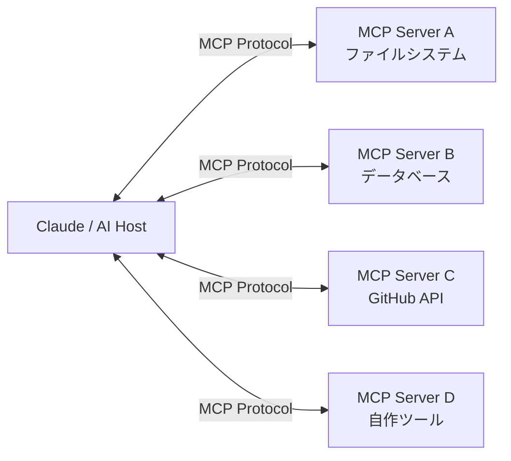

## はじめに

AIエージェントが本当に役に立つには、外部のツールやデータソースと連携できなければなりません。しかしこれまで、各AIプロバイダー・各フレームワークが独自の「ツール呼び出し」仕様を持っており、実装が乱立していました。

**Model Context Protocol（MCP）** は、この問題を解決するためにAnthropicが2024年末に策定したオープン標準です。AIモデルと外部ツールをつなぐ「USB-C」のような規格と言えます。

この記事では以下を解説します：

- MCPの概念とアーキテクチャ
- 既存のMCPサーバーを利用する方法
- Python/TypeScriptでMCPサーバーを自作する方法
- 本番運用で意識すべきポイント

---

## MCPとは何か

### 背景にある問題

従来のツール連携では、以下のような課題がありました：

| 問題 | 内容 |
|------|------|
| ベンダーロックイン | OpenAI Function Calling、LangChain Toolsなど各社独自仕様 |
| 重複実装 | 同じDBコネクタを各フレームワーク向けに別々に実装 |
| セキュリティの不統一 | 認証・認可の実装が各ツールにバラバラ |
| 文脈の欠如 | ツール一覧だけでは「何ができるか」が伝わりにくい |

### MCPが提供する解決策

MCPはJSON-RPC 2.0をベースにした標準プロトコルで、**ホスト（AIクライアント）** と **サーバー（ツール提供側）** を明確に分離します。



MCPサーバーが提供できるリソースは3種類あります：

| リソース種別 | 説明 | 例 |
|------------|------|----|
| **Tools** | AIが呼び出せる関数 | `execute_sql`, `create_file` |
| **Resources** | 読み取り可能なデータ | ファイル内容、DBスキーマ |
| **Prompts** | 再利用可能なプロンプトテンプレート | コードレビュー用プロンプト |

---

## 既存MCPサーバーを使う

まずは、すでに公開されているMCPサーバーを利用してみましょう。

### Claude Desktopでの設定

Claude Desktopは `claude_desktop_config.json` でMCPサーバーを設定できます：

```json
{
  "mcpServers": {
    "filesystem": {
      "command": "npx",
      "args": [
        "-y",
        "@modelcontextprotocol/server-filesystem",
        "/Users/yourname/projects"
      ]
    },
    "github": {
      "command": "npx",
      "args": ["-y", "@modelcontextprotocol/server-github"],
      "env": {
        "GITHUB_PERSONAL_ACCESS_TOKEN": "ghp_xxxx"
      }
    },
    "postgres": {
      "command": "npx",
      "args": [
        "-y",
        "@modelcontextprotocol/server-postgres",
        "postgresql://localhost/mydb"
      ]
    }
  }
}
```

設定後、Claudeは「このプロジェクトのREADMEを読んで、現在の実装上の問題点をリストアップして」のような指示を自律的に実行できます。

### 主要な公式MCPサーバー

```bash
# Anthropic公式リポジトリのサーバー一覧
npx @modelcontextprotocol/server-filesystem  # ファイル操作
npx @modelcontextprotocol/server-github      # GitHub操作
npx @modelcontextprotocol/server-postgres    # PostgreSQL
npx @modelcontextprotocol/server-sqlite      # SQLite
npx @modelcontextprotocol/server-brave-search # Web検索
npx @modelcontextprotocol/server-puppeteer   # ブラウザ操作
```

---

## MCPサーバーを自作する（Python）

既存サーバーにない機能が必要な場合、自作が最も効果的です。

### セットアップ

```bash
pip install mcp
```

### 最小限のMCPサーバー

```python
# server.py
from mcp.server import Server
from mcp.server.stdio import stdio_server
from mcp.types import Tool, TextContent
import asyncio
import json

# サーバーインスタンスの作成
server = Server("my-custom-server")

@server.list_tools()
async def list_tools() -> list[Tool]:
    """利用可能なツールの一覧を返す"""
    return [
        Tool(
            name="calculate",
            description="数式を計算します。四則演算と基本的な数学関数をサポート。",
            inputSchema={
                "type": "object",
                "properties": {
                    "expression": {
                        "type": "string",
                        "description": "計算する数式 (例: '2 + 3 * 4', 'sqrt(16)')"
                    }
                },
                "required": ["expression"]
            }
        ),
        Tool(
            name="get_weather",
            description="指定した都市の現在の天気を取得します。",
            inputSchema={
                "type": "object",
                "properties": {
                    "city": {
                        "type": "string",
                        "description": "天気を調べる都市名（日本語可）"
                    }
                },
                "required": ["city"]
            }
        )
    ]

@server.call_tool()
async def call_tool(name: str, arguments: dict) -> list[TextContent]:
    """ツールを実行し結果を返す"""
    
    if name == "calculate":
        expression = arguments["expression"]
        try:
            # 安全な評価のため、mathモジュールのみ許可
            import math
            allowed_names = {k: v for k, v in math.__dict__.items() if not k.startswith("_")}
            allowed_names.update({"abs": abs, "round": round})
            result = eval(expression, {"__builtins__": {}}, allowed_names)
            return [TextContent(type="text", text=f"計算結果: {expression} = {result}")]
        except Exception as e:
            return [TextContent(type="text", text=f"計算エラー: {str(e)}")]
    
    elif name == "get_weather":
        city = arguments["city"]
        # 実際はAPIを呼び出す。ここではダミーデータ
        weather_data = {
            "東京": {"temp": 18, "condition": "晴れ", "humidity": 45},
            "大阪": {"temp": 20, "condition": "曇り", "humidity": 60},
        }
        data = weather_data.get(city, {"temp": "不明", "condition": "不明", "humidity": "不明"})
        result = json.dumps(data, ensure_ascii=False)
        return [TextContent(type="text", text=f"{city}の天気: {result}")]
    
    else:
        return [TextContent(type="text", text=f"不明なツール: {name}")]

async def main():
    async with stdio_server() as (read_stream, write_stream):
        await server.run(read_stream, write_stream, server.create_initialization_options())

if __name__ == "__main__":
    asyncio.run(main())
```

### Claude Desktopへの登録

```json
{
  "mcpServers": {
    "my-custom": {
      "command": "python",
      "args": ["/path/to/server.py"]
    }
  }
}
```

---

## 実践的なMCPサーバー：社内APIラッパー

実際のユースケースとして、社内APIをMCPでラップする例を見てみましょう。

```python
# internal_api_server.py
from mcp.server import Server
from mcp.server.stdio import stdio_server
from mcp.types import Tool, TextContent, Resource, TextResourceContents
import asyncio
import httpx
import os
from datetime import datetime

server = Server("internal-api-server")

# 社内APIクライアント
API_BASE_URL = os.environ.get("INTERNAL_API_URL", "http://api.internal.example.com")
API_TOKEN = os.environ.get("INTERNAL_API_TOKEN", "")

async def api_request(method: str, path: str, **kwargs) -> dict:
    """社内APIへのリクエストを共通処理"""
    async with httpx.AsyncClient() as client:
        headers = {"Authorization": f"Bearer {API_TOKEN}"}
        response = await client.request(
            method,
            f"{API_BASE_URL}{path}",
            headers=headers,
            timeout=30.0,
            **kwargs
        )
        response.raise_for_status()
        return response.json()

@server.list_resources()
async def list_resources():
    """読み取り可能なリソース一覧"""
    from mcp.types import Resource
    return [
        Resource(
            uri="internal://api/schema",
            name="APIスキーマ",
            description="社内APIの全エンドポイント定義",
            mimeType="application/json"
        )
    ]

@server.read_resource()
async def read_resource(uri: str):
    """リソースの内容を返す"""
    if uri == "internal://api/schema":
        schema = await api_request("GET", "/docs/openapi.json")
        import json
        return TextResourceContents(
            uri=uri,
            mimeType="application/json",
            text=json.dumps(schema, ensure_ascii=False, indent=2)
        )

@server.list_tools()
async def list_tools() -> list[Tool]:
    return [
        Tool(
            name="search_users",
            description="社員情報を検索します。名前・部署・メールアドレスで絞り込み可能。",
            inputSchema={
                "type": "object",
                "properties": {
                    "query": {"type": "string", "description": "検索クエリ"},
                    "department": {"type": "string", "description": "部署名（任意）"},
                    "limit": {"type": "integer", "description": "取得件数（デフォルト: 10）", "default": 10}
                },
                "required": ["query"]
            }
        ),
        Tool(
            name="create_ticket",
            description="サポートチケットを作成します。",
            inputSchema={
                "type": "object",
                "properties": {
                    "title": {"type": "string", "description": "チケットのタイトル"},
                    "description": {"type": "string", "description": "詳細説明"},
                    "priority": {
                        "type": "string",
                        "enum": ["low", "medium", "high", "critical"],
                        "description": "優先度"
                    },
                    "assignee_email": {"type": "string", "description": "担当者メール（任意）"}
                },
                "required": ["title", "description", "priority"]
            }
        ),
        Tool(
            name="get_sales_report",
            description="売上レポートを取得します。期間を指定して集計データを返します。",
            inputSchema={
                "type": "object",
                "properties": {
                    "start_date": {"type": "string", "description": "開始日 (YYYY-MM-DD)"},
                    "end_date": {"type": "string", "description": "終了日 (YYYY-MM-DD)"},
                    "group_by": {
                        "type": "string",
                        "enum": ["day", "week", "month"],
                        "description": "集計単位",
                        "default": "month"
                    }
                },
                "required": ["start_date", "end_date"]
            }
        )
    ]

@server.call_tool()
async def call_tool(name: str, arguments: dict) -> list[TextContent]:
    import json
    
    try:
        if name == "search_users":
            params = {"q": arguments["query"], "limit": arguments.get("limit", 10)}
            if "department" in arguments:
                params["dept"] = arguments["department"]
            result = await api_request("GET", "/users/search", params=params)
            return [TextContent(type="text", text=json.dumps(result, ensure_ascii=False, indent=2))]
        
        elif name == "create_ticket":
            payload = {
                "title": arguments["title"],
                "description": arguments["description"],
                "priority": arguments["priority"],
                "created_at": datetime.now().isoformat()
            }
            if "assignee_email" in arguments:
                payload["assignee_email"] = arguments["assignee_email"]
            result = await api_request("POST", "/tickets", json=payload)
            return [TextContent(type="text", text=f"チケット作成完了: #{result['id']} - {result['url']}")]
        
        elif name == "get_sales_report":
            params = {
                "start": arguments["start_date"],
                "end": arguments["end_date"],
                "group_by": arguments.get("group_by", "month")
            }
            result = await api_request("GET", "/reports/sales", params=params)
            return [TextContent(type="text", text=json.dumps(result, ensure_ascii=False, indent=2))]
        
        else:
            return [TextContent(type="text", text=f"不明なツール: {name}")]
    
    except httpx.HTTPError as e:
        return [TextContent(type="text", text=f"APIエラー: {str(e)}")]

async def main():
    async with stdio_server() as (read_stream, write_stream):
        await server.run(read_stream, write_stream, server.create_initialization_options())

if __name__ == "__main__":
    asyncio.run(main())
```

---

## MCPサーバーを自作する（TypeScript）

Node.js/TypeScript環境での実装も見てみましょう。

```typescript
// src/server.ts
import { Server } from "@modelcontextprotocol/sdk/server/index.js";
import { StdioServerTransport } from "@modelcontextprotocol/sdk/server/stdio.js";
import {
  CallToolRequestSchema,
  ListToolsRequestSchema,
} from "@modelcontextprotocol/sdk/types.js";
import * as fs from "fs/promises";
import * as path from "path";

const server = new Server(
  { name: "file-analyzer", version: "1.0.0" },
  { capabilities: { tools: {} } }
);

// ツール一覧の定義
server.setRequestHandler(ListToolsRequestSchema, async () => ({
  tools: [
    {
      name: "analyze_directory",
      description: "ディレクトリの構造と各ファイルの概要を分析します。",
      inputSchema: {
        type: "object",
        properties: {
          dir_path: {
            type: "string",
            description: "分析するディレクトリのパス",
          },
          depth: {
            type: "number",
            description: "探索深さ（デフォルト: 2）",
            default: 2,
          },
        },
        required: ["dir_path"],
      },
    },
    {
      name: "count_lines",
      description: "ファイルまたはディレクトリ内のコード行数を集計します。",
      inputSchema: {
        type: "object",
        properties: {
          target_path: { type: "string", description: "対象のパス" },
          extensions: {
            type: "array",
            items: { type: "string" },
            description: "対象拡張子リスト（例: ['.ts', '.js']）",
          },
        },
        required: ["target_path"],
      },
    },
  ],
}));

// ツール実行ハンドラー
server.setRequestHandler(CallToolRequestSchema, async (request) => {
  const { name, arguments: args } = request.params;

  if (name === "analyze_directory") {
    const result = await analyzeDirectory(
      args!.dir_path as string,
      (args!.depth as number) ?? 2
    );
    return { content: [{ type: "text", text: result }] };
  }

  if (name === "count_lines") {
    const result = await countLines(
      args!.target_path as string,
      (args!.extensions as string[]) ?? [".ts", ".js", ".py"]
    );
    return { content: [{ type: "text", text: result }] };
  }

  throw new Error(`不明なツール: ${name}`);
});

async function analyzeDirectory(dirPath: string, depth: number): Promise<string> {
  const lines: string[] = [`📁 ${dirPath}`];

  async function walk(dir: string, indent: number) {
    if (indent >= depth) return;
    const entries = await fs.readdir(dir, { withFileTypes: true });
    for (const entry of entries) {
      if (entry.name.startsWith(".") || entry.name === "node_modules") continue;
      const prefix = "  ".repeat(indent + 1);
      if (entry.isDirectory()) {
        lines.push(`${prefix}📁 ${entry.name}/`);
        await walk(path.join(dir, entry.name), indent + 1);
      } else {
        const stat = await fs.stat(path.join(dir, entry.name));
        const size = (stat.size / 1024).toFixed(1);
        lines.push(`${prefix}📄 ${entry.name} (${size}KB)`);
      }
    }
  }

  await walk(dirPath, 0);
  return lines.join("\n");
}

async function countLines(targetPath: string, extensions: string[]): Promise<string> {
  let total = 0;
  const byExt: Record<string, number> = {};

  async function processFile(filePath: string) {
    const ext = path.extname(filePath);
    if (!extensions.includes(ext)) return;
    const content = await fs.readFile(filePath, "utf-8");
    const lines = content.split("\n").length;
    total += lines;
    byExt[ext] = (byExt[ext] ?? 0) + lines;
  }

  async function walk(p: string) {
    const stat = await fs.stat(p);
    if (stat.isFile()) {
      await processFile(p);
    } else {
      const entries = await fs.readdir(p);
      for (const entry of entries) {
        if (entry === "node_modules" || entry.startsWith(".")) continue;
        await walk(path.join(p, entry));
      }
    }
  }

  await walk(targetPath);

  const breakdown = Object.entries(byExt)
    .map(([ext, count]) => `  ${ext}: ${count.toLocaleString()} 行`)
    .join("\n");

  return `総行数: ${total.toLocaleString()} 行\n内訳:\n${breakdown}`;
}

// サーバー起動
const transport = new StdioServerTransport();
await server.connect(transport);
```

```bash
# セットアップ
npm init -y
npm install @modelcontextprotocol/sdk
npx tsc
```

---

## セキュリティ設計のベストプラクティス

MCPサーバーはAIが自律的に呼び出すため、セキュリティが非常に重要です。

### 1. 入力バリデーション

```python
from pydantic import BaseModel, validator, Field
from typing import Optional
import re

class CreateTicketInput(BaseModel):
    title: str = Field(..., min_length=1, max_length=200)
    description: str = Field(..., min_length=10, max_length=5000)
    priority: str = Field(..., pattern="^(low|medium|high|critical)$")
    assignee_email: Optional[str] = None

    @validator("assignee_email")
    def validate_email(cls, v):
        if v and not re.match(r"^[^@]+@[^@]+\.[^@]+$", v):
            raise ValueError("無効なメールアドレス形式")
        return v

@server.call_tool()
async def call_tool(name: str, arguments: dict) -> list[TextContent]:
    if name == "create_ticket":
        # Pydanticで入力を検証
        try:
            validated = CreateTicketInput(**arguments)
        except Exception as e:
            return [TextContent(type="text", text=f"入力エラー: {str(e)}")]
        
        # 検証済みデータのみ使用
        result = await api_request("POST", "/tickets", json=validated.dict(exclude_none=True))
        return [TextContent(type="text", text=f"チケット作成: #{result['id']}")]
```

### 2. 権限の最小化

```python
# 読み取り専用と書き込みありでサーバーを分ける
READ_ONLY_MODE = os.environ.get("MCP_READ_ONLY", "false").lower() == "true"

@server.call_tool()
async def call_tool(name: str, arguments: dict) -> list[TextContent]:
    # 書き込み系ツールはREAD_ONLYモードで拒否
    write_tools = {"create_ticket", "update_user", "delete_record"}
    if READ_ONLY_MODE and name in write_tools:
        return [TextContent(type="text", text=f"エラー: 読み取り専用モードでは {name} を実行できません")]
    # ...
```

### 3. 監査ログ

```python
import logging
import json
from datetime import datetime

audit_logger = logging.getLogger("mcp.audit")

@server.call_tool()
async def call_tool(name: str, arguments: dict) -> list[TextContent]:
    start_time = datetime.now()
    
    try:
        result = await _execute_tool(name, arguments)
        audit_logger.info(json.dumps({
            "timestamp": start_time.isoformat(),
            "tool": name,
            "args_keys": list(arguments.keys()),  # 値は含めない（機密保護）
            "status": "success",
            "duration_ms": (datetime.now() - start_time).total_seconds() * 1000
        }))
        return result
    except Exception as e:
        audit_logger.error(json.dumps({
            "timestamp": start_time.isoformat(),
            "tool": name,
            "status": "error",
            "error": str(e)
        }))
        raise
```

---

## MCPをLangChainやOpenAIから利用する

MCPはClaudeだけのものではありません。任意のAIフレームワークから利用できます。

```python
# LangChain + MCP の統合例
from langchain_mcp_adapters.tools import load_mcp_tools
from langchain_openai import ChatOpenAI
from langgraph.prebuilt import create_react_agent
from mcp import ClientSession, StdioServerParameters
from mcp.client.stdio import stdio_client
import asyncio

async def run_agent():
    # MCPサーバーへの接続
    server_params = StdioServerParameters(
        command="python",
        args=["internal_api_server.py"],
        env={"INTERNAL_API_TOKEN": "your_token"}
    )
    
    async with stdio_client(server_params) as (read, write):
        async with ClientSession(read, write) as session:
            await session.initialize()
            
            # MCPツールをLangChainツールに変換
            tools = await load_mcp_tools(session)
            
            # OpenAI GPT-4 + MCPツール でエージェント作成
            llm = ChatOpenAI(model="gpt-4o", temperature=0)
            agent = create_react_agent(llm, tools)
            
            result = await agent.ainvoke({
                "messages": [{"role": "user", "content": "先月の売上レポートを取得して、前月比を計算してください"}]
            })
            
            print(result["messages"][-1].content)

asyncio.run(run_agent())
```

---

## よくある問題と解決策

### タイムアウトエラー

```python
# ✗ デフォルトタイムアウトでは重い処理が失敗することがある
async with httpx.AsyncClient() as client:
    response = await client.get(url)

# ✓ 処理の特性に合わせたタイムアウト設定
async with httpx.AsyncClient(timeout=httpx.Timeout(connect=5.0, read=60.0)) as client:
    response = await client.get(url)
```

### JSONシリアライズエラー

```python
import json
from decimal import Decimal
from datetime import datetime

class MCPJSONEncoder(json.JSONEncoder):
    """MCPレスポンス用のJSONエンコーダー"""
    def default(self, obj):
        if isinstance(obj, Decimal):
            return float(obj)
        if isinstance(obj, datetime):
            return obj.isoformat()
        return super().default(obj)

# 使い方
result_text = json.dumps(data, cls=MCPJSONEncoder, ensure_ascii=False)
```

### ツールの説明文が不十分で誤呼び出しが発生する

AIがツールを選択する際、**description** の質が決定的に重要です。

```python
# ✗ 説明が曖昧
Tool(
    name="get_data",
    description="データを取得します。",
    ...
)

# ✓ いつ使うか・何が返るかを明確に記載
Tool(
    name="get_sales_report",
    description=(
        "指定期間の売上レポートを取得します。"
        "期間内の総売上・商品別売上・前期比などが含まれます。"
        "財務分析や売上予測の質問に答える際に使用してください。"
        "顧客情報や在庫情報は含まれません。"
    ),
    ...
)
```

---

## まとめ

MCPは「AIエージェントとツールをつなぐ標準規格」として、急速に普及しています。

| 学んだこと | ポイント |
|-----------|---------|
| MCPの概念 | ホスト/サーバー分離によるベンダー非依存な連携 |
| 既存サーバーの利用 | `claude_desktop_config.json` で設定するだけ |
| Pythonでの自作 | `mcp` ライブラリで Tools / Resources / Prompts を定義 |
| セキュリティ | 入力バリデーション・権限最小化・監査ログの3本柱 |
| 他フレームワーク連携 | `langchain-mcp-adapters` でLangChainからも利用可能 |

MCPの普及により、「社内のすべてのシステムをAIエージェントから安全に操作できる」という未来が現実になりつつあります。自社のAPIやツールをMCPでラップしておくことが、AIネイティブなエンジニアの重要な仕事になるでしょう。

### 次のステップ

- [LangChainで作るAIエージェント入門](/2025-02-05-langchain-agent-tutorial) でエージェントの基礎を学ぶ
- [AI時代のソフトウェアアーキテクチャ](/2025-03-05-llm-architecture-patterns) でシステム設計パターンを深める
- [Anthropic MCP公式ドキュメント](https://modelcontextprotocol.io/) でより詳細な仕様を確認する

---

*参考資料*
- *[Model Context Protocol Specification](https://spec.modelcontextprotocol.io/) - Anthropic (2024)*
- *[MCP GitHub Organization](https://github.com/modelcontextprotocol) - 公式SDKとサーバー実装*
- *[langchain-mcp-adapters](https://github.com/langchain-ai/langchain-mcp-adapters) - LangChain統合ライブラリ*
