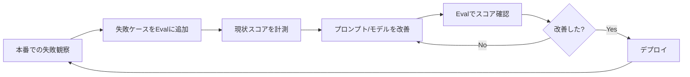

## はじめに：「なんとなく動いている」AIから脱却する

あなたのLLMアプリは、本当に改善されていますか？

プロンプトを少し変えたら「なんとなく良くなった気がする」——そんな直感頼りの開発を続けていませんか？それは非常に危険です。**AIネイティブエンジニアにとって、LLMアプリを測定・評価する能力は、コードを書く能力と同じくらい重要です。**

LLM Evals（評価）とは、AIシステムの出力品質を客観的・定量的に測定するプロセスです。ソフトウェア開発における単体テストのように、Evalsを整備することで：

- プロンプト変更や新モデルへの切り替えが「安全」になる
- どの変更が実際に品質を改善したかを客観的に判断できる
- 本番環境での品質劣化を早期に検知できる

この記事では、**LLMアプリ評価の理論から実装まで**を徹底解説します。

## LLM Evalsとは何か

### 従来のソフトウェアテストとの違い

従来のソフトウェアテストでは、入力と期待される出力が明確に定まっています。

```python
# 通常のユニットテスト
def test_add():
    assert add(1, 2) == 3  # 正解は常に3
```

LLMの出力は確率的であり、「正解」が一意に定まらない場合がほとんどです。

```python
# LLMの出力をどう評価する？
response = llm.generate("日本の首都はどこですか？")
# "東京です。" も "東京" も "東京都です。" も正解
# 自由回答の場合はさらに複雑
```

このため、LLM Evalsには専用のアプローチが必要です。

### 評価の3層構造

LLM Evalsは以下の3層で考えると整理しやすくなります。

| 層 | 評価対象 | 例 |
|----|---------|-----|
| **Unit Evals** | 単一のLLM呼び出し | 「この要約は正確か」 |
| **Integration Evals** | エージェントのステップ連鎖 | 「ツール選択は適切か」 |
| **End-to-End Evals** | ユーザーゴールの達成 | 「タスクを完遂できたか」 |

実践では、この3層をバランス良く整備することが重要です。

## 評価指標の設計

### 正解ラベルがある場合：参照ベース評価

期待される出力（ゴールデンデータ）が存在する場合は、それとの一致度を測定します。

**完全一致（Exact Match）**

```python
def exact_match(prediction: str, reference: str) -> float:
    return 1.0 if prediction.strip() == reference.strip() else 0.0
```

シンプルですが、同義語や表現の揺らぎに対応できません。

**意味的類似度（Semantic Similarity）**

```python
from sentence_transformers import SentenceTransformer, util

model = SentenceTransformer("paraphrase-multilingual-mpnet-base-v2")

def semantic_similarity(prediction: str, reference: str) -> float:
    embeddings = model.encode([prediction, reference])
    score = util.cos_sim(embeddings[0], embeddings[1])
    return float(score)

# 例
score = semantic_similarity(
    "東京は日本の首都です。",
    "日本の首都は東京である。"
)
print(score)  # 約0.93 — 意味的に近い
```

**ROUGE / BLEUスコア**

要約・翻訳タスクではROUGEやBLEUがよく使われます。

```python
from rouge_score import rouge_scorer

scorer = rouge_scorer.RougeScorer(["rouge1", "rouge2", "rougeL"], use_stemmer=False)

prediction = "LLMは自然言語処理の革命をもたらした。"
reference = "LLMは自然言語処理に革命を起こした。"

scores = scorer.score(reference, prediction)
print(f"ROUGE-1: {scores['rouge1'].fmeasure:.3f}")
print(f"ROUGE-L: {scores['rougeL'].fmeasure:.3f}")
```

### 正解ラベルがない場合：モデルベース評価

自由回答や創作タスクでは「正解」が存在しません。この場合、**LLM-as-a-Judge** パターンが有効です。

## LLM-as-a-Judge：LLMでLLMを評価する

### 基本パターン

評価用のLLMに、採点基準と出力を与えて評価させます。


```python
from openai import OpenAI

client = OpenAI()

JUDGE_PROMPT = """あなたはAIアシスタントの回答品質を評価する専門家です。
以下の基準で回答を1〜5点で採点し、理由を説明してください。

採点基準:
- 正確性: 事実に基づいているか (1-5)
- 網羅性: 質問に十分答えているか (1-5)
- 簡潔性: 不要な情報がないか (1-5)

出力形式（JSONで回答）:
{{
  "accuracy": <スコア>,
  "completeness": <スコア>,
  "conciseness": <スコア>,
  "overall": <平均スコア>,
  "reasoning": "<評価理由>"
}}

ユーザーの質問:
{question}

AIの回答:
{response}"""

def llm_judge(question: str, response: str) -> dict:
    result = client.chat.completions.create(
        model="gpt-4o",
        messages=[
            {
                "role": "user",
                "content": JUDGE_PROMPT.format(
                    question=question,
                    response=response
                )
            }
        ],
        response_format={"type": "json_object"},
        temperature=0  # 評価の一貫性のため温度は0
    )
    import json
    return json.loads(result.choices[0].message.content)

# 使用例
scores = llm_judge(
    question="RAGとファインチューニングの違いを教えてください",
    response="RAGは検索拡張生成で、外部ドキュメントを参照します。..."
)
print(scores)
```



### 評価バイアスへの対処

LLM-as-a-Judgeには以下のバイアスが知られています：

| バイアス | 説明 | 対処法 |
|---------|------|--------|
| **Position Bias** | リストの最初の回答を優遇 | 順序をランダム化して複数回評価 |
| **Verbosity Bias** | 長い回答を高評価する傾向 | 評価基準に「簡潔さ」を明示 |
| **Self-enhancement Bias** | 同じプロバイダーのモデル回答を優遇 | 評価モデルと生成モデルを別プロバイダーにする |
| **Sycophancy** | 「これは良い回答ですか？」と聞くと「はい」と答えやすい | 評価前に回答を提示しない |


```python
def robust_llm_judge(question: str, response_a: str, response_b: str) -> dict:
    """バイアス軽減のため、A/B比較評価を使う"""
    
    # 正順で評価
    result_normal = client.chat.completions.create(
        model="gpt-4o",
        messages=[{
            "role": "user",
            "content": f"""以下の2つの回答を比較して、どちらが質問に対してより良い回答かを評価してください。

質問: {question}

回答A: {response_a}
回答B: {response_b}

「A」「B」「引き分け」のいずれかをJSONで返してください: {{"winner": "A"|"B"|"tie", "reasoning": "..."}}"""
        }],
        response_format={"type": "json_object"},
        temperature=0
    )
    
    # 逆順で評価（Position Biasの確認）
    result_reversed = client.chat.completions.create(
        model="gpt-4o",
        messages=[{
            "role": "user",
            "content": f"""以下の2つの回答を比較して、どちらが質問に対してより良い回答かを評価してください。

質問: {question}

回答A: {response_b}  # 順序を入れ替え
回答B: {response_a}

「A」「B」「引き分け」のいずれかをJSONで返してください: {{"winner": "A"|"B"|"tie", "reasoning": "..."}}"""
        }],
        response_format={"type": "json_object"},
        temperature=0
    )
    
    import json
    normal = json.loads(result_normal.choices[0].message.content)
    reversed_ = json.loads(result_reversed.choices[0].message.content)
    
    # 両方でresponse_aが勝った場合のみ確定
    a_wins_normal = normal["winner"] == "A"
    a_wins_reversed = reversed_["winner"] == "B"  # 逆順でBはresponse_a
    
    if a_wins_normal and a_wins_reversed:
        return {"winner": "response_a", "confidence": "high"}
    elif not a_wins_normal and not a_wins_reversed:
        return {"winner": "response_b", "confidence": "high"}
    else:
        return {"winner": "tie", "confidence": "low", "note": "Position bias detected"}
```



## PromptFooを使った実践的なEvals

[PromptFoo](https://github.com/promptfoo/promptfoo) は、LLMアプリの評価に特化したOSSツールです。設定ファイルベースで、複数のプロバイダー・プロンプトを横断的にテストできます。

### インストールと基本設定

```bash
npm install -g promptfoo
promptfoo init
```

`promptfooconfig.yaml` を作成します：


```yaml
# promptfooconfig.yaml
prompts:
  - id: prompt_v1
    raw: |
      以下の日本語テキストを英語に翻訳してください。
      テキスト: {{text}}
  - id: prompt_v2
    raw: |
      あなたはプロの翻訳者です。以下の日本語を自然な英語に翻訳してください。
      翻訳する際は文化的ニュアンスも考慮してください。
      テキスト: {{text}}

providers:
  - openai:gpt-4o-mini
  - openai:gpt-4o
  - anthropic:claude-3-5-haiku-20241022

tests:
  - vars:
      text: "今日はとても良い天気ですね。"
    assert:
      - type: llm-rubric
        value: "翻訳が自然な英語であること"
      - type: javascript
        value: "output.includes('weather') || output.includes('day')"

  - vars:
      text: "お疲れ様でした。"
    assert:
      - type: llm-rubric
        value: "日本のビジネス文化における「お疲れ様」のニュアンスが伝わっていること"

  - vars:
      text: "よろしくお願いします。"
    assert:
      - type: contains-any
        value: ["best regards", "thank you", "please", "look forward"]
      - type: llm-rubric
        value: "日本のビジネス挨拶として適切な英語表現が使われていること"
```



```bash
# 評価を実行
promptfoo eval

# 結果をWebUIで確認
promptfoo view
```

### カスタム評価指標の実装

```yaml
# promptfooconfig.yaml に追加
defaultTest:
  assert:
    - type: javascript
      value: |
        // 出力が50文字以下であることを確認（簡潔さのチェック）
        return output.length <= 200;
    
    - type: python
      value: custom_evaluators/check_formality.py
```

```python
# custom_evaluators/check_formality.py
# promptfooが呼び出すカスタム評価スクリプト

def get_assert(output: str, context: dict) -> dict:
    """ビジネス文書として適切なフォーマルさを評価"""
    
    informal_markers = ["!", "lol", "btw", "gonna", "wanna", "kinda"]
    has_informal = any(marker in output.lower() for marker in informal_markers)
    
    if has_informal:
        return {
            "pass": False,
            "score": 0.0,
            "reason": f"インフォーマルな表現が含まれています: {output}"
        }
    
    return {
        "pass": True,
        "score": 1.0,
        "reason": "フォーマルな表現が使われています"
    }
```

## テストデータセットの構築

評価の精度は**テストデータの質**に依存します。良いEvalデータセットの特徴：

### ゴールデンデータセットの作り方

```python
import json
from dataclasses import dataclass, field
from datetime import datetime

@dataclass
class EvalCase:
    """評価ケースの基本構造"""
    id: str
    input: dict
    expected_output: str | None = None  # 参照がある場合
    criteria: list[str] = field(default_factory=list)  # 評価基準
    tags: list[str] = field(default_factory=list)  # "edge_case", "regression" など
    created_at: str = field(default_factory=lambda: datetime.now().isoformat())
    
class EvalDataset:
    def __init__(self, name: str):
        self.name = name
        self.cases: list[EvalCase] = []
    
    def add_case(self, case: EvalCase):
        self.cases.append(case)
    
    def add_regression_case(self, input: dict, expected: str, bug_description: str):
        """バグが発生した入力をリグレッションテストとして登録"""
        case = EvalCase(
            id=f"regression_{len(self.cases)}",
            input=input,
            expected_output=expected,
            criteria=[f"以前のバグが再発しないこと: {bug_description}"],
            tags=["regression"]
        )
        self.cases.append(case)
    
    def save(self, path: str):
        with open(path, "w", encoding="utf-8") as f:
            json.dump(
                [case.__dict__ for case in self.cases],
                f,
                ensure_ascii=False,
                indent=2
            )

# 使用例
dataset = EvalDataset("customer_support_qa")

# 通常のテストケース
dataset.add_case(EvalCase(
    id="basic_refund",
    input={"question": "返金はいつ頃になりますか？"},
    criteria=[
        "具体的な期間（3〜5営業日など）が含まれていること",
        "申し訳ない気持ちを示す表現が含まれていること",
        "次のアクションが明示されていること"
    ],
    tags=["basic", "refund"]
))

# リグレッションテスト
dataset.add_regression_case(
    input={"question": "キャンセルしたいのですが"},
    expected="キャンセル手続きについてご案内します...",
    bug_description="以前は「キャンセル不可」と誤った回答をしていた"
)

dataset.save("evals/customer_support.json")
```

### データ拡張でテストケースを増やす

手動でテストケースを作るのは大変です。LLMを使ってデータを拡張しましょう。

```python
def generate_eval_cases(seed_case: EvalCase, n: int = 5) -> list[EvalCase]:
    """シードケースから類似テストケースを自動生成"""
    
    prompt = f"""以下のテストケースに似ていますが、異なる表現や状況を持つ{n}個のテストケースを生成してください。

シードケース:
入力: {json.dumps(seed_case.input, ensure_ascii=False)}
評価基準: {seed_case.criteria}

{n}個のバリエーションをJSON配列で返してください:

[
  {{"input": {{"question": "..."}}, "note": "このバリエーションが必要な理由"}},
  ...
]

"""
    
    response = client.chat.completions.create(
        model="gpt-4o",
        messages=[{"role": "user", "content": prompt}],
        response_format={"type": "json_object"},
        temperature=0.8  # バリエーションのため少し高め
    )
    
    variations = json.loads(response.choices[0].message.content)
    
    return [
        EvalCase(
            id=f"{seed_case.id}_variation_{i}",
            input=v["input"],
            criteria=seed_case.criteria,  # 同じ基準を継承
            tags=seed_case.tags + ["generated"]
        )
        for i, v in enumerate(variations.get("variations", variations) if isinstance(variations, dict) else variations)
    ]
```

## LangSmithによる継続的評価パイプライン

本番運用では、**デプロイするたびに自動でEvalsを実行する**CI/CDパイプラインが不可欠です。LangSmithはその中核ツールです。

### LangSmithのセットアップ

```bash
pip install langsmith langchain-openai
export LANGCHAIN_API_KEY="your-api-key"
export LANGCHAIN_TRACING_V2="true"
export LANGCHAIN_PROJECT="my-llm-app"
```

### データセット登録とEvalの実行

```python
from langsmith import Client
from langsmith.evaluation import evaluate, LangChainStringEvaluator
from langchain_openai import ChatOpenAI
from langchain_core.prompts import ChatPromptTemplate

ls_client = Client()

# テストデータセットをLangSmithに登録
dataset_name = "customer_support_v1"

examples = [
    {
        "inputs": {"question": "返品はどのくらいかかりますか？"},
        "outputs": {"answer": "通常3〜5営業日でご返金いたします。"}
    },
    {
        "inputs": {"question": "注文をキャンセルしたいです"},
        "outputs": {"answer": "キャンセル手続きについてご案内します。..."}
    },
]

dataset = ls_client.create_dataset(dataset_name)
ls_client.create_examples(
    inputs=[e["inputs"] for e in examples],
    outputs=[e["outputs"] for e in examples],
    dataset_id=dataset.id
)

# 評価対象のLLMアプリ
prompt = ChatPromptTemplate.from_messages([
    ("system", "あなたは親切なカスタマーサポートAIです。"),
    ("human", "{question}")
])
llm = ChatOpenAI(model="gpt-4o-mini")
chain = prompt | llm

def run_chain(inputs: dict) -> dict:
    result = chain.invoke({"question": inputs["question"]})
    return {"answer": result.content}

# Evals実行
results = evaluate(
    run_chain,
    data=dataset_name,
    evaluators=[
        LangChainStringEvaluator("cot_qa"),       # Chain-of-Thought QA評価
        LangChainStringEvaluator("criteria", config={
            "criteria": {
                "helpfulness": "回答はユーザーの問題解決に役立っているか？",
                "politeness": "丁寧な言葉遣いが使われているか？",
            }
        }),
    ],
    experiment_prefix="gpt-4o-mini-baseline"
)

print(f"平均スコア: {results.to_pandas()['feedback.score'].mean():.3f}")
```

### GitHub Actionsでの自動化


```yaml
# .github/workflows/eval.yml
name: LLM Eval CI

on:
  pull_request:
    paths:
      - 'prompts/**'
      - 'src/llm/**'

jobs:
  eval:
    runs-on: ubuntu-latest
    steps:
      - uses: actions/checkout@v4
      
      - name: Setup Python
        uses: actions/setup-python@v5
        with:
          python-version: '3.12'
      
      - name: Install dependencies
        run: pip install langsmith langchain-openai
      
      - name: Run Evals
        env:
          OPENAI_API_KEY: ${{ secrets.OPENAI_API_KEY }}
          LANGCHAIN_API_KEY: ${{ secrets.LANGCHAIN_API_KEY }}
        run: python evals/run_evals.py
      
      - name: Check eval results
        run: |
          python -c "
          import json
          with open('eval_results.json') as f:
              results = json.load(f)
          avg_score = results['average_score']
          threshold = 0.75
          if avg_score < threshold:
              print(f'❌ Eval失敗: 平均スコア {avg_score:.3f} < 閾値 {threshold}')
              exit(1)
          print(f'✅ Eval合格: 平均スコア {avg_score:.3f}')
          "
```



## 評価の落とし穴と対処法

### 落とし穴1：評価基準の過適合

「テストに合格すること」を最適化しすぎると、本番では役に立たないシステムができあがります。

**対処法：** テストデータを定期的に更新し、本番での失敗事例を積極的に追加する。

### 落とし穴2：評価コストの無視

LLM-as-a-Judgeは精度が高い反面、評価自体にコストがかかります。

```python
class EvalStrategy:
    """コストと精度のトレードオフを管理"""
    
    @staticmethod
    def cheap_eval(output: str, expected: str) -> float:
        """高速・低コスト評価（まず全件に適用）"""
        # キーワードマッチング
        keywords = extract_keywords(expected)
        matches = sum(1 for kw in keywords if kw in output)
        return matches / len(keywords) if keywords else 0
    
    @staticmethod
    def expensive_eval(output: str, question: str) -> float:
        """高精度・高コスト評価（怪しいケースにのみ適用）"""
        return llm_judge(question, output)["overall"] / 5.0
    
    @classmethod
    def tiered_eval(cls, output: str, question: str, expected: str) -> float:
        """段階的評価：まず安い評価を行い、閾値以下なら精密評価"""
        cheap_score = cls.cheap_eval(output, expected)
        
        if cheap_score > 0.8:
            return cheap_score  # 明らかに良い→高コスト評価スキップ
        elif cheap_score < 0.3:
            return cheap_score  # 明らかに悪い→高コスト評価スキップ
        else:
            # 判断が難しいケースのみLLM評価
            return cls.expensive_eval(output, question)
```

### 落とし穴3：非決定性の無視

同じ入力でもLLMの出力は変わります。評価結果にもばらつきがあります。

```python
def stable_eval(inputs: dict, n_runs: int = 3) -> dict:
    """複数回実行して統計的に安定した評価を行う"""
    scores = []
    
    for _ in range(n_runs):
        output = llm_app(inputs)
        score = evaluate_output(output, inputs)
        scores.append(score)
    
    import statistics
    return {
        "mean": statistics.mean(scores),
        "stdev": statistics.stdev(scores) if len(scores) > 1 else 0,
        "min": min(scores),
        "max": max(scores),
        "confidence": "high" if statistics.stdev(scores) < 0.1 else "low"
    }
```

## 評価駆動開発（Eval-Driven Development）

Evalsが整備されたら、**評価駆動開発**のサイクルを回しましょう。



このサイクルを回すことで、**直感ではなくデータに基づいたAI改善**が可能になります。

### 改善効果の可視化

```python
import matplotlib.pyplot as plt
import pandas as pd

def plot_eval_history(experiment_results: list[dict]):
    """実験ごとのEvalスコア推移を可視化"""
    
    df = pd.DataFrame(experiment_results)
    
    fig, axes = plt.subplots(1, 2, figsize=(12, 5))
    
    # スコア推移
    axes[0].plot(df["experiment"], df["mean_score"], marker="o")
    axes[0].axhline(y=0.75, color="r", linestyle="--", label="閾値(0.75)")
    axes[0].set_title("評価スコアの推移")
    axes[0].set_ylabel("平均スコア")
    axes[0].legend()
    axes[0].tick_params(axis="x", rotation=45)
    
    # コスト推移
    axes[1].bar(df["experiment"], df["cost_usd"], color="orange")
    axes[1].set_title("実験コストの推移")
    axes[1].set_ylabel("コスト (USD)")
    axes[1].tick_params(axis="x", rotation=45)
    
    plt.tight_layout()
    plt.savefig("eval_history.png", dpi=150, bbox_inches="tight")
```

## まとめ：Evalsは投資対効果が最大のプラクティス

LLM Evalsを整備することは、初期コストがかかりますが、中長期的には最高の投資対効果をもたらします。

**今日から始めるアクション：**

1. **まず5件のテストケースを作る** — 完璧を目指さず、代表的な入力と評価基準を5件書くだけでOK
2. **LLM-as-a-Judgeを試す** — 評価用プロンプトを1つ作り、手動確認と比較する
3. **PromptFooをローカルで動かす** — `npm install -g promptfoo && promptfoo init` から30分で試せる
4. **本番での失敗をEvalsに変換する** — 次にバグが出たら、Evalデータに追加することを習慣にする

Evalsは一度に完璧に作る必要はありません。**小さく始めて継続的に育てる**ことが、AIネイティブエンジニアとしての本質的なスキルです。

## 参考リンク

- [PromptFoo公式ドキュメント](https://promptfoo.dev/docs/intro)
- [LangSmith Evaluation Docs](https://docs.smith.langchain.com/evaluation)
- [Judging LLM-as-a-Judge with MT-Bench and Chatbot Arena (論文)](https://arxiv.org/abs/2306.05685)
- [OpenAI Evals Framework](https://github.com/openai/evals)

---

*前の記事: [コンテキストエンジニアリング：LLMのパフォーマンスを最大化するコンテキスト設計術](/2026/03/13/context-engineering-guide)*
