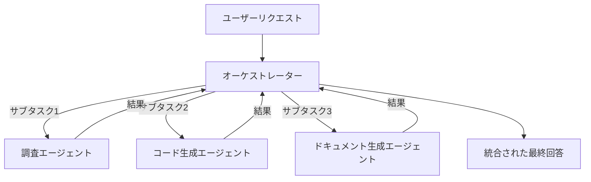
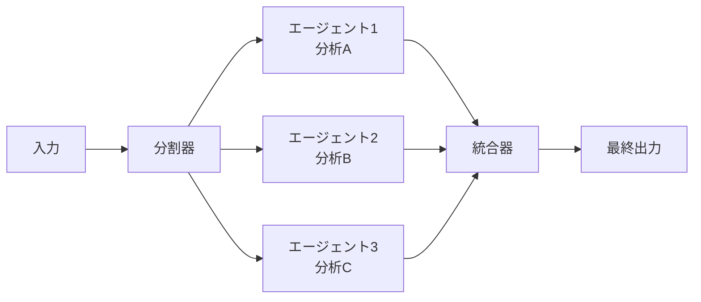
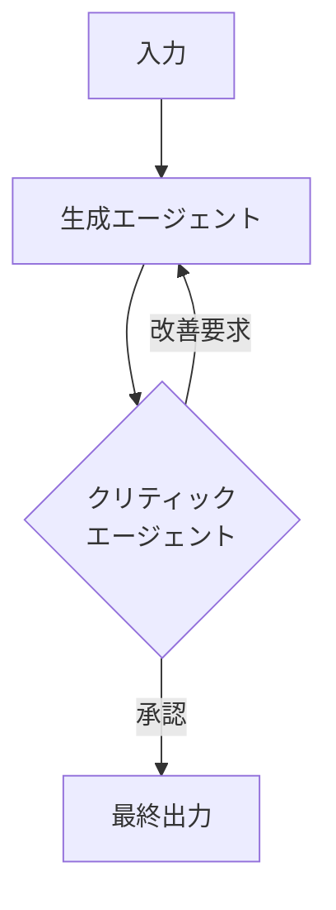

## はじめに：一匹狼のエージェントから、チームへ

前回の記事では、[AIコーディングエージェントを使いこなす上級テクニック](/ai-agents/2026/03/15/ai-coding-agents-guide.html)を紹介しました。単一のエージェントが驚くほど多くのことをこなせる時代です。

しかし、現実の業務は複雑です。長大なドキュメントを要約しながら、同時にコードのバグを修正して、最終的にその結果をSlackに通知する——これを一つのエージェントにすべてやらせるのは、**優秀な社員に何十もの専門知識を求めるのと同じ**です。

その解決策が **マルチエージェントシステム（Multi-Agent System, MAS）** です。

> 複数の専門化されたエージェントが協調し、単一エージェントでは達成困難なタスクを分散・並列処理で解決するアーキテクチャ。

2026年現在、LangGraph、CrewAI、Microsoft AutoGen、OpenAI Agents SDKなどのフレームワークが成熟し、マルチエージェントシステムは「研究」から「実用」の段階に移行しました。本記事では、**実際のプロダクションで使えるマルチエージェント設計パターン**を体系的に解説します。

---

## なぜマルチエージェントが必要か

### 単一エージェントの限界

```
❌ 単一エージェントの問題点

1. コンテキスト長の壁
   → 大量のドキュメントや長い会話履歴がウィンドウを圧迫

2. 並列処理の不可能
   → 調査・分析・実装を逐次処理するため遅い

3. 専門性の欠如
   → すべてのスキルを一つのプロンプトに詰め込むとパフォーマンス低下

4. 信頼性の問題
   → 一点障害（SPOF）、一つのエラーでパイプライン全体が止まる

5. 自己検証の難しさ
   → 自分の出力を自分で批判的に評価するのは構造的に困難
```

### マルチエージェントが解決すること

| 課題 | マルチエージェントの解決策 |
|------|--------------------------|
| コンテキスト長 | 各エージェントが担当する範囲を限定 |
| 処理速度 | 独立したサブタスクを並列実行 |
| 出力品質 | 専門エージェントによる専門的な判断 |
| 信頼性 | エラー時の再試行・フォールバック |
| 自己検証 | クリティック（批評）エージェントが独立してレビュー |

---

## 核心概念：エージェントの役割を定義する

マルチエージェントシステムを設計する前に、エージェントの役割を明確にしましょう。

### 3種類の基本ロール

```
┌─────────────────────────────────────────┐
│           オーケストレーター              │
│   (Orchestrator / Planner)               │
│   → タスクを分解し、ワーカーに委譲        │
│   → 進捗を管理し、最終的に統合            │
└─────────────────────────────────────────┘
              ↓ 指示・委譲
┌────────────┬────────────┬────────────────┐
│  ワーカー   │  ワーカー   │    ワーカー    │
│ (Worker)   │ (Worker)   │   (Worker)     │
│  調査担当  │  コード担当 │  レビュー担当  │
└────────────┴────────────┴────────────────┘
              ↓ 中間成果物
┌─────────────────────────────────────────┐
│              チェッカー                   │
│   (Checker / Critic / Validator)         │
│   → 成果物の品質・正確性を独立検証        │
└─────────────────────────────────────────┘
```

---

## パターン1: オーケストレーター／ワーカーパターン

最も基本的かつ強力なパターンです。

### 概要



### 実装例（OpenAI Agents SDK）

```python
from agents import Agent, Runner, handoff
from agents.models import GPT4o

# 専門ワーカーエージェントの定義
researcher = Agent(
    name="ResearchAgent",
    model=GPT4o(),
    instructions="""あなたは調査の専門家です。
    与えられたトピックについて、信頼性の高い情報を収集し、
    事実を整理して報告します。必ず情報源を明記してください。""",
    tools=[web_search_tool, arxiv_search_tool],
)

coder = Agent(
    name="CodeAgent",
    model=GPT4o(),
    instructions="""あなたはシニアソフトウェアエンジニアです。
    要件に基づいて高品質なPythonコードを書きます。
    型ヒント、エラーハンドリング、ドキュメントストリングを必ず含めてください。""",
    tools=[code_execution_tool],
)

reviewer = Agent(
    name="ReviewAgent",
    model=GPT4o(),
    instructions="""あなたはコードレビューの専門家です。
    バグ、セキュリティリスク、パフォーマンス問題を
    厳格にチェックして報告します。""",
)

# オーケストレーターの定義
orchestrator = Agent(
    name="Orchestrator",
    model=GPT4o(),
    instructions="""あなたはプロジェクトマネージャーです。
    ユーザーのリクエストを分析し、適切なエージェントに作業を委譲します。
    
    - 調査が必要 → ResearchAgent に委譲
    - コード生成が必要 → CodeAgent に委譲
    - コードのレビューが必要 → ReviewAgent に委譲
    
    各エージェントの出力を統合して、最終的な回答を提供します。""",
    handoffs=[
        handoff(researcher),
        handoff(coder),
        handoff(reviewer),
    ],
)

# 実行
async def run_orchestrated_task(user_request: str) -> str:
    result = await Runner.run(
        orchestrator,
        input=user_request,
        max_turns=20,
    )
    return result.final_output
```

### いつ使うか

- タスクが複数の異なる専門領域にまたがる場合
- 各サブタスクの依存関係が明確な場合
- 全体的な品質管理が重要な場合

---

## パターン2: 並列処理パターン（Parallel Fan-Out/Fan-In）

独立したサブタスクを同時並行で処理し、結果を集約するパターンです。

### 概要



### 実装例（LangGraph）

```python
import asyncio
from typing import TypedDict, Annotated
from langgraph.graph import StateGraph, START, END
import operator

class AnalysisState(TypedDict):
    document: str
    # 各エージェントの結果を蓄積
    results: Annotated[list[dict], operator.add]
    final_summary: str

# 並列実行する専門エージェント
async def security_analyst(state: AnalysisState) -> dict:
    """セキュリティリスクを分析"""
    prompt = f"""以下のコードのセキュリティリスクを分析してください:
    
{state['document']}

JSON形式で返してください: {{"risks": [...], "severity": "low|medium|high"}}"""
    result = await llm.ainvoke(prompt)
    return {"results": [{"agent": "security", "output": result.content}]}

async def performance_analyst(state: AnalysisState) -> dict:
    """パフォーマンス問題を分析"""
    prompt = f"""以下のコードのパフォーマンスを分析してください:
    
{state['document']}

JSON形式で返してください: {{"bottlenecks": [...], "suggestions": [...]}}"""
    result = await llm.ainvoke(prompt)
    return {"results": [{"agent": "performance", "output": result.content}]}

async def quality_analyst(state: AnalysisState) -> dict:
    """コード品質を分析"""
    prompt = f"""以下のコードの品質を分析してください（可読性、保守性、SOLID原則）:
    
{state['document']}"""
    result = await llm.ainvoke(prompt)
    return {"results": [{"agent": "quality", "output": result.content}]}

def aggregate_results(state: AnalysisState) -> dict:
    """全エージェントの結果を統合"""
    summary_prompt = f"""以下の専門エージェントの分析結果を統合してください:
    
{state['results']}

優先度順に改善提案をまとめてください。"""
    result = llm.invoke(summary_prompt)
    return {"final_summary": result.content}

# グラフ構築：並列実行
workflow = StateGraph(AnalysisState)
workflow.add_node("security", security_analyst)
workflow.add_node("performance", performance_analyst)
workflow.add_node("quality", quality_analyst)
workflow.add_node("aggregate", aggregate_results)

# 開始から3エージェントへ並列分岐
workflow.add_edge(START, "security")
workflow.add_edge(START, "performance")
workflow.add_edge(START, "quality")

# 3エージェントから統合へ
workflow.add_edge("security", "aggregate")
workflow.add_edge("performance", "aggregate")
workflow.add_edge("quality", "aggregate")
workflow.add_edge("aggregate", END)

app = workflow.compile()

# 実行（3エージェントが並列実行される）
result = await app.ainvoke({"document": code_to_review, "results": []})
print(result["final_summary"])
```

### パフォーマンス比較

```
逐次処理（単一エージェント）:
security(8s) → performance(7s) → quality(6s) = 合計 21秒

並列処理（マルチエージェント）:
security(8s)    ┐
performance(7s) ├→ aggregate(4s) = 合計 12秒
quality(6s)     ┘

→ 約40%の時間短縮
```

---

## パターン3: チェッカー／クリティックパターン

エージェントの出力を別のエージェントが独立してレビューすることで、品質と正確性を担保するパターンです。

### 概要



### 実装例

```python
from pydantic import BaseModel
from typing import Literal

class ReviewResult(BaseModel):
    approved: bool
    feedback: str
    issues: list[str]
    score: int  # 0-100

class GeneratorCriticSystem:
    def __init__(self, max_iterations: int = 3):
        self.max_iterations = max_iterations
        
        self.generator = ChatOpenAI(model="gpt-4o", temperature=0.7)
        self.critic = ChatOpenAI(model="gpt-4o", temperature=0.0)  # 評価は低温度
    
    async def generate_with_critique(
        self, 
        task: str,
        quality_threshold: int = 80
    ) -> dict:
        draft = None
        history = []
        
        for iteration in range(self.max_iterations):
            # 生成フェーズ
            if draft is None:
                gen_prompt = f"以下のタスクを実行してください:\n{task}"
            else:
                # 前回のフィードバックを反映
                gen_prompt = f"""以下のタスクを実行してください:
{task}

前回の出力:
{draft}

クリティックからのフィードバック:
{history[-1]['feedback']}

上記のフィードバックを踏まえて改善してください。"""
            
            gen_result = await self.generator.ainvoke(gen_prompt)
            draft = gen_result.content
            
            # 評価フェーズ
            critic_prompt = f"""以下の出力を厳密に評価してください:

タスク: {task}

出力:
{draft}

以下のJSONスキーマで評価を返してください:
{{
  "approved": boolean,
  "score": 0-100,
  "issues": ["問題点1", "問題点2", ...],
  "feedback": "改善のための具体的な指示"
}}

評価基準:
- 正確性（事実誤認がないか）
- 完全性（タスクを完全に達成しているか）
- 品質（プロ水準の仕上がりか）
- 安全性（有害な内容が含まれていないか）"""

            critic_result = await self.critic.ainvoke(critic_prompt)
            review = ReviewResult.model_validate_json(critic_result.content)
            
            history.append({
                "iteration": iteration + 1,
                "draft": draft,
                "score": review.score,
                "feedback": review.feedback,
                "issues": review.issues,
            })
            
            print(f"イテレーション {iteration + 1}: スコア {review.score}/100")
            
            if review.approved and review.score >= quality_threshold:
                break
        
        return {
            "final_output": draft,
            "iterations": len(history),
            "final_score": history[-1]["score"],
            "history": history,
        }

# 使用例
system = GeneratorCriticSystem(max_iterations=3)
result = await system.generate_with_critique(
    task="RustでHTTPクライアントライブラリの設計方針を1000字で説明してください",
    quality_threshold=85
)
print(result["final_output"])
print(f"\n品質スコア: {result['final_score']}/100（{result['iterations']}回イテレーション）")
```

---

## パターン4: 特化型エージェントチームパターン

CrewAIのような「チーム」として特化エージェントを組み合わせるパターンです。

### 実装例（CrewAI）

```python
from crewai import Agent, Task, Crew, Process
from crewai_tools import SerperDevTool, FileReadTool

# ツールの定義
search_tool = SerperDevTool()
file_tool = FileReadTool()

# チームメンバーの定義
product_manager = Agent(
    role="プロダクトマネージャー",
    goal="ユーザーの要望を明確化し、実装可能な仕様に落とし込む",
    backstory="""あなたは10年以上のプロダクト開発経験を持つPMです。
    ユーザーインタビューと市場調査のプロであり、
    開発チームが迷わないよう明確な仕様を作成できます。""",
    tools=[search_tool],
    verbose=True,
)

architect = Agent(
    role="ソフトウェアアーキテクト",
    goal="スケーラブルで保守可能なシステム設計を提案する",
    backstory="""あなたはクラウドネイティブアーキテクチャの専門家です。
    マイクロサービス、イベント駆動、CQRS等のパターンに精通しており、
    トレードオフを明確にした設計文書を作成できます。""",
    verbose=True,
)

senior_engineer = Agent(
    role="シニアエンジニア",
    goal="高品質なコードを実装し、技術的負債を最小化する",
    backstory="""あなたはPython/TypeScriptのエキスパートです。
    TDD、クリーンアーキテクチャ、DDD を実践し、
    レビュアーが驚くほど読みやすいコードを書きます。""",
    tools=[file_tool],
    verbose=True,
)

qa_engineer = Agent(
    role="QAエンジニア",
    goal="バグを早期に発見し、品質を担保する",
    backstory="""あなたは品質保証のプロです。
    ユニットテスト、統合テスト、E2Eテストを網羅的に設計し、
    エッジケースを見逃しません。""",
    verbose=True,
)

# タスクの定義（依存関係付き）
requirements_task = Task(
    description="""以下のユーザーリクエストを分析して、
    実装仕様書を作成してください: {user_request}
    
    仕様書には以下を含めてください:
    1. 機能要件一覧
    2. 非機能要件（パフォーマンス、セキュリティ）
    3. APIインターフェース定義
    4. 優先度とフェーズ分け""",
    agent=product_manager,
    expected_output="詳細な実装仕様書（Markdown形式）",
)

architecture_task = Task(
    description="""仕様書を元にシステムアーキテクチャを設計してください。
    Mermaidダイアグラムを含む設計文書を作成してください。""",
    agent=architect,
    context=[requirements_task],  # 要件タスクの完了後に実行
    expected_output="システムアーキテクチャ設計文書（Mermaidダイアグラム含む）",
)

implementation_task = Task(
    description="""アーキテクチャ設計に基づいて実装コードを書いてください。
    型ヒント、エラーハンドリング、docstringを含めてください。""",
    agent=senior_engineer,
    context=[architecture_task],
    expected_output="完全な実装コード（Python）",
)

testing_task = Task(
    description="""実装コードに対する包括的なテストを作成してください。
    pytest形式で、カバレッジ90%以上を目指してください。""",
    agent=qa_engineer,
    context=[implementation_task],
    expected_output="完全なテストコード（pytest）",
)

# クルーの組成・実行
crew = Crew(
    agents=[product_manager, architect, senior_engineer, qa_engineer],
    tasks=[requirements_task, architecture_task, implementation_task, testing_task],
    process=Process.sequential,  # 順次実行（依存関係あり）
    verbose=True,
)

result = crew.kickoff(inputs={"user_request": "ユーザー認証付きTODOアプリのAPIを作りたい"})
```

---

## パターン5: ヒューマン・イン・ザ・ループパターン

重要な判断ポイントで人間の承認を求めるパターンです。本番システムで特に重要です。

### 実装例（LangGraph）

```python
from langgraph.checkpoint.memory import MemorySaver
from langgraph.graph import StateGraph, START, END
import uuid

class WorkflowState(TypedDict):
    task: str
    plan: str
    implementation: str
    human_approved: bool
    human_feedback: str

def generate_plan(state: WorkflowState) -> dict:
    """実装計画を生成"""
    result = llm.invoke(f"以下のタスクの実装計画を作成: {state['task']}")
    return {"plan": result.content}

def request_human_approval(state: WorkflowState) -> dict:
    """人間の承認を待つ（interrupt）"""
    # LangGraphのinterruptを使用 - ここで処理が一時停止する
    from langgraph.types import interrupt
    
    feedback = interrupt({
        "message": "以下の計画を承認しますか？",
        "plan": state["plan"],
        "instructions": "承認する場合は 'yes'、修正が必要な場合は修正内容を入力してください。",
    })
    
    if feedback.lower() == "yes":
        return {"human_approved": True, "human_feedback": ""}
    else:
        return {"human_approved": False, "human_feedback": feedback}

def implement(state: WorkflowState) -> dict:
    """承認された計画を実装"""
    result = llm.invoke(f"""
計画:
{state['plan']}

この計画を実装してください。
""")
    return {"implementation": result.content}

def revise_plan(state: WorkflowState) -> dict:
    """フィードバックを元に計画を修正"""
    result = llm.invoke(f"""
元の計画:
{state['plan']}

人間からのフィードバック:
{state['human_feedback']}

計画を修正してください。
""")
    return {"plan": result.content}

def should_implement(state: WorkflowState) -> str:
    return "implement" if state["human_approved"] else "revise_plan"

# グラフ構築
workflow = StateGraph(WorkflowState)
workflow.add_node("generate_plan", generate_plan)
workflow.add_node("request_approval", request_human_approval)
workflow.add_node("implement", implement)
workflow.add_node("revise_plan", revise_plan)

workflow.add_edge(START, "generate_plan")
workflow.add_edge("generate_plan", "request_approval")
workflow.add_conditional_edges("request_approval", should_implement)
workflow.add_edge("revise_plan", "request_approval")  # 修正後は再度承認を求める
workflow.add_edge("implement", END)

# チェックポイント付きでコンパイル（状態の永続化）
checkpointer = MemorySaver()
app = workflow.compile(checkpointer=checkpointer)

# 実行
thread_id = str(uuid.uuid4())
config = {"configurable": {"thread_id": thread_id}}

# フェーズ1: 計画生成まで実行
result = app.invoke(
    {"task": "PythonでRedisキャッシュ付きAPIを実装する"},
    config=config
)
# この時点でinterruptが発生し、人間の入力を待つ

# フェーズ2: 人間が承認（別のプロセスや時刻でも可）
final_result = app.invoke(
    Command(resume="yes"),  # または修正内容
    config=config
)
```

---

## エラーハンドリングとレジリエンス

マルチエージェントシステムは障害点が増えるため、適切なエラーハンドリングが不可欠です。

### 3つの回復戦略

```python
from enum import Enum
from typing import Callable
import asyncio

class RecoveryStrategy(Enum):
    RETRY = "retry"          # 同じエージェントで再試行
    FALLBACK = "fallback"    # フォールバックエージェントに切替
    SKIP = "skip"            # このエージェントをスキップして続行
    ABORT = "abort"          # ワークフロー全体を中断

class ResilientAgentRunner:
    def __init__(
        self,
        max_retries: int = 3,
        retry_delay: float = 1.0,
        strategy: RecoveryStrategy = RecoveryStrategy.RETRY,
        fallback_agent: Callable | None = None,
    ):
        self.max_retries = max_retries
        self.retry_delay = retry_delay
        self.strategy = strategy
        self.fallback_agent = fallback_agent
    
    async def run(self, agent_func: Callable, *args, **kwargs):
        last_error = None
        
        for attempt in range(self.max_retries):
            try:
                return await agent_func(*args, **kwargs)
            
            except RateLimitError as e:
                # レートリミット: 指数バックオフで再試行
                wait_time = self.retry_delay * (2 ** attempt)
                print(f"レートリミット。{wait_time}秒後に再試行 ({attempt+1}/{self.max_retries})")
                await asyncio.sleep(wait_time)
                last_error = e
                
            except ContextLengthExceededError as e:
                # コンテキスト超過: フォールバックに切替
                if self.fallback_agent:
                    print("コンテキスト超過。フォールバックエージェントに切替")
                    return await self.fallback_agent(*args, **kwargs)
                raise
                
            except AgentTimeoutError as e:
                # タイムアウト: スキップして続行
                if self.strategy == RecoveryStrategy.SKIP:
                    print("タイムアウト。このエージェントをスキップします")
                    return {"status": "skipped", "reason": str(e)}
                last_error = e
                
            except Exception as e:
                print(f"予期しないエラー: {e}")
                last_error = e
                break
        
        if self.strategy == RecoveryStrategy.ABORT:
            raise RuntimeError(f"エージェント実行失敗: {last_error}")
        
        return {"status": "failed", "error": str(last_error)}
```

---

## 可観測性：マルチエージェントのデバッグ

単一エージェントと違い、複数エージェントが絡み合うシステムのデバッグは複雑です。

### トレーシングの実装

```python
import time
import uuid
from dataclasses import dataclass, field
from typing import Any

@dataclass
class AgentSpan:
    span_id: str = field(default_factory=lambda: str(uuid.uuid4())[:8])
    agent_name: str = ""
    input_tokens: int = 0
    output_tokens: int = 0
    latency_ms: float = 0.0
    status: str = "pending"
    error: str | None = None
    children: list["AgentSpan"] = field(default_factory=list)

class AgentTracer:
    def __init__(self):
        self.root_span: AgentSpan | None = None
        self.current_span: AgentSpan | None = None
    
    def start_span(self, agent_name: str) -> AgentSpan:
        span = AgentSpan(agent_name=agent_name)
        span._start_time = time.time()
        
        if self.root_span is None:
            self.root_span = span
        elif self.current_span:
            self.current_span.children.append(span)
        
        self.current_span = span
        return span
    
    def end_span(self, span: AgentSpan, status: str = "success", error: str | None = None):
        span.latency_ms = (time.time() - span._start_time) * 1000
        span.status = status
        span.error = error
    
    def print_trace(self, span: AgentSpan | None = None, indent: int = 0):
        if span is None:
            span = self.root_span
        
        status_icon = "✅" if span.status == "success" else "❌"
        print(f"{'  ' * indent}{status_icon} [{span.agent_name}] "
              f"{span.latency_ms:.0f}ms | "
              f"tokens: {span.input_tokens}→{span.output_tokens}")
        
        for child in span.children:
            self.print_trace(child, indent + 1)

# 使用例（出力例）:
# ✅ [Orchestrator] 45ms | tokens: 320→180
#   ✅ [ResearchAgent] 2341ms | tokens: 450→820
#   ✅ [CodeAgent] 3102ms | tokens: 680→1240
#   ❌ [ReviewAgent] 152ms | tokens: 200→0
#     ✅ [ReviewAgent (retry)] 2890ms | tokens: 200→540
```

---

## アンチパターン：よくある失敗

### ❌ アンチパターン1: 過剰なエージェント分割

```python
# 悪い例: 一行のことをするだけのエージェント
capitalize_agent = Agent(instructions="テキストを大文字に変換する")
trim_agent = Agent(instructions="前後の空白を除去する")
punctuation_agent = Agent(instructions="句読点を修正する")

# これは単純に string.capitalize().strip() でよい
# エージェント呼び出しのコスト・レイテンシが無駄
```

**ルール**: エージェントは「LLMの判断が必要な作業単位」に分割する。文字列変換のような決定論的な処理はコードで書く。

### ❌ アンチパターン2: 無制限ループ

```python
# 悪い例: 終了条件が曖昧で無限ループの危険
while not critic.is_satisfied(output):
    output = generator.generate(task)
    # critic が永遠に満足しない可能性がある

# 良い例: 最大イテレーション数を設定
for i in range(MAX_ITERATIONS := 5):
    output = generator.generate(task)
    result = critic.evaluate(output)
    if result.score >= THRESHOLD:
        break
```

### ❌ アンチパターン3: コンテキストの肥大化

```python
# 悪い例: すべての中間結果を次のエージェントに渡す
next_agent_input = f"""
前のエージェントの完全な出力:
{previous_agent_raw_output}  # 10,000トークン

さらにその前のエージェントの出力:
{earlier_output}  # 8,000トークン
"""

# 良い例: 次のエージェントが必要な情報だけを抽出して渡す
summary = summarizer.extract_key_info(previous_agent_raw_output)
next_agent_input = f"要点:\n{summary}"  # 500トークン
```

---

## まとめ：どのパターンを選ぶか

| シナリオ | 推奨パターン |
|----------|-------------|
| タスクが複数の専門領域にまたがる | オーケストレーター／ワーカー |
| 独立したサブタスクがある | 並列処理 |
| 高品質・高正確性が求められる | チェッカー／クリティック |
| 長期的な複雑プロジェクト | 特化型エージェントチーム |
| 重要な判断や取り返しのつかない操作 | ヒューマン・イン・ザ・ループ |
| すべての要件に対応したい | 複数パターンの組み合わせ |

マルチエージェントシステムは強力ですが、**複雑さはコストです**。まず単一エージェントで解けないかを考え、解けない場合に最小限のマルチエージェント構成を選ぶことが、AIネイティブエンジニアとしての成熟した判断です。

次回は、これらのマルチエージェントシステムを本番環境で運用するための **LLMOps実践ガイド** を紹介します。

---

## 参考リソース

- [LangGraph ドキュメント](https://langchain-ai.github.io/langgraph/) - グラフベースのエージェントフレームワーク
- [CrewAI ドキュメント](https://docs.crewai.com/) - チーム型マルチエージェントフレームワーク
- [OpenAI Agents SDK](https://openai.github.io/openai-agents-python/) - OpenAI公式エージェントライブラリ
- [Microsoft AutoGen](https://microsoft.github.io/autogen/) - 会話型マルチエージェントフレームワーク
- [Anthropic: Building effective agents](https://www.anthropic.com/research/building-effective-agents) - エージェント設計のベストプラクティス（Anthropic公式）
