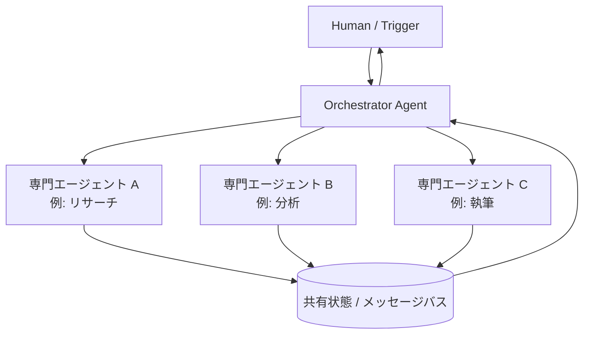
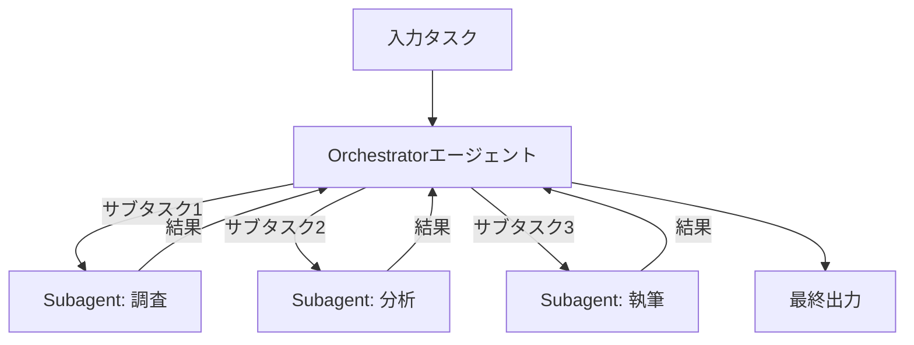
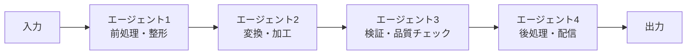
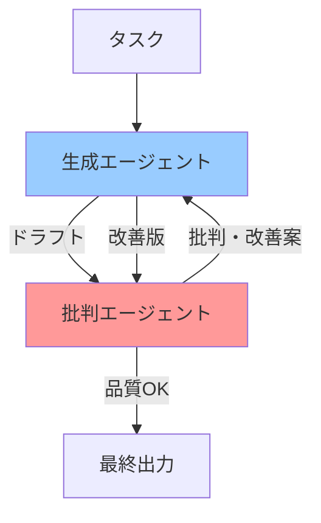
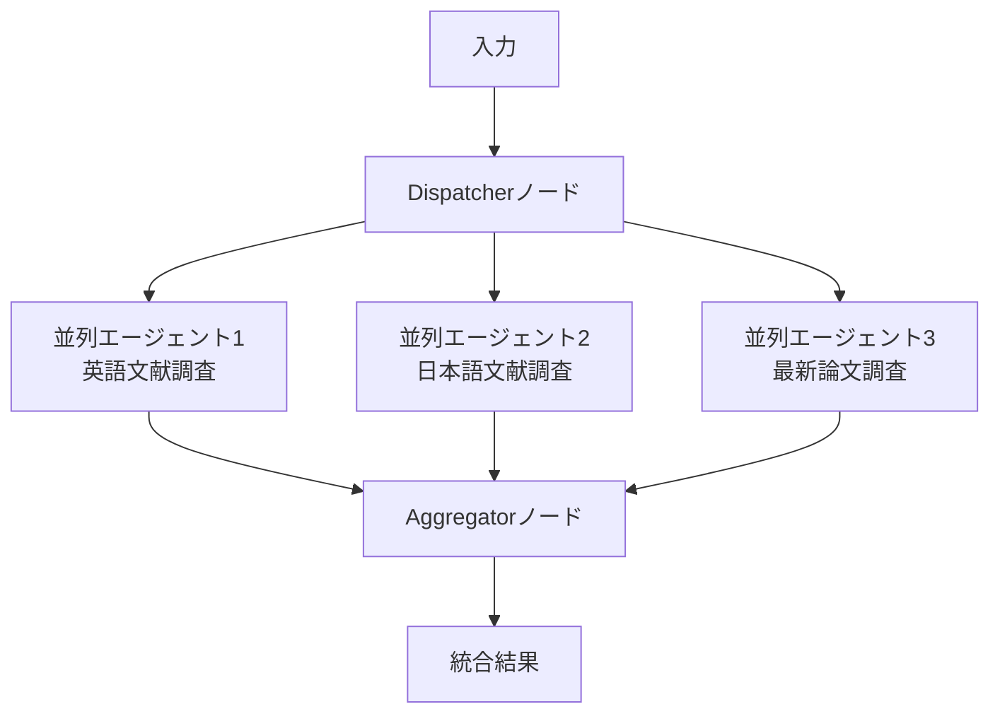
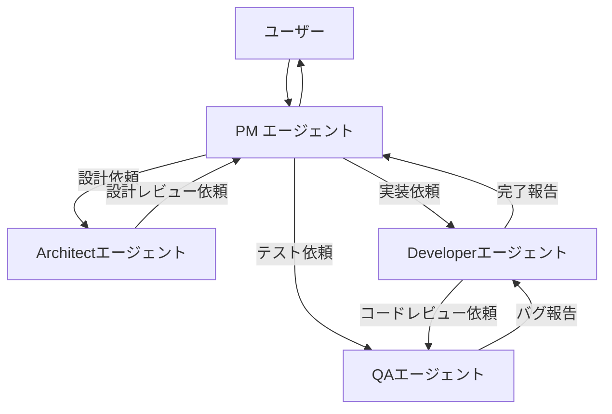
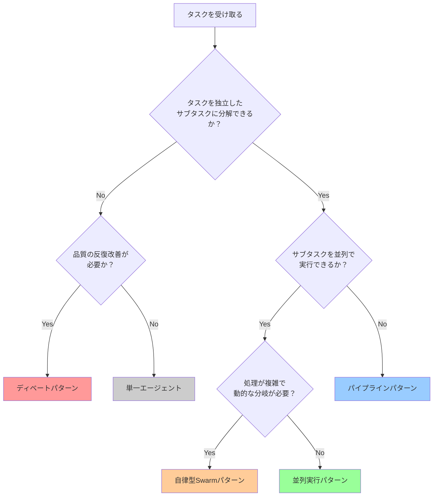

## はじめに：なぜ「1つのエージェント」では足りないのか

単一のAIエージェントに「Webを調査して、競合分析レポートを書いて、それをもとにスライドを作って」と依頼するとどうなるでしょうか？

最新のLLMでも、**長大なタスクを単一のコンテキストで一気にこなすことには限界**があります。タスクが複雑になるほど、集中力（アテンション）が分散し、精度が下がります。人間の組織が「一人で全部やる」より「専門家がチームを組む」方が高品質な成果を出せるように、AIも同じです。

**マルチエージェントシステム（Multi-Agent System）** とは、複数の特化したAIエージェントが役割を分担・協調して、単一エージェントでは困難な複雑タスクを解決する仕組みです。

2026年時点で、マルチエージェントが必要とされる場面は急速に増えています：

- **長大なコードベースのリファクタリング**：調査エージェント、設計エージェント、実装エージェント、レビューエージェントが連携
- **複雑なリサーチ**：情報収集、要約、批判的分析、最終レポート作成を分業
- **自律的なQA**：テスト生成エージェントとバグ修正エージェントが反復的に協調
- **多言語ドキュメント生成**：コンテンツ作成エージェントと翻訳エージェントが並列実行

本記事では、マルチエージェントシステムの**主要な設計パターン**を整理し、**LangGraphを使った実装例**とともに、設計時の判断基準・注意点を実践的に解説します。

---

## マルチエージェントシステムの基本概念

### エージェントとは何か（おさらい）

マルチエージェントの文脈では、各エージェントを以下のように定義します：

```
エージェント = LLM + ツール群 + 状態（メモリ）+ 目標
```

重要なのは「**自律的に次のアクションを決定できる**」という点です。単なる関数呼び出しとは異なり、エージェントは自ら判断してループを回します。

### マルチエージェントの構成要素



| 構成要素 | 役割 |
|----------|------|
| **Orchestrator** | タスクを受け取り、分解し、各エージェントに割り振る司令塔 |
| **Specialist Agent** | 特定のサブタスクに特化したエージェント |
| **共有状態** | エージェント間でデータを受け渡す仕組み（グラフのstate） |
| **メッセージバス** | 非同期コミュニケーションのためのキュー |

---

## 主要な設計パターン5選

### パターン1: Orchestrator-Subagentパターン

最も基本的かつ広く使われるパターンです。**中央の司令塔（Orchestrator）がタスクを分解し、専門エージェント（Subagent）に委譲**します。



**適用場面**：タスクを独立したサブタスクに分解できる場合。研究レポート作成、複数ステップの自動化ワークフロー。

**LangGraph実装例**：

```python
from langgraph.graph import StateGraph, END
from langchain_anthropic import ChatAnthropic
from typing import TypedDict, Annotated
import operator

# 共有状態の定義
class OrchestratorState(TypedDict):
    task: str
    plan: list[str]
    research_result: str
    analysis_result: str
    final_report: str
    messages: Annotated[list, operator.add]

llm = ChatAnthropic(model="claude-3-7-sonnet-20250219")

# Orchestratorノード：タスクを分解してプランを立てる
def orchestrator_node(state: OrchestratorState) -> OrchestratorState:
    response = llm.invoke([
        {"role": "system", "content": (
            "あなたはタスク分解の専門家です。"
            "与えられたタスクを具体的なサブタスクのリストに分解してください。"
            "JSONリストで返してください: [\"サブタスク1\", \"サブタスク2\", ...]"
        )},
        {"role": "user", "content": f"タスク: {state['task']}"}
    ])
    import json, re
    match = re.search(r'\[.*?\]', response.content, re.DOTALL)
    plan = json.loads(match.group()) if match else [state["task"]]
    return {"plan": plan}

# Researcherノード：情報収集に特化
def researcher_node(state: OrchestratorState) -> OrchestratorState:
    task = state["plan"][0] if state["plan"] else state["task"]
    response = llm.invoke([
        {"role": "system", "content": (
            "あなたはリサーチ専門のエージェントです。"
            "与えられたトピックについて、重要な事実・データ・事例を収集・整理してください。"
        )},
        {"role": "user", "content": f"調査対象: {task}"}
    ])
    return {"research_result": response.content}

# Analystノード：分析に特化
def analyst_node(state: OrchestratorState) -> OrchestratorState:
    response = llm.invoke([
        {"role": "system", "content": (
            "あなたは分析専門のエージェントです。"
            "収集された情報を批判的に分析し、洞察とインプリケーションを抽出してください。"
        )},
        {"role": "user", "content": (
            f"元のタスク: {state['task']}\n\n"
            f"収集された情報:\n{state['research_result']}"
        )}
    ])
    return {"analysis_result": response.content}

# Writerノード：最終レポート生成
def writer_node(state: OrchestratorState) -> OrchestratorState:
    response = llm.invoke([
        {"role": "system", "content": (
            "あなたはプロのライターです。"
            "調査結果と分析を統合した、明確で読みやすいレポートを作成してください。"
        )},
        {"role": "user", "content": (
            f"タスク: {state['task']}\n\n"
            f"調査結果:\n{state['research_result']}\n\n"
            f"分析:\n{state['analysis_result']}"
        )}
    ])
    return {"final_report": response.content}

# グラフの構築
def build_orchestrator_graph():
    graph = StateGraph(OrchestratorState)
    
    graph.add_node("orchestrator", orchestrator_node)
    graph.add_node("researcher", researcher_node)
    graph.add_node("analyst", analyst_node)
    graph.add_node("writer", writer_node)
    
    graph.set_entry_point("orchestrator")
    graph.add_edge("orchestrator", "researcher")
    graph.add_edge("researcher", "analyst")
    graph.add_edge("analyst", "writer")
    graph.add_edge("writer", END)
    
    return graph.compile()

# 実行
app = build_orchestrator_graph()
result = app.invoke({"task": "2026年の生成AI市場トレンドを調査・分析してレポートにまとめる"})
print(result["final_report"])
```

---

### パターン2: パイプライン（Sequential Pipeline）パターン

エージェントが**アセンブリラインのように順番に処理**を引き継ぐパターンです。前のエージェントの出力が次のエージェントの入力になります。



**適用場面**：データ変換パイプライン、コンテンツ生成→翻訳→校正のような直線的ワークフロー。各ステップに特化したエージェントを置くことで、品質と再利用性が向上します。

```python
from langgraph.graph import StateGraph, END
from typing import TypedDict

class PipelineState(TypedDict):
    raw_content: str        # 生の入力
    structured_content: str # 構造化済み
    translated_content: str # 翻訳済み
    reviewed_content: str   # レビュー済み

# ステップ1: 構造化エージェント
def structurer_agent(state: PipelineState) -> PipelineState:
    """非構造化テキストをMarkdown形式に整形する"""
    response = llm.invoke([
        {"role": "system", "content": (
            "入力テキストを整理し、適切な見出し・箇条書き・段落に分けてMarkdown形式で出力してください。"
        )},
        {"role": "user", "content": state["raw_content"]}
    ])
    return {"structured_content": response.content}

# ステップ2: 翻訳エージェント
def translator_agent(state: PipelineState) -> PipelineState:
    """日本語コンテンツを英語に翻訳する"""
    response = llm.invoke([
        {"role": "system", "content": (
            "以下の日本語コンテンツをナチュラルな英語に翻訳してください。"
            "Markdown構造は保持してください。"
        )},
        {"role": "user", "content": state["structured_content"]}
    ])
    return {"translated_content": response.content}

# ステップ3: レビューエージェント
def reviewer_agent(state: PipelineState) -> PipelineState:
    """品質チェックと最終調整"""
    response = llm.invoke([
        {"role": "system", "content": (
            "以下のコンテンツを校正してください。"
            "文法・スタイル・明確さの問題を修正し、最終版を出力してください。"
        )},
        {"role": "user", "content": state["translated_content"]}
    ])
    return {"reviewed_content": response.content}

def build_pipeline():
    graph = StateGraph(PipelineState)
    graph.add_node("structurer", structurer_agent)
    graph.add_node("translator", translator_agent)
    graph.add_node("reviewer", reviewer_agent)
    graph.set_entry_point("structurer")
    graph.add_edge("structurer", "translator")
    graph.add_edge("translator", "reviewer")
    graph.add_edge("reviewer", END)
    return graph.compile()
```

---

### パターン3: ディベート（Debate / Critique）パターン

**複数のエージェントが異なる視点から議論・批判し合い、品質を高めるパターン**です。LLMは単独では「自分の出力を批判する」のが苦手ですが、専用の批判エージェントを用意することで解決できます。



**適用場面**：コードレビュー自動化、文書の品質向上、ファクトチェック、意思決定の検証。

```python
from langgraph.graph import StateGraph, END
from typing import TypedDict, Literal

class DebateState(TypedDict):
    task: str
    draft: str
    critique: str
    iteration: int
    max_iterations: int
    final_output: str

def generator_node(state: DebateState) -> DebateState:
    """ドラフトを生成・改善するエージェント"""
    if state["draft"] and state["critique"]:
        # 批判を受けて改善
        prompt = (
            f"タスク: {state['task']}\n\n"
            f"前回のドラフト:\n{state['draft']}\n\n"
            f"批判・改善指摘:\n{state['critique']}\n\n"
            f"批判を踏まえて改善したバージョンを出力してください。"
        )
    else:
        # 初回生成
        prompt = f"以下のタスクに対する回答を作成してください: {state['task']}"
    
    response = llm.invoke([
        {"role": "system", "content": "あなたは高品質なコンテンツを作成する専門家です。"},
        {"role": "user", "content": prompt}
    ])
    return {"draft": response.content, "iteration": state.get("iteration", 0) + 1}

def critic_node(state: DebateState) -> DebateState:
    """ドラフトを批判的に評価するエージェント"""
    response = llm.invoke([
        {"role": "system", "content": (
            "あなたは厳格な批評家です。以下のコンテンツの問題点を指摘してください。\n"
            "- 論理的な矛盾や飛躍はないか\n"
            "- 重要な情報が欠けていないか\n"
            "- 表現の曖昧さや不正確さはないか\n"
            "品質が十分な場合は「APPROVED」とのみ返してください。"
        )},
        {"role": "user", "content": (
            f"元のタスク: {state['task']}\n\n"
            f"評価対象:\n{state['draft']}"
        )}
    ])
    return {"critique": response.content}

def should_continue(state: DebateState) -> Literal["generator", "end"]:
    """品質が十分か、または最大イテレーション数に達したか判定"""
    if "APPROVED" in state.get("critique", "") or state.get("iteration", 0) >= state.get("max_iterations", 3):
        return "end"
    return "generator"

def finalize_node(state: DebateState) -> DebateState:
    return {"final_output": state["draft"]}

def build_debate_graph():
    graph = StateGraph(DebateState)
    graph.add_node("generator", generator_node)
    graph.add_node("critic", critic_node)
    graph.add_node("finalize", finalize_node)
    
    graph.set_entry_point("generator")
    graph.add_edge("generator", "critic")
    graph.add_conditional_edges(
        "critic",
        should_continue,
        {"generator": "generator", "end": "finalize"}
    )
    graph.add_edge("finalize", END)
    return graph.compile()

# 実行例
debate_app = build_debate_graph()
result = debate_app.invoke({
    "task": "Pythonの非同期処理（asyncio）のベストプラクティスを3点まとめてください",
    "draft": "",
    "critique": "",
    "iteration": 0,
    "max_iterations": 3,
    "final_output": ""
})
print(f"最終出力（{result['iteration']}回のイテレーション後）:")
print(result["final_output"])
```

---

### パターン4: 並列実行（Parallel Fan-out/Fan-in）パターン

**複数のエージェントが同時並列で異なるサブタスクを処理**し、結果を集約するパターンです。スループットを最大化できます。



**適用場面**：複数ソースからの情報収集、複数言語での同時翻訳、並列バリデーション。

```python
import asyncio
from langgraph.graph import StateGraph, END
from typing import TypedDict, Annotated
import operator

class ParallelState(TypedDict):
    query: str
    results: Annotated[list[str], operator.add]  # 並列結果をリストに追加
    final_summary: str

async def research_english(state: ParallelState) -> ParallelState:
    """英語ソースを調査（実際にはWebサーチツールを使用）"""
    response = llm.invoke([
        {"role": "system", "content": "英語の技術文献・ブログ・ドキュメントの観点から回答してください。"},
        {"role": "user", "content": state["query"]}
    ])
    return {"results": [f"[英語ソース]\n{response.content}"]}

async def research_japanese(state: ParallelState) -> ParallelState:
    """日本語ソースを調査"""
    response = llm.invoke([
        {"role": "system", "content": "日本語の技術記事・Qiita・Zennの観点から回答してください。"},
        {"role": "user", "content": state["query"]}
    ])
    return {"results": [f"[日本語ソース]\n{response.content}"]}

async def research_papers(state: ParallelState) -> ParallelState:
    """学術論文を調査"""
    response = llm.invoke([
        {"role": "system", "content": "arXivなどの学術論文の観点から、研究成果・評価指標・ベンチマークを中心に回答してください。"},
        {"role": "user", "content": state["query"]}
    ])
    return {"results": [f"[学術論文]\n{response.content}"]}

def aggregator_node(state: ParallelState) -> ParallelState:
    """並列結果を集約して統合サマリーを生成"""
    combined = "\n\n---\n\n".join(state["results"])
    response = llm.invoke([
        {"role": "system", "content": (
            "複数のソースからの情報を統合して、包括的なサマリーを作成してください。"
            "重複を排除し、各ソースの視点の違いを明示してください。"
        )},
        {"role": "user", "content": f"クエリ: {state['query']}\n\n収集情報:\n{combined}"}
    ])
    return {"final_summary": response.content}

# LangGraphの並列実行はSend APIを使用
from langgraph.constants import Send

def dispatch_node(state: ParallelState):
    """並列実行を開始するディスパッチャー"""
    return [
        Send("research_english", state),
        Send("research_japanese", state),
        Send("research_papers", state),
    ]

def build_parallel_graph():
    graph = StateGraph(ParallelState)
    graph.add_node("research_english", research_english)
    graph.add_node("research_japanese", research_japanese)
    graph.add_node("research_papers", research_papers)
    graph.add_node("aggregator", aggregator_node)
    
    graph.set_entry_point("dispatch")
    graph.add_node("dispatch", lambda s: s)  # パススルーノード
    graph.add_conditional_edges("dispatch", dispatch_node, ["research_english", "research_japanese", "research_papers"])
    graph.add_edge("research_english", "aggregator")
    graph.add_edge("research_japanese", "aggregator")
    graph.add_edge("research_papers", "aggregator")
    graph.add_edge("aggregator", END)
    return graph.compile()
```

---

### パターン5: 自律型マルチエージェント（Autonomous Swarm）パターン

**エージェントが自律的に他のエージェントを呼び出せる**最も高度なパターンです。各エージェントが他エージェントを「ツール」として利用できます。



```python
from langchain_core.tools import tool
from langchain_anthropic import ChatAnthropic
from langgraph.prebuilt import create_react_agent

llm = ChatAnthropic(model="claude-3-7-sonnet-20250219")

# 各専門エージェントをツールとして定義
@tool
def call_architect_agent(requirement: str) -> str:
    """システム設計・アーキテクチャの検討が必要なときに使用する。
    入力: 設計対象の要件、制約、技術スタック。
    出力: 推奨アーキテクチャとその根拠。
    """
    architect_llm = ChatAnthropic(model="claude-3-7-sonnet-20250219")
    response = architect_llm.invoke([
        {"role": "system", "content": (
            "あなたはソフトウェアアーキテクトです。"
            "与えられた要件に対して、最適なシステム設計を提案してください。"
            "スケーラビリティ・保守性・セキュリティを考慮してください。"
        )},
        {"role": "user", "content": requirement}
    ])
    return response.content

@tool
def call_developer_agent(task: str) -> str:
    """コードの実装・修正が必要なときに使用する。
    入力: 実装すべき機能の説明、使用する言語・フレームワーク。
    出力: 動作するコードと解説。
    """
    developer_llm = ChatAnthropic(model="claude-3-7-sonnet-20250219")
    response = developer_llm.invoke([
        {"role": "system", "content": (
            "あなたはシニアソフトウェアエンジニアです。"
            "クリーンで保守しやすいコードを実装してください。"
            "エラーハンドリング・テスト・コメントも含めてください。"
        )},
        {"role": "user", "content": task}
    ])
    return response.content

@tool
def call_qa_agent(code_and_requirement: str) -> str:
    """コードのレビューやテスト設計が必要なときに使用する。
    入力: レビュー対象のコードと元の要件。
    出力: 問題点の指摘とテストケース。
    """
    qa_llm = ChatAnthropic(model="claude-3-7-sonnet-20250219")
    response = qa_llm.invoke([
        {"role": "system", "content": (
            "あなたはQAエンジニアです。"
            "バグ・セキュリティ問題・パフォーマンス問題を見つけ、"
            "改善提案とテストケースを提示してください。"
        )},
        {"role": "user", "content": code_and_requirement}
    ])
    return response.content

# PM（Project Manager）エージェント：他のエージェントを使いこなす
pm_agent = create_react_agent(
    llm,
    tools=[call_architect_agent, call_developer_agent, call_qa_agent],
    state_modifier=(
        "あなたはAIエージェントチームのProject Managerです。\n"
        "ユーザーの要件を受け取り、適切な専門エージェントを呼び出して仕事を進めてください。\n"
        "- 設計が必要 → call_architect_agent\n"
        "- コード実装が必要 → call_developer_agent\n"
        "- レビュー・テストが必要 → call_qa_agent\n"
        "最終的な成果物をユーザーに報告してください。"
    )
)

# 実行
result = pm_agent.invoke({
    "messages": [{
        "role": "user",
        "content": "FastAPIでJWT認証付きのユーザー登録・ログインAPIを作成してください。セキュリティレビューも行ってください。"
    }]
})
print(result["messages"][-1].content)
```

---

## 設計パターンの選び方

どのパターンを選ぶべきか、以下のフローチャートを参考にしてください：



### パターン比較表

| パターン | 複雑さ | コスト | レイテンシ | 適用場面 |
|---------|--------|--------|-----------|---------|
| Orchestrator-Subagent | 中 | 中 | 中 | 汎用的なタスク分解 |
| パイプライン | 低 | 低 | 低 | 直線的な変換処理 |
| ディベート | 中 | 高 | 高 | 品質重視の生成タスク |
| 並列実行 | 中 | 高 | 低 | 複数ソースの同時処理 |
| 自律型Swarm | 高 | 非常に高 | 高 | 複雑・動的なタスク |

---

## 本番環境での落とし穴と対策

### 落とし穴1: 無限ループ

エージェントが互いに呼び出し合い、終了条件を満たせずに無限ループに陥るリスクがあります。

```python
# ✗ 終了条件がない
def should_continue(state):
    if state["quality_score"] < 0.9:  # 絶対達成できないしきい値かもしれない
        return "generate"
    return "end"

# ✓ 最大イテレーション数を必ず設ける
def should_continue(state):
    MAX_ITER = 5
    if state["iteration"] >= MAX_ITER:
        return "end"  # 強制終了
    if state["quality_score"] >= 0.8:  # 現実的なしきい値
        return "end"
    return "generate"
```

### 落とし穴2: コスト爆発

マルチエージェントはLLM呼び出しが倍増するため、コストが急増します。

```python
import tiktoken

def estimate_cost(messages: list, model: str = "claude-3-7-sonnet-20250219") -> float:
    """API呼び出し前にコストを概算する"""
    # Claude Sonnet 3.7: 入力 $3/1M tokens, 出力 $15/1M tokens（概算）
    encoder = tiktoken.get_encoding("cl100k_base")
    input_tokens = sum(len(encoder.encode(m.get("content", ""))) for m in messages)
    estimated_output_tokens = 500  # 平均的な出力長
    
    cost = (input_tokens / 1_000_000 * 3.0) + (estimated_output_tokens / 1_000_000 * 15.0)
    return cost

# コスト上限チェック
def safe_invoke(llm, messages, max_cost_usd=0.10):
    estimated = estimate_cost(messages)
    if estimated > max_cost_usd:
        raise ValueError(f"推定コスト ${estimated:.4f} が上限 ${max_cost_usd} を超えています")
    return llm.invoke(messages)
```

### 落とし穴3: エラーの伝播

上流エージェントのエラーが下流に伝わり、システム全体が止まります。

```python
from typing import Optional
import logging

logger = logging.getLogger(__name__)

def robust_agent_node(state: dict, agent_fn, fallback_value: str = "") -> dict:
    """エラーを吸収して処理を継続するラッパー"""
    try:
        return agent_fn(state)
    except Exception as e:
        logger.error(f"エージェント {agent_fn.__name__} でエラー: {e}")
        # フォールバック値を設定して続行
        return {
            "error": str(e),
            "result": fallback_value,
            "status": "error"
        }

# 使い方
def safe_researcher_node(state):
    return robust_agent_node(state, researcher_node, fallback_value="調査結果を取得できませんでした。")
```

### 落とし穴4: エージェント間の文脈喪失

各エージェントは独立したコンテキストを持つため、重要な背景情報が伝わらないことがあります。

```python
# ✗ 結果のみを渡す（文脈が失われる）
def analyst_node_bad(state):
    response = llm.invoke([
        {"role": "user", "content": state["research_result"]}  # 元のタスクが不明
    ])
    return {"analysis": response.content}

# ✓ 元のタスクと結果の両方を渡す
def analyst_node_good(state):
    response = llm.invoke([
        {"role": "system", "content": "分析エージェントです。元のタスク背景を踏まえて分析してください。"},
        {"role": "user", "content": (
            f"## 元のタスク\n{state['original_task']}\n\n"
            f"## 収集された情報\n{state['research_result']}\n\n"
            f"上記の情報を分析してください。"
        )}
    ])
    return {"analysis": response.content}
```

---

## 可観測性（Observability）の確保

マルチエージェントは処理が複雑なため、**何がどこで起きているかを追跡できる仕組み**が不可欠です。

```python
import time
import uuid
from dataclasses import dataclass, field
from typing import Any

@dataclass
class AgentTrace:
    """エージェント実行のトレース記録"""
    trace_id: str = field(default_factory=lambda: str(uuid.uuid4())[:8])
    agent_name: str = ""
    start_time: float = field(default_factory=time.time)
    end_time: float = 0.0
    input_summary: str = ""
    output_summary: str = ""
    token_usage: dict = field(default_factory=dict)
    error: str = ""
    
    @property
    def duration_ms(self) -> float:
        return (self.end_time - self.start_time) * 1000

# トレース付きエージェントラッパー
def traced_agent(agent_name: str, traces: list[AgentTrace]):
    def decorator(func):
        def wrapper(state):
            trace = AgentTrace(agent_name=agent_name)
            trace.input_summary = str(state)[:200]
            
            try:
                result = func(state)
                trace.output_summary = str(result)[:200]
            except Exception as e:
                trace.error = str(e)
                raise
            finally:
                trace.end_time = time.time()
                traces.append(trace)
                print(f"[{trace.trace_id}] {agent_name}: {trace.duration_ms:.0f}ms")
            
            return result
        return wrapper
    return decorator

# LangSmithを使った本番トレーシング（推奨）
import os
# os.environ["LANGCHAIN_TRACING_V2"] = "true"
# os.environ["LANGCHAIN_API_KEY"] = "your-api-key"
# LangSmith設定後は自動的に全LLM呼び出しが記録される
```

---

## まとめ：マルチエージェント設計の原則

マルチエージェントシステムは強力ですが、**複雑さとコストのトレードオフ**を常に意識する必要があります。

### 設計の原則

| 原則 | 内容 |
|------|------|
| **単一責任** | 各エージェントは1つの明確な役割のみを持つ |
| **終了条件の明示** | ループには必ず最大反復回数を設定する |
| **文脈の継承** | 元のタスクや背景情報は常に次のエージェントに渡す |
| **コスト意識** | API呼び出し数 × 平均トークン数でコストを試算してから設計する |
| **可観測性** | LangSmithなどのツールで全エージェントの実行を追跡する |
| **段階的複雑化** | まず単一エージェントで解いてから、必要に応じてマルチ化する |

### 次のステップ

- [MCPガイド](/2026-03-11-model-context-protocol-guide) でエージェントとツールの接続標準を学ぶ
- [AIコーディングエージェント完全活用ガイド](/2026-03-15-ai-coding-agents-guide) で実際のコーディングエージェントを使いこなす
- [LangGraph公式ドキュメント](https://langchain-ai.github.io/langgraph/) でより高度なグラフ制御を習得する

マルチエージェントは「AIのチームマネジメント」です。優れたエンジニアリングチームを作るのと同じ原則——明確な役割分担、適切なコミュニケーション、品質チェックの仕組み——がAIエージェントにも当てはまります。

---

*参考資料*
- *[LangGraph Documentation](https://langchain-ai.github.io/langgraph/) - LangChain AI (2024)*
- *[Anthropic Multi-Agent Research](https://www.anthropic.com/research/multi-agent-evaluations) - Anthropic (2024)*
- *[AutoGen: Enabling Next-Gen LLM Applications](https://arxiv.org/abs/2308.08155) - Microsoft Research (2023)*
- *[AgentBench: Evaluating LLMs as Agents](https://arxiv.org/abs/2308.03688) - Tsinghua University (2023)*
