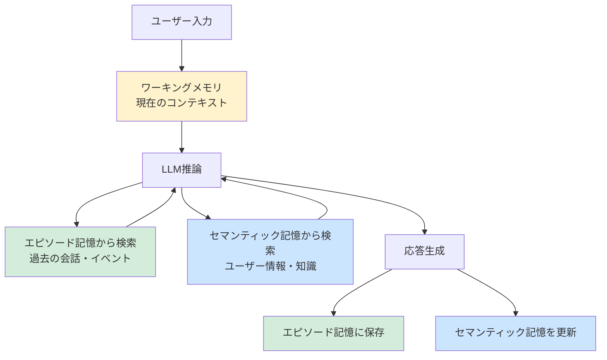

## はじめに：なぜ「記憶」がエージェントの壁になるのか

「先週の要件定義の会議、覚えてる？」「私の好みのコーディングスタイルって何か分かる？」——現時点のAIエージェントにこう聞いても、会話履歴が消えていればゼロ回答が返ってきます。

LLMは本質的に**ステートレス（状態なし）**です。各リクエストは独立した推論であり、前回の会話を「覚えている」ように見えるのは、プロンプトにその履歴を毎回埋め込んでいるだけです。

これは2つの根本的な問題を引き起こします：

1. **コンテキストウィンドウの限界**：長期間・大量の情報は物理的に詰め込めない
2. **情報の揮発性**：セッションをまたぐと全てがリセットされる

しかし、本当に実用的なエージェントを作るためには、ユーザーの好みを覚え、過去の意思決定を参照し、積み重なった知識を活用できなければなりません。

本記事では、AIエージェントに「記憶」を持たせる**メモリシステムの設計**を、理論から実装まで体系的に解説します。

## メモリの4つの種類

人間の記憶システムを参考に、LLMエージェントのメモリは以下の4種類に分類できます：

| メモリ種別 | 保持期間 | 内容例 | 実装手段 |
|-----------|---------|-------|---------|
| **ワーキングメモリ** | 現在の会話のみ | 今のタスク状態、変数 | コンテキスト内 |
| **エピソード記憶** | 過去の特定イベント | 「3月5日に○○を決めた」 | ベクターDB + 要約 |
| **セマンティック記憶** | 永続的な知識 | ユーザーの好み、ドメイン知識 | ベクターDB / KG |
| **手続き記憶** | 永続的なスキル | 「このユーザーへの返答スタイル」 | プロンプト / LoRA |



## ワーキングメモリの設計

ワーキングメモリは**現在の会話コンテキスト**そのものです。しかし、「そのまま全部入れる」では長期会話が破綻します。

### 会話履歴の圧縮戦略

```python
from langchain_core.messages import HumanMessage, AIMessage, SystemMessage
from langchain_openai import ChatOpenAI

llm = ChatOpenAI(model="gpt-4o")

def summarize_old_messages(messages: list, keep_last: int = 6) -> list:
    """古いメッセージを要約してコンテキストを圧縮する"""
    if len(messages) <= keep_last:
        return messages

    # 古い部分を要約
    old_messages = messages[:-keep_last]
    recent_messages = messages[-keep_last:]

    summary_prompt = f"""以下の会話履歴を簡潔に要約してください。
重要な決定事項・ユーザーの好み・コンテキストを保持すること。

会話履歴:
{format_messages(old_messages)}

要約（200文字以内）:"""

    summary = llm.invoke(summary_prompt).content

    # 要約 + 最新メッセージを結合
    compressed = [SystemMessage(content=f"[過去の会話要約]\n{summary}")]
    compressed.extend(recent_messages)
    return compressed


def format_messages(messages):
    lines = []
    for m in messages:
        role = "User" if isinstance(m, HumanMessage) else "AI"
        lines.append(f"{role}: {m.content}")
    return "\n".join(lines)
```

### 動的コンテキスト管理

重要度スコアリングで**何を残すか**を判断する手法も有効です：


```python
from dataclasses import dataclass
from typing import Optional
import json

@dataclass
class MemoryItem:
    content: str
    importance: float  # 0.0 ~ 1.0
    timestamp: str
    tags: list[str]

def score_importance(message: str, llm) -> float:
    """LLMでメッセージの重要度を0-1でスコアリング"""
    prompt = f"""以下のメッセージの重要度を0.0〜1.0で評価してください。
基準：ユーザーの好み・制約・重要な決定 = 高スコア、雑談・確認 = 低スコア

メッセージ: "{message}"

JSONで返答: {{"score": 0.0, "reason": "理由"}}"""

    try:
        response = llm.invoke(prompt)
        data = json.loads(response.content)
        return float(data["score"])
    except Exception:
        return 0.3  # デフォルト
```


## エピソード記憶：過去の会話を検索可能にする

エピソード記憶は「いつ・何が起きたか」を記録し、必要に応じて**意味的に検索**できる仕組みです。

### ベクターDBを使った実装

```python
from langchain_community.vectorstores import Chroma
from langchain_openai import OpenAIEmbeddings
from datetime import datetime

class EpisodicMemory:
    def __init__(self, user_id: str):
        self.user_id = user_id
        self.embeddings = OpenAIEmbeddings(model="text-embedding-3-small")
        self.vectorstore = Chroma(
            collection_name=f"episodes_{user_id}",
            embedding_function=self.embeddings,
            persist_directory="./memory_db"
        )

    def store(self, content: str, metadata: dict = None):
        """会話の重要な部分をエピソード記憶に保存"""
        doc_metadata = {
            "user_id": self.user_id,
            "timestamp": datetime.now().isoformat(),
            "type": "episode",
            **(metadata or {})
        }
        self.vectorstore.add_texts(
            texts=[content],
            metadatas=[doc_metadata]
        )

    def retrieve(self, query: str, k: int = 5) -> list[str]:
        """クエリに関連するエピソードを検索"""
        results = self.vectorstore.similarity_search_with_score(
            query=query,
            k=k,
            filter={"user_id": self.user_id}
        )
        # スコア閾値でフィルタリング（低スコア＝低関連性を除外）
        return [
            doc.page_content
            for doc, score in results
            if score < 0.5  # Chromaはコサイン距離なので小さいほど類似
        ]

    def store_conversation_summary(self, messages: list, llm):
        """会話終了時に自動的に要約して保存"""
        summary_prompt = f"""この会話から記憶すべき重要な情報を抽出してください。
- ユーザーの好み・要望
- 重要な決定事項
- 学習した事実
- 次回以降に役立つコンテキスト

会話:
{format_messages(messages)}

箇条書きで記述:"""
        summary = llm.invoke(summary_prompt).content
        self.store(summary, metadata={"type": "conversation_summary"})
```

## セマンティック記憶：ユーザープロファイルと知識ベース

エピソード記憶が「出来事」を記録するのに対し、セマンティック記憶は**抽象化された知識・事実**を管理します。

### ユーザープロファイルの動的更新

```python
from typing import Any
import json

class UserProfile:
    """ユーザーの好み・属性を動的に管理するセマンティック記憶"""

    def __init__(self, user_id: str, storage_backend):
        self.user_id = user_id
        self.storage = storage_backend
        self._profile_key = f"profile:{user_id}"

    def get(self) -> dict:
        data = self.storage.get(self._profile_key)
        return json.loads(data) if data else {}


    def update(self, conversation: str, llm) -> dict:
        """会話から新しい情報を抽出してプロファイルを更新"""
        current_profile = self.get()

        extract_prompt = f"""以下の会話から、ユーザーに関する新しい情報を抽出してください。

現在のプロファイル:
{json.dumps(current_profile, ensure_ascii=False, indent=2)}

新しい会話:
{conversation}

既存プロファイルへの追加・変更点をJSONで返してください。
変更がなければ空の {{}} を返してください。

例:
{{
  "preferred_language": "Python",
  "coding_style": "型ヒントを必ず使用",
  "timezone": "Asia/Tokyo",
  "expertise_level": "senior"
}}"""



        result = llm.invoke(extract_prompt).content
        try:
            updates = json.loads(result)
            if updates:
                merged = {**current_profile, **updates}
                self.storage.set(self._profile_key, json.dumps(merged, ensure_ascii=False))
                return merged
        except json.JSONDecodeError:
            pass
        return current_profile

    def to_system_prompt(self) -> str:
        """プロファイルをシステムプロンプト用テキストに変換"""
        profile = self.get()
        if not profile:
            return ""
        items = [f"- {k}: {v}" for k, v in profile.items()]
        return "## ユーザープロファイル\n" + "\n".join(items)
```

## 実践：フルメモリシステムの統合

ここまでの要素を組み合わせた、実際に使えるエージェントアーキテクチャです：

```python
from langchain_openai import ChatOpenAI
from langchain_core.messages import HumanMessage, AIMessage, SystemMessage

class MemoryAwareAgent:
    def __init__(self, user_id: str):
        self.user_id = user_id
        self.llm = ChatOpenAI(model="gpt-4o", temperature=0.7)
        self.episodic = EpisodicMemory(user_id)
        self.profile = UserProfile(user_id, storage_backend=RedisStorage())
        self.working_memory: list = []

    def chat(self, user_input: str) -> str:
        # 1. 関連するエピソード記憶を検索
        relevant_episodes = self.episodic.retrieve(user_input, k=3)

        # 2. ユーザープロファイルを取得
        profile_context = self.profile.to_system_prompt()

        # 3. システムプロンプトを構築
        system_parts = [
            "あなたは親切で記憶力の優れたAIアシスタントです。",
            profile_context,
        ]
        if relevant_episodes:
            episodes_text = "\n".join(f"- {e}" for e in relevant_episodes)
            system_parts.append(f"## 関連する過去の会話\n{episodes_text}")

        system_prompt = "\n\n".join(filter(None, system_parts))

        # 4. ワーキングメモリの圧縮
        compressed_history = summarize_old_messages(
            self.working_memory, keep_last=8
        )

        # 5. メッセージを組み立てて推論
        messages = [
            SystemMessage(content=system_prompt),
            *compressed_history,
            HumanMessage(content=user_input)
        ]
        response = self.llm.invoke(messages)
        ai_response = response.content

        # 6. ワーキングメモリを更新
        self.working_memory.append(HumanMessage(content=user_input))
        self.working_memory.append(AIMessage(content=ai_response))

        # 7. 重要度が高い場合はエピソード記憶に保存
        importance = score_importance(user_input, self.llm)
        if importance > 0.6:
            self.episodic.store(
                f"User: {user_input}\nAI: {ai_response}",
                metadata={"importance": importance}
            )

        # 8. プロファイルを非同期更新（実際はバックグラウンドで実行推奨）
        self.profile.update(
            f"User: {user_input}\nAI: {ai_response}",
            self.llm
        )

        return ai_response

    def end_session(self):
        """セッション終了時に会話全体を要約して保存"""
        if len(self.working_memory) > 2:
            self.episodic.store_conversation_summary(
                self.working_memory, self.llm
            )
```

## mem0：メモリシステムをすぐに使えるライブラリ

自作せずとも、**mem0**（旧Memory）を使えば数行でメモリ機能を組み込めます：

```bash
pip install mem0ai==0.1.x
```

```python
from mem0 import Memory
from openai import OpenAI

# mem0の初期化（バックエンドはデフォルトでChroma + OpenAI）
m = Memory()
openai_client = OpenAI()

def chat_with_memory(user_id: str, user_message: str) -> str:
    # 関連する記憶を取得
    relevant_memories = m.search(user_message, user_id=user_id, limit=5)
    memory_context = "\n".join(
        [f"- {mem['memory']}" for mem in relevant_memories.get("results", [])]
    )

    system_prompt = "あなたは親切なAIアシスタントです。"
    if memory_context:
        system_prompt += f"\n\n## ユーザーに関する記憶:\n{memory_context}"

    # LLM呼び出し
    response = openai_client.chat.completions.create(
        model="gpt-4o",
        messages=[
            {"role": "system", "content": system_prompt},
            {"role": "user", "content": user_message}
        ]
    )
    ai_response = response.choices[0].message.content

    # 記憶を自動更新（mem0が重要情報を抽出して保存）
    m.add(
        [
            {"role": "user", "content": user_message},
            {"role": "assistant", "content": ai_response}
        ],
        user_id=user_id
    )

    return ai_response

# 使用例
print(chat_with_memory("user_123", "私はPythonが得意でFlaskを使ってAPIを開発しています"))
# → 通常の応答

print(chat_with_memory("user_123", "APIのレート制限をどう実装すればいい？"))
# → "Flaskをお使いとのことなので、Flask-Limiterがおすすめです..."（記憶を活用）
```

## プロダクション運用での注意点

### 1. プライバシーとデータガバナンス

メモリシステムは**個人情報を蓄積**します。必ず以下を設計に含めてください：

- **忘れる権利**: ユーザーが記憶の削除を要求できる機能
- **データ暗号化**: ベクターDBの保存データを暗号化
- **保持期間ポリシー**: 90日など期限を設け古い記憶を自動削除

```python
def delete_user_memory(user_id: str, vectorstore, profile_storage):
    """GDPR準拠の記憶削除"""
    # ベクターDBから該当ユーザーのデータ削除
    vectorstore.delete(where={"user_id": user_id})
    # プロファイル削除
    profile_storage.delete(f"profile:{user_id}")
    print(f"User {user_id} のすべての記憶を削除しました")
```

### 2. 記憶の汚染と修正

誤った情報が記憶されると、その後の会話全体に影響します：

| 問題 | 対処法 |
|-----|--------|
| 間違った情報が保存される | LLMによる事実確認ステップの追加 |
| 古い情報が残り続ける | タイムスタンプ + 信頼度スコアの管理 |
| ユーザーが記憶を訂正したい | 「記憶を更新して」コマンドの実装 |
| 異なるユーザーの記憶が混入 | user_idによる厳格なスコープ管理 |

### 3. パフォーマンス最適化

```python
import asyncio
from functools import lru_cache

class OptimizedMemoryAgent:
    async def chat_async(self, user_id: str, user_input: str) -> str:
        # 記憶検索とプロファイル取得を並列実行
        episodes_task = asyncio.create_task(
            self.episodic.retrieve_async(user_input)
        )
        profile_task = asyncio.create_task(
            self.profile.get_async(user_id)
        )

        episodes, profile = await asyncio.gather(episodes_task, profile_task)

        # ... 以降は通常処理
```

## まとめ：記憶が「使えるエージェント」を作る

AIエージェントのメモリシステムを設計する上での重要ポイントをまとめます：

**設計の原則**
- 4種類のメモリ（ワーキング・エピソード・セマンティック・手続き）を目的別に使い分ける
- 全てを保存しようとせず、**重要度スコアリング**で選別する
- ユーザーごとに厳格にスコープを分離する

**実装の選択肢**
- **スモールスタート**: mem0 + Redis でまず動かす
- **本格運用**: Chroma/Pinecone + PostgreSQL + カスタムロジック
- **エンタープライズ**: Zep / LangMem + 既存インフラ統合

**見落としがちな点**
- プライバシー設計は後付けできない → 最初から組み込む
- 記憶の「忘却」メカニズムも同じくらい重要
- 記憶の正確性を定期的に評価する仕組みを作る

[コンテキストエンジニアリングの記事](/prompt-engineering/2026/03/13/context-engineering-guide.html)で解説した「何をLLMに渡すか」という視点と組み合わせると、メモリシステムの設計がより洗練されます。次のステップとして、[LLMアプリ評価（Evals）](/llm/2026/03/14/llm-evals-guide.html)を活用してメモリの品質も定量的に測定することをお勧めします。

記憶を持つエージェントは、使えば使うほど賢くなる——これが次世代のAIアシスタントの姿です。

## 参考資料

- [mem0 公式ドキュメント](https://docs.mem0.ai/)
- [LangMem by LangChain](https://langchain-ai.github.io/langmem/)
- [Zep - Memory Layer for AI Apps](https://www.getzep.com/)
- [Cognitive Architectures for Language Agents (arXiv)](https://arxiv.org/abs/2309.02427)
- [MemGPT: Towards LLMs as Operating Systems (arXiv)](https://arxiv.org/abs/2310.08560)
