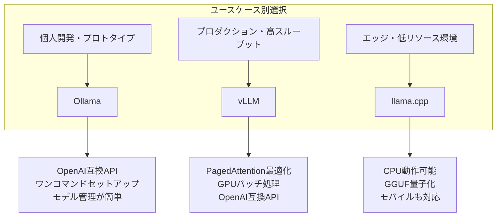
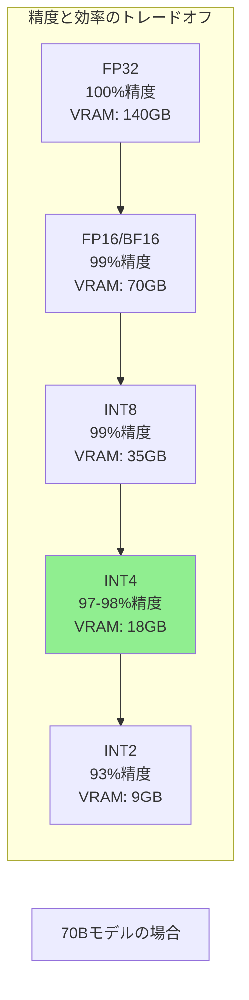
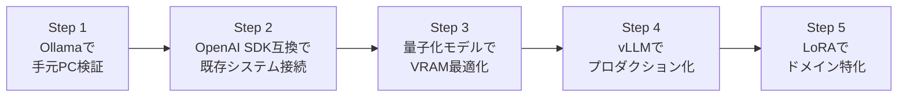

## はじめに：なぜいま「ローカルLLM」なのか

2026年現在、GPT-4oやClaude 3.7といったAPIサービスは圧倒的に便利です。しかし現場エンジニアから次のような声を聞くことが増えています。

> 「顧客データをOpenAIに送っていいのか、法務から待ったがかかった」
> 「APIコストが月100万円を超え始めた。どうにかしたい」
> 「インターネット接続のない工場環境でAIを動かしたい」
> 「レスポンスを50ms以内に収めたいが、APIだとRTT（ラウンドトリップ）がボトルネック」

これらの課題は全て、**ローカルLLM（オンプレミスLLM）**によって解決できます。そして2025〜2026年にかけて、ローカルで動かせるモデルの性能が飛躍的に向上しました。

- **Llama 3.3 70B**：GPT-4oと互角の性能をオープンウェイトで実現
- **Qwen2.5 72B**：コーディング・数学に特化した高性能モデル
- **Phi-4 14B**：Microsoftが放つ、軽量ながら驚異的な推論能力
- **DeepSeek-R1 70B**：Chain-of-Thoughtを内蔵した推論特化モデル

本記事では、ローカルLLMを**実務レベルで運用するための全知識**を体系的に解説します。

## ローカルLLM vs クラウドAPI：何を選ぶべきか

まず意思決定の整理から始めましょう。

| 観点 | クラウドAPI | ローカルLLM |
|------|------------|-------------|
| **セットアップ** | 即時（APIキーのみ） | 環境構築が必要 |
| **コスト** | 従量課金（大量利用は高額） | 初期ハードウェア費用 + 電気代 |
| **プライバシー** | データが外部に送信される | データが自社内に留まる |
| **レイテンシ** | ネットワーク遅延あり（50〜500ms） | ローカル処理（1〜50ms） |
| **モデル品質** | フロンティアモデルにアクセス可 | オープンウェイトモデルに限定 |
| **カスタマイズ** | 限定的 | ファインチューニング完全対応 |
| **オフライン動作** | 不可 | 可能 |
| **スケーラビリティ** | 無限（お金次第） | ハードウェア依存 |

**ローカルLLMを選ぶべきケース：**

1. 個人情報・機密情報を扱うシステム（医療、法務、金融）
2. 大量推論でAPIコストが月数百万円を超えるとき
3. ネットワーク非依存の組み込みシステムや工場系IoT
4. モデルをファインチューニングして自社ドメインに特化させたいとき
5. 特定のレイテンシSLAを満たす必要があるとき

## 主要ツール3選の比較

ローカルLLM実行環境は大きく3つのツールが市場を牽引しています。



### Ollama：開発者体験No.1

```bash
# macOS/Linux インストール
curl -fsSL https://ollama.com/install.sh | sh

# Windows（PowerShell）
# Ollama公式サイトからインストーラーをダウンロード

# モデルをダウンロードして即時実行
ollama run llama3.3

# APIサーバーとして起動（バックグラウンド）
ollama serve  # デフォルトで http://localhost:11434 に立ち上がる
```

Ollamaの最大の強みは**開発者体験**です。`ollama run モデル名`の1コマンドで、数十GBのモデルを自動ダウンロード・最適化・実行します。

### vLLM：本番プロダクションの標準

```bash
# pip インストール（CUDA 12.1環境）
pip install vllm==0.8.0

# OpenAI互換サーバーとして起動
python -m vllm.entrypoints.openai.api_server \
    --model meta-llama/Llama-3.3-70B-Instruct \
    --tensor-parallel-size 2 \
    --max-model-len 32768 \
    --port 8000
```

vLLMの核心技術は **PagedAttention** です。GPUのKVキャッシュメモリをOSのページメモリのように動的管理することで、従来比2〜24倍のスループットを達成します。

### llama.cpp：どこでも動く軽量ランタイム

```bash
# ビルド（macOSでのApple Silicon最適化）
git clone https://github.com/ggerganov/llama.cpp
cd llama.cpp
cmake -B build -DLLAMA_METAL=ON
cmake --build build --config Release

# GGUFモデルを実行
./build/bin/llama-server \
    -m models/qwen2.5-7b-instruct-q4_k_m.gguf \
    --port 8080 \
    -c 32768 \
    --n-gpu-layers 99  # GPUに乗せられるレイヤー数
```

llama.cppは**CPU only**でも動作するため、GPUなし環境やRaspberry Pi、Androidまで対応範囲が広いです。

## モデル選定ガイド2026

モデル選定は「ハードウェアスペック × ユースケース」で決まります。

### VRAMとモデルサイズの対応表

| 利用可能VRAM | おすすめモデル | 精度 |
|-------------|---------------|------|
| 4GB以下 | Phi-4-mini (3.8B), Qwen2.5-3B | ★★☆ |
| 8GB | Llama-3.2-8B, Mistral-7B-v0.3 | ★★★ |
| 16GB | Phi-4 (14B), Qwen2.5-14B | ★★★★ |
| 24GB | Llama-3.1-20B, Mistral-22B | ★★★★ |
| 48GB+ (2×24GB) | Llama-3.3-70B, Qwen2.5-72B | ★★★★★ |
| 80GB+ (A100) | Llama-3.3-70B (全精度) | ★★★★★ |

### ユースケース別おすすめモデル

**コーディング支援：**
```
1位: Qwen2.5-Coder-32B（コード特化、HumanEval 92.7%）
2位: DeepSeek-Coder-V2-Lite-Instruct（軽量で高速）
3位: Llama-3.1-70B-Instruct（汎用性も高い）
```

**日本語処理：**
```
1位: Llama-3.1-Swallow-70B-Instruct（東工大の日本語特化版）
2位: Qwen2.5-72B-Instruct（多言語対応・日本語品質高）
3位: EZO-Common-9B-gemma-2-it（軽量日本語モデル）
```

**推論・数学：**
```
1位: DeepSeek-R1-Distill-Llama-70B（思考プロセス付き）
2位: Phi-4（14B、数学ベンチマーク高評価）
3位: QwQ-32B（Alibaba推論特化モデル）
```

## 実践：Ollamaで開発環境を構築する

### Step 1: モデルのダウンロードと管理

```bash
# 利用可能なモデル一覧確認
ollama list

# モデルをダウンロード（量子化バリアントも指定可能）
ollama pull llama3.3:70b-instruct-q4_K_M  # 4bit量子化版（推奨）
ollama pull qwen2.5-coder:32b
ollama pull phi4:latest

# モデルの詳細情報確認
ollama show llama3.3

# ディスク節約のためモデルを削除
ollama rm llama3.3:70b
```

### Step 2: OpenAI SDK互換で接続

OllamaはOpenAI互換APIを提供しています。既存のOpenAI SDKコードをベースURLを変えるだけで流用できます。

```python
# pip install openai
from openai import OpenAI

# ベースURLをローカルに向けるだけ！
client = OpenAI(
    base_url="http://localhost:11434/v1",
    api_key="ollama",  # 値は何でもOK（認証なし）
)

response = client.chat.completions.create(
    model="llama3.3",
    messages=[
        {"role": "system", "content": "あなたは優秀なPythonエンジニアです。"},
        {"role": "user", "content": "FastAPIで簡単なTODO APIを実装してください。"},
    ],
    temperature=0.7,
    stream=True,  # ストリーミング対応
)

for chunk in response:
    if chunk.choices[0].delta.content:
        print(chunk.choices[0].delta.content, end="", flush=True)
```

### Step 3: LangChainとの連携

```python
# pip install langchain-ollama
from langchain_ollama import ChatOllama
from langchain_core.prompts import ChatPromptTemplate
from langchain_core.output_parsers import StrOutputParser

# モデル初期化
llm = ChatOllama(
    model="llama3.3",
    temperature=0.1,
    num_ctx=8192,       # コンテキストウィンドウ
    num_predict=2048,   # 最大生成トークン数
)

# シンプルなチェーン構築
prompt = ChatPromptTemplate.from_messages([
    ("system", "あなたはコードレビューの専門家です。"),
    ("human", "以下のコードをレビューしてください:\n\n{code}"),
])

chain = prompt | llm | StrOutputParser()

result = chain.invoke({
    "code": """
def get_user(id):
    conn = sqlite3.connect('db.sqlite')
    cursor = conn.cursor()
    cursor.execute(f"SELECT * FROM users WHERE id = {id}")
    return cursor.fetchone()
"""
})
print(result)
```

### Step 4: Embeddingモデルも一緒に動かす

```python
# Embeddingモデルのダウンロード
# $ ollama pull nomic-embed-text

from langchain_ollama import OllamaEmbeddings
from langchain_community.vectorstores import Chroma

# Embedding生成
embeddings = OllamaEmbeddings(model="nomic-embed-text")

# RAGシステムのベクターストア構築（完全ローカル！）
vectorstore = Chroma.from_texts(
    texts=[
        "社内のコーディング規約：変数名はsnake_caseを使用",
        "デプロイはGitHub Actionsを通じて行う",
        "APIの認証にはJWTトークンを使用する",
    ],
    embedding=embeddings,
    persist_directory="./local_vectorstore",
)

# 検索
docs = vectorstore.similarity_search("変数の命名規則は？", k=2)
for doc in docs:
    print(doc.page_content)
```

## 実践：vLLMでプロダクション環境を構築する

### 高スループットサーバーのセットアップ

```yaml
# docker-compose.yml
version: '3.8'
services:
  vllm-server:
    image: vllm/vllm-openai:latest
    runtime: nvidia
    environment:
      - NVIDIA_VISIBLE_DEVICES=all
      - HF_TOKEN=${HUGGING_FACE_TOKEN}
    ports:
      - "8000:8000"
    volumes:
      - ./models:/root/.cache/huggingface
    command: >
      --model meta-llama/Llama-3.3-70B-Instruct
      --tensor-parallel-size 2
      --max-model-len 32768
      --max-num-seqs 256
      --enable-chunked-prefill
      --gpu-memory-utilization 0.90
    deploy:
      resources:
        reservations:
          devices:
            - driver: nvidia
              count: 2
              capabilities: [gpu]
```

### バッチ処理でコストを最大化

vLLMの真価はContinuous Batchingにあります。複数リクエストを効率的にまとめて処理することで、GPUの利用率を最大化します。

```python
import asyncio
from openai import AsyncOpenAI

client = AsyncOpenAI(base_url="http://localhost:8000/v1", api_key="dummy")

async def analyze_code(code: str) -> str:
    response = await client.chat.completions.create(
        model="meta-llama/Llama-3.3-70B-Instruct",
        messages=[
            {"role": "user", "content": f"このコードのバグを指摘してください:\n{code}"},
        ],
        max_tokens=512,
    )
    return response.choices[0].message.content

# 100件のコードを並列で一気に処理
async def batch_analyze(codes: list[str]) -> list[str]:
    tasks = [analyze_code(code) for code in codes]
    return await asyncio.gather(*tasks)

# 実行
codes = ["..." for _ in range(100)]  # 100件のコード
results = asyncio.run(batch_analyze(codes))
print(f"処理完了: {len(results)}件")
```

## 量子化：モデルを小さくする技術

**量子化（Quantization）**は、モデルの重みを32bit浮動小数点から低精度形式に変換することで、メモリ使用量と推論速度を改善する技術です。



### GGUF量子化の種類（llama.cpp用）

```bash
# 量子化バリアントの読み方
# Q4_K_M = 4bit量子化、K-quantsアルゴリズム、Mサイズ

# バリアント比較（70Bモデルの場合）
# Q2_K    → 26GB  精度↓↓ 速度↑↑ (非推奨)
# Q4_K_S  → 37GB  精度↓  速度↑  (ストレージ優先)
# Q4_K_M  → 40GB  精度◎  速度↑  (バランス最良、推奨)
# Q5_K_M  → 46GB  精度○  速度◎  (精度優先)
# Q6_K    → 53GB  精度+  速度-   (高精度)
# Q8_0    → 70GB  精度++ 速度--  (ほぼ損失なし)

# HuggingFaceから量子化済みモデルをダウンロード（Bartowski等）
ollama pull qwen2.5:72b-instruct-q4_K_M
```

### AWQとGPTQによる高品質量子化

```python
# pip install autoawq
from awq import AutoAWQForCausalLM
from transformers import AutoTokenizer

model_path = "meta-llama/Llama-3.3-70B-Instruct"
quant_path = "./llama3.3-70b-awq"

# キャリブレーションデータの準備
quant_config = {
    "zero_point": True,
    "q_group_size": 128,
    "w_bit": 4,
    "version": "GEMM",
}

# 量子化実行（キャリブレーションデータが必要）
model = AutoAWQForCausalLM.from_pretrained(model_path, device_map="auto")
tokenizer = AutoTokenizer.from_pretrained(model_path)

model.quantize(tokenizer, quant_config=quant_config)
model.save_quantized(quant_path)
tokenizer.save_pretrained(quant_path)
print(f"量子化完了: {quant_path}")
```

## パフォーマンスチューニング実践

### Ollamaのチューニングパラメータ

```bash
# Modelfileでモデルの動作をカスタマイズ
cat > Modelfile << 'EOF'
FROM llama3.3

# システムプロンプトを固定
SYSTEM """
あなたは株式会社○○の社内AIアシスタントです。
社内の技術スタックはPython/FastAPI/PostgreSQL/Kubernetesです。
回答は必ず日本語で行ってください。
"""

# パラメータチューニング
PARAMETER temperature 0.1        # 低めで安定した出力
PARAMETER top_p 0.9
PARAMETER top_k 40
PARAMETER num_ctx 16384           # コンテキストウィンドウ
PARAMETER num_predict 2048        # 最大出力トークン
PARAMETER repeat_penalty 1.1      # 繰り返し抑制
EOF

# カスタムモデルを作成
ollama create company-assistant -f Modelfile
ollama run company-assistant
```

### llama.cppのGPU最適化

```bash
# --n-gpu-layers: GPUに乗せるレイヤー数を最大化
# --threads: CPUスレッド数（物理コア数 - 2が目安）
# --batch-size: バッチサイズ（大きいほどGPU効率↑）
# --ubatch-size: マイクロバッチサイズ

./llama-server \
    -m models/llama3.3-70b-q4_k_m.gguf \
    --port 8080 \
    -c 32768 \
    --n-gpu-layers 99 \
    --threads 8 \
    --batch-size 512 \
    --ubatch-size 128 \
    --flash-attn \          # Flash Attention有効化
    --mlock \               # メモリをロックして高速化
    --parallel 4            # 同時処理リクエスト数
```

### ベンチマーク測定

```python
import time
import httpx
import statistics

def benchmark_llm(url: str, model: str, n_requests: int = 20):
    client = httpx.Client(timeout=120)
    prompt = "フィボナッチ数列の最初の10項をPythonで計算するコードを書いてください。"
    
    ttft_list = []  # Time To First Token
    total_times = []
    token_counts = []
    
    for i in range(n_requests):
        start = time.time()
        first_token_time = None
        tokens = 0
        
        with client.stream("POST", f"{url}/v1/chat/completions", json={
            "model": model,
            "messages": [{"role": "user", "content": prompt}],
            "stream": True,
            "max_tokens": 256,
        }) as resp:
            for line in resp.iter_lines():
                if line.startswith("data: ") and line != "data: [DONE]":
                    if first_token_time is None:
                        first_token_time = time.time()
                    tokens += 1
        
        elapsed = time.time() - start
        ttft_list.append((first_token_time - start) * 1000)
        total_times.append(elapsed)
        token_counts.append(tokens)
    
    print(f"=== ベンチマーク結果 ({n_requests}リクエスト) ===")
    print(f"TTFT (中央値):  {statistics.median(ttft_list):.0f}ms")
    print(f"総処理時間(中央値): {statistics.median(total_times):.2f}s")
    print(f"スループット:   {sum(token_counts)/sum(total_times):.1f} tokens/sec")

benchmark_llm("http://localhost:11434", "llama3.3")
```

## プロダクション運用のポイント

### セキュリティ設定

ローカルLLMサーバーをネットワーク上に公開する場合は、必ず認証を設定します。

```python
# FastAPIでリバースプロキシを作成し、認証を追加
from fastapi import FastAPI, HTTPException, Depends
from fastapi.security import HTTPBearer, HTTPAuthorizationCredentials
import httpx

app = FastAPI()
security = HTTPBearer()
VALID_TOKENS = {"sk-internal-abc123", "sk-internal-xyz789"}

async def verify_token(credentials: HTTPAuthorizationCredentials = Depends(security)):
    if credentials.credentials not in VALID_TOKENS:
        raise HTTPException(status_code=401, detail="Invalid token")
    return credentials.credentials

@app.post("/v1/chat/completions")
async def proxy_chat(request: dict, token: str = Depends(verify_token)):
    async with httpx.AsyncClient() as client:
        response = await client.post(
            "http://localhost:11434/v1/chat/completions",
            json=request,
            timeout=120,
        )
    return response.json()
```

### ヘルスチェックと監視

```python
# Prometheus メトリクス収集
from prometheus_client import Counter, Histogram, start_http_server
import time

REQUEST_COUNT = Counter('llm_requests_total', 'Total LLM requests', ['model', 'status'])
REQUEST_LATENCY = Histogram('llm_request_duration_seconds', 'LLM request latency', ['model'])
TOKEN_COUNT = Counter('llm_tokens_total', 'Total tokens generated', ['model'])

def monitored_completion(model: str, messages: list):
    start_time = time.time()
    try:
        response = client.chat.completions.create(
            model=model,
            messages=messages,
        )
        duration = time.time() - start_time
        REQUEST_COUNT.labels(model=model, status="success").inc()
        REQUEST_LATENCY.labels(model=model).observe(duration)
        TOKEN_COUNT.labels(model=model).inc(response.usage.completion_tokens)
        return response
    except Exception as e:
        REQUEST_COUNT.labels(model=model, status="error").inc()
        raise
```

### モデルのホットスワップ（無停止切り替え）

```bash
# vLLMのLORA（Low-Rank Adaptation）動的ローディング
# ベースモデルは維持したまま、LoRAアダプタを切り替える

curl -X POST http://localhost:8000/v1/load_lora_adapter \
    -H "Content-Type: application/json" \
    -d '{
        "lora_name": "company-domain-v2",
        "lora_path": "/models/loras/company-domain-v2"
    }'

# アダプタを指定してリクエスト
curl -X POST http://localhost:8000/v1/chat/completions \
    -H "Content-Type: application/json" \
    -d '{
        "model": "llama3.3__company-domain-v2__1",
        "messages": [{"role": "user", "content": "社内用語でいう「ドッグフーディング」とは？"}]
    }'
```

## よくある問題と解決策

### 問題1: VRAM不足（OOM Error）

```bash
# 解決策1: 量子化バリアントを下げる
ollama pull llama3.3:70b-instruct-q4_K_M  # → q3_K_Mに変更

# 解決策2: コンテキスト長を削減
PARAMETER num_ctx 4096  # デフォルトの半分に

# 解決策3: CPU+GPUのハイブリッド推論（llama.cpp）
./llama-server -m model.gguf --n-gpu-layers 40  # 40レイヤーのみGPU、残りCPU

# 解決策4: 複数GPUへのテンソル並列（vLLM）
--tensor-parallel-size 2  # GPU2枚に分割
```

### 問題2: 推論が遅い

```bash
# チェック項目
nvidia-smi  # GPU使用率が100%近いか確認
# → 低い場合はバッチサイズを増やす or Flash Attentionを有効化

# Ollamaのデバッグログ確認
OLLAMA_DEBUG=1 ollama serve 2>&1 | grep -E "load|GPU|layer"
```

### 問題3: 日本語の品質が低い

```python
# 解決策1: 日本語特化モデルに切り替え
# Llama-3.1-Swallow-70B-Instruct（東工大作成）

# 解決策2: システムプロンプトで日本語を強制
messages = [
    {
        "role": "system",
        "content": "You must respond in Japanese. Never use English in your responses."
    },
    ...
]

# 解決策3: temperature を下げて安定性を上げる
llm = ChatOllama(model="llama3.3", temperature=0.1)
```

## ハードウェア選定ガイド

### 開発・検証用（個人・小チーム）

| 構成 | VRAM | コスト目安 | 動かせるモデル |
|------|------|------------|---------------|
| MacBook Pro M3 Max | 48GB統合 | 約50万円 | 70Bまで可（量子化） |
| RTX 4090 × 1 | 24GB | 約20万円 | 20Bまで可 |
| RTX 4090 × 2 | 48GB | 約40万円 | 70Bまで可 |

### プロダクション用（サービス）

| 構成 | VRAM | コスト目安 | 想定スループット |
|------|------|------------|----------------|
| A100 40GB × 1 | 40GB | クラウド約1,500円/h | 300 tokens/sec |
| A100 80GB × 2 | 160GB | クラウド約3,000円/h | 800 tokens/sec |
| H100 80GB × 4 | 320GB | クラウド約8,000円/h | 2,000 tokens/sec |

## まとめ：ローカルLLM導入ロードマップ



本記事で解説したポイントをまとめます：

1. **ツール選択**: 開発はOllama、本番はvLLM、エッジ/CPUはllama.cpp
2. **モデル選択**: VRAMサイズとユースケースで決定。Q4_K_Mが品質と効率のベストバランス
3. **API互換性**: 全ツールがOpenAI互換APIを提供。既存コードのbase_urlを変えるだけ
4. **量子化**: 70Bモデルも4bit量子化で48GB GPUに収まる。精度劣化は1〜3%程度
5. **日本語対応**: Llama-3.1-Swallow、Qwen2.5などの多言語モデルが高品質

ローカルLLMは「プライバシーを守りながら、クラウドAPIに近い品質を実現する」現実的な選択肢になりました。まずはOllamaで手元のMacやLinux PCに試してみることをお勧めします。意外なほど簡単に動き始めるはずです。

## 参考リンク

- [Ollama公式](https://ollama.com/) - モデルライブラリとドキュメント
- [vLLM Documentation](https://docs.vllm.ai/) - プロダクション推論エンジン
- [llama.cpp GitHub](https://github.com/ggerganov/llama.cpp) - 軽量推論ランタイム
- [HuggingFace Model Hub](https://huggingface.co/models?other=gguf) - GGUFモデル検索
- [Ollama Model Library](https://ollama.com/library) - Ollamaモデル一覧

### 関連記事

- [LLMアプリ評価（Evals）完全ガイド](/llm/2026/03/14/llm-evals-guide.html)
- [コンテキストエンジニアリング](/prompt-engineering/2026/03/13/context-engineering-guide.html)
- [AIエージェントのメモリシステム設計](/ai-agents/2026/03/19/llm-memory-system-guide.html)
