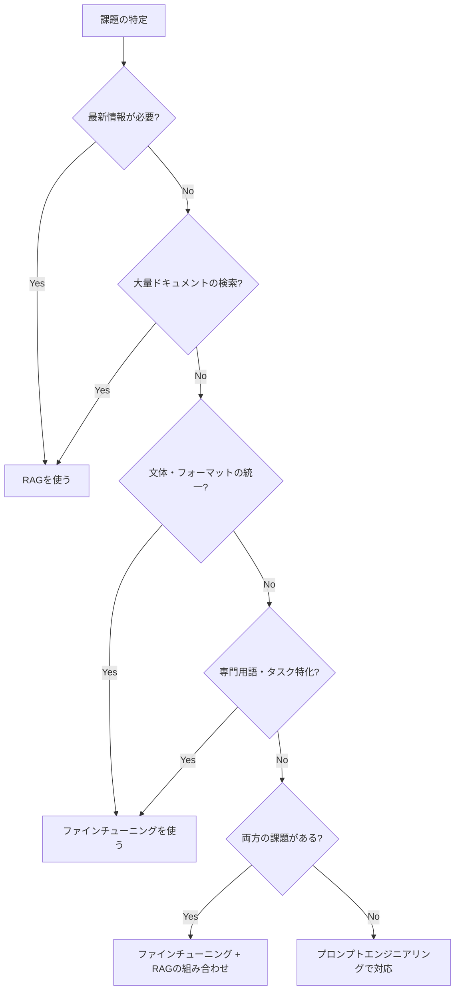
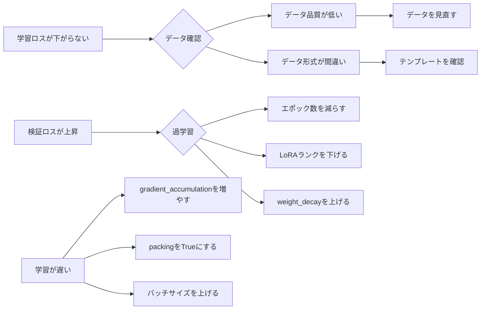

## はじめに：「RAGで解決できない問題」に気づいたとき

多くのAIネイティブエンジニアが最初に手を出すのはRAG（検索拡張生成）です。社内ドキュメントを与えてLLMに回答させる仕組みは直感的で、導入も比較的簡単。しかし実務で運用していると、こんな壁にぶつかることがあります。

> 「うちの業界特有の専門用語をモデルが理解していない」
> 「回答のトーンや形式を統一したいが、プロンプトだけでは制御しきれない」
> 「毎回長いsystem promptを送ることで、コストと遅延が膨らんでいる」
> 「特定のタスク（SQLクエリ生成、法律文書の要約）の精度がどうしても上がらない」

これらは**ファインチューニング**が最も有効な場面です。

2025〜2026年にかけて、ファインチューニングを取り巻く環境は劇的に改善されました。特に**LoRA（Low-Rank Adaptation）**と**QLoRA（量子化LoRA）**の登場により、**数百ドルのGPUコストで、GPT-4oに匹敵するタスク特化モデルを作る**ことが現実的になっています。

本記事では、理論的な背景から実装、そして評価・運用まで、ファインチューニングの全体像を体系的に解説します。

## ファインチューニングとRAG：正しい使い分け

まず大前提として、**ファインチューニングとRAGは競合する技術ではありません**。それぞれの強みと弱みを正確に把握することが重要です。

| 観点 | ファインチューニング | RAG |
|------|------------------|-----|
| **向いている用途** | 文体・フォーマット統一、専門語彙の習得、タスク特化 | 最新情報への対応、大量ドキュメント検索、事実グラウンディング |
| **知識の更新** | 再学習が必要（コスト大） | ドキュメント更新のみ（低コスト） |
| **推論コスト** | 低（短いシステムプロンプト） | 高（毎回検索+長いコンテキスト） |
| **初期投資** | GPU時間・データ整備が必要 | 比較的低い |
| **精度の上限** | タスク特化で非常に高い | 検索精度に依存 |
| **ハルシネーション** | 学習データに依存 | 根拠ドキュメントで抑制しやすい |

**判断基準のフローチャート：**



## LoRAの仕組み：なぜ効率的にファインチューニングできるのか

### フルファインチューニングの問題点

従来のフルファインチューニング（Full Fine-tuning）では、モデルの全パラメータを更新します。Llama 3 70Bモデルであれば700億個のパラメータを全て更新するため：

- **GPU VRAM**: 約140GB以上（fp16の場合）
- **学習コスト**: A100 80GB × 8枚を使っても数日
- **ストレージ**: モデルごとに140GB以上のチェックポイント

これは多くの企業にとって現実的ではありません。

### LoRAの核心アイデア

**LoRA（Low-Rank Adaptation）**は2021年にMicrosoft Researchが提案した手法で、核心のアイデアは以下の通りです。

> 「学習時の重み更新行列 ΔW は、実は低ランクな構造を持っている」

数式で表すと：

```
W' = W + ΔW = W + BA

ここで：
- W  : 元のモデルの重み行列（d × d）
- B  : 低ランク行列（d × r）
- A  : 低ランク行列（r × d）
- r  : ランク（通常4〜64）
```

元の重み行列 W（例：4096 × 4096 = 1,677万パラメータ）の代わりに、ランク `r=16` の場合は B と A の合計 `4096×16 + 16×4096 = 13万パラメータ` のみを学習します。削減率は約**99.2%**です。

```python
# LoRAの概念的な実装（PyTorch）
import torch
import torch.nn as nn

class LoRALinear(nn.Module):
    def __init__(self, in_features, out_features, rank=16, alpha=32):
        super().__init__()
        self.rank = rank
        self.alpha = alpha
        self.scaling = alpha / rank
        
        # 元の重みは凍結（学習しない）
        self.weight = nn.Parameter(
            torch.randn(out_features, in_features), 
            requires_grad=False
        )
        
        # LoRAの低ランク行列（これだけ学習する）
        self.lora_A = nn.Parameter(torch.randn(rank, in_features) * 0.02)
        self.lora_B = nn.Parameter(torch.zeros(out_features, rank))
    
    def forward(self, x):
        # 元の重みでの計算 + LoRAの補正
        base_output = x @ self.weight.T
        lora_output = x @ self.lora_A.T @ self.lora_B.T
        return base_output + lora_output * self.scaling
```

### QLoRA：さらに踏み込んだメモリ削減

**QLoRA（Quantized LoRA）**は、LoRAをさらに拡張した手法です。

1. ベースモデルを**4bit量子化**（NF4: NormalFloat4）して保持
2. その上にLoRAアダプターを**16bit精度**で学習
3. 勾配計算時に必要に応じてdequantize

結果として：
- **Llama 3 70Bを1枚のA100 80GB（または2枚のRTX 4090）で学習可能**
- フルファインチューニングと比較して精度低下は最小限（多くのタスクで1%以内）

```
メモリ消費の比較（70Bモデルの場合）：

フルファインチューニング : 約560GB（fp32）
LoRA（fp16）          : 約140GB
QLoRA（4bit）         : 約35GB  ← これが革命的
```

## 環境構築：Unslothを使った高速ファインチューニング

2026年現在、ファインチューニングのデファクトスタンダードは**Unsloth**です。Hugging Face TRL/PEFTと比較して：

- 🚀 **学習速度が2〜5倍高速**（カスタムCUDAカーネルによる最適化）
- 💾 **メモリ使用量が70%削減**
- ✅ **Llama 3.x、Qwen 2.5、Mistral、Phi-4等、主要モデルに対応**

### インストール

```bash
# CUDA 12.1の場合
pip install "unsloth[colab-new] @ git+https://github.com/unslothai/unsloth.git"
pip install --no-deps "xformers<0.0.27" "trl<0.9.0" peft accelerate bitsandbytes

# または公式の推奨インストール（より安定）
pip install unsloth

# 確認
python -c "import unsloth; print(unsloth.__version__)"
```

### 必要なハードウェア目安

| モデルサイズ | QLoRA最小VRAM | 推奨GPU |
|------------|-------------|---------|
| 7B / 8B | 8GB | RTX 3080, L4 |
| 13B / 14B | 12GB | RTX 3080 Ti, T4 x2 |
| 32B | 24GB | RTX 4090, A10G |
| 70B | 40GB | A100 40GB, 2× RTX 4090 |

## 実装：Instruction Tuningの完全コード例

最も一般的なユースケースである**Instruction Tuning**（特定の指示スタイルでモデルを調整）の完全なコードを紹介します。

### Step 1: モデルの読み込み

```python
from unsloth import FastLanguageModel
import torch

# モデルの設定
max_seq_length = 2048
dtype = None  # Noneで自動検出（bf16推奨）
load_in_4bit = True  # QLoRA有効化

# モデルとトークナイザーの読み込み
model, tokenizer = FastLanguageModel.from_pretrained(
    model_name="unsloth/Meta-Llama-3.1-8B-Instruct",
    max_seq_length=max_seq_length,
    dtype=dtype,
    load_in_4bit=load_in_4bit,
)

print(f"モデル読み込み完了: {model.num_parameters():,} パラメータ")
```

### Step 2: LoRAアダプターの設定

```python
# LoRAの設定（最重要のハイパーパラメータ）
model = FastLanguageModel.get_peft_model(
    model,
    r=16,                   # ランク：高いほど表現力↑、メモリ↑（推奨: 8〜64）
    target_modules=[        # LoRAを適用するモジュール
        "q_proj", "k_proj", "v_proj", "o_proj",  # Attention
        "gate_proj", "up_proj", "down_proj",       # FFN
    ],
    lora_alpha=16,          # スケーリング係数（通常はrと同じ値）
    lora_dropout=0,         # Unslothはdropout=0が最速
    bias="none",            # LoRAのバイアス項
    use_gradient_checkpointing="unsloth",  # メモリ削減
    random_state=42,
    use_rslora=False,       # RsLoRA（ランク安定化）の使用
)

# 学習可能なパラメータ数を確認
trainable = sum(p.numel() for p in model.parameters() if p.requires_grad)
total = sum(p.numel() for p in model.parameters())
print(f"学習可能パラメータ: {trainable:,} / {total:,} ({100*trainable/total:.2f}%)")
# 例: 学習可能パラメータ: 83,886,080 / 8,030,261,248 (1.04%)
```

### Step 3: データセットの準備

Instruction Tuningには**Alpaca形式**が広く使われています：

```python
from datasets import load_dataset

# Alpaca形式のサンプルデータ
sample_data = [
    {
        "instruction": "以下の顧客レビューをポジティブ・ネガティブ・中立で分類してください。",
        "input": "配送が遅かったですが、商品自体は期待通りでした。",
        "output": "中立\n\n理由：配送への不満（ネガティブ要素）がありますが、商品品質には満足（ポジティブ要素）しており、総合的に中立と判断します。"
    },
    {
        "instruction": "SQLクエリを生成してください。",
        "input": "usersテーブルから、2024年1月以降に登録した東京在住のユーザーを年齢順に取得する",
        "output": "SELECT *\nFROM users\nWHERE\n    created_at >= '2024-01-01'\n    AND prefecture = '東京'\nORDER BY age ASC;"
    },
    # ... 数百〜数千件
]

# Alpacaプロンプトテンプレート
alpaca_prompt = """以下は、タスクを説明する指示と、さらなる文脈を提供する入力の組み合わせです。
要求を適切に満たす回答を書いてください。

### 指示:
{}

### 入力:
{}

### 回答:
{}"""

EOS_TOKEN = tokenizer.eos_token

def formatting_prompts_func(examples):
    instructions = examples["instruction"]
    inputs = examples["input"]
    outputs = examples["output"]
    texts = []
    for instruction, input_text, output in zip(instructions, inputs, outputs):
        text = alpaca_prompt.format(instruction, input_text, output) + EOS_TOKEN
        texts.append(text)
    return {"text": texts}

# データセットの変換
from datasets import Dataset
dataset = Dataset.from_list(sample_data)
dataset = dataset.map(formatting_prompts_func, batched=True)

print(f"データセット件数: {len(dataset)}")
print("サンプル:")
print(dataset[0]["text"][:300])
```

### Step 4: 学習の実行

```python
from trl import SFTTrainer
from transformers import TrainingArguments
from unsloth import is_bfloat16_supported

trainer = SFTTrainer(
    model=model,
    tokenizer=tokenizer,
    train_dataset=dataset,
    dataset_text_field="text",
    max_seq_length=max_seq_length,
    dataset_num_proc=2,
    packing=False,  # 短いシーケンスをパックして高速化（True推奨）
    args=TrainingArguments(
        # 基本設定
        output_dir="./checkpoints",
        num_train_epochs=3,          # エポック数
        
        # バッチサイズ（VRAM量に応じて調整）
        per_device_train_batch_size=2,
        gradient_accumulation_steps=4,  # 実効バッチサイズ = 2 × 4 = 8
        
        # 学習率スケジューリング
        warmup_ratio=0.1,
        learning_rate=2e-4,             # LoRAでは1e-4〜3e-4が典型的
        lr_scheduler_type="cosine",
        
        # 精度とメモリ
        fp16=not is_bfloat16_supported(),
        bf16=is_bfloat16_supported(),
        
        # ログと保存
        logging_steps=10,
        save_strategy="epoch",
        save_total_limit=2,
        
        # 最適化
        optim="adamw_8bit",  # 8bit Adamでメモリ削減
        weight_decay=0.01,
        max_grad_norm=1.0,
        
        seed=42,
    ),
)

# 学習実行
print("学習開始...")
trainer_stats = trainer.train()
print(f"学習完了: {trainer_stats.metrics}")
```

### Step 5: モデルの保存と推論

```python
# LoRAアダプターのみを保存（小さい）
model.save_pretrained("./my_model_lora")
tokenizer.save_pretrained("./my_model_lora")
# → 通常数十MB〜200MB程度

# ベースモデルにマージして保存（デプロイ用）
model.save_pretrained_merged(
    "./my_model_merged",
    tokenizer,
    save_method="merged_16bit",  # fp16でマージ
)

# 推論用に読み込み直し
FastLanguageModel.for_inference(model)

# 推論テスト
inputs = tokenizer(
    [alpaca_prompt.format(
        "以下の顧客レビューをポジティブ・ネガティブ・中立で分類してください。",
        "このソフトウェアは使いやすいですが、ドキュメントが少なくて困ります。",
        "",  # 回答欄は空
    )],
    return_tensors="pt"
).to("cuda")

from transformers import TextStreamer
text_streamer = TextStreamer(tokenizer)

outputs = model.generate(
    **inputs,
    streamer=text_streamer,
    max_new_tokens=256,
    temperature=0.1,
    repetition_penalty=1.1,
)
```

## データセット設計：品質がすべて

ファインチューニングで最もインパクトが大きいのは**データの質**です。「ゴミを入れればゴミが出る（GIGO）」は、LLMの学習でも完全に当てはまります。

### データ量の目安

| タスクの複雑さ | 最低ライン | 推奨 |
|-------------|---------|------|
| 単純な分類・変換 | 200件 | 1,000件 |
| 複合的な指示に従う | 500件 | 3,000件 |
| ドメイン知識の習得 | 1,000件 | 10,000件以上 |
| 会話スタイルの習得 | 300件（多様性重視） | 2,000件 |

### 高品質データを作る3つの戦略

**1. 人手による高品質データ収集**
```python
# 理想的なデータの特徴
quality_checklist = {
    "多様性": "同じ表現パターンの繰り返しを避ける",
    "正確性": "専門家がレビューした正解を使う",
    "一貫性": "同じ指示には同じスタイルで回答",
    "適切な長さ": "必要十分な長さ（過度に短くも長くもない）",
}
```

**2. Synthetic Data Generation（合成データ生成）**
```python
import openai

client = openai.OpenAI()

def generate_training_data(topic: str, num_samples: int = 100) -> list[dict]:
    """GPT-4oを使って学習データを自動生成する"""
    
    prompt = f"""
    あなたはデータ生成の専門家です。
    以下のトピックに関するInstruction Tuning用のデータを{num_samples}件生成してください。
    
    トピック: {topic}
    
    各データは以下のJSON形式で出力してください：
    
    {{
      "instruction": "タスクの指示文",
      "input": "追加の文脈や入力データ（不要な場合は空文字）",
      "output": "理想的な回答"
    }}
    
    
    多様性のために：
    - 難易度を易しい・普通・難しいで均等に分散する
    - 表現パターンを変える
    - エッジケースも含める
    """
    
    response = client.chat.completions.create(
        model="gpt-4o",
        messages=[{"role": "user", "content": prompt}],
        response_format={"type": "json_object"},
    )
    
    import json
    return json.loads(response.choices[0].message.content)["data"]

# 使用例
sql_data = generate_training_data(
    topic="SQLクエリ生成（PostgreSQL）。集計、JOIN、サブクエリを含む複雑なクエリ",
    num_samples=200
)
```

**3. Self-Instruct（既存モデルへの自己蒸留）**

ベースモデル（Llama 3.1 70B等）を使って、小型モデル（8B）用の訓練データを生成する手法。コストと品質のバランスが良い。

```bash
# LLaMA-Factoryを使った自己蒸留の例
llamafactory-cli train \
  --stage pt \
  --model_name_or_path meta-llama/Meta-Llama-3.1-70B-Instruct \
  --dataset self_cognition \
  --template llama3 \
  --output_dir ./teacher_output
```

## ハイパーパラメータ チューニングガイド

### 最重要パラメータ：ランク `r`

```python
# ランクの選択基準
rank_selection_guide = {
    "r=4":  "非常に限られたメモリ。タスクが単純な場合のみ",
    "r=8":  "小さめのタスク、高いメモリ制約下での推奨",
    "r=16": "バランスが良い。多くのユースケースでのデフォルト推奨",
    "r=32": "複雑なタスク、余裕があるメモリ環境",
    "r=64": "非常に複雑なタスク。過学習に注意",
}
```

### 学習率の設定

```python
# タスク別の学習率目安
learning_rate_guide = {
    "2e-4": "一般的なInstruction Tuning（推奨スタート地点）",
    "1e-4": "既にある程度チューニング済みモデルへの追加学習",
    "5e-5": "非常に少ないデータでの学習、過学習防止重視",
    "3e-4": "合成データが多い場合、データ品質への自信がある場合",
}
```

### 学習曲線で判断するトラブルシューティング



## 評価：ファインチューニングの効果を測る

学習が終わったら、**必ず定量評価**を行ってください。「なんとなく良くなった気がする」は危険です。

### タスク別評価指標

```python
# evaluation/eval_pipeline.py

from datasets import load_dataset
from transformers import pipeline
import evaluate

class FineTuningEvaluator:
    """ファインチューニング後のモデルを自動評価するパイプライン"""
    
    def __init__(self, model, tokenizer, baseline_model=None):
        self.model = model
        self.tokenizer = tokenizer
        self.baseline = baseline_model
    
    def evaluate_classification(self, test_dataset):
        """分類タスクの評価（F1スコア、正解率）"""
        accuracy_metric = evaluate.load("accuracy")
        f1_metric = evaluate.load("f1")
        
        predictions = []
        references = []
        
        for sample in test_dataset:
            output = self._generate(sample["instruction"], sample["input"])
            predictions.append(self._extract_label(output))
            references.append(sample["expected_label"])
        
        results = {
            "accuracy": accuracy_metric.compute(
                predictions=predictions, references=references
            ),
            "f1": f1_metric.compute(
                predictions=predictions, references=references, average="weighted"
            ),
        }
        return results
    
    def evaluate_generation(self, test_dataset):
        """生成タスクの評価（ROUGE、BERTScore）"""
        rouge = evaluate.load("rouge")
        bertscore = evaluate.load("bertscore")
        
        generated_texts = [
            self._generate(s["instruction"], s["input"]) 
            for s in test_dataset
        ]
        references = [s["output"] for s in test_dataset]
        
        return {
            "rouge": rouge.compute(
                predictions=generated_texts, references=references
            ),
            "bertscore": bertscore.compute(
                predictions=generated_texts, 
                references=references, 
                lang="ja"
            ),
        }
    
    def evaluate_with_llm_judge(self, test_dataset, judge_model="gpt-4o"):
        """LLM-as-a-Judgeによる品質評価"""
        import openai
        client = openai.OpenAI()
        
        scores = []
        for sample in test_dataset:
            generated = self._generate(sample["instruction"], sample["input"])
            
            judge_prompt = f"""
            以下の指示に対して生成された回答を1〜5で評価してください。
            
            指示: {sample['instruction']}
            入力: {sample['input']}
            正解例: {sample['output']}
            生成回答: {generated}
            
            評価基準：
            5: 正解例と同等以上の品質
            4: 概ね正確、わずかな不足
            3: 部分的に正確
            2: 主要な誤りがある
            1: 全く不正確
            
            スコアのみを整数で出力してください。
            """
            
            response = client.chat.completions.create(
                model=judge_model,
                messages=[{"role": "user", "content": judge_prompt}],
                max_tokens=10,
            )
            scores.append(int(response.choices[0].message.content.strip()))
        
        return {
            "mean_score": sum(scores) / len(scores),
            "score_distribution": {i: scores.count(i) for i in range(1, 6)},
        }
    
    def _generate(self, instruction: str, input_text: str) -> str:
        # 省略: モデルによる生成ロジック
        pass
    
    def _extract_label(self, text: str) -> str:
        # 省略: テキストからラベルを抽出するロジック
        pass
```

## デプロイ：GGUFとvLLMで本番運用

ファインチューニング済みモデルを本番環境に乗せる方法を解説します。

### オプション1：GGUF + Ollamaでローカル/エッジデプロイ

```python
# Unslothで直接GGUFに変換
model.save_pretrained_gguf(
    "./my_model_gguf",
    tokenizer,
    quantization_method="q4_k_m",  # 量子化レベル（q4_k_mがバランス良）
)

# Ollamaで使えるModelfileを生成
modelfile_content = """
FROM ./my_model_gguf/unsloth.Q4_K_M.gguf

SYSTEM "あなたは○○専門のAIアシスタントです。..."

PARAMETER temperature 0.1
PARAMETER top_p 0.9
PARAMETER num_ctx 4096
"""

with open("./Modelfile", "w") as f:
    f.write(modelfile_content)

# Ollamaへの登録
# $ ollama create my-custom-model -f ./Modelfile
# $ ollama run my-custom-model
```

### オプション2：vLLMで高スループットAPIサーバー

```bash
# vLLMでOpenAI互換APIサーバーを起動
vllm serve ./my_model_merged \
  --dtype bfloat16 \
  --max-model-len 4096 \
  --gpu-memory-utilization 0.95 \
  --served-model-name my-custom-llm \
  --host 0.0.0.0 \
  --port 8000
```

```python
# OpenAI SDKで接続（互換性あり）
from openai import OpenAI

client = OpenAI(
    base_url="http://localhost:8000/v1",
    api_key="dummy",  # vLLMはAPIキー不要
)

response = client.chat.completions.create(
    model="my-custom-llm",
    messages=[
        {"role": "system", "content": "あなたは専門的なSQLアシスタントです。"},
        {"role": "user", "content": "月次の売上集計クエリを書いてください。"},
    ],
    temperature=0.1,
)
print(response.choices[0].message.content)
```

## 実践的なトラブルシューティング

### よくある問題と解決策

**問題1: 学習後に「Catastrophic Forgetting（壊滅的忘却）」が発生**

ファインチューニングで特定タスクに最適化した結果、元の汎用的な能力が大きく劣化する現象。

```python
# 対策1: LoRAランクを下げる（更新量を抑える）
# 対策2: 学習率を下げる
# 対策3: 汎用タスクのサンプルをデータセットに混ぜる（データの多様性確保）

# 対策4: GaLoreやDoRAなど高度な手法を使う
from peft import LoraConfig

config = LoraConfig(
    r=8,        # ランクを下げる
    lora_alpha=16,
    target_modules=["q_proj", "v_proj"],  # 対象モジュールを絞る
    lora_dropout=0.05,  # 軽いdropoutで正則化
)
```

**問題2: 回答が学習データのフォーマットに過度に依存する**

```python
# 原因: 同じフォーマットのデータが多すぎる
# 解決: プロンプトのバリエーションを増やす

prompt_variations = [
    "以下を{task}してください：\n{input}",
    "{input}\n\n上記を{task}した結果を教えてください。",
    "タスク: {task}\n入力: {input}\n出力:",
    "【{task}】\n{input}",
]
```

**問題3: 日本語の品質が英語より著しく低い**

```python
# 原因: ベースモデルの日本語学習データが少ない
# 解決: 日本語に強いベースモデルを選ぶ

japanese_strong_models = [
    "llm-jp/llm-jp-3-13b",           # 日本語特化
    "cyberagent/calm3-22b-chat",      # 日本語強化
    "Qwen/Qwen2.5-14B-Instruct",     # 中国語・日本語に強い多言語モデル
    "tokyotech-llm/Llama-3.1-Swallow-70B-Instruct-v0.3",  # 日本語継続学習済み
]
```

## まとめ：ファインチューニングを始めるための3ステップ

1. **小さく始める**: まず100件のデータと8Bモデルでプロトタイプを作る。完璧なデータを集めようとせず、まず動かす。

2. **評価を先に設計する**: 「このタスクで何%の精度が出ればOKか」という基準を学習前に定める。LLM-as-a-Judgeとルールベース評価を組み合わせると効果的。

3. **繰り返す**: データ収集 → 学習 → 評価 → データ修正のサイクルを回す。1回で完璧を目指さない。

RAGとファインチューニングを組み合わせることで、**特定タスクの精度×最新情報への対応**の両方を実現できます。まず自分のユースケースがどちらに向いているかを見極め、必要に応じて両方を組み合わせることが、2026年のAIネイティブエンジニアとしての重要なスキルです。

## 参考リソース

- [LoRA論文 (Hu et al., 2021)](https://arxiv.org/abs/2106.09685)
- [QLoRA論文 (Dettmers et al., 2023)](https://arxiv.org/abs/2305.14314)
- [Unsloth公式ドキュメント](https://github.com/unslothai/unsloth)
- [Hugging Face PEFT](https://huggingface.co/docs/peft)
- [TRL (Transformer Reinforcement Learning)](https://huggingface.co/docs/trl)
- [LLaMA-Factory](https://github.com/hiyouga/LLaMA-Factory)
- 関連記事: [ローカルLLM完全ガイド2026](/llm/2026/03/23/local-llm-complete-guide.html)
- 関連記事: [LLMアプリ評価（Evals）完全ガイド](/llm/2026/03/14/llm-evals-guide.html)
