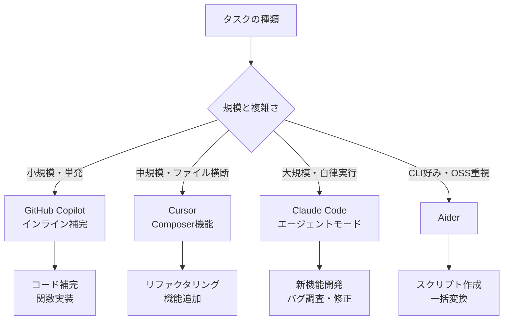
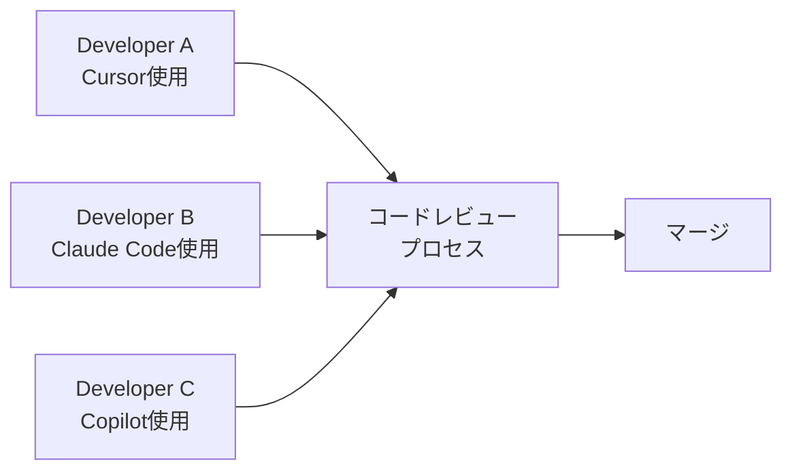

## はじめに：「バイブコーディング」とは何か

2025年2月、OpenAIの共同創業者Andrej Karpathyが一つのツイートを投稿しました。

> "There's a new kind of coding I call 'vibe coding', where you fully give in to the vibes, embrace exponentials, and forget that the code even exists."

「バイブコーディング」——コードの細部を気にせず、AIに乗っかって感覚でプロダクトを作る開発スタイル。このコンセプトは瞬く間にエンジニアコミュニティに広まり、2026年現在では単なる流行語を超え、プロフェッショナルな開発現場でも本格的に取り入れられるワークフローになっています。

しかし、「ノリでコーディングする」と字義通りに解釈すると失敗します。本記事では、**バイブコーディングの本質を理解した上で、プロのエンジニアが実務で使える実践的なワークフロー**を解説します。

### この記事で学べること

- バイブコーディングの正しい理解と、ただの「コード生成」との違い
- 主要AIコーディングツール（Cursor・Claude Code・GitHub Copilot・Aider）の比較と使い分け
- 仕様設計→実装→レビューまでの実践ワークフロー
- AIが苦手なタスクと、人間が担うべき役割
- チーム開発への適用パターン

## バイブコーディングの本質：「意図の伝達」から「成果の検証」へ

### 従来のコーディングとの違い

従来のソフトウェア開発では、エンジニアが**実装の詳細**に責任を持っていました。

```
従来: 要件 → 設計 → コーディング（すべて手で書く） → テスト → デプロイ
```

バイブコーディングでは、エンジニアの役割が変わります。

```
バイブ: 要件 → 意図の明確化 → AIへの委譲 → 検証・修正 → デプロイ
```

エンジニアは「何を作りたいか」を明確に伝え、AIが生成したコードが「意図通りか」を検証する役割にシフトします。これは**アーキテクト思考**に近い姿勢です。

### Karpathyが言いたかったこと

Karpathyの元の発言をよく読むと、彼は「コードを理解しなくていい」と言っているのではありません。むしろ、**コードの細粒度な実装詳細への執着を手放し、より高次の問題解決に集中する**というマインドセットの転換を促しています。

熟練エンジニアほどバイブコーディングが有効なのは、**何が正しいかを判断する能力**があるからです。逆に、初学者が無批判にAI生成コードを使い続けると、誤りを検知できずに技術的負債を積み上げるリスクがあります。

> **重要**: バイブコーディングは「コードを書かない」のではなく、「コードを書くことへの認知コストを下げる」技術です。

## 主要AIコーディングツールの比較

### 2026年現在のランドスケープ

| ツール | 主な用途 | 強み | 弱み | コスト目安 |
|--------|----------|------|------|-----------|
| **Cursor** | IDE統合・大規模編集 | コードベース全体の文脈理解 | 有料プランが必要 | $20〜/月 |
| **Claude Code** | CLI・エージェント型 | 複雑なタスクの自律実行 | トークン消費が多い | 従量課金 |
| **GitHub Copilot** | インライン補完 | IDE統合・学習曲線が低い | 単発補完が中心 | $10〜/月 |
| **Aider** | CLI・Git連携 | OSS・カスタマイズ性 | セットアップが必要 | 無料（APIコスト別） |
| **Windsurf** | IDE統合 | Cascade機能・UI | Cursor比で後発 | $15〜/月 |

### ユースケース別の使い分け



## 実践ワークフロー：仕様設計から実装まで

### フェーズ1：仕様の「AI可読化」

バイブコーディングで最も重要なのは、**AIが正確に意図を理解できる仕様を作ること**です。

#### ❌ 悪い仕様の渡し方

```
「ユーザー認証機能を作って」
```

これではAIは何も重要な情報を持っていません。セキュリティ要件は？使うライブラリは？既存のコードベースとの整合性は？

#### ✅ 良い仕様の渡し方

````markdown
## タスク: ユーザー認証機能の実装

### 前提条件
- フレームワーク: FastAPI 0.115
- データベース: PostgreSQL（SQLAlchemy 2.0）
- 既存の User モデル: `app/models/user.py` 参照
- 認証方式: JWT（アクセストークン15分 + リフレッシュトークン7日）

### 実装すること
1. `/auth/login` エンドポイント（メール + パスワード）
2. `/auth/refresh` エンドポイント
3. `/auth/logout` エンドポイント（リフレッシュトークンの無効化）
4. 認証済みルート用の `get_current_user` 依存関数

### セキュリティ要件
- パスワードは bcrypt でハッシュ化済み（既存ロジック使用）
- リフレッシュトークンはDBに保存し、ローテーション方式を採用
- レート制限: 5回失敗で15分ロック

### やらないこと
- OAuth2/ソーシャルログイン（別タスク）
- メール認証（既存実装あり）
````

この詳細さが、AIの出力品質を劇的に上げます。

### フェーズ2：イテレーティブな実装

一度に全部作ろうとしないのがコツです。

#### ステップ1: スケルトンを生成させる

```
まず、上記仕様のファイル構成と各ファイルの役割だけを示してください。
コードは書かず、設計の妥当性を確認したいです。
```

AIが提案する構成を確認してから、実装に進みます。

#### ステップ2: テストファーストで実装

```
まず `/auth/login` エンドポイントのユニットテストを書いてください。
正常系3ケース + 異常系5ケースをカバーしてください。
```

テストを先に生成させることで、AIの「意図の理解度」を確認できます。テストが想定と違えば、仕様の伝え方を改善します。

#### ステップ3: テストをパスする実装を生成

```
上記のテストをすべてパスする実装を書いてください。
```

テスト駆動のため、AIが自由に解釈する余地を狭められます。

### フェーズ3：生成コードの検証

AIが生成したコードを**無批判にコミットしない**ことが鉄則です。

```python
# AIが生成したコードのチェックポイント

# 1. セキュリティ: SQLインジェクション、XSS、認証バイパスの確認
# 悪い例（AIが生成することがある）:
query = f"SELECT * FROM users WHERE email = '{email}'"  # SQLインジェクション脆弱性

# 良い例:
user = db.query(User).filter(User.email == email).first()  # ORMを使用

# 2. エラーハンドリング: 例外が適切に処理されているか
# 3. パフォーマンス: N+1クエリ、不要なループがないか
# 4. テストカバレッジ: エッジケースが見落とされていないか
```

## Claude Codeを使ったエージェント型ワークフロー

Claude Codeは、単なるコード補完を超えた**自律的なエージェント**として機能します。

### 基本的な起動と設定

```bash
# インストール
npm install -g @anthropic-ai/claude-code

# プロジェクトディレクトリで起動
cd my-project
claude

# 特定のタスクを指示
claude "このリポジトリのREADMEを読んで、テストが通っていないファイルを特定し、修正してください"
```

### CLAUDE.mdによるプロジェクト設定

プロジェクトルートに `CLAUDE.md` を置くことで、AIに常にコンテキストを与えられます。

```markdown
# CLAUDE.md

## プロジェクト概要
このプロジェクトはECサイトのバックエンドAPIです（FastAPI + PostgreSQL）。

## 開発ルール
- Python 3.12以上を使用
- 型ヒントは必須（mypy strict）
- テストカバレッジ80%以上を維持
- コミットメッセージはConventional Commits形式

## よく使うコマンド
- テスト実行: `pytest -v --cov=app`
- Lint: `ruff check . && mypy app/`
- DB migration: `alembic upgrade head`

## 禁止事項
- `print()` デバッグ（loggerを使用）
- 直接的なSQL文字列結合
- `except Exception` の素通し
```

### 実際のClaude Codeセッション例

```bash
$ claude

Claude: こんにちは！何を手伝いましょうか？

> app/api/v1/products.py の商品一覧エンドポイントが遅い。
> 原因を調査して修正してください。

Claude: 調査します。まずコードを読みます...
[Reads app/api/v1/products.py]
[Reads app/models/product.py]
[Reads app/schemas/product.py]

N+1クエリ問題を発見しました。各商品に対してカテゴリーを個別に
クエリしています。`joinedload` を使った修正案を提示します...

[Edits app/api/v1/products.py]

修正後のパフォーマンスを確認するためにテストを実行します...
[Runs: pytest tests/api/test_products.py -v]

テストが通りました。変更内容を確認してください。
```

## Cursorの高度な使い方

### Composerでの大規模リファクタリング

Cursorの**Composer**機能（`Cmd/Ctrl + I`）は、複数ファイルにまたがる変更を一括で行えます。

```
# Composerへの入力例

既存の `utils/date.py` にある日付処理関数を全て見直してください。
以下の方針で統一リファクタリングを行います：

1. すべての日付はUTCで処理し、表示時のみローカル変換
2. `datetime.now()` → `datetime.now(timezone.utc)` に統一
3. 型ヒントを `datetime` → `datetime[UTC]` に変更
4. 関連するテストも同時に更新

影響範囲: utils/date.py と、それをimportしているすべてのファイル
```

### `.cursorrules` でプロジェクトルールを定義

```
# .cursorrules

You are an expert Python developer working on a FastAPI project.

Always:
- Use type hints for all function parameters and return values
- Write docstrings in Google style
- Prefer composition over inheritance
- Use dependency injection via FastAPI's Depends()

Never:
- Use global variables
- Write synchronous database operations in async endpoints
- Ignore exceptions without logging

When writing tests:
- Use pytest-asyncio for async tests
- Mock external services with pytest-mock
- Follow AAA pattern (Arrange-Act-Assert)
```

## 人間が担うべき5つの役割

バイブコーディングで生産性が上がっても、以下の役割は人間が担い続ける必要があります。

### 1. アーキテクチャの意思決定

```
AIが苦手なこと:
- 「今後5年のスケーラビリティを考えたマイクロサービス分割」
- 「チームのスキルセットを考慮した技術スタック選定」
- 「ビジネス制約（コスト・規制）を踏まえた設計」
```

AIは与えられた制約の中で最適化しますが、制約の設定は人間の仕事です。

### 2. セキュリティレビュー

AIは既知の脆弱性パターンを避けることは得意ですが、**ビジネスロジック固有の認可バグ**（「Aさんが自分のデータしか見られないはずが、IDを変えれば他人のデータも見られる」など）は見落とすことがあります。

```python
# AIが見落としやすい認可バグの例
@app.get("/orders/{order_id}")
async def get_order(order_id: int, current_user: User = Depends(get_current_user)):
    order = db.query(Order).filter(Order.id == order_id).first()
    # ❌ current_user.id == order.user_id のチェックが抜けている
    return order
```

### 3. コードレビューの文脈判断

AIはコードの「正しさ」は判断できますが、「チームにとっての読みやすさ」や「既存コードとの一貫性」は判断しにくい場合があります。

### 4. ユーザー要件の深堀り

「ユーザーが言ったこと」と「ユーザーが本当に欲しいもの」は異なります。この洞察はAIには難しく、ドメイン知識と対話スキルが必要です。

### 5. 最終的な品質の責任

デプロイの判断、インシデント対応の判断、技術的負債の管理——これらの責任は人間にあります。AIはツールです。

## チーム開発への適用パターン

### パターン1：個人生産性の底上げ

最もシンプルな適用。各開発者が個人のワークフローにAIツールを組み込みます。



重要なのは、**AIツールの使用を強制しないこと**。各人が自分に合ったツールを選べる環境を作ります。

### パターン2：スペック駆動開発

チームで仕様書のフォーマットを統一し、AIが実装できる粒度まで詳細化します。

```markdown
# スペックテンプレート（チーム共通）

## 機能名: [名前]
## 優先度: High/Medium/Low
## 担当者: [名前]

### What（何を作るか）
[ユーザーストーリー形式で記述]

### Why（なぜ作るか）
[ビジネス背景・KPIとの関係]

### Acceptance Criteria（完了条件）
- [ ] [テスト可能な条件1]
- [ ] [テスト可能な条件2]

### Technical Notes（技術的メモ）
[AIへのヒント: 既存の類似実装、使うべきライブラリ等]

### Out of Scope（やらないこと）
[AIが誤解しやすい範囲外の機能]
```

### パターン3：AIコードレビュアーの導入

GitHub ActionsでAIによる自動コードレビューを設定します。

```yaml
# .github/workflows/ai-review.yml
name: AI Code Review

on:
  pull_request:
    types: [opened, synchronize]

jobs:
  review:
    runs-on: ubuntu-latest
    steps:
      - uses: actions/checkout@v4
      - name: AI Review
        uses: coderabbitai/ai-pr-reviewer@latest
        with:
          GITHUB_TOKEN: ${{ secrets.GITHUB_TOKEN }}
          OPENAI_API_KEY: ${{ secrets.OPENAI_API_KEY }}
          review_comment_lgtm: false
          path_filters: |
            !**/*.md
            !**/*.lock
```

人間のレビュアーは、AIが検出した問題を確認しつつ、AIが見落としやすい**設計の文脈**に集中できます。

## よくある失敗パターンと対策

### 失敗1：コンテキストウィンドウの無駄遣い

```
❌ 「このプロジェクト全体を見てバグを直して」

✅ 「app/services/payment.py の checkout() 関数で、
   割引コード適用後の金額計算が正しくない。
   期待値: 100円 × 0.9 = 90円
   実際の動作: 100円 - 90円 = 10円 になっている」
```

問題を**絞り込んで**渡すほど、AIの回答精度が上がります。

### 失敗2：生成コードをテストしない

```bash
# 必ずローカルで動作確認してからコミット
python -m pytest tests/ -v
ruff check .
mypy app/

# エラーがなければコミット
git add -p  # -p で差分を確認しながらステージング
git commit -m "feat: add user authentication endpoints"
```

### 失敗3：AIの自信過剰を信じる

AIは「わからない」と言いにくい傾向があります。特に以下の領域は人間による検証が必須です。

- **パフォーマンス数値の主張**（「このアルゴリズムはO(n log n)です」）
- **ライブラリの最新API**（学習データのカットオフ以降の変更）
- **セキュリティの確実性**（「この実装は安全です」）

### 失敗4：AIへの過度な依存によるスキル低下

バイブコーディングの危険性の一つが、基礎スキルの退化です。

対策として：
- 週1回は「AIなしデー」を設ける
- AIが生成したコードを必ず理解してからコミットする
- コードレビューでは実装の意図を口頭で説明できるようにする

## 生産性測定：バイブコーディングの効果を数値で見る

導入効果を測定するための指標を紹介します。

```python
# 計測すべきメトリクス

metrics = {
    # 開発速度
    "cycle_time": "タスク着手からPRマージまでの時間",
    "pr_size": "PRあたりの変更行数（小さいほど良い）",
    
    # 品質
    "defect_rate": "本番バグ発生率",
    "review_iterations": "PRレビューの往復回数",
    "test_coverage": "テストカバレッジ",
    
    # 開発者体験
    "flow_time": "割り込みなし集中時間",
    "cognitive_load": "1週間の主観的な疲労度（1-10）"
}
```

多くのチームで報告されている効果：
- **単純な機能実装**: 2〜4倍高速化
- **ボイラープレートコード生成**: 5〜10倍高速化
- **バグ修正**: 1.5〜3倍高速化（問題の特定が速くなる）
- **ドキュメント作成**: 3〜5倍高速化

## まとめ：バイブコーディングとの正しい付き合い方

バイブコーディングは「コードを書かなくていい」という魔法ではありません。**エンジニアとしての判断力をより高次の問題に集中させるための手法**です。

### 今日から始める3ステップ

1. **ツールを試す**: まずCursorかGitHub Copilot（無料トライアルあり）で1週間試す
2. **仕様書を詳細化する**: 次のタスクで、AIに渡せるレベルまで仕様を書き下ろす練習をする
3. **検証プロセスを強化する**: AIの生成コードを「疑う目」で見るレビューチェックリストを作る

最終的に、バイブコーディングを使いこなせるエンジニアとそうでないエンジニアの差は、**AIをどれだけ効果的に使えるか**ではなく、**AIが生成したものをどれだけ正確に評価できるか**にあります。

深いドメイン知識、アーキテクチャの洞察力、セキュリティの感覚——これらはAIが代替できないエンジニアの価値です。バイブコーディングはその価値をより高く発揮するための道具として位置付けましょう。

## 参考リソース

- [Andrej Karpathy "Vibe Coding" 元ツイート（2025年2月）](https://x.com/karpathy/status/1886192184808149022)
- [Claude Code ドキュメント](https://docs.anthropic.com/ja/docs/claude-code)
- [Cursor ドキュメント](https://docs.cursor.com/)
- [Aider GitHubリポジトリ](https://github.com/Aider-AI/aider)
- [GitHub Copilot ドキュメント](https://docs.github.com/ja/copilot)
- 関連記事: [AIコーディングエージェント完全ガイド](/ai-coding-agents-guide)
- 関連記事: [LLMエバリュエーション実践ガイド](/llm-evals-guide)
