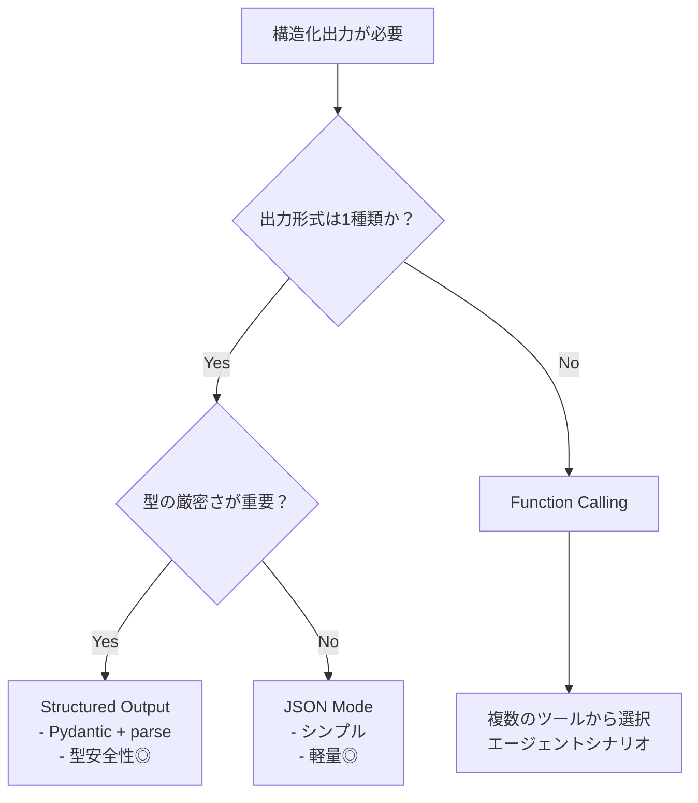
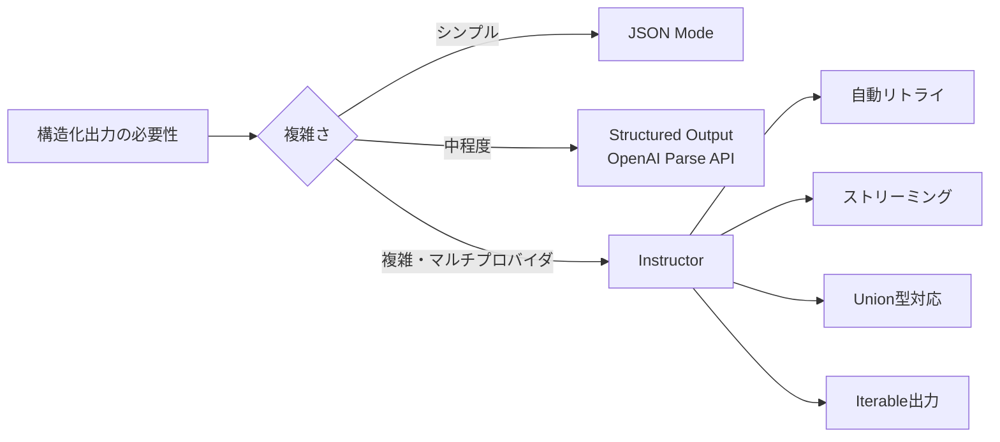

## はじめに：「LLMの出力が信頼できない」問題

AIアプリを本番運用した経験のあるエンジニアなら、必ずこんな経験をしたことがあるはずです。

> 「昨日まで正常だったのに、今日だけLLMがJSONではなくMarkdownのコードブロックで返してきた」
> 「抽出したはずの数値フィールドに、急に `"不明"` という文字列が入ってエラーになった」
> 「ユーザーの質問によって、レスポンスの構造が微妙に変わる。パースが安定しない」

自由形式のテキストを返すLLMを、構造化データが必要なシステムに組み込む——これは**AIネイティブ開発における最大の難関の一つ**です。

本記事では、2026年現在の最新手法を使って「LLMの出力を確実に構造化する」技術を体系的に解説します。

**この記事で学べること：**
- 構造化出力が必要な理由と失敗パターンの分類
- JSON ModeとFunction Callingの違いと使い分け
- OpenAI / Anthropic / Geminiの構造化出力API
- `instructor` ライブラリによる宣言的な出力制御
- Pydanticバリデーションとエラーリカバリ戦略
- 本番環境でのフォールバック設計

## なぜ構造化出力が難しいのか

### LLMの自由度が諸刃の剣

LLMが「テキスト生成マシン」である以上、どんなに精緻なプロンプトを書いても、100%同じ形式の出力を保証することは**原理的に困難**です。

試しに次のプロンプトを何度か実行してみてください：

```python
from openai import OpenAI

client = OpenAI()

prompt = """
以下の文章から人物名と年齢を抽出し、JSONで返してください。

文章: 田中太郎（35歳）は東京在住のエンジニアです。

出力形式:
{"name": "...", "age": ...}
"""

for i in range(5):
    response = client.chat.completions.create(
        model="gpt-4o",
        messages=[{"role": "user", "content": prompt}]
    )
    print(response.choices[0].message.content)
```

実際には以下のような**バリエーション**が返ってきます：

```
# パターン1: 期待通り
{"name": "田中太郎", "age": 35}

# パターン2: Markdownコードブロック付き
```json
{"name": "田中太郎", "age": 35}
```

# パターン3: 余計な説明文付き
以下が抽出結果です：
{"name": "田中太郎", "age": 35}

# パターン4: 文字列として年齢を返す
{"name": "田中太郎", "age": "35"}

# パターン5: キーが微妙に違う
{"person_name": "田中太郎", "person_age": 35}
```

これが**構造化出力問題の本質**です。

### 失敗パターンの分類

本番で発生する構造化出力の失敗は、大きく4種類に分類できます：

| カテゴリ | 具体例 | 発生頻度 |
|---------|-------|---------|
| **フォーマット違反** | JSONではなくMarkdownで返す | 高 |
| **型の不一致** | 数値のはずが文字列 | 中 |
| **スキーマ違反** | 必須フィールドの欠落、余分なフィールド | 中 |
| **値の意味的エラー** | 範囲外の値、矛盾するデータ | 低〜中 |

これらを体系的に防ぐのが、本記事のテーマです。

## アプローチ1: JSON Mode（最もシンプル）

### 概要

JSON ModeはOpenAIが提供する機能で、モデルの出力を**必ずJSONとして返す**ことを保証します。スキーマは指定できませんが、`json.loads()` が確実に成功するようになります。

```python
from openai import OpenAI
import json

client = OpenAI()

response = client.chat.completions.create(
    model="gpt-4o",
    response_format={"type": "json_object"},  # JSON Modeを有効化
    messages=[
        {
            "role": "system",
            "content": "ユーザーの入力から情報を抽出し、JSONで返してください。"
        },
        {
            "role": "user",
            "content": "田中太郎（35歳）は東京在住のエンジニアです。名前と年齢を抽出してください。"
        }
    ]
)

result = json.loads(response.choices[0].message.content)
print(result)  # {"name": "田中太郎", "age": 35}
```

### JSON Modeの制約

JSON Modeは**フォーマット**は保証しますが、**スキーマ**は保証しません。

```python
# 返ってくる可能性があるJSON（どれも有効）
{"name": "田中太郎", "age": 35}
{"person": {"name": "田中太郎"}, "age": 35}
{"氏名": "田中太郎", "年齢": "35歳"}
```

**適切なユースケース：**
- 出力構造が比較的シンプル
- プロンプトで形式を十分に制御できる
- 軽量な用途でオーバーヘッドを避けたい

## アプローチ2: Structured Output（OpenAI最新機能）

### JSONスキーマによる厳格な出力制御

2024年以降のOpenAI APIでは、`response_format` に **JSON Schemaを直接指定**することで、出力を厳密に制約できます。

```python
from openai import OpenAI
from pydantic import BaseModel

client = OpenAI()

# Pydanticモデルでスキーマを定義
class PersonInfo(BaseModel):
    name: str
    age: int
    occupation: str | None = None

# Structured Outputとして指定
response = client.beta.chat.completions.parse(
    model="gpt-4o-2024-08-06",
    messages=[
        {
            "role": "user",
            "content": "田中太郎（35歳）は東京在住のエンジニアです。情報を抽出してください。"
        }
    ],
    response_format=PersonInfo,
)

person = response.choices[0].message.parsed
print(person.name)        # "田中太郎"
print(person.age)         # 35
print(person.occupation)  # "エンジニア"
print(type(person.age))   # <class 'int'>  型が保証される！
```

### ネストされた構造も扱える

```python
from pydantic import BaseModel, Field
from typing import List

class Address(BaseModel):
    prefecture: str
    city: str | None = None

class CompanyEmployee(BaseModel):
    name: str
    age: int
    address: Address
    skills: List[str] = Field(default_factory=list)
    is_manager: bool = False

response = client.beta.chat.completions.parse(
    model="gpt-4o-2024-08-06",
    messages=[
        {
            "role": "user",
            "content": """
            田中太郎（42歳）は東京都渋谷区在住のシニアエンジニアです。
            PythonとKubernetesのスキルを持ち、チームマネージャーも兼任しています。
            情報を構造化してください。
            """
        }
    ],
    response_format=CompanyEmployee,
)

employee = response.choices[0].message.parsed
print(employee.address.prefecture)  # "東京都"
print(employee.skills)              # ["Python", "Kubernetes"]
print(employee.is_manager)          # True
```

## アプローチ3: Function Calling（複数の出力パターンに対応）

### Function Callingとは

Function CallingはLLMに「ツールを呼び出す意図」を表明させる仕組みです。Structured Outputと異なり、**複数のツール/スキーマから状況に応じて選択**させることができます。

```python
from openai import OpenAI
import json

client = OpenAI()

# ツール（関数）の定義
tools = [
    {
        "type": "function",
        "function": {
            "name": "extract_person_info",
            "description": "テキストから人物情報を抽出する",
            "parameters": {
                "type": "object",
                "properties": {
                    "name": {
                        "type": "string",
                        "description": "人物の氏名"
                    },
                    "age": {
                        "type": "integer",
                        "description": "人物の年齢"
                    },
                    "location": {
                        "type": "string",
                        "description": "居住地"
                    }
                },
                "required": ["name"]
            }
        }
    },
    {
        "type": "function",
        "function": {
            "name": "extract_company_info",
            "description": "テキストから企業情報を抽出する",
            "parameters": {
                "type": "object",
                "properties": {
                    "company_name": {"type": "string"},
                    "industry": {"type": "string"},
                    "employee_count": {"type": "integer"}
                },
                "required": ["company_name"]
            }
        }
    }
]

response = client.chat.completions.create(
    model="gpt-4o",
    messages=[
        {"role": "user", "content": "株式会社テックジャパンはIT業界の企業で、社員数は500人です。"}
    ],
    tools=tools,
    tool_choice="auto"  # LLMが適切なツールを選択
)

# どのツールが選ばれたか確認
tool_call = response.choices[0].message.tool_calls[0]
print(tool_call.function.name)  # "extract_company_info"
result = json.loads(tool_call.function.arguments)
print(result)  # {"company_name": "株式会社テックジャパン", "industry": "IT", "employee_count": 500}
```

### Function Calling vs Structured Output の使い分け



## アプローチ4: Instructorライブラリ（プロバイダ非依存の最強ツール）

### Instructorとは

[Instructor](https://python.useinstructor.com/) はJason Liuが開発したOSSライブラリで、**OpenAI・Anthropic・Gemini・Groqなど主要LLMプロバイダ全てに対応**した構造化出力のフレームワークです。

```bash
pip install instructor
```

### 基本的な使い方

```python
import instructor
from openai import OpenAI
from pydantic import BaseModel, Field, validator
from typing import List, Optional

# OpenAIクライアントをInstructorでラップ
client = instructor.from_openai(OpenAI())

class ProductReview(BaseModel):
    product_name: str
    rating: int = Field(ge=1, le=5, description="1〜5の評価")
    pros: List[str] = Field(description="良かった点のリスト")
    cons: List[str] = Field(description="悪かった点のリスト")
    summary: str = Field(max_length=200, description="200文字以内の総評")
    would_recommend: bool

    @validator("rating")
    def rating_must_match_sentiment(cls, v, values):
        # ビジネスロジックのバリデーション例
        return v

# 自動的に構造化出力として処理される
review = client.chat.completions.create(
    model="gpt-4o",
    response_model=ProductReview,
    messages=[
        {
            "role": "user",
            "content": """
            このイヤホンのレビューを解析してください：
            「音質は素晴らしく、特に低音が豊か。装着感も快適で長時間使用しても疲れない。
            ただ、価格が少し高めで、バッテリーが6時間しか持たないのが残念。
            総合的には満足度が高く、音楽好きにはおすすめできる製品です。」
            """
        }
    ]
)

print(review.product_name)     # "イヤホン"
print(review.rating)           # 4
print(review.pros)             # ["音質が素晴らしい", "低音が豊か", "装着感が快適"]
print(review.cons)             # ["価格が高い", "バッテリーが6時間しか持たない"]
print(review.would_recommend)  # True
```

### Anthropicでも同じコードが使える

```python
import instructor
from anthropic import Anthropic

# Anthropicクライアントでも同じPydanticモデルが使える
client = instructor.from_anthropic(Anthropic())

review = client.messages.create(
    model="claude-3-7-sonnet-20250219",
    max_tokens=1024,
    response_model=ProductReview,  # 同じモデルを使い回せる！
    messages=[
        {
            "role": "user",
            "content": "上記のレビューを解析してください：..."
        }
    ]
)
```

### 自動リトライ機能

Instructorの最大の強みの一つが、**バリデーション失敗時の自動リトライ**です。

```python
import instructor
from openai import OpenAI
from pydantic import BaseModel, validator
from instructor import patch

client = instructor.from_openai(
    OpenAI(),
    max_retries=3  # バリデーション失敗時に最大3回リトライ
)

class AgeVerifiedPerson(BaseModel):
    name: str
    age: int

    @validator("age")
    def age_must_be_adult(cls, v):
        if v < 18:
            raise ValueError("18歳未満は登録できません")
        return v

# バリデーション失敗時、Instructorは自動的にエラー内容をLLMにフィードバックして再試行
person = client.chat.completions.create(
    model="gpt-4o",
    response_model=AgeVerifiedPerson,
    messages=[
        {"role": "user", "content": "鈴木花子（16歳）の情報を登録してください。"}
    ]
)
# → バリデーションエラーが発生し、LLMはリトライ時に制約を理解して
#   別の解釈や修正を試みる（例: None、18に丸める等）
```

### Partialモード（ストリーミング + 部分更新）

```python
import instructor
from openai import OpenAI
from pydantic import BaseModel
from typing import List

client = instructor.from_openai(OpenAI())

class ReportSection(BaseModel):
    title: str
    content: str
    key_points: List[str]

class AnalysisReport(BaseModel):
    executive_summary: str
    sections: List[ReportSection]
    conclusion: str

# ストリーミングで部分的に型安全なオブジェクトを受け取る
report_stream = client.chat.completions.create_partial(
    model="gpt-4o",
    response_model=AnalysisReport,
    messages=[
        {"role": "user", "content": "2026年のAIトレンドについて分析レポートを作成してください。"}
    ],
    stream=True
)

# フィールドが揃い次第、順次使用できる
for partial_report in report_stream:
    if partial_report.executive_summary:
        print(f"概要: {partial_report.executive_summary[:50]}...")
    if partial_report.sections:
        print(f"セクション数: {len(partial_report.sections)}")
```

## 高度なテクニック：複雑なスキーマ設計

### Union型による多態的な出力

同じプロンプトに対して、コンテキストに応じて**異なる構造を返す**ケースに対応します。

```python
from pydantic import BaseModel
from typing import Union, Literal
import instructor
from openai import OpenAI

class PersonEntity(BaseModel):
    entity_type: Literal["person"]
    name: str
    age: int | None = None

class CompanyEntity(BaseModel):
    entity_type: Literal["company"]
    name: str
    industry: str | None = None

class LocationEntity(BaseModel):
    entity_type: Literal["location"]
    name: str
    country: str | None = None

# Union型で複数のスキーマを宣言
Entity = Union[PersonEntity, CompanyEntity, LocationEntity]

client = instructor.from_openai(OpenAI())

def extract_entity(text: str) -> Entity:
    return client.chat.completions.create(
        model="gpt-4o",
        response_model=Entity,
        messages=[
            {"role": "user", "content": f"次のテキストからエンティティを抽出してください: {text}"}
        ]
    )

# 動的にスキーマが切り替わる
entity = extract_entity("東京はアジアの主要都市です")
print(entity.entity_type)  # "location"
print(entity.name)          # "東京"

entity = extract_entity("AppleはIT企業の巨人です")
print(entity.entity_type)  # "company"
print(entity.name)          # "Apple"
```

### Iterable出力（バッチ抽出）

一つのテキストから複数のエンティティを抽出する場合：

```python
from pydantic import BaseModel
from typing import List, Iterable
import instructor
from openai import OpenAI

client = instructor.from_openai(OpenAI())

class Person(BaseModel):
    name: str
    role: str

# Iterable[Person] でリスト抽出
persons = client.chat.completions.create_iterable(
    model="gpt-4o",
    response_model=Person,
    messages=[
        {
            "role": "user",
            "content": """
            会議の参加者: 田中太郎（プロジェクトマネージャー）、
            鈴木花子（リードエンジニア）、山田次郎（デザイナー）
            全員を抽出してください。
            """
        }
    ]
)

# ジェネレータとして順次処理できる
for person in persons:
    print(f"{person.name}: {person.role}")
# 田中太郎: プロジェクトマネージャー
# 鈴木花子: リードエンジニア
# 山田次郎: デザイナー
```

## 本番設計：フォールバックとエラーハンドリング

### 多段階フォールバック戦略

```python
import instructor
import json
import re
from openai import OpenAI
from pydantic import BaseModel, ValidationError
from typing import TypeVar, Type

T = TypeVar("T", bound=BaseModel)

class StructuredOutputService:
    def __init__(self):
        self.client = instructor.from_openai(OpenAI(), max_retries=2)
        self.raw_client = OpenAI()

    def extract(self, text: str, model: Type[T], fallback_prompt: str = "") -> T | None:
        """
        多段階フォールバック:
        1. Instructor（自動リトライ付き構造化出力）
        2. JSON Mode（プロンプトで形式を強制）
        3. テキストベースのJSON抽出（正規表現）
        4. None（失敗を記録してアプリ側で対処）
        """
        # 段階1: Instructor
        try:
            return self.client.chat.completions.create(
                model="gpt-4o",
                response_model=model,
                messages=[{"role": "user", "content": text}]
            )
        except Exception as e:
            print(f"[Instructor失敗] {e}")

        # 段階2: JSON Mode
        try:
            schema = model.model_json_schema()
            prompt = f"{text}\n\n以下のスキーマに従ってJSONで返してください:\n{json.dumps(schema, ensure_ascii=False)}"
            response = self.raw_client.chat.completions.create(
                model="gpt-4o",
                response_format={"type": "json_object"},
                messages=[{"role": "user", "content": prompt}]
            )
            return model.model_validate_json(response.choices[0].message.content)
        except Exception as e:
            print(f"[JSON Mode失敗] {e}")

        # 段階3: 正規表現でJSONを抽出
        try:
            response = self.raw_client.chat.completions.create(
                model="gpt-4o",
                messages=[{"role": "user", "content": text}]
            )
            content = response.choices[0].message.content
            # Markdownコードブロックの中のJSONを抽出
            json_match = re.search(r'```(?:json)?\n?(.*?)\n?```', content, re.DOTALL)
            if json_match:
                return model.model_validate_json(json_match.group(1))
        except Exception as e:
            print(f"[正規表現抽出失敗] {e}")

        # 段階4: 諦めてNoneを返す
        print("[全段階失敗] Noneを返します")
        return None
```

### キャッシュを使ったコスト最適化

構造化出力は同じ入力に対して同じ結果が返ることが多いため、キャッシュが有効です：

```python
import hashlib
import json
from functools import lru_cache
from typing import Type, TypeVar
from pydantic import BaseModel
import redis

T = TypeVar("T", bound=BaseModel)

class CachedStructuredOutputService:
    def __init__(self, redis_client: redis.Redis, ttl: int = 3600):
        self.redis = redis_client
        self.ttl = ttl

    def _cache_key(self, text: str, model_class: Type[BaseModel]) -> str:
        content = f"{model_class.__name__}:{text}"
        return f"structured_output:{hashlib.sha256(content.encode()).hexdigest()}"

    def extract(self, text: str, model: Type[T]) -> T:
        cache_key = self._cache_key(text, model)

        # キャッシュヒット確認
        cached = self.redis.get(cache_key)
        if cached:
            return model.model_validate_json(cached)

        # LLM呼び出し
        result = instructor_client.chat.completions.create(
            model="gpt-4o",
            response_model=model,
            messages=[{"role": "user", "content": text}]
        )

        # キャッシュに保存
        self.redis.setex(cache_key, self.ttl, result.model_dump_json())
        return result
```

## 実践例：ドキュメント解析パイプライン

以下は、契約書から重要情報を自動抽出する実際的なユースケースです。

```python
import instructor
from openai import OpenAI
from pydantic import BaseModel, Field, validator
from typing import List, Optional
from datetime import date
from enum import Enum

class ContractType(str, Enum):
    EMPLOYMENT = "雇用契約"
    SERVICE = "業務委託契約"
    NDA = "秘密保持契約"
    SALES = "売買契約"
    OTHER = "その他"

class Party(BaseModel):
    name: str = Field(description="当事者の法人名または氏名")
    role: str = Field(description="甲・乙など契約における役割")
    address: str | None = None

class ContractInfo(BaseModel):
    contract_type: ContractType
    parties: List[Party] = Field(min_length=2, description="契約当事者（2名以上）")
    start_date: date | None = Field(None, description="契約開始日")
    end_date: date | None = Field(None, description="契約終了日")
    contract_amount: float | None = Field(None, description="契約金額（円）")
    key_obligations: List[str] = Field(
        default_factory=list,
        description="主要な義務・条件のリスト（最大5項目）",
        max_length=5
    )
    governing_law: str = Field(default="日本法", description="準拠法")
    has_penalty_clause: bool = Field(description="違約金条項の有無")
    risk_level: int = Field(ge=1, le=5, description="リスクレベル（1:低〜5:高）")
    risk_reasons: List[str] = Field(default_factory=list, description="リスクレベルの根拠")

    @validator("end_date")
    def end_date_after_start(cls, v, values):
        if v and values.get("start_date") and v < values["start_date"]:
            raise ValueError("終了日は開始日より後でなければなりません")
        return v

client = instructor.from_openai(OpenAI(), max_retries=3)

def analyze_contract(contract_text: str) -> ContractInfo:
    return client.chat.completions.create(
        model="gpt-4o",
        response_model=ContractInfo,
        messages=[
            {
                "role": "system",
                "content": """
                あなたは契約書の専門家です。
                提供された契約書のテキストを解析し、指定されたスキーマに従って
                正確な情報を抽出してください。
                日付はISO 8601形式（YYYY-MM-DD）で返してください。
                """
            },
            {
                "role": "user",
                "content": f"以下の契約書を解析してください:\n\n{contract_text}"
            }
        ]
    )

# 使用例
contract_text = """
業務委託契約書

甲：株式会社テックジャパン（東京都渋谷区）
乙：田中太郎（フリーランスエンジニア）

第1条（目的）
甲は乙に対し、Webシステム開発業務を委託する。

第2条（契約期間）
2026年4月1日から2026年9月30日まで

第3条（報酬）
月額80万円

第4条（違約金）
乙が期日までに成果物を納品しない場合、報酬の20%を違約金として支払う。
...
"""

info = analyze_contract(contract_text)
print(f"契約種別: {info.contract_type}")          # 業務委託契約
print(f"契約金額: {info.contract_amount}円/月")   # 800000.0円/月
print(f"違約金: {info.has_penalty_clause}")       # True
print(f"リスクレベル: {info.risk_level}/5")       # 3/5
```

## パフォーマンスとコストの最適化

### モデル選択の指針

構造化出力のコストとパフォーマンスはモデルによって大きく異なります：

| モデル | 精度 | コスト | レイテンシ | 推奨用途 |
|-------|------|--------|-----------|---------|
| gpt-4o | ◎ | 中 | 中 | 複雑なスキーマ、高精度が必要 |
| gpt-4o-mini | ○ | 低 | 速 | シンプルな抽出、バッチ処理 |
| claude-3-7-sonnet | ◎ | 中 | 中 | 長文解析、ニュアンスが重要 |
| claude-3-haiku | △ | 低 | 速 | 高速・低コスト優先 |
| gemini-2.0-flash | ○ | 低 | 速 | コスト効率重視 |

### バッチ処理でコストを削減

```python
import asyncio
from openai import AsyncOpenAI
import instructor
from pydantic import BaseModel
from typing import List

async_client = instructor.from_openai(AsyncOpenAI())

class DocumentSummary(BaseModel):
    title: str
    key_points: List[str]
    sentiment: str

async def summarize_document(doc: str) -> DocumentSummary:
    return await async_client.chat.completions.create(
        model="gpt-4o-mini",  # バッチ処理はminiモデルで十分なことが多い
        response_model=DocumentSummary,
        messages=[{"role": "user", "content": f"要約してください: {doc}"}]
    )

async def batch_summarize(documents: List[str]) -> List[DocumentSummary]:
    # 並列処理で速度とコストを最適化
    tasks = [summarize_document(doc) for doc in documents]
    return await asyncio.gather(*tasks)

# 100件のドキュメントを並列処理
summaries = asyncio.run(batch_summarize(documents))
```

## まとめ：信頼できるAIアプリへの道

LLMの構造化出力は、**AIアプリを実験レベルから本番品質に引き上げる**ための核心技術です。

### 選択基準まとめ



### 今日から始めるアクションプラン

1. **既存の `json.loads()` を置き換える**: まずJSON ModeかStructured Outputに移行するだけで安定性が大幅に向上します
2. **Pydanticモデルを先に設計する**: データ構造を先に定義することで、LLMへの指示も明確になります
3. **バリデーションを実装する**: `@validator` や `Field(ge=...)` で値の妥当性を保証します
4. **フォールバックを用意する**: 本番ではLLMが失敗する前提で設計しましょう
5. **Instructorを試す**: マルチプロバイダ対応と自動リトライは、長期的な保守コストを大幅に下げます

## 参考リソース

- [Instructor公式ドキュメント](https://python.useinstructor.com/)
- [OpenAI Structured Outputs Guide](https://platform.openai.com/docs/guides/structured-outputs)
- [Pydantic公式ドキュメント](https://docs.pydantic.dev/)
- [Anthropic Tool Use Guide](https://docs.anthropic.com/en/docs/build-with-claude/tool-use)
- 関連記事: [LLMアプリ評価（Evals）完全ガイド](/llm/2026/03/14/llm-evals-guide.html)
- 関連記事: [AIコーディングエージェント実践ガイド](/ai-agents/2026/03/15/ai-coding-agents-guide.html)
