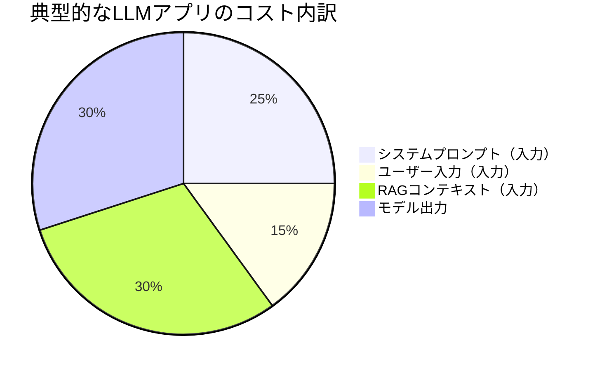
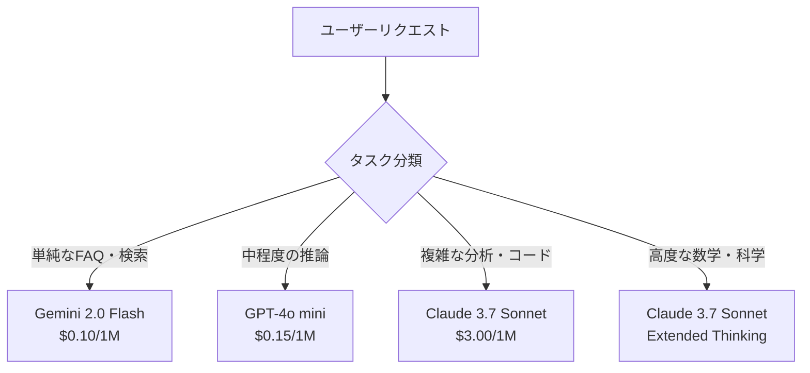
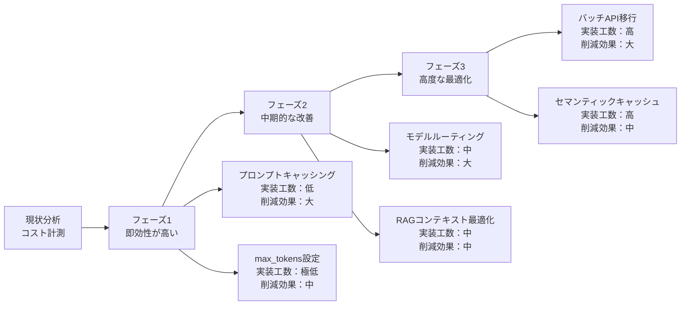

## はじめに：「動くLLMアプリ」から「持続可能なLLMアプリ」へ

AIネイティブエンジニアとして最初のLLMアプリをリリースするのは難しくありません。APIキーを取得し、プロンプトを書いて、呼び出せばすぐに動く——これが現代の開発体験です。

しかし、プロダクション運用が始まった途端、多くのチームがこんな問題に直面します。

> 「月のAPIコストが予想の10倍になった」  
> 「ユーザーが増えるほど赤字が膨らむ構造になっている」  
> 「レスポンスが遅すぎてUXが悪化している」  
> 「コスト削減しようとしたら精度が落ちた」

実際、LLMアプリの**コストと速度の最適化はプロダクトの生死を分ける**要素です。本記事では、プロダクションLLMのコストを大幅削減するための体系的な戦略と、すぐに実装できるテクニックを上級エンジニア向けに解説します。

---

## LLMのコスト構造を理解する

最適化の前に、何に対してお金を払っているかを正確に理解しましょう。

### 主要APIの課金モデル（2026年3月時点）

| プロバイダー | モデル | 入力（/1M tokens） | 出力（/1M tokens） | キャッシュ読込 |
|-------------|--------|-------------------|-------------------|--------------|
| Anthropic | Claude 3.7 Sonnet | $3.00 | $15.00 | $0.30 |
| Anthropic | Claude 3.5 Haiku | $0.80 | $4.00 | $0.08 |
| OpenAI | GPT-4o | $2.50 | $10.00 | $1.25 |
| OpenAI | GPT-4o mini | $0.15 | $0.60 | $0.075 |
| Google | Gemini 2.0 Flash | $0.10 | $0.40 | $0.025 |

**重要な気づき：**
- **出力トークンは入力の3〜5倍高い**
- **キャッシュ読込は通常の入力より80〜90%安い**
- **モデル間でコストは50〜100倍の開きがある**

この3点だけで、最適化の方向性が見えてきます。

### コストの構成要素



多くのアプリで、**コンテキストウィンドウの大半が「毎回同じ情報」で占められている**という事実に注目してください。ここが最大の最適化ポイントです。

---

## 戦略1：プロンプトキャッシング（最大90%削減）

### なぜキャッシングが効くのか

LLMへのAPIコールで、毎回変わらない部分（システムプロンプト、RAGドキュメント、few-shot例など）は、**プロバイダー側でキャッシュ**できます。キャッシュヒット時のコストは通常の10〜20%です。

```python
# Anthropicのプロンプトキャッシング実装例
import anthropic

client = anthropic.Anthropic()

# 大量のシステムプロンプトをキャッシュする
response = client.messages.create(
    model="claude-3-7-sonnet-20250219",
    max_tokens=1024,
    system=[
        {
            "type": "text",
            "text": "あなたは○○社の社内ヘルプデスクAIです。",
        },
        {
            "type": "text",
            # 社内ドキュメント（数万トークン）をここに入れる
            "text": load_company_documents(),
            "cache_control": {"type": "ephemeral"},  # キャッシュ対象に指定
        }
    ],
    messages=[
        {"role": "user", "content": user_question}
    ]
)

# usage情報でキャッシュ効果を確認
print(response.usage)
# cache_creation_input_tokens: 8000  ← 初回のみ
# cache_read_input_tokens: 8000      ← 2回目以降
# input_tokens: 50                   ← ユーザー入力のみ
```

### OpenAIのキャッシング（自動適用）

OpenAIはキャッシングが**自動的に適用**されます。特別な実装は不要ですが、効果を最大化するためにはプロンプト構造の工夫が必要です。

```python
# キャッシュヒット率を最大化するプロンプト構造
# ルール：変わらない部分を先頭に、変わる部分を末尾に

messages = [
    # ✅ 先頭（キャッシュされやすい）
    {"role": "system", "content": STATIC_SYSTEM_PROMPT},  # 変わらない
    {"role": "user", "content": STATIC_EXAMPLES},          # few-shot例
    {"role": "assistant", "content": STATIC_RESPONSES},
    
    # 変動するRAGコンテキストも可能な限り前に
    {"role": "user", "content": f"参考情報：\n{rag_context}"},
    
    # ❌ 末尾（動的）
    {"role": "user", "content": user_input},               # 毎回変わる
]
```

**キャッシュ効率を下げるアンチパターン：**

```python
# ❌ 悪い例：タイムスタンプをシステムプロンプトに入れる
system = f"現在時刻は {datetime.now()} です。..."  # 毎回変わるのでキャッシュ不可

# ✅ 良い例：動的な情報はユーザーメッセージに移す
system = "必要に応じて現在時刻を参照してください。"
user = f"[現在時刻: {datetime.now()}]\n{user_input}"
```

### キャッシュ効果の計算

システムプロンプト + RAGコンテキストが8,000トークン、1日1,000リクエストの場合：

| 方式 | 入力コスト/日 | 削減効果 |
|------|-------------|---------|
| キャッシュなし | $24.00（claude-3-7-sonnet） | — |
| キャッシュあり（90%ヒット） | $2.64 | **89%削減** |

---

## 戦略2：モデルルーティング（50〜80%削減）

### タスクに応じてモデルを使い分ける

全リクエストに最高性能モデルを使う必要はありません。**タスクの複雑さに応じてモデルを選択**することで、コストを大幅削減できます。



### LiteLLMによるモデルルーター実装

```python
import litellm
from litellm import Router

# モデルプールの定義
router = Router(
    model_list=[
        {
            "model_name": "fast",
            "litellm_params": {
                "model": "gemini/gemini-2.0-flash",
                "api_key": os.getenv("GOOGLE_API_KEY"),
            },
        },
        {
            "model_name": "balanced",
            "litellm_params": {
                "model": "gpt-4o-mini",
                "api_key": os.getenv("OPENAI_API_KEY"),
            },
        },
        {
            "model_name": "powerful",
            "litellm_params": {
                "model": "claude-3-7-sonnet-20250219",
                "api_key": os.getenv("ANTHROPIC_API_KEY"),
            },
        },
    ],
    # フォールバック設定
    fallbacks=[
        {"fast": ["balanced"]},
        {"balanced": ["powerful"]},
    ],
    # レート制限時の自動切り替え
    allowed_fails=3,
)

# タスク複雑度の判定
def classify_task_complexity(user_input: str, context: dict) -> str:
    """タスクの複雑さを判定してモデルを選択"""
    
    # ルールベースの判定（高速・無料）
    if len(user_input) < 50 and context.get("is_faq"):
        return "fast"
    
    if any(keyword in user_input for keyword in ["コード", "実装", "アーキテクチャ", "設計"]):
        return "powerful"
    
    if any(keyword in user_input for keyword in ["要約", "翻訳", "分類"]):
        return "balanced"
    
    # LLMによる分類（コスト対効果を考えて軽量モデルで）
    return classify_with_llm(user_input)

def classify_with_llm(user_input: str) -> str:
    """軽量モデルでタスク複雑度を分類"""
    response = router.completion(
        model="fast",
        messages=[{
            "role": "user",
            "content": f"""以下のタスクを分類してください。
タスク: {user_input[:200]}
回答（simple/medium/complex のいずれか一語）:"""
        }],
        max_tokens=10,
    )
    label = response.choices[0].message.content.strip().lower()
    return {"simple": "fast", "medium": "balanced", "complex": "powerful"}.get(label, "balanced")

# 実際の呼び出し
async def process_request(user_input: str, context: dict):
    model = classify_task_complexity(user_input, context)
    
    response = router.completion(
        model=model,
        messages=[{"role": "user", "content": user_input}],
    )
    
    # コストのログ記録
    cost = litellm.completion_cost(completion_response=response)
    log_cost(model=model, cost=cost, input=user_input[:50])
    
    return response.choices[0].message.content
```

### Semantic Routerによる高精度ルーティング

```python
from semantic_router import Route, RouteLayer
from semantic_router.encoders import OpenAIEncoder

# ルートの定義
simple_route = Route(
    name="simple",
    utterances=[
        "今日の天気は？",
        "ありがとう",
        "○○の意味を教えて",
        "よくある質問",
    ],
)

complex_route = Route(
    name="complex",
    utterances=[
        "このシステムのアーキテクチャを設計してください",
        "バグの根本原因を分析して修正案を提示して",
        "複数の選択肢のトレードオフを評価して",
    ],
)

encoder = OpenAIEncoder()
rl = RouteLayer(encoder=encoder, routes=[simple_route, complex_route])

def route_request(query: str) -> str:
    route = rl(query)
    if route.name == "simple":
        return "fast"
    elif route.name == "complex":
        return "powerful"
    return "balanced"
```

---

## 戦略3：バッチAPIの活用（50%割引）

### リアルタイム不要な処理はバッチに

OpenAIとAnthropicはどちらも**バッチAPI**を提供しており、**通常の50%のコスト**で実行できます。

```python
# OpenAI Batch APIの使い方
import json
from openai import OpenAI

client = OpenAI()

# バッチリクエストファイルの作成
requests = []
for i, item in enumerate(items_to_process):
    requests.append({
        "custom_id": f"item-{i}",
        "method": "POST",
        "url": "/v1/chat/completions",
        "body": {
            "model": "gpt-4o-mini",
            "messages": [
                {"role": "system", "content": SYSTEM_PROMPT},
                {"role": "user", "content": item["text"]},
            ],
            "max_tokens": 200,
        }
    })

# JSONLファイルとして保存
with open("batch_requests.jsonl", "w") as f:
    for req in requests:
        f.write(json.dumps(req, ensure_ascii=False) + "\n")

# バッチジョブの投入
with open("batch_requests.jsonl", "rb") as f:
    batch_file = client.files.create(file=f, purpose="batch")

batch_job = client.batches.create(
    input_file_id=batch_file.id,
    endpoint="/v1/chat/completions",
    completion_window="24h",
)

print(f"Batch job created: {batch_job.id}")
# 通常数時間〜24時間以内に完了

# 結果の取得
def retrieve_batch_results(batch_id: str):
    batch = client.batches.retrieve(batch_id)
    
    if batch.status == "completed":
        result_file = client.files.content(batch.output_file_id)
        results = {}
        for line in result_file.text.strip().split("\n"):
            result = json.loads(line)
            custom_id = result["custom_id"]
            content = result["response"]["body"]["choices"][0]["message"]["content"]
            results[custom_id] = content
        return results
    
    return None
```

### バッチ処理が適しているユースケース

- ✅ 大量ドキュメントの分類・要約
- ✅ データセットへのラベル付け
- ✅ 夜間バッチレポート生成
- ✅ コンテンツのモデレーション
- ✅ Evals（評価）の大規模実行
- ❌ チャット（リアルタイム性が必要）
- ❌ ユーザーがレスポンスを待っている処理

---

## 戦略4：トークン最適化

### 入力トークンを削減する

#### 1. システムプロンプトの圧縮

```python
# ❌ 冗長な書き方（420トークン）
system_prompt = """
あなたは非常に優秀なカスタマーサポートAIアシスタントです。
ユーザーからの質問に対して、丁寧かつ親切に回答してください。
回答は日本語で行い、専門用語は可能な限り避け、分かりやすく説明してください。
もし質問が弊社のサービスに関係ない場合は、その旨をお伝えください。
個人情報に関する質問には答えないでください。
"""

# ✅ 圧縮後（80トークン）
system_prompt = """カスタマーサポートAI。日本語で簡潔に回答。
範囲外・個人情報の質問は丁重に断る。"""
```

#### 2. RAGコンテキストの選択的注入

```python
from langchain_community.vectorstores import Chroma
from langchain_openai import OpenAIEmbeddings

vectorstore = Chroma(embedding_function=OpenAIEmbeddings())

def get_relevant_context(query: str, max_tokens: int = 2000) -> str:
    """必要最小限のコンテキストだけを取得する"""
    
    # 類似度スコアでフィルタリング
    docs_with_scores = vectorstore.similarity_search_with_score(
        query, k=10
    )
    
    # スコアが低いドキュメントを除外（ノイズ削減）
    relevant_docs = [
        doc for doc, score in docs_with_scores
        if score > 0.75  # 閾値でフィルタ
    ]
    
    # トークン数に基づいて上位ドキュメントを選択
    context_parts = []
    current_tokens = 0
    
    for doc in relevant_docs:
        doc_tokens = count_tokens(doc.page_content)
        if current_tokens + doc_tokens > max_tokens:
            break
        context_parts.append(doc.page_content)
        current_tokens += doc_tokens
    
    return "\n\n".join(context_parts)
```

#### 3. 会話履歴の圧縮

長い会話は古い履歴をそのまま保持すると、トークン数が膨大になります。

```python
def compress_conversation_history(
    messages: list,
    max_tokens: int = 2000,
    model: str = "gpt-4o-mini",
) -> list:
    """古い会話を要約して圧縮する"""
    
    total_tokens = count_messages_tokens(messages)
    
    if total_tokens <= max_tokens:
        return messages  # 圧縮不要
    
    # 最新の数ターンは保持
    recent_messages = messages[-4:]  # 直近2往復は保持
    old_messages = messages[:-4]
    
    if not old_messages:
        return recent_messages
    
    # 古い会話を要約
    summary_response = openai_client.chat.completions.create(
        model=model,
        messages=[
            {
                "role": "system",
                "content": "以下の会話を2〜3文で要約してください。重要な情報（ユーザーの名前、決定事項、コンテキスト）を保持すること。"
            },
            {
                "role": "user",
                "content": format_messages_for_summary(old_messages)
            }
        ],
        max_tokens=200,
    )
    
    summary = summary_response.choices[0].message.content
    
    # 要約を先頭に挿入
    compressed = [
        {"role": "system", "content": f"[これまでの会話の要約]: {summary}"},
        *recent_messages,
    ]
    
    return compressed
```

### 出力トークンを削減する

出力トークンは入力の3〜5倍高価です。**Structured Output**を使うことで、不要な説明文を排除できます。

```python
from pydantic import BaseModel
from openai import OpenAI

client = OpenAI()

class SentimentResult(BaseModel):
    label: str  # "positive" | "negative" | "neutral"
    score: float  # 0.0〜1.0
    reason: str  # 1文で

# ❌ 通常のプロンプト（出力が冗長になりやすい）
# 「このレビューの感情を分析してください」
# → 「このレビューは非常にポジティブな感情を表しています。
#    顧客は製品に満足しており、星5つを付けています...（長い説明）」

# ✅ Structured Outputで出力を制御
response = client.beta.chat.completions.parse(
    model="gpt-4o-mini",
    messages=[
        {"role": "system", "content": "感情分析を実行してください。"},
        {"role": "user", "content": review_text},
    ],
    response_format=SentimentResult,
    max_tokens=100,  # 確実に制限
)

result = response.choices[0].message.parsed
# SentimentResult(label="positive", score=0.92, reason="...")
# 出力トークン: 約30（vs 通常のテキスト出力100〜300トークン）
```

---

## 戦略5：キャッシュレイヤーの追加

APIの前にアプリケーションレベルのキャッシュを置くことで、同一・類似リクエストの重複呼び出しを防ぎます。

```python
import hashlib
import json
import redis
from typing import Optional

class LLMCache:
    """
    2層キャッシュ戦略：
    1. 完全一致キャッシュ（Redis）
    2. セマンティックキャッシュ（ベクトルDB）
    """
    
    def __init__(self, redis_client: redis.Redis, vector_store):
        self.redis = redis_client
        self.vector_store = vector_store
        self.ttl = 3600 * 24  # 24時間
    
    def _make_key(self, messages: list, model: str) -> str:
        content = json.dumps({"messages": messages, "model": model}, ensure_ascii=False)
        return f"llm:exact:{hashlib.sha256(content.encode()).hexdigest()}"
    
    def get_exact(self, messages: list, model: str) -> Optional[str]:
        """完全一致キャッシュの検索"""
        key = self._make_key(messages, model)
        cached = self.redis.get(key)
        if cached:
            return json.loads(cached)["response"]
        return None
    
    def get_semantic(self, query: str, threshold: float = 0.97) -> Optional[str]:
        """セマンティックキャッシュの検索（類似質問への対応）"""
        results = self.vector_store.similarity_search_with_score(query, k=1)
        if results and results[0][1] > threshold:
            return results[0][0].metadata["response"]
        return None
    
    def set(self, messages: list, model: str, response: str):
        """キャッシュへの保存"""
        # 完全一致キャッシュ
        key = self._make_key(messages, model)
        self.redis.setex(key, self.ttl, json.dumps({"response": response}))
        
        # セマンティックキャッシュ（最後のユーザーメッセージで索引）
        last_user_msg = next(
            (m["content"] for m in reversed(messages) if m["role"] == "user"),
            None
        )
        if last_user_msg:
            self.vector_store.add_texts(
                texts=[last_user_msg],
                metadatas=[{"response": response}]
            )

# 使用例
cache = LLMCache(redis_client=redis.Redis(), vector_store=chroma_store)

async def cached_completion(messages: list, model: str = "gpt-4o-mini") -> str:
    user_query = messages[-1]["content"]
    
    # 1. 完全一致キャッシュ確認
    if cached := cache.get_exact(messages, model):
        return cached  # API呼び出しゼロ
    
    # 2. セマンティックキャッシュ確認
    if cached := cache.get_semantic(user_query):
        return cached  # API呼び出しゼロ
    
    # 3. APIを実際に呼び出す
    response = await call_llm_api(messages=messages, model=model)
    
    # 4. キャッシュに保存
    cache.set(messages, model, response)
    
    return response
```

---

## 戦略6：コスト監視とアラートの実装

最適化の効果を測定し、コストの異常を早期発見するための監視基盤を整えましょう。

```python
import time
from dataclasses import dataclass, field
from collections import defaultdict
from datetime import datetime, timedelta

@dataclass
class CostTracker:
    """LLMコストのリアルタイム追跡"""
    
    daily_budget: float = 100.0  # 1日の予算（ドル）
    alert_threshold: float = 0.8  # アラート閾値（80%）
    
    _costs: dict = field(default_factory=lambda: defaultdict(float))
    _token_counts: dict = field(default_factory=lambda: defaultdict(int))
    
    # モデルごとの単価（$/1Kトークン）
    PRICING = {
        "gpt-4o": {"input": 0.0025, "output": 0.010},
        "gpt-4o-mini": {"input": 0.00015, "output": 0.0006},
        "claude-3-7-sonnet-20250219": {"input": 0.003, "output": 0.015},
        "claude-3-5-haiku-20241022": {"input": 0.0008, "output": 0.004},
        "gemini/gemini-2.0-flash": {"input": 0.0001, "output": 0.0004},
    }
    
    def record(
        self,
        model: str,
        input_tokens: int,
        output_tokens: int,
        cached_tokens: int = 0,
        endpoint: str = "unknown",
    ):
        pricing = self.PRICING.get(model, {"input": 0.001, "output": 0.003})
        
        # キャッシュトークンは割引適用
        effective_input = input_tokens - cached_tokens
        cache_cost = cached_tokens * pricing["input"] * 0.1  # 90%割引
        
        cost = (
            effective_input / 1000 * pricing["input"]
            + output_tokens / 1000 * pricing["output"]
            + cache_cost
        )
        
        today = datetime.now().strftime("%Y-%m-%d")
        self._costs[today] += cost
        self._token_counts[f"{today}:{model}:input"] += input_tokens
        self._token_counts[f"{today}:{model}:output"] += output_tokens
        
        # アラートチェック
        if self._costs[today] >= self.daily_budget * self.alert_threshold:
            self._send_alert(today, self._costs[today])
        
        return cost
    
    def get_daily_summary(self, date: str = None) -> dict:
        date = date or datetime.now().strftime("%Y-%m-%d")
        return {
            "date": date,
            "total_cost": self._costs[date],
            "budget_used_pct": self._costs[date] / self.daily_budget * 100,
        }
    
    def _send_alert(self, date: str, cost: float):
        # Slack/PagerDuty等に通知
        print(f"⚠️ LLMコストアラート: {date} の累計コストが ${cost:.2f} に達しました")


# デコレータとして使う
def track_cost(tracker: CostTracker, endpoint: str):
    def decorator(func):
        async def wrapper(*args, **kwargs):
            start = time.time()
            result = await func(*args, **kwargs)
            
            # レスポンスからトークン数を取得
            if hasattr(result, "usage"):
                tracker.record(
                    model=kwargs.get("model", "unknown"),
                    input_tokens=result.usage.input_tokens,
                    output_tokens=result.usage.output_tokens,
                    cached_tokens=getattr(result.usage, "cache_read_input_tokens", 0),
                    endpoint=endpoint,
                )
            return result
        return wrapper
    return decorator
```

---

## 最適化ロードマップ：どこから着手するか

全ての戦略を一度に実装する必要はありません。**コストと実装コストのバランス**から優先順位をつけましょう。



### フェーズ別アクションプラン

| フェーズ | アクション | 期待削減率 | 実装工数 |
|---------|-----------|-----------|---------|
| **フェーズ1**（〜1週間） | プロンプトキャッシング有効化 | 40〜60% | 低 |
| | `max_tokens` の適切な設定 | 10〜20% | 極低 |
| | 不要なfew-shot例の削除 | 5〜15% | 低 |
| **フェーズ2**（〜1ヶ月） | モデルルーティング導入 | 30〜50% | 中 |
| | RAGチャンク数の最適化 | 10〜30% | 中 |
| | 会話履歴の圧縮 | 10〜20% | 中 |
| **フェーズ3**（〜3ヶ月） | バッチAPI活用 | 50%（対象タスク限定） | 高 |
| | セマンティックキャッシュ | 15〜30% | 高 |
| | 小型モデルへのファインチューニング | 60〜80% | 高 |

---

## 実際の最適化事例

### ケーススタディ：社内Q&Aボット

**Before（最適化前）:**
- モデル: Claude 3.7 Sonnet（全リクエスト）
- システムプロンプト: 3,000トークン（毎回送信）
- RAGコンテキスト: 5,000トークン（全ドキュメント）
- 月コスト: $8,200

**After（最適化後）:**
- プロンプトキャッシング導入 → システムプロンプト+RAGがキャッシュヒット
- モデルルーティング → 単純な質問（60%）はGemini 2.0 Flashに変更
- RAGコンテキスト削減 → 関連度スコアで上位3チャンクのみ（平均1,200トークン）
- 月コスト: **$920**（**89%削減**）

---

## まとめ

LLMのコスト最適化は「精度を犠牲にする」ものではありません。**正しいモデルを正しい方法で使う**ことで、精度を保ちながらコストを大幅削減できます。

今日から実装できるアクション：

1. **まず計測する** — LiteLLMやカスタムのCostTrackerで現状のコストを可視化
2. **プロンプトキャッシングを有効化** — 数時間で最大60%削減
3. **`max_tokens` を設定** — 出力トークンに上限を設けるだけで即効果
4. **モデルルーターを導入** — タスクに応じた最適モデルを選択

プロダクションAIを「動かす」フェーズから「持続可能にスケールさせる」フェーズへ。コスト最適化はその核心にある技術です。

---

## 参考リソース

- [Anthropic Prompt Caching ドキュメント](https://docs.anthropic.com/en/docs/build-with-claude/prompt-caching)
- [OpenAI Batch API ドキュメント](https://platform.openai.com/docs/guides/batch)
- [LiteLLM Router ドキュメント](https://docs.litellm.ai/docs/routing)
- [LangChain Token Usage Tracking](https://python.langchain.com/docs/how_to/chat_token_usage_tracking/)

### 関連記事

- [LLMアプリ評価（Evals）完全ガイド](/2026/03/14/llm-evals-guide)
- [コンテキストエンジニアリング：LLMのパフォーマンスを最大化する](/2026/03/13/context-engineering-guide)
- [ローカルLLM完全ガイド2026](/2026/03/23/local-llm-complete-guide)
