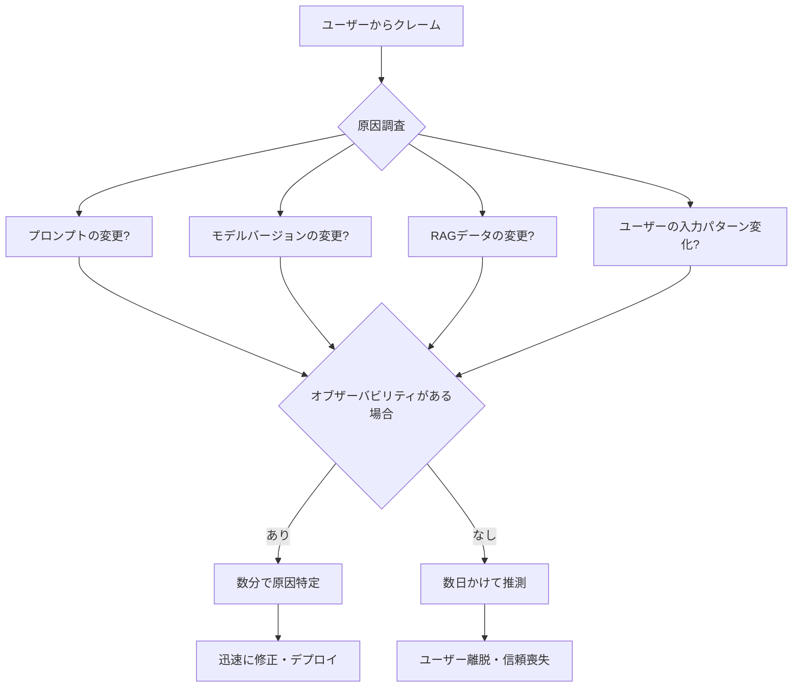
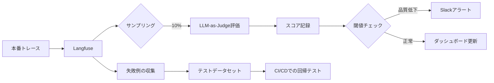
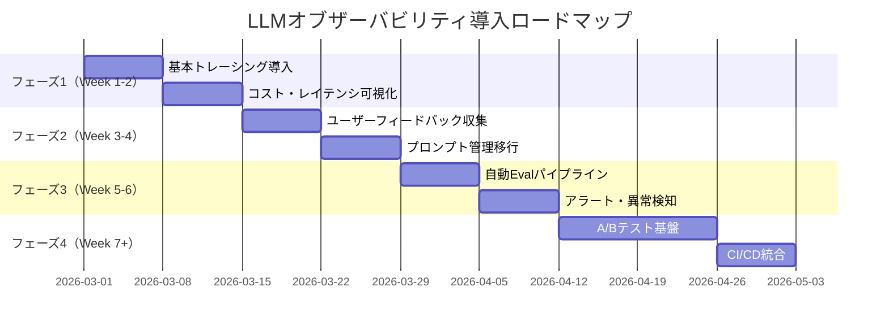

## はじめに：「動いているから大丈夫」では済まない時代へ

LLMアプリを本番リリースした翌朝、こんな問い合わせがくることがあります。

> 「昨日から回答の質が急に落ちた気がするんだけど…」  
> 「なんかすごく遅くなってない？」  
> 「コストが先月の3倍になってるんだけど、何が起きてる？」

従来のWebアプリであれば、ログとメトリクスを確認すれば即座に原因を特定できるでしょう。しかしLLMアプリでは話が違います。

- プロンプトの微妙な変化が品質に影響する
- 同じ入力でも出力が毎回変わる
- エージェントが複数ステップにわたって行動する
- コストはトークン数・モデル・レイテンシが絡み合う

これらの複雑性に対応するのが **LLMオブザーバビリティ**（可観測性）です。

2026年現在、LLMオブザーバビリティはもはや「あると便利」ではなく、本番運用の**必須インフラ**になっています。この記事では、AIネイティブエンジニアが知るべき理論と実装を体系的に解説します。

## LLMオブザーバビリティとは何か

従来のオブザーバビリティの三本柱（ログ・メトリクス・トレーシング）をLLMの世界に拡張したものです。

| 従来のオブザーバビリティ | LLMオブザーバビリティ |
|---|---|
| ログ（テキストイベント） | プロンプト・レスポンスの記録 |
| メトリクス（数値指標） | トークン数・コスト・レイテンシ・スコア |
| トレーシング（処理フロー） | エージェントの思考ステップ・ツール呼び出し |
| エラー追跡 | ハルシネーション検出・品質劣化アラート |

さらにLLM特有の要素として以下が加わります：

- **プロンプト管理**: バージョン管理・A/Bテスト・ロールバック
- **ユーザーフィードバック収集**: 👍/👎ボタンの記録と分析
- **評価（Eval）パイプライン**: 自動品質スコアリング
- **データセット管理**: テストケースの蓄積と再現

## なぜ今オブザーバビリティが重要か



実際に筆者が観察した現場での失敗パターン：

**パターン1: サイレントな品質劣化**  
プロンプトの小さな変更が積み重なり、3ヶ月後に回答品質が大幅低下。しかしモニタリングがないため誰も気づかず、ユーザーが静かに離れていった。

**パターン2: コスト爆発**  
エージェントのループバグにより、1回のリクエストで100回以上LLMを呼び出す状態が6時間継続。気づいたときには月予算の40%を消費していた。

**パターン3: 再現不能なバグ**  
「たまに壊れる」という報告があっても、ログがなければ再現できない。LLMの出力は非決定論的なため、問題のある入力と出力の組み合わせを記録しておかなければ調査不能。

## 主要ツールの比較

2026年現在、LLMオブザーバビリティのエコシステムは急速に成熟しています。

| ツール | タイプ | 特徴 | 向いているケース |
|---|---|---|---|
| **Langfuse** | OSS/クラウド | 直感的UI・プロンプト管理・Eval統合 | スタートアップ〜中規模チーム |
| **Arize Phoenix** | OSS | ローカル実行可能・LLMaaSに非依存 | プライバシー重視・オフライン環境 |
| **OpenLLMetry** | OSS SDK | OpenTelemetry標準準拠 | 既存OTel基盤との統合 |
| **Helicone** | クラウド | プロキシ方式・ゼロコード導入 | 即時導入優先 |
| **Braintrust** | クラウド | Eval重視・CI/CD統合 | テスト駆動開発チーム |
| **LangSmith** | クラウド | LangChainとの深い統合 | LangChainユーザー |

本記事では最も汎用的な **Langfuse**（OSS版）と **OpenLLMetry** を中心に解説します。

## Langfuseを使ったトレーシング実装

### インストールと初期設定

```bash
pip install langfuse==2.x openai
```

```python
# .env
LANGFUSE_PUBLIC_KEY=pk-lf-xxxxxxxx
LANGFUSE_SECRET_KEY=sk-lf-xxxxxxxx
LANGFUSE_HOST=https://cloud.langfuse.com  # セルフホストの場合は変更
```

### 基本的なトレーシング

```python
from langfuse.decorators import langfuse_context, observe
from langfuse.openai import openai  # OpenAIをラップしたモジュール

@observe()  # このデコレータだけでトレースが記録される
def answer_question(user_question: str) -> str:
    # Langfuse経由のOpenAIクライアントを使うだけで自動計測
    response = openai.chat.completions.create(
        model="gpt-4o",
        messages=[
            {"role": "system", "content": "あなたは親切なアシスタントです。"},
            {"role": "user", "content": user_question}
        ]
    )
    return response.choices[0].message.content

# 呼び出すだけでLangfuseに記録される
result = answer_question("量子コンピュータとは何ですか？")
```

### RAGパイプラインの詳細トレーシング

RAGのような複数ステップ処理では、各ステップを個別に記録することが重要です。

```python
from langfuse.decorators import observe
from langfuse.openai import openai

@observe()
def retrieve_documents(query: str) -> list[str]:
    """ベクターDBから関連文書を取得"""
    # 実際の実装ではFAISSやPineconeなどを使用
    # ここではダミー実装
    return [
        "量子コンピュータは量子力学の原理を利用したコンピュータです。",
        "従来のビットに対して量子ビット（qubit）を使用します。"
    ]

@observe()
def generate_answer(query: str, context: list[str]) -> str:
    """取得した文書をもとに回答を生成"""
    context_text = "\n".join(context)
    
    response = openai.chat.completions.create(
        model="gpt-4o",
        messages=[
            {
                "role": "system", 
                "content": f"以下のコンテキストをもとに質問に答えてください:\n\n{context_text}"
            },
            {"role": "user", "content": query}
        ]
    )
    return response.choices[0].message.content

@observe()  # 親トレースになる
def rag_pipeline(user_query: str) -> str:
    # 各子関数も@observeで記録されるため、ネスト構造が自動的に表現される
    docs = retrieve_documents(user_query)
    answer = generate_answer(user_query, docs)
    
    # ユーザーへのスコア記録
    langfuse_context.score_current_trace(
        name="retrieval_quality",
        value=len(docs) / 10.0,  # 実際はLLMによる評価スコアを使う
        comment=f"Retrieved {len(docs)} documents"
    )
    
    return answer
```

Langfuse UIでは以下のようなツリー構造で可視化されます：

```
rag_pipeline (親トレース: 1.2s, $0.003)
├── retrieve_documents (0.1s)
└── generate_answer (1.1s, 450 tokens)
    └── openai.chat.completions (GPT-4o)
```

### ユーザーフィードバックの記録

```python
from langfuse import Langfuse

langfuse = Langfuse()

def record_user_feedback(trace_id: str, is_helpful: bool, comment: str = None):
    """UIの👍/👎ボタンからフィードバックを記録"""
    langfuse.score(
        trace_id=trace_id,
        name="user_feedback",
        value=1 if is_helpful else 0,
        comment=comment
    )

# FastAPIエンドポイントの例
from fastapi import FastAPI
from pydantic import BaseModel

app = FastAPI()

class FeedbackRequest(BaseModel):
    trace_id: str
    helpful: bool
    comment: str | None = None

@app.post("/feedback")
def submit_feedback(req: FeedbackRequest):
    record_user_feedback(req.trace_id, req.helpful, req.comment)
    return {"status": "recorded"}
```

## エージェントのトレーシング

マルチステップエージェントのデバッグは、オブザーバビリティがなければ困難を極めます。

```python
from langfuse.decorators import observe, langfuse_context
from langfuse.openai import openai
import json

# ツール定義
def search_web(query: str) -> str:
    """Web検索（ダミー実装）"""
    return f"'{query}'に関する検索結果: ..."

def calculate(expression: str) -> str:
    """計算実行"""
    try:
        result = eval(expression)  # 実際はsandbox化する
        return str(result)
    except Exception as e:
        return f"エラー: {e}"

TOOLS = [
    {
        "type": "function",
        "function": {
            "name": "search_web",
            "description": "インターネットで情報を検索する",
            "parameters": {
                "type": "object",
                "properties": {
                    "query": {"type": "string", "description": "検索クエリ"}
                },
                "required": ["query"]
            }
        }
    },
    {
        "type": "function", 
        "function": {
            "name": "calculate",
            "description": "数式を計算する",
            "parameters": {
                "type": "object",
                "properties": {
                    "expression": {"type": "string", "description": "計算式"}
                },
                "required": ["expression"]
            }
        }
    }
]

@observe()
def run_tool(tool_name: str, tool_args: dict) -> str:
    """ツール実行をトレース"""
    # ツール名をメタデータとして記録
    langfuse_context.update_current_span(
        metadata={"tool": tool_name, "args": tool_args}
    )
    
    if tool_name == "search_web":
        return search_web(tool_args["query"])
    elif tool_name == "calculate":
        return calculate(tool_args["expression"])
    return "Unknown tool"

@observe()
def run_agent(user_message: str, max_steps: int = 10) -> str:
    """ReActエージェントの実行"""
    messages = [
        {"role": "system", "content": "あなたはツールを使って問題を解決するエージェントです。"},
        {"role": "user", "content": user_message}
    ]
    
    for step in range(max_steps):
        response = openai.chat.completions.create(
            model="gpt-4o",
            messages=messages,
            tools=TOOLS,
            tool_choice="auto"
        )
        
        message = response.choices[0].message
        messages.append(message)
        
        # ツール呼び出しがない場合は終了
        if not message.tool_calls:
            return message.content
        
        # ツールを実行して結果を追加
        for tool_call in message.tool_calls:
            tool_result = run_tool(
                tool_call.function.name,
                json.loads(tool_call.function.arguments)
            )
            messages.append({
                "role": "tool",
                "tool_call_id": tool_call.id,
                "content": tool_result
            })
    
    return "最大ステップ数に達しました"
```

このコードを実行すると、Langfuse UIでエージェントの全思考ステップが可視化されます：

```
run_agent (親トレース: 3.5s, $0.012, 5ステップ)
├── openai.chat.completions → ツール呼び出し決定
├── run_tool: search_web {"query": "最新のAI動向"}
│   └── 0.3s, 結果: "..."
├── openai.chat.completions → 計算が必要と判断
├── run_tool: calculate {"expression": "1024 * 0.002"}
│   └── 0.001s, 結果: "2.048"
└── openai.chat.completions → 最終回答生成
```

## OpenLLMetry：OpenTelemetry標準でのトレーシング

既存のOpenTelemetry基盤がある場合、OpenLLMetryを使うと既存のJaeger/Grafana/Datadogにシームレスに統合できます。

```bash
pip install opentelemetry-sdk traceloop-sdk
```

```python
from traceloop.sdk import Traceloop
from traceloop.sdk.decorators import workflow, task
from openai import OpenAI

# 初期化（既存のOTelエクスポーターに接続）
Traceloop.init(
    app_name="my-llm-app",
    # 既存のCollectorエンドポイントを指定
    api_endpoint="http://otel-collector:4317"
)

client = OpenAI()

@task(name="document_retrieval")
def retrieve(query: str) -> list[str]:
    # RAG処理...
    return ["doc1", "doc2"]

@task(name="llm_generation") 
def generate(query: str, docs: list[str]) -> str:
    response = client.chat.completions.create(
        model="gpt-4o",
        messages=[{"role": "user", "content": query}]
    )
    return response.choices[0].message.content

@workflow(name="rag_workflow")
def rag(query: str) -> str:
    docs = retrieve(query)
    return generate(query, docs)
```

生成されるスパンはOpenTelemetry標準のため、GrafanaやDatadogの既存ダッシュボードでそのまま表示できます。

### Grafanaダッシュボードの設定例

```yaml
# grafana-dashboard.yaml（概念的な例）
panels:
  - title: "LLMレイテンシ（p95）"
    query: |
      histogram_quantile(0.95, 
        sum(rate(llm_request_duration_seconds_bucket[5m])) by (le, model)
      )
  
  - title: "トークン消費量（時系列）"
    query: |
      sum(rate(llm_token_count_total[1h])) by (model, token_type)
  
  - title: "エラー率"
    query: |
      sum(rate(llm_request_errors_total[5m])) 
      / sum(rate(llm_requests_total[5m]))
```

## プロンプト管理とA/Bテスト

オブザーバビリティツールのプロンプト管理機能を使うと、プロンプトの変更を安全に管理できます。

### Langfuseでのプロンプト管理

```python
from langfuse import Langfuse
from langfuse.openai import openai

langfuse = Langfuse()

def get_answer_with_managed_prompt(user_question: str) -> str:
    # バージョン管理されたプロンプトを取得
    # Langfuse UIから更新でき、コードデプロイ不要
    prompt = langfuse.get_prompt(
        name="qa-system-prompt",
        version=None,  # Noneで最新バージョンを使用
        fallback="あなたは親切なアシスタントです。"
    )
    
    response = openai.chat.completions.create(
        model="gpt-4o",
        messages=[
            # プロンプトオブジェクトを直接渡すと自動でリンク
            prompt.get_langchain_prompt(),
            {"role": "user", "content": user_question}
        ]
    )
    
    return response.choices[0].message.content
```

### A/Bテストの実装

```python
import random
from langfuse.decorators import observe, langfuse_context

PROMPT_VARIANTS = {
    "control": "あなたは丁寧で正確なアシスタントです。",
    "concise": "あなたは簡潔で要点を絞った回答をするアシスタントです。",
    "detailed": "あなたは詳細な説明と例を交えて回答するアシスタントです。"
}

@observe()
def ab_test_answer(user_question: str, user_id: str) -> str:
    # ユーザーIDで一貫したバリアント割り当て（ランダムシードをユーザーIDで固定）
    random.seed(hash(user_id))
    variant_name = random.choice(list(PROMPT_VARIANTS.keys()))
    system_prompt = PROMPT_VARIANTS[variant_name]
    
    # バリアント情報をメタデータとして記録
    langfuse_context.update_current_trace(
        metadata={
            "ab_variant": variant_name,
            "user_id": user_id
        },
        tags=[f"ab_variant:{variant_name}"]
    )
    
    response = openai.chat.completions.create(
        model="gpt-4o",
        messages=[
            {"role": "system", "content": system_prompt},
            {"role": "user", "content": user_question}
        ]
    )
    
    return response.choices[0].message.content
```

Langfuse UIのフィルター機能で `ab_variant:control` と `ab_variant:concise` を比較し、ユーザーフィードバックスコアや平均レイテンシを比較することで、どちらのプロンプトが優れているかを定量的に判断できます。

## リアルタイムアラートの設定

品質劣化やコスト異常を素早く検知するためのアラート設定例です。

### Langfuse + Webhookによるアラート

```python
# langfuse_alert_handler.py
from fastapi import FastAPI, Request
import httpx
import os

app = FastAPI()

SLACK_WEBHOOK_URL = os.environ["SLACK_WEBHOOK_URL"]

@app.post("/langfuse-webhook")
async def handle_langfuse_event(request: Request):
    event = await request.json()
    
    # スコアが閾値を下回ったらアラート
    if event.get("type") == "score-created":
        score = event["data"]
        if score["name"] == "user_feedback" and score["value"] == 0:
            await send_slack_alert(
                f"⚠️ ユーザーネガティブフィードバック\n"
                f"Trace ID: {score['traceId']}\n"
                f"時刻: {score['timestamp']}"
            )

async def send_slack_alert(message: str):
    async with httpx.AsyncClient() as client:
        await client.post(SLACK_WEBHOOK_URL, json={"text": message})
```

### コスト異常検知

```python
# cost_monitor.py
from langfuse import Langfuse
from datetime import datetime, timedelta

langfuse = Langfuse()

def check_cost_anomaly():
    """過去1時間のコストが前日同時間帯の3倍を超えたらアラート"""
    now = datetime.utcnow()
    one_hour_ago = now - timedelta(hours=1)
    yesterday_same_time = now - timedelta(days=1)
    yesterday_one_hour_before = yesterday_same_time - timedelta(hours=1)
    
    # Langfuse APIでコストデータを取得
    current = langfuse.get_observation_metrics(
        from_timestamp=one_hour_ago,
        to_timestamp=now
    )
    baseline = langfuse.get_observation_metrics(
        from_timestamp=yesterday_one_hour_before,
        to_timestamp=yesterday_same_time
    )
    
    current_cost = current.total_cost
    baseline_cost = baseline.total_cost
    
    if baseline_cost > 0 and current_cost > baseline_cost * 3:
        send_alert(
            f"🚨 コスト異常検知\n"
            f"現在: ${current_cost:.4f}\n"
            f"前日同時間帯: ${baseline_cost:.4f}\n"
            f"比率: {current_cost/baseline_cost:.1f}x"
        )
```

## LLM評価（Eval）パイプラインとの統合

オブザーバビリティデータを評価パイプラインに流すことで、継続的な品質監視が実現します。



```python
# eval_pipeline.py
from langfuse import Langfuse
from openai import OpenAI
import random

langfuse = Langfuse()
openai_client = OpenAI()

def evaluate_response_quality(
    user_input: str,
    llm_output: str,
    trace_id: str
) -> float:
    """LLM-as-Judgeによる品質評価（0.0〜1.0）"""
    
    judge_prompt = f"""
以下のユーザー入力とAIの回答を評価してください。

【ユーザー入力】
{user_input}

【AIの回答】
{llm_output}

評価基準:
1. 正確性: 回答は事実に基づいているか
2. 関連性: 質問に適切に答えているか
3. 明確性: 回答は分かりやすいか

0.0（最低）から1.0（最高）のスコアをJSON形式で返してください。
例: {{"score": 0.8, "reason": "正確で関連性があるが、もう少し具体例があるとよい"}}
"""
    
    response = openai_client.chat.completions.create(
        model="gpt-4o-mini",  # 評価はコスト削減のため小さいモデルを使用
        messages=[{"role": "user", "content": judge_prompt}],
        response_format={"type": "json_object"}
    )
    
    import json
    result = json.loads(response.choices[0].message.content)
    score = result["score"]
    reason = result.get("reason", "")
    
    # スコアをトレースに記録
    langfuse.score(
        trace_id=trace_id,
        name="llm_judge_quality",
        value=score,
        comment=reason
    )
    
    return score

def run_eval_pipeline(sample_rate: float = 0.1):
    """本番トレースの一部を自動評価"""
    # 直近1時間のトレースを取得
    traces = langfuse.get_traces(limit=100)
    
    sampled = random.sample(
        traces.data, 
        int(len(traces.data) * sample_rate)
    )
    
    scores = []
    for trace in sampled:
        if trace.input and trace.output:
            score = evaluate_response_quality(
                trace.input.get("question", ""),
                trace.output.get("answer", ""),
                trace.id
            )
            scores.append(score)
    
    avg_score = sum(scores) / len(scores) if scores else 0
    print(f"平均品質スコア: {avg_score:.3f} (n={len(scores)})")
    
    if avg_score < 0.7:
        print("⚠️ 品質スコアが閾値を下回っています！")
```

## 本番環境でのベストプラクティス

### 1. 非同期フラッシュでレイテンシを最小化

```python
# Langfuseはデフォルトで非同期送信するが、明示的に設定することを推奨
from langfuse import Langfuse

langfuse = Langfuse(
    flush_at=50,       # 50イベント溜まったらバッチ送信
    flush_interval=10, # または10秒ごとに送信
)

# アプリ終了時に残りのイベントをフラッシュ
import atexit
atexit.register(langfuse.flush)
```

### 2. 機密情報のマスキング

```python
from langfuse.decorators import observe, langfuse_context
import re

def mask_pii(text: str) -> str:
    """個人情報をマスキング"""
    # メールアドレス
    text = re.sub(r'\b[A-Za-z0-9._%+-]+@[A-Za-z0-9.-]+\.[A-Z|a-z]{2,}\b', 
                  '[EMAIL]', text)
    # 電話番号（日本形式）
    text = re.sub(r'\b\d{2,4}-\d{2,4}-\d{4}\b', '[PHONE]', text)
    return text

@observe()
def handle_user_query(user_input: str) -> str:
    # PIIをマスキングしてからLangfuseに記録
    langfuse_context.update_current_trace(
        input={"query": mask_pii(user_input)}
    )
    
    # 実際の処理には元の入力を使用
    return process_query(user_input)
```

### 3. サンプリング戦略

```python
import random
from langfuse.decorators import observe

def should_trace(user_id: str, trace_rate: float = 0.1) -> bool:
    """高トラフィック時はサンプリングでコストを抑制"""
    return random.random() < trace_rate

@observe()
def handle_request(user_id: str, query: str) -> str:
    if not should_trace(user_id):
        # トレースを無効化
        langfuse_context.update_current_observation(level="DEBUG")
    
    return generate_response(query)
```

### 4. セッション管理

```python
from langfuse.decorators import observe, langfuse_context

@observe()
def chat_turn(session_id: str, user_message: str) -> str:
    """会話セッション全体をグループ化して追跡"""
    langfuse_context.update_current_trace(
        session_id=session_id,  # 同じsession_idのトレースがUIでグループ化される
        user_id=get_user_from_session(session_id)
    )
    
    history = get_chat_history(session_id)
    response = generate_with_history(user_message, history)
    save_to_history(session_id, user_message, response)
    
    return response
```

## オブザーバビリティ導入のロードマップ

段階的に導入することで、チームの負荷を最小化しながら価値を最大化できます。



**フェーズ1（最優先）**: まずトレーシングを入れて「見える化」するだけでも大きな価値があります。

**フェーズ2**: フィードバックデータが溜まり始めると、品質の定量的な議論が可能になります。

**フェーズ3**: 自動Evalにより、手動でのモニタリング工数が大幅に削減されます。

**フェーズ4**: データが十分に蓄積された段階で、科学的なプロンプト最適化が可能になります。

## まとめ：オブザーバビリティはAIネイティブエンジニアの必須スキル

LLMオブザーバビリティを導入することで得られる価値を整理します：

| 課題 | オブザーバビリティなし | オブザーバビリティあり |
|---|---|---|
| 品質劣化の検知 | ユーザークレームで気づく（数週間後） | リアルタイムアラートで即座に検知 |
| コスト爆発 | 請求書で気づく（翌月） | 異常検知で数時間以内に対処 |
| バグの再現 | 「たまに起きる」で調査困難 | トレースIDで完全な再現が可能 |
| プロンプト改善 | 感覚・経験頼み | データドリブンなA/Bテスト |
| チーム間の議論 | 「良くなった気がする」 | スコアの推移グラフで定量議論 |

2026年のAIネイティブエンジニアには、コードを書く能力だけでなく、**AIシステムを観察し、理解し、継続的に改善する能力**が求められます。

まずは今日のプロジェクトに `@observe()` デコレータを一つ追加することから始めてみてください。それだけで、LLMアプリの「ブラックボックス」が「ガラスの箱」に変わる第一歩を踏み出せます。

## 参考リンク

- [Langfuse公式ドキュメント](https://langfuse.com/docs)
- [OpenLLMetry GitHub](https://github.com/traceloop/openllmetry)
- [Arize Phoenix](https://phoenix.arize.com/)
- [OpenTelemetry for LLMs仕様](https://opentelemetry.io/docs/specs/semconv/gen-ai/)
- [LLM Observability Best Practices（DAIR.AI）](https://github.com/dair-ai/Prompt-Engineering-Guide)
