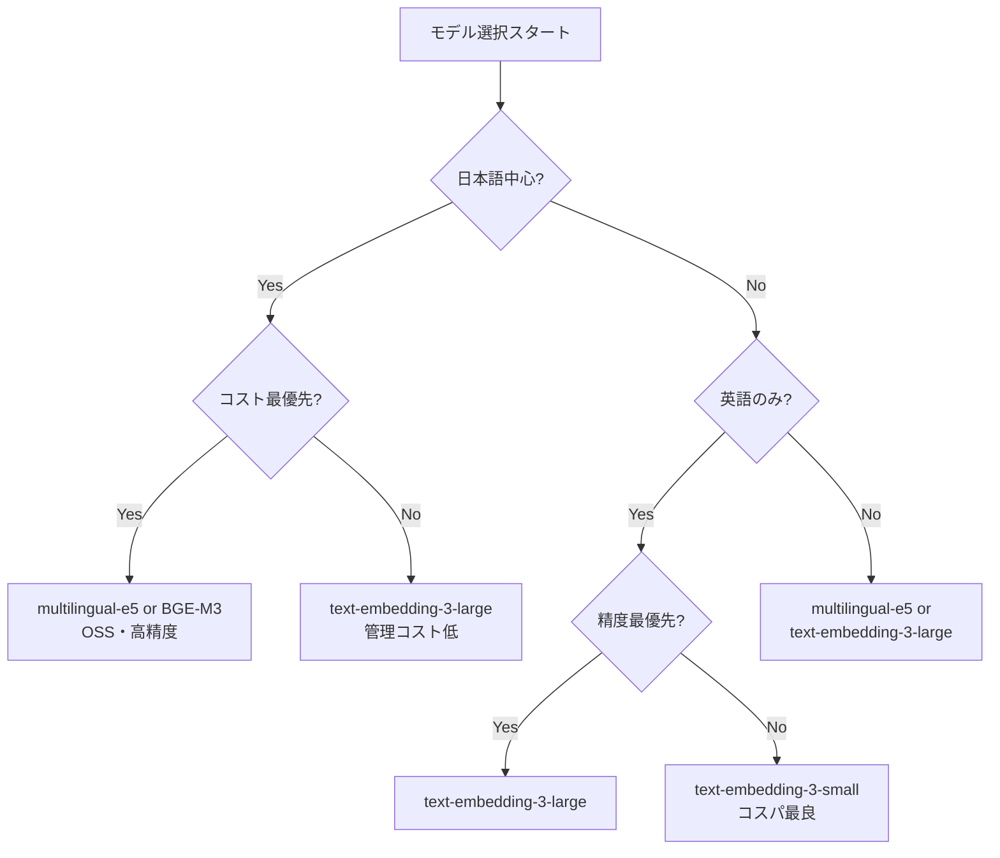
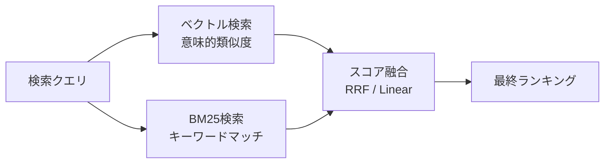
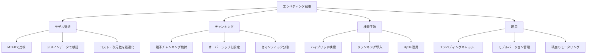

## はじめに：RAGの精度が低い本当の理由

RAGシステムを作ったけど、期待ほど精度が出ない——そんな経験はありませんか？

チャンキング戦略を工夫した、システムプロンプトを改善した、それでも質問によっては全然関係ないドキュメントが取得されてくる。

この問題の根本原因は多くの場合、**エンベディング（埋め込みベクトル）の理解不足**にあります。

エンベディングはRAGだけでなく、意味検索・レコメンデーション・重複検出・クラスタリングなど、現代のAIアプリケーションの至る所で使われています。にもかかわらず、「とりあえず`text-embedding-3-small`を使えばOK」という理解のまま本番に持ち込んでいるケースが非常に多い。

この記事では：

- エンベディングが**内部でどう動いているか**
- ユースケース別の**モデル選択の判断基準**
- ベクトルDBの**比較と選定ポイント**
- 検索精度を劇的に改善する**ハイブリッド検索・リランキング**
- 本番運用で必須の**最適化テクニック**

を、動作するコードとともに徹底解説します。

---

## エンベディングとは何か：直感的な理解

テキストをベクトルに変換するとき、何が起きているのでしょうか？

### 意味空間への射影

エンベディングモデルは、テキストを**高次元の実数ベクトル空間**に射影します。重要なのは、**意味的に近いテキストは、ベクトル空間でも近い位置に来る**という性質です。

```python
# 概念的なイメージ
"犬は吠える"     → [0.82, -0.31, 0.54, ...]  # 512〜3072次元
"犬はワンワン鳴く" → [0.81, -0.30, 0.53, ...]  # ほぼ同じベクトル
"猫はニャアと鳴く" → [0.79, -0.28, 0.51, ...]  # 少し離れている
"量子力学の基礎"   → [-0.12, 0.67, -0.43, ...] # 大きく離れている
```

この「意味的な近さ」を数値（コサイン類似度など）で表現できるため、キーワードマッチでは見つけられない**意味的に関連するドキュメントを検索**できます。

### キーワード検索との決定的な違い

| 比較軸 | キーワード検索（BM25等） | ベクトル検索 |
|--------|------------------------|--------------|
| マッチング方式 | 単語の一致 | 意味の近さ |
| 同義語対応 | ✗（辞書が必要） | ✓（自動） |
| 多言語対応 | ✗（言語ごとに設定）| ✓（多言語モデルなら） |
| 文脈理解 | ✗ | ✓ |
| 計算コスト | 低い | 高い |
| 説明可能性 | 高い | 低い |
| 完全一致の強さ | 強い | 弱い |

---

## エンベディングモデルの選び方

「どのモデルを使えばいいですか？」という質問に対する正直な答えは**「ユースケースによる」**です。以下の判断フレームワークを使ってください。

### 主要モデルの比較（2026年版）

| モデル | 次元数 | 最大トークン | 言語 | コスト/1Mトークン | MTEB スコア |
|--------|--------|-------------|------|-------------------|-------------|
| `text-embedding-3-large` | 3072 | 8191 | 多言語 | $0.13 | ~64.6 |
| `text-embedding-3-small` | 1536 | 8191 | 多言語 | $0.02 | ~62.3 |
| `text-embedding-ada-002` | 1536 | 8191 | 多言語 | $0.10 | ~61.0 |
| `intfloat/multilingual-e5-large-instruct` | 1024 | 512 | 100言語 | 無料（OSS）| ~65.0 |
| `BAAI/bge-m3` | 1024 | 8192 | 100言語 | 無料（OSS）| ~64.8 |
| `Cohere embed-v3` | 1024 | 512 | 多言語 | $0.10 | ~64.5 |

### 選択の判断ツリー



### モデル評価：MTEBベンチマークを読み解く

[MTEB（Massive Text Embedding Benchmark）](https://huggingface.co/spaces/mteb/leaderboard)は56タスクにわたるエンベディングモデルの評価指標です。ただし**盲信は禁物**です。

```python
# MTEBスコアが高くても、ドメイン特化では劣ることがある
# 必ず自分のデータで検証する

from sentence_transformers import SentenceTransformer
import numpy as np
from sklearn.metrics.pairwise import cosine_similarity

def evaluate_model_on_domain(model_name: str, query_doc_pairs: list[tuple]) -> float:
    """
    ドメイン固有データでモデルを評価する
    query_doc_pairs: [(query, relevant_doc, irrelevant_doc), ...]
    """
    model = SentenceTransformer(model_name)
    
    scores = []
    for query, relevant_doc, irrelevant_doc in query_doc_pairs:
        q_emb = model.encode([query])
        rel_emb = model.encode([relevant_doc])
        irr_emb = model.encode([irrelevant_doc])
        
        rel_score = cosine_similarity(q_emb, rel_emb)[0][0]
        irr_score = cosine_similarity(q_emb, irr_emb)[0][0]
        
        # 関連ドキュメントのスコアが高いほど良い
        scores.append(float(rel_score > irr_score))
    
    return np.mean(scores)

# 使い方例
test_pairs = [
    (
        "解約方法を教えてください",
        "サービスの解約は、設定画面から「アカウント削除」を選択してください。",
        "新機能のプレミアムプランが追加されました。"
    ),
    # ... 自社ドメインのペアを100件以上用意する
]

score = evaluate_model_on_domain("intfloat/multilingual-e5-large-instruct", test_pairs)
print(f"ドメイン精度: {score:.2%}")
```

---

## 実装：エンベディングの生成と管理

### OpenAI APIを使った基本実装

```python
from openai import OpenAI
from tenacity import retry, stop_after_attempt, wait_exponential
import numpy as np

client = OpenAI()

@retry(stop=stop_after_attempt(3), wait=wait_exponential(min=1, max=10))
def embed_texts(texts: list[str], model: str = "text-embedding-3-small") -> list[list[float]]:
    """テキストのリストをエンベディングに変換（バッチ処理）"""
    # OpenAI APIは1回のリクエストで最大2048テキストまで
    batch_size = 100
    all_embeddings = []
    
    for i in range(0, len(texts), batch_size):
        batch = texts[i:i + batch_size]
        # 改行文字を除去（エンベディング品質に影響することがある）
        batch = [text.replace("\n", " ") for text in batch]
        
        response = client.embeddings.create(
            input=batch,
            model=model,
            # 次元削減オプション（text-embedding-3シリーズのみ）
            # dimensions=512  # コスト削減に有効
        )
        all_embeddings.extend([item.embedding for item in response.data])
    
    return all_embeddings

def cosine_similarity(a: list[float], b: list[float]) -> float:
    """コサイン類似度を計算"""
    a_np = np.array(a)
    b_np = np.array(b)
    return float(np.dot(a_np, b_np) / (np.linalg.norm(a_np) * np.linalg.norm(b_np)))
```

### 次元削減による最適化（OpenAI text-embedding-3系）

```python
# text-embedding-3-largeは最大3072次元だが、削減してもほぼ精度は落ちない
# 公式ドキュメントによると256次元でもada-002（1536次元）を上回る

import time

def benchmark_dimensions(text_pairs: list[tuple[str, str]], dimensions_list: list[int]):
    """次元数ごとの精度とコストをベンチマーク"""
    results = {}
    
    for dim in dimensions_list:
        start = time.time()
        embeddings = client.embeddings.create(
            input=[t for pair in text_pairs for t in pair],
            model="text-embedding-3-large",
            dimensions=dim
        )
        elapsed = time.time() - start
        
        vecs = [item.embedding for item in embeddings.data]
        scores = []
        for i in range(0, len(vecs), 2):
            score = cosine_similarity(vecs[i], vecs[i+1])
            scores.append(score)
        
        results[dim] = {
            "avg_similarity": np.mean(scores),
            "storage_mb_per_1M_docs": dim * 4 / 1024 / 1024,  # float32
            "latency_s": elapsed
        }
    
    return results

# 推奨：512次元で精度とコストのバランスが最良なケースが多い
```

### OSSモデルのローカル実行

```python
from sentence_transformers import SentenceTransformer
import torch

class LocalEmbedder:
    def __init__(self, model_name: str = "intfloat/multilingual-e5-large-instruct"):
        self.device = "cuda" if torch.cuda.is_available() else "cpu"
        self.model = SentenceTransformer(model_name, device=self.device)
        self.model_name = model_name
    
    def get_query_prompt(self, query: str) -> str:
        """e5-instructシリーズはクエリにインストラクションが必要"""
        if "instruct" in self.model_name:
            return f"Instruct: Given a user query, find relevant documents\nQuery: {query}"
        return query
    
    def encode_documents(self, texts: list[str], batch_size: int = 32) -> np.ndarray:
        """ドキュメントのエンベディング（インストラクションなし）"""
        return self.model.encode(
            texts,
            batch_size=batch_size,
            show_progress_bar=True,
            normalize_embeddings=True  # コサイン類似度の計算を内積に変換できる
        )
    
    def encode_query(self, query: str) -> np.ndarray:
        """クエリのエンベディング（インストラクション付き）"""
        return self.model.encode(
            self.get_query_prompt(query),
            normalize_embeddings=True
        )

# 使い方
embedder = LocalEmbedder()
doc_embeddings = embedder.encode_documents(["文書1", "文書2", ...])
query_embedding = embedder.encode_query("検索クエリ")

# 内積でコサイン類似度を計算（normalize済みの場合）
scores = doc_embeddings @ query_embedding
```

---

## ベクトルデータベース：選定と実装

### 主要ベクトルDBの比較

| DB | ホスティング | スケール | 特徴 | 適したユースケース |
|----|------------|--------|------|-----------------|
| **pgvector** | セルフホスト/クラウド | 〜数百万件 | PostgreSQL拡張 | 既存DBと統合 |
| **Qdrant** | セルフホスト/クラウド | 億件以上 | 高速・Rust製・フィルタ強力 | 本番スケール |
| **Weaviate** | セルフホスト/クラウド | 億件以上 | GraphQL・マルチモーダル | 複雑なスキーマ |
| **Chroma** | セルフホスト | 〜数百万件 | 開発用・シンプル | プロトタイプ |
| **Pinecone** | SaaS | 億件以上 | フルマネージド | 管理コスト削減 |
| **Milvus** | セルフホスト/クラウド | 億件以上 | エンタープライズ向け | 大規模本番 |

### pgvectorの実装（既存PostgreSQLと統合）

```python
import psycopg2
from psycopg2.extras import execute_batch
import numpy as np

class PgVectorStore:
    def __init__(self, connection_string: str, table_name: str = "documents"):
        self.conn = psycopg2.connect(connection_string)
        self.table_name = table_name
        self._setup()
    
    def _setup(self):
        with self.conn.cursor() as cur:
            cur.execute("CREATE EXTENSION IF NOT EXISTS vector")
            cur.execute(f"""
                CREATE TABLE IF NOT EXISTS {self.table_name} (
                    id          BIGSERIAL PRIMARY KEY,
                    content     TEXT NOT NULL,
                    embedding   vector(1536),  -- モデルに合わせて変更
                    metadata    JSONB DEFAULT '{{}}',
                    created_at  TIMESTAMPTZ DEFAULT NOW()
                )
            """)
            # IVFFlatインデックス（100万件以下に推奨）
            # listsはdocs数の平方根が目安（100万件なら1000）
            cur.execute(f"""
                CREATE INDEX IF NOT EXISTS {self.table_name}_embedding_idx
                ON {self.table_name}
                USING ivfflat (embedding vector_cosine_ops)
                WITH (lists = 100)
            """)
            self.conn.commit()
    
    def upsert(self, documents: list[dict]):
        """ドキュメントとエンベディングを保存"""
        with self.conn.cursor() as cur:
            execute_batch(cur, f"""
                INSERT INTO {self.table_name} (content, embedding, metadata)
                VALUES (%s, %s::vector, %s)
                ON CONFLICT DO NOTHING
            """, [
                (doc["content"], doc["embedding"], psycopg2.extras.Json(doc.get("metadata", {})))
                for doc in documents
            ])
            self.conn.commit()
    
    def search(
        self, 
        query_embedding: list[float], 
        k: int = 5,
        filter_metadata: dict | None = None
    ) -> list[dict]:
        """類似ドキュメントを検索"""
        with self.conn.cursor() as cur:
            where_clause = ""
            params = [query_embedding, k]
            
            if filter_metadata:
                conditions = []
                for key, value in filter_metadata.items():
                    conditions.append(f"metadata->>{repr(key)} = %s")
                    params.insert(-1, value)
                where_clause = "WHERE " + " AND ".join(conditions)
            
            cur.execute(f"""
                SELECT content, metadata,
                       1 - (embedding <=> %s::vector) AS similarity
                FROM {self.table_name}
                {where_clause}
                ORDER BY embedding <=> %s::vector
                LIMIT %s
            """, [query_embedding] + (list(filter_metadata.values()) if filter_metadata else []) + [query_embedding, k])
            
            return [
                {"content": row[0], "metadata": row[1], "score": float(row[2])}
                for row in cur.fetchall()
            ]
```

### Qdrantの実装（大規模本番向け）

```python
from qdrant_client import QdrantClient
from qdrant_client.models import (
    Distance, VectorParams, PointStruct,
    Filter, FieldCondition, MatchValue,
    SearchParams, HnswConfigDiff
)
import uuid

class QdrantVectorStore:
    def __init__(self, url: str, collection_name: str, embedding_dim: int = 1536):
        self.client = QdrantClient(url=url)
        self.collection_name = collection_name
        self._setup(embedding_dim)
    
    def _setup(self, embedding_dim: int):
        collections = [c.name for c in self.client.get_collections().collections]
        if self.collection_name not in collections:
            self.client.create_collection(
                collection_name=self.collection_name,
                vectors_config=VectorParams(
                    size=embedding_dim,
                    distance=Distance.COSINE
                ),
                # HNSWパラメータチューニング
                # m: 精度↑ → メモリ↑（推奨: 16〜64）
                # ef_construct: インデックス精度↑ → 構築時間↑（推奨: 100〜500）
                hnsw_config=HnswConfigDiff(m=16, ef_construct=200)
            )
    
    def upsert(self, documents: list[dict]):
        """ドキュメントとエンベディングをバッチ保存"""
        points = [
            PointStruct(
                id=str(uuid.uuid4()),
                vector=doc["embedding"],
                payload={
                    "content": doc["content"],
                    **doc.get("metadata", {})
                }
            )
            for doc in documents
        ]
        self.client.upsert(collection_name=self.collection_name, points=points)
    
    def search(
        self,
        query_embedding: list[float],
        k: int = 5,
        filters: dict | None = None
    ) -> list[dict]:
        """フィルタ付き類似検索"""
        qdrant_filter = None
        if filters:
            qdrant_filter = Filter(
                must=[
                    FieldCondition(key=key, match=MatchValue(value=value))
                    for key, value in filters.items()
                ]
            )
        
        results = self.client.search(
            collection_name=self.collection_name,
            query_vector=query_embedding,
            query_filter=qdrant_filter,
            limit=k,
            search_params=SearchParams(hnsw_ef=128)  # 検索時精度（高いほど遅い）
        )
        
        return [
            {
                "content": hit.payload["content"],
                "metadata": {k: v for k, v in hit.payload.items() if k != "content"},
                "score": hit.score
            }
            for hit in results
        ]
```

---

## 検索精度を高める上級テクニック

### ハイブリッド検索：ベクトル＋BM25の組み合わせ

ベクトル検索とキーワード検索、どちらが優れているかという議論は間違っています。**両方使うのが正解**です。これをハイブリッド検索と呼びます。



**RRF（Reciprocal Rank Fusion）**は最もシンプルかつ効果的なスコア融合手法です：

```python
from rank_bm25 import BM25Okapi
import MeCab  # 日本語トークナイザー
from collections import defaultdict

class HybridSearcher:
    def __init__(self, documents: list[dict], embedder, vector_store):
        self.documents = documents
        self.embedder = embedder
        self.vector_store = vector_store
        
        # BM25インデックスを構築（日本語はMeCabでトークナイズ）
        self.tagger = MeCab.Tagger("-Owakati")
        tokenized = [self._tokenize(doc["content"]) for doc in documents]
        self.bm25 = BM25Okapi(tokenized)
    
    def _tokenize(self, text: str) -> list[str]:
        return self.tagger.parse(text).strip().split()
    
    def search(self, query: str, k: int = 5, alpha: float = 0.5) -> list[dict]:
        """
        ハイブリッド検索
        alpha: ベクトル検索の重み（0.0=BM25のみ、1.0=ベクトルのみ）
        """
        # ベクトル検索（上位k*2件を取得）
        query_emb = self.embedder.encode_query(query)
        vector_results = self.vector_store.search(query_emb, k=k*2)
        
        # BM25検索（上位k*2件を取得）
        tokenized_query = self._tokenize(query)
        bm25_scores = self.bm25.get_scores(tokenized_query)
        bm25_top_idx = bm25_scores.argsort()[::-1][:k*2]
        
        # RRF（Reciprocal Rank Fusion）でスコア融合
        rrf_scores = defaultdict(float)
        RRF_K = 60  # ハイパーパラメータ（通常60が良い）
        
        # ベクトル検索結果のRRFスコア
        for rank, result in enumerate(vector_results):
            doc_id = result["content"][:50]  # 簡易ID
            rrf_scores[doc_id] += alpha * (1.0 / (RRF_K + rank + 1))
        
        # BM25結果のRRFスコア
        for rank, idx in enumerate(bm25_top_idx):
            doc_id = self.documents[idx]["content"][:50]
            rrf_scores[doc_id] += (1 - alpha) * (1.0 / (RRF_K + rank + 1))
        
        # スコア順にソート
        sorted_docs = sorted(rrf_scores.items(), key=lambda x: x[1], reverse=True)
        return sorted_docs[:k]
```

### リランキング：取得後の精度向上

ベクトル検索で上位20件を取得し、**CrossEncoderモデルでリランキング**することで、精度を大幅に改善できます。CrossEncoderはQueryとDocumentを**同時に**処理するため、より精緻なスコアリングが可能です。

```python
from sentence_transformers import CrossEncoder

class Reranker:
    def __init__(self, model_name: str = "cross-encoder/ms-marco-MiniLM-L-6-v2"):
        # 日本語向け: hotchpotch/japanese-reranker-cross-encoder-large-v1
        self.model = CrossEncoder(model_name)
    
    def rerank(
        self,
        query: str,
        documents: list[dict],
        top_k: int = 5
    ) -> list[dict]:
        """
        初期検索結果をリランキング
        documents: [{"content": str, "metadata": dict, "score": float}, ...]
        """
        # CrossEncoderに(query, document)ペアを渡す
        pairs = [(query, doc["content"]) for doc in documents]
        scores = self.model.predict(pairs)
        
        # スコアで降順ソート
        scored_docs = sorted(
            zip(documents, scores),
            key=lambda x: x[1],
            reverse=True
        )
        
        return [
            {**doc, "rerank_score": float(score)}
            for doc, score in scored_docs[:top_k]
        ]

# RAGパイプラインに組み込む
class AdvancedRAGPipeline:
    def __init__(self, embedder, vector_store, reranker, llm_client):
        self.embedder = embedder
        self.vector_store = vector_store
        self.reranker = reranker
        self.llm = llm_client
    
    def query(self, user_query: str, initial_k: int = 20, final_k: int = 5) -> str:
        # Step 1: ベクトル検索で候補を広く取得
        query_emb = self.embedder.encode_query(user_query)
        candidates = self.vector_store.search(query_emb, k=initial_k)
        
        # Step 2: リランキングで精度を上げる
        reranked = self.reranker.rerank(user_query, candidates, top_k=final_k)
        
        # Step 3: コンテキストを構築してLLMに渡す
        context = "\n\n".join([
            f"[{i+1}] {doc['content']}"
            for i, doc in enumerate(reranked)
        ])
        
        response = self.llm.chat.completions.create(
            model="gpt-4o",
            messages=[
                {"role": "system", "content": "与えられたコンテキストのみを使って質問に答えてください。"},
                {"role": "user", "content": f"コンテキスト:\n{context}\n\n質問: {user_query}"}
            ]
        )
        return response.choices[0].message.content
```

### クエリ拡張（HyDE：Hypothetical Document Embeddings）

HyDEは「クエリをそのままベクトル化するのではなく、LLMに仮想的な回答ドキュメントを生成させ、そのエンベディングで検索する」手法です。

```python
from openai import OpenAI

client = OpenAI()

def hyde_search(query: str, embedder, vector_store, k: int = 5) -> list[dict]:
    """
    HyDE（Hypothetical Document Embeddings）検索
    短いクエリでも高精度な検索が可能
    """
    # Step 1: LLMに仮想的な回答を生成させる
    response = client.chat.completions.create(
        model="gpt-4o-mini",
        messages=[{
            "role": "user",
            "content": f"""以下の質問に対する理想的な回答文書を生成してください。
実際には存在しない情報でも構いません。検索のための仮想文書として使います。

質問: {query}

回答文書（200字程度）:"""
        }],
        max_tokens=300
    )
    
    hypothetical_doc = response.choices[0].message.content
    
    # Step 2: 仮想文書のエンベディングで検索
    hyp_embedding = embedder.encode_documents([hypothetical_doc])[0]
    return vector_store.search(hyp_embedding, k=k)

# 効果の例
# クエリ「なぜ空は青い？」→ LLMが「空が青く見える理由はレイリー散乱...」という仮想回答を生成
# → この仮想回答のベクトルで「レイリー散乱について詳しく説明した技術文書」が検索される
```

---

## チャンキング戦略：見落とされがちな精度向上のカギ

エンベディングの精度はモデルよりも**チャンキング戦略**に大きく左右されます。

```python
from langchain.text_splitter import RecursiveCharacterTextSplitter
import re

class SmartChunker:
    """コンテキストを保持しながら効率的にチャンクを生成"""
    
    def __init__(self, chunk_size: int = 512, chunk_overlap: int = 64):
        self.chunk_size = chunk_size
        self.chunk_overlap = chunk_overlap
        self.splitter = RecursiveCharacterTextSplitter(
            chunk_size=chunk_size,
            chunk_overlap=chunk_overlap,
            separators=["\n\n", "\n", "。", "、", " ", ""]
        )
    
    def chunk_with_context(self, text: str, title: str = "") -> list[dict]:
        """
        親チャンク + 子チャンク方式（Parent-Child Chunking）
        - 小さいチャンクでベクトル検索（精度↑）
        - 取得後に親チャンクのコンテキストをLLMに渡す（品質↑）
        """
        # 大きな親チャンクを作成（LLMへのコンテキスト用）
        parent_splitter = RecursiveCharacterTextSplitter(
            chunk_size=2048,
            chunk_overlap=128,
            separators=["\n\n", "\n", "。"]
        )
        parent_chunks = parent_splitter.split_text(text)
        
        results = []
        for parent_idx, parent_chunk in enumerate(parent_chunks):
            # 各親チャンクをさらに小さく分割（検索用）
            child_chunks = self.splitter.split_text(parent_chunk)
            
            for child_idx, child_chunk in enumerate(child_chunks):
                results.append({
                    "content": child_chunk,          # ベクトル検索用（小）
                    "parent_content": parent_chunk,  # LLMへのコンテキスト用（大）
                    "metadata": {
                        "title": title,
                        "parent_idx": parent_idx,
                        "child_idx": child_idx,
                        "char_count": len(child_chunk)
                    }
                })
        
        return results
    
    def semantic_chunk(self, text: str, embedder) -> list[dict]:
        """
        セマンティックチャンキング：内容の変化点で分割
        固定サイズより精度が高いが処理コストが高い
        """
        sentences = re.split(r'(?<=[。！？\.\!\?])', text)
        sentences = [s.strip() for s in sentences if s.strip()]
        
        if len(sentences) < 3:
            return [{"content": text, "metadata": {}}]
        
        # 隣接文のエンベディング差分を計算
        embeddings = embedder.encode_documents(sentences)
        
        # コサイン類似度が急落する箇所が「意味の変わり目」
        breakpoints = []
        threshold = 0.3  # この値を下回ったら分割
        
        for i in range(len(embeddings) - 1):
            sim = float(embeddings[i] @ embeddings[i+1])  # normalize済みなら内積=コサイン類似度
            if sim < threshold:
                breakpoints.append(i + 1)
        
        # 変わり目でテキストを分割
        chunks = []
        start = 0
        for bp in breakpoints:
            chunk_text = "".join(sentences[start:bp])
            chunks.append({"content": chunk_text, "metadata": {"semantic_break": True}})
            start = bp
        chunks.append({"content": "".join(sentences[start:]), "metadata": {}})
        
        return chunks
```

---

## 本番運用のベストプラクティス

### エンベディングキャッシュ

同じテキストを何度もエンベディングするのは無駄です。キャッシュは必須です。

```python
import hashlib
import json
import redis
from functools import wraps

class CachedEmbedder:
    def __init__(self, base_embedder, redis_url: str = "redis://localhost:6379"):
        self.embedder = base_embedder
        self.redis = redis.from_url(redis_url)
        self.cache_ttl = 60 * 60 * 24 * 30  # 30日間キャッシュ
    
    def _cache_key(self, text: str, model: str) -> str:
        content = f"{model}:{text}"
        return f"emb:{hashlib.sha256(content.encode()).hexdigest()}"
    
    def encode(self, texts: list[str]) -> list[list[float]]:
        results = [None] * len(texts)
        uncached_indices = []
        uncached_texts = []
        
        # キャッシュから取得を試みる
        for i, text in enumerate(texts):
            key = self._cache_key(text, "default")
            cached = self.redis.get(key)
            if cached:
                results[i] = json.loads(cached)
            else:
                uncached_indices.append(i)
                uncached_texts.append(text)
        
        # キャッシュミスのみAPIを呼ぶ
        if uncached_texts:
            new_embeddings = self.embedder.encode_documents(uncached_texts)
            for i, (idx, emb) in enumerate(zip(uncached_indices, new_embeddings)):
                key = self._cache_key(texts[idx], "default")
                self.redis.setex(key, self.cache_ttl, json.dumps(emb.tolist()))
                results[idx] = emb.tolist()
        
        return results
```

### エンベディングのバージョン管理

モデルを変更したとき、既存データをどう扱うかは重大な問題です。

```python
class VersionedVectorStore:
    """
    エンベディングモデルのバージョン管理
    モデル変更時に段階的マイグレーションを実現
    """
    
    def __init__(self, vector_store, current_model: str):
        self.store = vector_store
        self.current_model = current_model
    
    def migrate_incrementally(
        self,
        old_embedder,
        new_embedder,
        documents: list[dict],
        batch_size: int = 100
    ):
        """
        バックグラウンドでの段階的マイグレーション
        アクセスのあったドキュメントから順次再エンベディング
        """
        total = len(documents)
        migrated = 0
        
        for i in range(0, total, batch_size):
            batch = documents[i:i + batch_size]
            texts = [doc["content"] for doc in batch]
            
            # 新モデルで再エンベディング
            new_embeddings = new_embedder.encode_documents(texts)
            
            # メタデータにモデルバージョンを記録
            updated_docs = [
                {
                    **doc,
                    "embedding": emb.tolist(),
                    "metadata": {
                        **doc.get("metadata", {}),
                        "embedding_model": self.current_model,
                        "migrated_at": "2026-03-30"
                    }
                }
                for doc, emb in zip(batch, new_embeddings)
            ]
            
            self.store.upsert(updated_docs)
            migrated += len(batch)
            print(f"Migration progress: {migrated}/{total} ({migrated/total:.1%})")
```

---

## まとめ：エンベディング戦略のチェックリスト



今日紹介したテクニックを全部一度に導入する必要はありません。まず**モデルをドメインデータで評価**し、次に**ハイブリッド検索またはリランキング**を追加する——この2ステップだけでも、多くのケースでRAGの精度は大きく改善します。

エンベディングは「設定して終わり」ではなく、定期的に評価・改善するものだという意識を持つことが、AIネイティブなエンジニアへの第一歩です。

---

## 参考・関連リソース

- [MTEB Leaderboard](https://huggingface.co/spaces/mteb/leaderboard) — エンベディングモデルの最新比較
- [OpenAI Embeddings Guide](https://platform.openai.com/docs/guides/embeddings) — 公式ドキュメント
- [Sentence Transformers Documentation](https://www.sbert.net/) — OSSエンベディングの実装
- [Qdrant Documentation](https://qdrant.tech/documentation/) — Qdrant公式ドキュメント
- 本ブログ関連記事: [RAG実装ガイド](/2025/02/19/rag-implementation-guide.html) — RAGシステム全体の構築方法
- 本ブログ関連記事: [LLM可観測性完全ガイド](/2026/03/28/llm-observability-guide.html) — エンベディング品質のモニタリング方法
