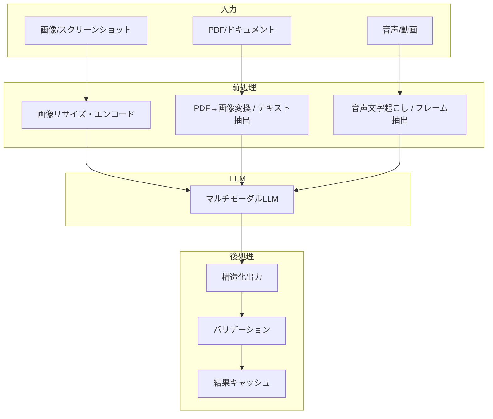
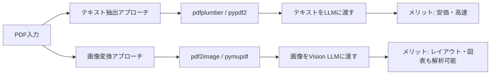

## はじめに

「LLM = テキスト処理」という時代は終わりました。

2026年現在、主要なLLMはテキストだけでなく**画像・PDF・音声・動画**をネイティブに理解できます。GPT-4o、Gemini 2.0 Flash、Claude 3.5 Sonnetのいずれも、マルチモーダル入力を標準サポートしています。

しかし、「APIにファイルを渡せばなんとかなる」という感覚で実装すると、精度・コスト・信頼性の3点で失敗します。プロダクションで本当に使えるマルチモーダルAIを構築するには、**各モダリティの特性を理解した上での設計**が不可欠です。

この記事では、AIネイティブエンジニアとして知るべきマルチモーダルLLMの実践テクニックを、コード付きで体系的に解説します。

### この記事で学べること

- 主要モデルのマルチモーダル能力の比較と使い分け
- 画像認識・OCR・図表解析のプロ実装パターン
- PDF・ドキュメント処理のベストプラクティス
- 音声入力（Whisper / GPT-4o Audio）の活用
- 動画理解（Gemini 2.0）の実装
- コスト最適化と品質向上のトレードオフ
- 本番運用での注意点

---

## マルチモーダルLLMの全体像

### 対応するモダリティ比較（2026年Q1時点）

| モデル | 画像 | 動画 | 音声入力 | 音声出力 | ドキュメント | 長コンテキスト |
|---|---|---|---|---|---|---|
| GPT-4o | ✅ | ❌ | ✅ | ✅ | ✅（PDF） | 128K tokens |
| GPT-4o mini | ✅ | ❌ | ✅ | ❌ | ✅（PDF） | 128K tokens |
| Gemini 2.0 Flash | ✅ | ✅ | ✅ | ✅ | ✅ | 1M tokens |
| Gemini 2.0 Pro | ✅ | ✅ | ✅ | ✅ | ✅ | 2M tokens |
| Claude 3.5 Sonnet | ✅ | ❌ | ❌ | ❌ | ✅（PDF） | 200K tokens |
| Claude 3.5 Haiku | ✅ | ❌ | ❌ | ❌ | ✅（PDF） | 200K tokens |
| Llama 3.2 Vision | ✅ | ❌ | ❌ | ❌ | ❌ | 128K tokens |

> ※ 各社の機能は急速に進化中です。最新情報は公式ドキュメントで確認してください。

### マルチモーダル処理のアーキテクチャ



---

## 画像認識・解析の実践

### 基本的な画像入力

OpenAI APIへの画像の渡し方は、URLとBase64の2通りです。

```python
import base64
from pathlib import Path
from openai import OpenAI

client = OpenAI()

def encode_image(image_path: str) -> str:
    """画像をBase64エンコード"""
    with open(image_path, "rb") as f:
        return base64.standard_b64encode(f.read()).decode("utf-8")

def analyze_image(image_path: str, prompt: str) -> str:
    """画像を解析してテキストを返す"""
    base64_image = encode_image(image_path)
    
    # 拡張子からMIMEタイプを判定
    ext = Path(image_path).suffix.lower()
    mime_map = {".jpg": "jpeg", ".jpeg": "jpeg", ".png": "png", 
                ".gif": "gif", ".webp": "webp"}
    mime_type = f"image/{mime_map.get(ext, 'jpeg')}"
    
    response = client.chat.completions.create(
        model="gpt-4o",
        messages=[
            {
                "role": "user",
                "content": [
                    {
                        "type": "image_url",
                        "image_url": {
                            "url": f"data:{mime_type};base64,{base64_image}",
                            "detail": "high",  # "low" | "high" | "auto"
                        },
                    },
                    {"type": "text", "text": prompt},
                ],
            }
        ],
        max_tokens=1024,
    )
    return response.choices[0].message.content
```

### `detail` パラメータの使い分け

OpenAIのビジョンAPIには `detail` パラメータがあります。これはコストと精度に直結します：

| detail値 | トークン消費 | 用途 |
|---|---|---|
| `low` | 常に85トークン | 画像の大まかな内容把握、分類 |
| `high` | 512×512タイルに分割して計算 | OCR、細部の解析、図表読み取り |
| `auto` | 画像サイズに応じて自動選択 | 汎用（非推奨：コスト予測困難） |

**コスト計算例（`high` モード）：**

```python
def estimate_vision_tokens(width: int, height: int) -> int:
    """high detailモードでのトークン数を概算"""
    # 短辺を768px以下にスケール
    if min(width, height) > 768:
        scale = 768 / min(width, height)
        width = int(width * scale)
        height = int(height * scale)
    
    # 長辺を2048px以下にスケール
    if max(width, height) > 2048:
        scale = 2048 / max(width, height)
        width = int(width * scale)
        height = int(height * scale)
    
    # 512x512タイル数を計算
    tiles_w = (width + 511) // 512
    tiles_h = (height + 511) // 512
    tiles = tiles_w * tiles_h
    
    return 85 + 170 * tiles  # ベーストークン + タイルあたり170トークン

# 例: 1920x1080の画像
tokens = estimate_vision_tokens(1920, 1080)
print(f"推定トークン数: {tokens}")  # 約595トークン
```

### スクリーンショット解析（UIテスト自動化への応用）

```python
import asyncio
from playwright.async_api import async_playwright
from openai import AsyncOpenAI
import base64

client = AsyncOpenAI()

async def analyze_ui_screenshot(url: str, question: str) -> dict:
    """Webページのスクリーンショットを撮ってUI解析"""
    async with async_playwright() as p:
        browser = await p.chromium.launch()
        page = await browser.new_page(viewport={"width": 1280, "height": 720})
        await page.goto(url)
        screenshot = await page.screenshot(type="png")
        await browser.close()
    
    b64 = base64.standard_b64encode(screenshot).decode()
    
    response = await client.chat.completions.create(
        model="gpt-4o",
        messages=[
            {
                "role": "user",
                "content": [
                    {
                        "type": "image_url",
                        "image_url": {"url": f"data:image/png;base64,{b64}", "detail": "high"},
                    },
                    {"type": "text", "text": f"""
以下のWebページのスクリーンショットを分析してください。

質問: {question}

JSON形式で回答してください:
{{
  "answer": "回答",
  "confidence": "high|medium|low",
  "ui_elements_found": ["検出されたUI要素のリスト"],
  "issues": ["問題点があれば記述"]
}}
"""},
                ],
            }
        ],
        response_format={"type": "json_object"},
        max_tokens=1024,
    )
    
    import json
    return json.loads(response.choices[0].message.content)

# 使用例
# result = asyncio.run(analyze_ui_screenshot(
#     "https://example.com",
#     "ログインボタンは存在しますか？アクセシビリティ上の問題はありますか？"
# ))
```

---

## PDF・ドキュメント処理

### PDFをどう扱うか：2つのアプローチ

PDFの処理方法には大きく2つのアプローチがあります：



**使い分けの基準：**

| 状況 | 推奨アプローチ |
|---|---|
| テキスト主体のPDF（契約書、論文） | テキスト抽出 |
| 図表・グラフを含む | 画像変換 |
| スキャンPDF（OCRが必要） | 画像変換 |
| レイアウトが重要（財務報告書） | 画像変換 |
| コスト優先 | テキスト抽出 |

### テキスト抽出アプローチ（高速・低コスト）

```python
import pdfplumber
from openai import OpenAI
from typing import Generator

client = OpenAI()

def extract_pdf_text(pdf_path: str) -> str:
    """PDFからテキストを抽出（ページ番号付き）"""
    pages = []
    with pdfplumber.open(pdf_path) as pdf:
        for i, page in enumerate(pdf.pages, 1):
            text = page.extract_text()
            if text and text.strip():
                pages.append(f"=== ページ {i} ===\n{text}")
    return "\n\n".join(pages)

def analyze_pdf_with_text(pdf_path: str, question: str) -> str:
    """テキスト抽出でPDFを解析"""
    text = extract_pdf_text(pdf_path)
    
    # 長すぎる場合はチャンク処理が必要
    MAX_CHARS = 100_000  # 約25Kトークン相当
    if len(text) > MAX_CHARS:
        text = text[:MAX_CHARS] + "\n\n[以降のテキストは省略されました]"
    
    response = client.chat.completions.create(
        model="gpt-4o-mini",  # テキストのみなら安価なモデルで十分
        messages=[
            {
                "role": "system",
                "content": "あなたはドキュメント解析の専門家です。提供されたPDFテキストに基づいて正確に回答してください。",
            },
            {
                "role": "user",
                "content": f"以下のPDFの内容について回答してください。\n\n質問: {question}\n\n--- PDFテキスト ---\n{text}",
            },
        ],
        max_tokens=2048,
    )
    return response.choices[0].message.content
```

### 画像変換アプローチ（高精度・図表対応）

```python
import fitz  # pymupdf: pip install pymupdf
import base64
from openai import OpenAI
from pathlib import Path

client = OpenAI()

def pdf_to_images_base64(pdf_path: str, dpi: int = 150) -> list[str]:
    """PDFを画像に変換してBase64リストを返す"""
    doc = fitz.open(pdf_path)
    images = []
    
    for page in doc:
        # DPI設定でmatrixを計算（72dpi基準）
        zoom = dpi / 72
        mat = fitz.Matrix(zoom, zoom)
        pix = page.get_pixmap(matrix=mat)
        img_bytes = pix.tobytes("png")
        images.append(base64.standard_b64encode(img_bytes).decode())
    
    doc.close()
    return images

def analyze_pdf_with_vision(
    pdf_path: str,
    question: str,
    max_pages: int = 20,
    dpi: int = 150,
) -> str:
    """Vision LLMを使ってPDFを高精度解析"""
    images = pdf_to_images_base64(pdf_path, dpi=dpi)
    
    if len(images) > max_pages:
        print(f"警告: {len(images)}ページ中、最初の{max_pages}ページのみ処理します")
        images = images[:max_pages]
    
    # コンテンツリストを構築
    content = [{"type": "text", "text": f"以下のPDFを分析して回答してください。\n\n質問: {question}"}]
    
    for i, b64_img in enumerate(images, 1):
        content.append({
            "type": "text",
            "text": f"[ページ {i}]"
        })
        content.append({
            "type": "image_url",
            "image_url": {
                "url": f"data:image/png;base64,{b64_img}",
                "detail": "high",
            },
        })
    
    response = client.chat.completions.create(
        model="gpt-4o",
        messages=[{"role": "user", "content": content}],
        max_tokens=4096,
    )
    return response.choices[0].message.content
```

### Claudeのネイティブ PDF サポートを活用

AnthropicはPDFをBase64でそのまま渡せるネイティブ対応をしており、変換不要で高精度です：

```python
import anthropic
import base64

anthropic_client = anthropic.Anthropic()

def analyze_pdf_claude(pdf_path: str, question: str) -> str:
    """Claude のネイティブPDFサポートを活用"""
    with open(pdf_path, "rb") as f:
        pdf_data = base64.standard_b64encode(f.read()).decode()
    
    response = anthropic_client.messages.create(
        model="claude-3-5-sonnet-20241022",
        max_tokens=4096,
        messages=[
            {
                "role": "user",
                "content": [
                    {
                        "type": "document",
                        "source": {
                            "type": "base64",
                            "media_type": "application/pdf",
                            "data": pdf_data,
                        },
                    },
                    {"type": "text", "text": question},
                ],
            }
        ],
    )
    return response.content[0].text
```

---

## 音声処理

### Whisper APIによる文字起こし

```python
from openai import OpenAI
from pathlib import Path

client = OpenAI()

def transcribe_audio(
    audio_path: str,
    language: str = "ja",
    response_format: str = "verbose_json",
) -> dict:
    """音声ファイルを文字起こし（タイムスタンプ付き）"""
    with open(audio_path, "rb") as audio_file:
        transcript = client.audio.transcriptions.create(
            model="whisper-1",
            file=audio_file,
            language=language,
            response_format=response_format,  # verbose_jsonでタイムスタンプ取得
            timestamp_granularities=["segment", "word"],  # word単位のタイムスタンプ
        )
    
    return {
        "text": transcript.text,
        "language": transcript.language,
        "duration": transcript.duration,
        "segments": [
            {
                "start": seg.start,
                "end": seg.end,
                "text": seg.text,
            }
            for seg in (transcript.segments or [])
        ],
    }

def transcribe_and_summarize(audio_path: str) -> dict:
    """文字起こし + 要約を一括処理"""
    result = transcribe_audio(audio_path)
    
    # 文字起こしテキストをGPT-4oで要約
    summary_response = client.chat.completions.create(
        model="gpt-4o-mini",
        messages=[
            {
                "role": "system",
                "content": "音声の文字起こしを受け取り、重要なポイントを箇条書きで要約してください。",
            },
            {"role": "user", "content": result["text"]},
        ],
        max_tokens=1024,
    )
    
    result["summary"] = summary_response.choices[0].message.content
    return result
```

### GPT-4o Audio Preview（リアルタイム音声会話）

```python
import base64
from openai import OpenAI
from pathlib import Path

client = OpenAI()

def audio_chat_with_gpt4o(audio_path: str, text_prompt: str = "") -> dict:
    """GPT-4o Audio Previewで音声を直接LLMに渡す"""
    with open(audio_path, "rb") as f:
        audio_data = base64.standard_b64encode(f.read()).decode()
    
    ext = Path(audio_path).suffix.lower().lstrip(".")
    if ext == "mp3":
        audio_format = "mp3"
    elif ext in ("wav", "wave"):
        audio_format = "wav"
    else:
        audio_format = "mp3"  # フォールバック
    
    content = [
        {
            "type": "input_audio",
            "input_audio": {
                "data": audio_data,
                "format": audio_format,
            },
        }
    ]
    if text_prompt:
        content.append({"type": "text", "text": text_prompt})
    
    response = client.chat.completions.create(
        model="gpt-4o-audio-preview",
        modalities=["text"],  # テキスト応答のみ
        messages=[{"role": "user", "content": content}],
        max_tokens=1024,
    )
    
    return {
        "text": response.choices[0].message.content,
        "usage": {
            "audio_tokens": response.usage.prompt_tokens_details.audio_tokens,
            "text_tokens": response.usage.prompt_tokens_details.text_tokens,
        },
    }
```

---

## 動画理解（Gemini 2.0）

GeminiはYouTube URLや動画ファイルをネイティブにサポートします：

```python
import google.generativeai as genai
import time
from pathlib import Path

genai.configure(api_key="YOUR_GEMINI_API_KEY")

def analyze_youtube_video(youtube_url: str, question: str) -> str:
    """YouTube動画をGeminiで分析"""
    model = genai.GenerativeModel("gemini-2.0-flash")
    
    response = model.generate_content([
        {
            "file_data": {
                "file_uri": youtube_url,
                "mime_type": "video/youtube",
            }
        },
        question,
    ])
    return response.text

def analyze_local_video(video_path: str, question: str) -> str:
    """ローカル動画ファイルをGeminiで分析"""
    print(f"動画をアップロード中: {video_path}")
    video_file = genai.upload_file(path=video_path)
    
    # アップロード完了を待機
    while video_file.state.name == "PROCESSING":
        time.sleep(5)
        video_file = genai.get_file(video_file.name)
    
    if video_file.state.name == "FAILED":
        raise ValueError(f"動画の処理に失敗しました: {video_file.state.name}")
    
    model = genai.GenerativeModel("gemini-2.0-flash")
    response = model.generate_content([video_file, question])
    
    # 使用後はファイルを削除（ストレージ節約）
    genai.delete_file(video_file.name)
    
    return response.text

# 使用例
# 動画の特定シーンについて質問
# result = analyze_youtube_video(
#     "https://www.youtube.com/watch?v=XXXXX",
#     "この動画で説明されている技術的な概念を3点にまとめてください"
# )
```

---

## 高度な実装パターン

### パターン1：マルチモーダルRAG（画像をベクトル検索に組み込む）

```python
from openai import OpenAI
import base64
import json
from pathlib import Path

client = OpenAI()

def get_image_description_for_embedding(image_path: str) -> str:
    """画像の説明テキストを生成してエンベディング用に使う"""
    b64 = base64.standard_b64encode(Path(image_path).read_bytes()).decode()
    
    response = client.chat.completions.create(
        model="gpt-4o-mini",
        messages=[
            {
                "role": "user",
                "content": [
                    {"type": "image_url", "image_url": {"url": f"data:image/png;base64,{b64}", "detail": "low"}},
                    {
                        "type": "text",
                        "text": """この画像について、検索インデックス用の詳細な説明を生成してください。
以下を含めてください:
1. 画像の種類（写真/図表/スクリーンショット等）
2. 主要なコンテンツの説明
3. テキストが含まれる場合はその内容
4. 重要なキーワード（タグ形式）

JSON形式で返してください: {"description": "...", "tags": [...], "text_content": "..."}""",
                    },
                ],
            }
        ],
        response_format={"type": "json_object"},
        max_tokens=512,
    )
    
    result = json.loads(response.choices[0].message.content)
    # 検索用のテキストとして結合
    return f"{result['description']} {' '.join(result['tags'])} {result.get('text_content', '')}"

def create_image_embedding(image_path: str) -> list[float]:
    """画像の検索用エンベディングを生成"""
    description = get_image_description_for_embedding(image_path)
    
    embedding_response = client.embeddings.create(
        model="text-embedding-3-small",
        input=description,
    )
    return embedding_response.data[0].embedding
```

### パターン2：構造化データ抽出（レシート・名刺・フォーム）

```python
from pydantic import BaseModel, Field
from openai import OpenAI
import base64
import json
from typing import Optional
from datetime import date

client = OpenAI()

class ReceiptItem(BaseModel):
    name: str = Field(description="商品名")
    quantity: int = Field(description="数量", default=1)
    unit_price: float = Field(description="単価（円）")
    total_price: float = Field(description="合計金額（円）")

class Receipt(BaseModel):
    store_name: str = Field(description="店舗名")
    date: Optional[str] = Field(description="日付 (YYYY-MM-DD形式)", default=None)
    items: list[ReceiptItem] = Field(description="購入品目リスト")
    subtotal: Optional[float] = Field(description="小計（税抜）", default=None)
    tax: Optional[float] = Field(description="消費税額", default=None)
    total: float = Field(description="合計金額（税込）")
    payment_method: Optional[str] = Field(description="支払い方法", default=None)

def extract_receipt_data(image_path: str) -> Receipt:
    """レシート画像から構造化データを抽出"""
    b64 = base64.standard_b64encode(open(image_path, "rb").read()).decode()
    
    schema = Receipt.model_json_schema()
    
    response = client.chat.completions.create(
        model="gpt-4o",
        messages=[
            {
                "role": "system",
                "content": f"""レシート画像から情報を抽出し、以下のJSONスキーマに従って出力してください。
読み取れない項目はnullにしてください。金額は数値（円）で記録してください。

スキーマ: {json.dumps(schema, ensure_ascii=False)}""",
            },
            {
                "role": "user",
                "content": [
                    {
                        "type": "image_url",
                        "image_url": {"url": f"data:image/jpeg;base64,{b64}", "detail": "high"},
                    },
                    {"type": "text", "text": "このレシートの情報を抽出してください。"},
                ],
            },
        ],
        response_format={"type": "json_object"},
        max_tokens=1024,
    )
    
    data = json.loads(response.choices[0].message.content)
    return Receipt(**data)
```

### パターン3：複数画像の比較・差分検出

```python
from openai import OpenAI
import base64

client = OpenAI()

def compare_images(image_path_1: str, image_path_2: str, context: str = "") -> dict:
    """2つの画像を比較して差分・変化点を検出"""
    
    def load(path):
        return base64.standard_b64encode(open(path, "rb").read()).decode()
    
    b64_1 = load(image_path_1)
    b64_2 = load(image_path_2)
    
    prompt = f"""2つの画像を比較して、以下のJSON形式で違いを報告してください。
{f'コンテキスト: {context}' if context else ''}

{{
  "summary": "全体的な変化の要約",
  "differences": [
    {{
      "location": "変化が起きた場所の説明",
      "before": "変化前の状態",
      "after": "変化後の状態",
      "significance": "high|medium|low"
    }}
  ],
  "unchanged_elements": ["変化していない主要な要素"],
  "overall_similarity": 0.0  // 0.0〜1.0の類似度スコア
}}"""

    response = client.chat.completions.create(
        model="gpt-4o",
        messages=[
            {
                "role": "user",
                "content": [
                    {"type": "text", "text": "画像1（変更前）:"},
                    {"type": "image_url", "image_url": {"url": f"data:image/png;base64,{b64_1}", "detail": "high"}},
                    {"type": "text", "text": "画像2（変更後）:"},
                    {"type": "image_url", "image_url": {"url": f"data:image/png;base64,{b64_2}", "detail": "high"}},
                    {"type": "text", "text": prompt},
                ],
            }
        ],
        response_format={"type": "json_object"},
        max_tokens=2048,
    )
    
    import json
    return json.loads(response.choices[0].message.content)
```

---

## コスト最適化戦略

### 画像前処理によるトークン削減

```python
from PIL import Image
import io
import base64
from pathlib import Path

def optimize_image_for_llm(
    image_path: str,
    max_short_side: int = 768,
    max_long_side: int = 1568,
    quality: int = 85,
    format: str = "JPEG",
) -> str:
    """LLMに渡す前に画像を最適化してコストを削減"""
    img = Image.open(image_path)
    
    # RGBAをRGBに変換（JPEGはアルファチャンネル非対応）
    if img.mode in ("RGBA", "P") and format == "JPEG":
        background = Image.new("RGB", img.size, (255, 255, 255))
        if img.mode == "P":
            img = img.convert("RGBA")
        background.paste(img, mask=img.split()[3] if img.mode == "RGBA" else None)
        img = background
    elif img.mode != "RGB":
        img = img.convert("RGB")
    
    # アスペクト比を保ちながらリサイズ
    w, h = img.size
    short_side = min(w, h)
    long_side = max(w, h)
    
    if short_side > max_short_side:
        scale = max_short_side / short_side
        w, h = int(w * scale), int(h * scale)
    
    if max(w, h) > max_long_side:
        scale = max_long_side / max(w, h)
        w, h = int(w * scale), int(h * scale)
    
    img = img.resize((w, h), Image.LANCZOS)
    
    # 圧縮して出力
    buffer = io.BytesIO()
    img.save(buffer, format=format, quality=quality, optimize=True)
    buffer.seek(0)
    
    return base64.standard_b64encode(buffer.read()).decode()

# コスト比較
# 元の4K画像(3840x2160): ~2,805トークン (high detail)
# 最適化後(1568x882):    ~1,275トークン → 約55%削減
```

### モデル選択とコストのトレードオフ

```python
from enum import Enum
from dataclasses import dataclass

class TaskComplexity(Enum):
    SIMPLE = "simple"    # 画像分類、Yes/No判定
    MEDIUM = "medium"    # テキスト抽出、基本解析
    COMPLEX = "complex"  # 詳細解析、図表理解、多画像比較

@dataclass
class ModelConfig:
    model: str
    max_tokens: int
    detail: str

def select_vision_model(task: TaskComplexity, provider: str = "openai") -> ModelConfig:
    """タスク複雑度に応じてモデルを選択"""
    if provider == "openai":
        configs = {
            TaskComplexity.SIMPLE: ModelConfig("gpt-4o-mini", 256, "low"),
            TaskComplexity.MEDIUM: ModelConfig("gpt-4o-mini", 1024, "high"),
            TaskComplexity.COMPLEX: ModelConfig("gpt-4o", 4096, "high"),
        }
    elif provider == "anthropic":
        configs = {
            TaskComplexity.SIMPLE: ModelConfig("claude-3-5-haiku-20241022", 256, ""),
            TaskComplexity.MEDIUM: ModelConfig("claude-3-5-haiku-20241022", 1024, ""),
            TaskComplexity.COMPLEX: ModelConfig("claude-3-5-sonnet-20241022", 4096, ""),
        }
    else:
        raise ValueError(f"未対応のプロバイダー: {provider}")
    
    return configs[task]

# コスト目安（OpenAI、2026年Q1）
# SIMPLE（low detail）: 画像1枚あたり約$0.001
# MEDIUM（high detail、1080p）: 約$0.006
# COMPLEX（high detail、4K）: 約$0.025
```

---

## 本番運用での注意点

### 1. ファイルサイズ制限に対処する

```python
from pathlib import Path

def check_file_constraints(file_path: str, provider: str = "openai") -> dict:
    """ファイルの制約チェックと推奨事項"""
    size_mb = Path(file_path).stat().st_size / (1024 * 1024)
    ext = Path(file_path).suffix.lower()
    
    limits = {
        "openai": {"image_mb": 20, "formats": [".jpg", ".jpeg", ".png", ".gif", ".webp"]},
        "anthropic": {"image_mb": 5, "formats": [".jpg", ".jpeg", ".png", ".gif", ".webp"]},
        "gemini": {"image_mb": 20, "formats": [".jpg", ".jpeg", ".png", ".gif", ".webp", ".heic"]},
    }
    
    limit = limits.get(provider, limits["openai"])
    issues = []
    
    if size_mb > limit["image_mb"]:
        issues.append(f"ファイルサイズが上限({limit['image_mb']}MB)を超えています: {size_mb:.1f}MB")
    
    if ext not in limit["formats"]:
        issues.append(f"未サポートの形式: {ext}。サポート形式: {limit['formats']}")
    
    return {
        "ok": len(issues) == 0,
        "size_mb": round(size_mb, 2),
        "issues": issues,
        "recommendation": "画像を圧縮・リサイズしてください" if issues else "問題なし",
    }
```

### 2. レート制限とリトライ

```python
import asyncio
import time
from openai import AsyncOpenAI, RateLimitError, APIError
from tenacity import retry, stop_after_attempt, wait_exponential, retry_if_exception_type

client = AsyncOpenAI()

@retry(
    retry=retry_if_exception_type((RateLimitError, APIError)),
    wait=wait_exponential(multiplier=1, min=4, max=60),
    stop=stop_after_attempt(5),
)
async def analyze_image_with_retry(image_b64: str, prompt: str) -> str:
    """リトライ付き画像解析"""
    response = await client.chat.completions.create(
        model="gpt-4o",
        messages=[
            {
                "role": "user",
                "content": [
                    {"type": "image_url", "image_url": {"url": f"data:image/png;base64,{image_b64}"}},
                    {"type": "text", "text": prompt},
                ],
            }
        ],
        max_tokens=1024,
    )
    return response.choices[0].message.content

async def batch_process_images(image_paths: list[str], prompt: str, concurrency: int = 5) -> list[str]:
    """複数画像を並列処理（同時実行数を制限）"""
    semaphore = asyncio.Semaphore(concurrency)
    
    async def process_one(path: str) -> str:
        async with semaphore:
            b64 = base64.standard_b64encode(open(path, "rb").read()).decode()
            return await analyze_image_with_retry(b64, prompt)
    
    tasks = [process_one(p) for p in image_paths]
    return await asyncio.gather(*tasks, return_exceptions=True)
```

### 3. プライバシーとデータガバナンス

マルチモーダルLLMを扱う際の重要な考慮事項：

```python
import hashlib
from datetime import datetime

class MultimodalAuditLog:
    """マルチモーダルAPI呼び出しの監査ログ"""
    
    def __init__(self, db_path: str = "audit.db"):
        import sqlite3
        self.conn = sqlite3.connect(db_path)
        self.conn.execute("""
            CREATE TABLE IF NOT EXISTS audit_log (
                id INTEGER PRIMARY KEY AUTOINCREMENT,
                timestamp TEXT NOT NULL,
                modality TEXT NOT NULL,       -- image/audio/video/document
                file_hash TEXT NOT NULL,      -- ファイルのSHA256ハッシュ（内容は保存しない）
                model TEXT NOT NULL,
                prompt_summary TEXT,          -- プロンプトの要約（機密情報は含めない）
                purpose TEXT,                 -- 処理目的
                data_classification TEXT      -- public/internal/confidential/restricted
            )
        """)
    
    def log(self, modality: str, file_content: bytes, model: str, 
            prompt: str, purpose: str, classification: str):
        file_hash = hashlib.sha256(file_content).hexdigest()
        # プロンプトは先頭100文字のみ記録
        prompt_summary = prompt[:100] + "..." if len(prompt) > 100 else prompt
        
        self.conn.execute(
            "INSERT INTO audit_log VALUES (NULL, ?, ?, ?, ?, ?, ?, ?)",
            (datetime.utcnow().isoformat(), modality, file_hash, model, 
             prompt_summary, purpose, classification)
        )
        self.conn.commit()
```

---

## ユースケース別クイックリファレンス

| ユースケース | 推奨モデル | アプローチ | 月コスト目安（1000件/月） |
|---|---|---|---|
| レシートOCR | GPT-4o mini | 画像→構造化JSON | ~$3 |
| 契約書PDF解析 | Claude 3.5 Sonnet | ネイティブPDF | ~$15 |
| UIテスト自動化 | GPT-4o | スクリーンショット | ~$30 |
| 会議録文字起こし | Whisper + GPT-4o mini | 音声→テキスト→要約 | ~$8 |
| 製品画像分類 | GPT-4o mini (low detail) | 分類タスク | ~$1 |
| 図表・グラフ解析 | GPT-4o | high detail | ~$25 |
| 動画コンテンツ分析 | Gemini 2.0 Flash | 動画直接入力 | ~$10 |
| マルチモーダルRAG | GPT-4o + text-embedding-3-small | 説明文生成→エンベディング | ~$20 |

---

## まとめ

マルチモーダルLLMを本番で活用するための要点をまとめます：

**モデル選択**
- 動画が必要なら**Gemini 2.0**（唯一の実用レベル）
- PDF処理の精度なら**Claude 3.5**（ネイティブPDFサポート）
- コスパと汎用性なら**GPT-4o / GPT-4o mini**
- プライバシー重視なら**Llama 3.2 Vision**（ローカル実行）

**コスト管理**
- `detail: "low"` で約85トークン（分類・大まかな解析に十分）
- 画像を前処理（リサイズ・圧縮）してからAPIに渡す
- タスク複雑度に応じてモデルを自動選択する仕組みを作る

**品質向上**
- 構造化出力（JSON）で後処理を簡単に
- 複数画像を渡す場合は順序と文脈を明示する
- マルチモーダルRAGで大量ドキュメントも検索可能に

**本番運用**
- リトライ＋セマフォで安定したバッチ処理
- 監査ログでデータガバナンスを確保
- 機密データはローカルモデルかプライベートデプロイを検討

テキスト処理だけで使っているLLMを、今日からマルチモーダルに拡張してみてください。スキャンPDFの自動処理、UIテストの自動化、会議録の構造化など、エンジニアの日常業務を大きく効率化できるユースケースが身近にあるはずです。

---

## 参考資料

- [OpenAI Vision Guide](https://platform.openai.com/docs/guides/vision)
- [Anthropic Vision API](https://docs.anthropic.com/ja/docs/build-with-claude/vision)
- [Google Gemini Multimodal](https://ai.google.dev/gemini-api/docs/vision)
- [OpenAI Whisper](https://platform.openai.com/docs/guides/speech-to-text)
- [PyMuPDF Documentation](https://pymupdf.readthedocs.io/)
- 関連記事: [LLMコスト最適化完全ガイド2026](/llm/2026/03/27/llm-cost-optimization-guide.html)
- 関連記事: [エンベディング完全ガイド2026](/llm/2026/03/30/embedding-vector-search-guide.html)
