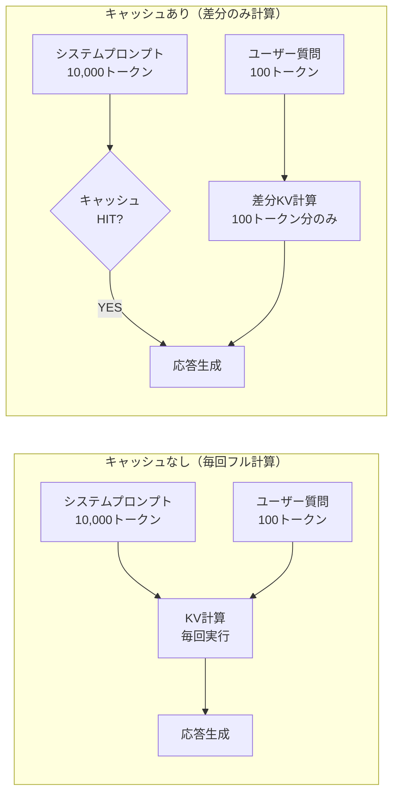

## はじめに：LLMコストの「隠れた最適化ポイント」

RAGシステムを本番で運用していると、ある法則に気づきます。

> **「リクエストのたびに、ほぼ同じシステムプロンプトとドキュメントを何度も何度も送っている」**

100文字のユーザー質問に対して、10,000トークンのシステムプロンプト＋コンテキストを毎回送信——これは膨大な無駄です。2026年現在、Anthropic・OpenAI・Googleの主要プロバイダはいずれも**プロンプトキャッシング**機能を提供しており、うまく活用すれば**入力トークンコストを最大90%削減、レイテンシを最大80%短縮**できます。

ところが、実装時の細かいコツを知らないと期待通りにキャッシュがヒットせず、「なんか効いていない…」という状態になりがちです。

この記事では、プロンプトキャッシングの仕組みを正確に理解した上で、各プロバイダの実装方法、キャッシュヒット率を最大化する設計パターン、そしてコスト計算の実例まで体系的に解説します。

### この記事で学べること

- プロンプトキャッシングの仕組みと各プロバイダの比較
- Anthropic / OpenAI / Gemini での具体的な実装方法
- キャッシュヒット率を最大化するプロンプト設計の原則
- RAG・エージェントシステムへの組み込みパターン
- コスト・レイテンシの計測とモニタリング手法

## プロンプトキャッシングとは何か

### KVキャッシュの仕組み

LLMがトークンを処理するとき、Transformer内部では各レイヤーで**Key-Value（KV）テンソル**が計算されます。この計算は非常にコストが高く、全処理時間の大半を占めます。



**プロンプトキャッシングは、一度計算したKVテンソルをサーバー側に保存し、同じプレフィックスを含むリクエストで再利用する仕組みです。**

### キャッシュが有効になる条件

各プロバイダ共通の重要な前提があります：

> **キャッシュはプロンプトの「先頭からの連続した一致」でのみ有効になる**

つまり、システムプロンプト→コンテキスト→会話履歴の順で固定部分を先頭に配置し、変動する部分（ユーザーの最新メッセージなど）を末尾に置く設計が必須です。

## 各プロバイダの比較

| プロバイダ | 対応モデル | キャッシュ価格 | 最小キャッシュ長 | TTL |
|-----------|-----------|------------|--------------|-----|
| **Anthropic** | Claude 3.5/3.7 Sonnet, Haiku | 入力の10% | 1,024 tokens | 5分（最終アクセスから延長） |
| **OpenAI** | GPT-4o, GPT-4o-mini, o1/o3 | 入力の50% | 1,024 tokens | 5〜10分（自動） |
| **Google** | Gemini 1.5/2.0 Pro/Flash | 入力の25% | 32,768 tokens | 1時間〜（明示的に設定） |

> **Anthropicが最もキャッシュ価格が安い（通常入力の10%）**が、TTLが短いため頻繁なリクエストが前提。Googleは最小長が大きい代わりにTTLが長く、大規模ドキュメントの分析に向いています。

## Anthropic（Claude）での実装

### 基本的なキャッシュコントロール

AnthropicではAPIリクエストに`cache_control`フィールドを追加することで、キャッシュするプレフィックスの**終端位置**を明示します。

```python
import anthropic

client = anthropic.Anthropic()

# システムプロンプトをキャッシュ
response = client.messages.create(
    model="claude-3-5-sonnet-20241022",
    max_tokens=1024,
    system=[
        {
            "type": "text",
            "text": """あなたは優秀なソフトウェアエンジニアです。
以下のコードベースを理解した上で、ユーザーの質問に答えてください。

## コードベース（10,000行分のコンテキスト）
...（長大なドキュメント）...
""",
            "cache_control": {"type": "ephemeral"}  # ここまでをキャッシュ
        }
    ],
    messages=[
        {"role": "user", "content": "このクラスの責務を説明してください"}
    ]
)

# キャッシュの使用状況を確認
usage = response.usage
print(f"入力トークン: {usage.input_tokens}")
print(f"キャッシュ作成: {usage.cache_creation_input_tokens}")  # 初回のみ課金
print(f"キャッシュ読み込み: {usage.cache_read_input_tokens}")   # 10%の価格
```

### 複数キャッシュポイントの活用

最大4箇所のキャッシュポイントを設定できます。RAGシステムでは「固定コンテキスト」と「動的コンテキスト」を分けて管理するのが効果的です。

```python
def create_cached_messages(
    system_instructions: str,    # 固定：AIの役割定義
    knowledge_base: str,         # 半固定：RAGで取得した長文書
    conversation_history: list,  # 変動：過去の会話
    user_message: str            # 変動：最新の質問
) -> dict:
    return {
        "system": [
            {
                "type": "text",
                "text": system_instructions,
                "cache_control": {"type": "ephemeral"}  # キャッシュポイント1
            },
            {
                "type": "text",
                "text": knowledge_base,
                "cache_control": {"type": "ephemeral"}  # キャッシュポイント2
            }
        ],
        "messages": [
            *conversation_history,  # 過去の会話（キャッシュポイント3として末尾に設定可）
            {"role": "user", "content": user_message}
        ]
    }
```

### 会話履歴のキャッシュ（マルチターン最適化）

長い会話の中で履歴をキャッシュするには、最後の`user`メッセージの**直前の位置**にキャッシュポイントを置きます。

```python
def build_conversation_with_cache(messages: list[dict]) -> list[dict]:
    """会話履歴の末尾から2番目にキャッシュポイントを設定"""
    if len(messages) < 2:
        return messages
    
    cached_messages = []
    for i, msg in enumerate(messages):
        if i == len(messages) - 2:  # 最後のuserメッセージの直前
            # このメッセージの内容をキャッシュ対象にする
            content = msg["content"]
            if isinstance(content, str):
                content = [{"type": "text", "text": content, 
                           "cache_control": {"type": "ephemeral"}}]
            cached_messages.append({**msg, "content": content})
        else:
            cached_messages.append(msg)
    
    return cached_messages
```

## OpenAI での実装

### 自動キャッシュ（設定不要）

OpenAIのキャッシュは**自動的に適用**されます。開発者が明示的に設定する必要はなく、同じプレフィックスを含むリクエストが自動でキャッシュヒットします。

```python
from openai import OpenAI

client = OpenAI()

# 特別な設定不要 - 自動的にキャッシュが適用される
response = client.chat.completions.create(
    model="gpt-4o",
    messages=[
        {
            "role": "system",
            "content": """# 製品仕様書（v2.3）
            
## 概要
（長大なシステムプロンプト：最初の1024トークン以上が同じであれば自動キャッシュ）

..."""
        },
        {
            "role": "user",
            "content": "第3章の要件について教えてください"
        }
    ]
)

# キャッシュ使用状況の確認
usage = response.usage
print(f"プロンプトトークン: {usage.prompt_tokens}")
print(f"キャッシュヒット: {usage.prompt_tokens_details.cached_tokens}")
print(f"実費計算トークン: {usage.prompt_tokens - usage.prompt_tokens_details.cached_tokens}")
```

### キャッシュヒット率を上げるコツ（OpenAI）

OpenAIはTTLが5〜10分と短いため、**リクエスト間隔を空けすぎない**ことが重要です。

```python
import time
from openai import OpenAI

client = OpenAI()

SYSTEM_PROMPT = """（10,000トークンの固定システムプロンプト）..."""

def chat_with_cache_warmup(questions: list[str]):
    """バッチ処理でキャッシュを温める"""
    results = []
    
    for i, question in enumerate(questions):
        response = client.chat.completions.create(
            model="gpt-4o",
            messages=[
                {"role": "system", "content": SYSTEM_PROMPT},
                {"role": "user", "content": question}
            ]
        )
        
        cached = response.usage.prompt_tokens_details.cached_tokens
        total = response.usage.prompt_tokens
        hit_rate = cached / total * 100 if total > 0 else 0
        
        print(f"Q{i+1}: キャッシュヒット率 {hit_rate:.1f}% ({cached}/{total}トークン)")
        results.append(response)
        
        # OpenAIのキャッシュTTLは5〜10分 - あまり間を空けない
        time.sleep(0.1)
    
    return results
```

## Google Gemini での実装（Context Caching）

### 明示的なキャッシュ作成

GeminiはAnthropicやOpenAIと異なり、**キャッシュを明示的なAPIリソースとして管理**します。作成・使用・削除が独立しており、TTLも柔軟に設定できます。

```python
import google.generativeai as genai
from google.generativeai import caching
import datetime

genai.configure(api_key="YOUR_API_KEY")

# 長大なドキュメントをキャッシュとして作成
cache = caching.CachedContent.create(
    model="models/gemini-1.5-pro-002",
    display_name="製品仕様書キャッシュ",
    system_instruction="""あなたは製品仕様に詳しいエキスパートです。
以下のドキュメントを参照して、質問に答えてください。""",
    contents=[
        {
            "role": "user",
            "parts": [
                {"text": "（32,768トークン以上の長大なドキュメント）\n\n..."}
            ]
        }
    ],
    ttl=datetime.timedelta(hours=2),  # 有効期間を設定
)

print(f"キャッシュ作成: {cache.name}")
print(f"有効期限: {cache.expire_time}")

# キャッシュを使用してモデルを初期化
model = genai.GenerativeModel.from_cached_content(cached_content=cache)

# 複数の質問に同じキャッシュを使用
questions = [
    "第2章の要件を要約してください",
    "セキュリティ要件はどこに記載されていますか？",
    "パフォーマンス目標を教えてください",
]

for question in questions:
    response = model.generate_content(question)
    print(f"\nQ: {question}")
    print(f"A: {response.text[:200]}...")
    print(f"キャッシュ使用トークン: {response.usage_metadata.cached_content_token_count}")
```

### キャッシュの動的更新

```python
# TTL を延長する
cache.update(ttl=datetime.timedelta(hours=4))

# キャッシュの一覧を確認
for cached_content in caching.CachedContent.list():
    print(f"- {cached_content.display_name}: {cached_content.expire_time}")

# 不要になったキャッシュを削除（コスト削減）
cache.delete()
```

## キャッシュヒット率を最大化する設計パターン

### 原則1：固定部分を先頭に、変動部分を末尾に

```python
# ❌ 悪い例：変動部分が先頭にある
bad_prompt = f"""
ユーザー名: {user_name}  # ← 毎回変わる！キャッシュが無効に
現在時刻: {current_time}  # ← 毎回変わる！

（長大な固定コンテキスト...）
"""

# ✅ 良い例：固定部分を先頭に、変動部分を末尾に
good_system = """
（長大な固定コンテキスト...）
以下の情報はユーザーメッセージに含まれます。
"""  # キャッシュ可能

good_user = f"""
ユーザー名: {user_name}
現在時刻: {current_time}

質問: {user_question}
"""  # 変動部分はuserメッセージへ
```

### 原則2：タイムスタンプ・乱数・ユーザー固有情報をシステムプロンプトに含めない

```python
from datetime import datetime

# ❌ 悪い例
system_prompt = f"現在は{datetime.now().strftime('%Y-%m-%d %H:%M')}です。"

# ✅ 良い例：動的情報はユーザーメッセージへ
system_prompt = "必要な場合、ユーザーが現在の日時を提供します。"
user_message = f"現在時刻は{datetime.now().strftime('%Y-%m-%d %H:%M')}です。{question}"
```

### 原則3：RAGの検索結果をキャッシュ可能な構造で渡す

RAGシステムでキャッシュを活用する最も効果的なパターンは、「よく参照されるドキュメント」を事前にキャッシュしておく手法です。

```python
from collections import Counter
import anthropic

class CachedRAGSystem:
    def __init__(self):
        self.client = anthropic.Anthropic()
        self.document_cache = {}  # ドキュメントIDとキャッシュ済みフラグ
        self.access_counter = Counter()
    
    def get_top_documents(self, doc_ids: list[str], top_n: int = 5) -> list[str]:
        """アクセス頻度の高いドキュメントを優先的にキャッシュ対象に"""
        for doc_id in doc_ids:
            self.access_counter[doc_id] += 1
        return [doc_id for doc_id, _ in self.access_counter.most_common(top_n)]
    
    def build_prompt_with_cache(
        self, 
        retrieved_docs: list[dict],
        user_query: str,
        system_instructions: str
    ) -> dict:
        """頻出ドキュメントをキャッシュポイントの前に配置"""
        top_doc_ids = self.get_top_documents([d["id"] for d in retrieved_docs])
        
        # 頻出ドキュメントを先頭に、低頻度を末尾に
        sorted_docs = sorted(
            retrieved_docs,
            key=lambda d: d["id"] in top_doc_ids,
            reverse=True
        )
        
        # 頻出ドキュメントの境界にキャッシュポイントを設置
        top_docs_text = "\n\n".join(
            f"# ドキュメント: {d['title']}\n{d['content']}"
            for d in sorted_docs if d["id"] in top_doc_ids
        )
        
        tail_docs_text = "\n\n".join(
            f"# ドキュメント: {d['title']}\n{d['content']}"
            for d in sorted_docs if d["id"] not in top_doc_ids
        )
        
        system = [
            {"type": "text", "text": system_instructions,
             "cache_control": {"type": "ephemeral"}},  # 固定指示をキャッシュ
            {"type": "text", "text": f"## 参考ドキュメント（頻出）\n{top_docs_text}",
             "cache_control": {"type": "ephemeral"}},  # 頻出ドキュメントをキャッシュ
        ]
        
        if tail_docs_text:
            system.append(
                {"type": "text", "text": f"## 参考ドキュメント（追加）\n{tail_docs_text}"}
                # 低頻度はキャッシュしない
            )
        
        return {
            "system": system,
            "messages": [{"role": "user", "content": user_query}]
        }
```

### 原則4：エージェントのツール定義をキャッシュする

ツールをたくさん定義するエージェントでは、ツール定義部分もキャッシュ対象になります。

```python
# Anthropic: ツール定義もキャッシュに含まれる（システムプロンプトの一部として扱われる）
# ツール定義は変更頻度が低いため、キャッシュ効果が高い

tools = [
    {
        "name": "search_database",
        "description": "データベースを検索します（詳細な説明...）",
        "input_schema": { ... }
    },
    # 多数のツール定義...
]

# システムプロンプトとツール定義を合わせてキャッシュ対象に
response = client.messages.create(
    model="claude-3-5-sonnet-20241022",
    max_tokens=4096,
    system=[
        {
            "type": "text",
            "text": "（エージェントの詳細な指示）",
            "cache_control": {"type": "ephemeral"}
        }
    ],
    tools=tools,
    messages=messages
)
```

## コスト計算の実例

実際にどれだけ節約できるか、具体的な数値で確認しましょう。

### シナリオ：ドキュメントQAシステム（1日1,000リクエスト）

| 項目 | 数値 |
|------|------|
| システムプロンプト | 8,000トークン |
| RAGコンテキスト | 4,000トークン（平均） |
| ユーザー質問 | 100トークン（平均） |
| 合計入力 | 12,100トークン |

**Claude 3.5 Sonnet での計算**（$3.00/1Mトークン）：

```
■ キャッシュなしの場合（1日1,000リクエスト）
  12,100トークン × 1,000回 = 12,100,000トークン
  コスト = 12.1M × $3.00 / 1M = $36.30/日

■ キャッシュあり（ヒット率90%と仮定）の場合
  - キャッシュ書き込み（初回）: 12,000トークン × $3.75/1M = $0.045（初回のみ）
  - キャッシュ読み込み: 12,000 × 999回 × $0.30/1M = $3.597/日
  - 非キャッシュ部分（質問100トークン）: 100 × 1,000回 × $3.00/1M = $0.30/日
  合計 = $3.942/日

■ 節約額: $36.30 - $3.942 = $32.36/日 = 約$971/月（89%削減）
```

### コスト計算ユーティリティ

```python
from dataclasses import dataclass

@dataclass
class CacheEconomics:
    """プロンプトキャッシングのコスト計算"""
    
    # トークン数
    system_tokens: int
    context_tokens: int
    user_tokens: int
    
    # リクエスト数
    daily_requests: int
    
    # 価格（$/1Mトークン）
    input_price: float = 3.00        # Claude 3.5 Sonnet
    cache_write_price: float = 3.75  # キャッシュ書き込み
    cache_read_price: float = 0.30   # キャッシュ読み込み（10%）
    
    def calculate(self, cache_hit_rate: float = 0.9) -> dict:
        total_input = self.system_tokens + self.context_tokens + self.user_tokens
        cacheable = self.system_tokens + self.context_tokens
        
        # キャッシュなし
        no_cache_cost = (total_input * self.daily_requests * self.input_price) / 1_000_000
        
        # キャッシュあり
        cache_hits = int(self.daily_requests * cache_hit_rate)
        cache_misses = self.daily_requests - cache_hits
        
        cache_write_cost = (cacheable * self.cache_write_price) / 1_000_000
        cache_read_cost = (cacheable * cache_hits * self.cache_read_price) / 1_000_000
        non_cached_cost = (
            (self.user_tokens * self.daily_requests + cacheable * cache_misses)
            * self.input_price
        ) / 1_000_000
        
        total_with_cache = cache_write_cost + cache_read_cost + non_cached_cost
        savings_pct = (1 - total_with_cache / no_cache_cost) * 100
        
        return {
            "no_cache_daily": round(no_cache_cost, 2),
            "with_cache_daily": round(total_with_cache, 2),
            "savings_daily": round(no_cache_cost - total_with_cache, 2),
            "savings_percent": round(savings_pct, 1),
            "monthly_savings": round((no_cache_cost - total_with_cache) * 30, 0)
        }

# 使用例
economics = CacheEconomics(
    system_tokens=8000,
    context_tokens=4000,
    user_tokens=100,
    daily_requests=1000
)
result = economics.calculate(cache_hit_rate=0.9)
print(f"削減率: {result['savings_percent']}%")
print(f"月間節約額: ${result['monthly_savings']:,.0f}")
```

## キャッシュ効果のモニタリング

本番環境では、キャッシュのヒット率と効果を継続的に計測することが重要です。

```python
import time
from dataclasses import dataclass, field
from collections import deque

@dataclass
class CacheMetrics:
    """キャッシュメトリクスの収集"""
    window_size: int = 1000  # 直近N件を集計
    
    total_requests: int = 0
    total_input_tokens: int = 0
    total_cache_read_tokens: int = 0
    total_cache_write_tokens: int = 0
    latencies: deque = field(default_factory=lambda: deque(maxlen=1000))
    
    def record(self, usage, latency_ms: float):
        self.total_requests += 1
        self.total_input_tokens += usage.input_tokens
        self.total_cache_read_tokens += getattr(usage, 'cache_read_input_tokens', 0)
        self.total_cache_write_tokens += getattr(usage, 'cache_creation_input_tokens', 0)
        self.latencies.append(latency_ms)
    
    def report(self) -> dict:
        if self.total_input_tokens == 0:
            return {}
        
        cache_hit_rate = self.total_cache_read_tokens / self.total_input_tokens
        avg_latency = sum(self.latencies) / len(self.latencies) if self.latencies else 0
        
        return {
            "requests": self.total_requests,
            "cache_hit_rate": f"{cache_hit_rate:.1%}",
            "tokens_saved": self.total_cache_read_tokens,
            "avg_latency_ms": round(avg_latency, 1),
        }

metrics = CacheMetrics()

def tracked_api_call(client, **kwargs):
    start = time.time()
    response = client.messages.create(**kwargs)
    elapsed = (time.time() - start) * 1000
    
    metrics.record(response.usage, elapsed)
    return response
```

## よくある落とし穴と対処法

### 落とし穴1：TTL切れを考慮していない

```python
# ❌ 問題：バッチ処理でTTLを超えてしまう
def process_batch_naive(items):
    for item in items:
        time.sleep(300)  # 5分待機 → TTLが切れる！
        call_api(item)

# ✅ 対策：TTL内に完了させるか、定期的にウォームアップリクエストを送る
def process_batch_with_warmup(items, ttl_seconds=270):
    last_warmup = time.time()
    
    for item in items:
        if time.time() - last_warmup > ttl_seconds:
            # キャッシュをウォームアップ（軽量なダミーリクエスト）
            send_warmup_request()
            last_warmup = time.time()
        
        call_api(item)
```

### 落とし穴2：最小トークン数を満たしていない

```python
# ❌ 問題：1,024トークン未満だとキャッシュされない
short_system = "あなたはアシスタントです。"  # 短すぎる → キャッシュ不可

# ✅ 対策：詳細な指示・Few-shotサンプルを追加してキャッシュ閾値を超える
detailed_system = """
あなたは経験豊富なソフトウェアエンジニアです。
（詳細な役割定義、行動原則、Few-shotサンプル、
 ドメイン知識などを追加して1,024トークン以上にする）
...
"""
```

### 落とし穴3：キャッシュポイントの位置が間違っている

```python
# ❌ 問題：変動コンテンツの後にキャッシュポイントを置いてしまう
messages = [
    {"role": "user", "content": [
        {"type": "text", "text": f"最新ニュース: {dynamic_news}"},  # 変動！
        {"type": "text", "text": static_knowledge,
         "cache_control": {"type": "ephemeral"}}  # 変動コンテンツの後ではヒットしない
    ]}
]

# ✅ 対策：固定コンテンツをキャッシュポイントより前に置く
messages = [
    {"role": "user", "content": [
        {"type": "text", "text": static_knowledge,
         "cache_control": {"type": "ephemeral"}},  # 固定を先頭に
        {"type": "text", "text": f"最新ニュース: {dynamic_news}"}   # 変動を末尾に
    ]}
]
```

## まとめ：プロンプトキャッシングを導入すべき場面

| ユースケース | キャッシュ効果 | 推奨プロバイダ |
|------------|-------------|-------------|
| RAGシステム（固定知識ベース） | ★★★★★ | Anthropic / Google |
| エージェント（多数のツール定義） | ★★★★☆ | Anthropic |
| マルチターン会話 | ★★★★☆ | Anthropic / OpenAI |
| コードベース分析 | ★★★★★ | Google（長文書） |
| バッチ文書処理 | ★★★☆☆ | Anthropic（TTL注意） |
| リアルタイムAPI（低TPS） | ★★☆☆☆ | TTL切れリスクあり |

### 今すぐできる改善チェックリスト

- [ ] システムプロンプトに動的コンテンツ（時刻・ユーザー名など）が混入していないか確認
- [ ] 固定部分が先頭、変動部分が末尾になっているか確認
- [ ] キャッシュ対象のトークン数が1,024以上（Geminiは32,768以上）か確認
- [ ] `cache_read_input_tokens` / `cached_tokens` をログに記録しヒット率を監視
- [ ] TTLを考慮したリクエスト間隔の設計ができているか確認

プロンプトキャッシングは、**コードの変更なしにAPIコストを劇的に削減できる数少ない最適化**の一つです。既存のLLMアプリケーションに組み込むだけで、月数万円〜数十万円の節約が期待できます。まずは手元のシステムプロンプトのトークン数を確認することから始めてみてください。

## 参考リソース

- [Anthropic Prompt Caching ドキュメント](https://docs.anthropic.com/en/docs/build-with-claude/prompt-caching)
- [OpenAI Prompt Caching ガイド](https://platform.openai.com/docs/guides/prompt-caching)
- [Google Gemini Context Caching](https://ai.google.dev/gemini-api/docs/caching)
- [LLMコスト最適化ガイド2026](/llm/2026/03/27/llm-cost-optimization-guide.html)
- [RAG実装ガイド](/llm/2025/02/19/rag-implementation-guide.html)
