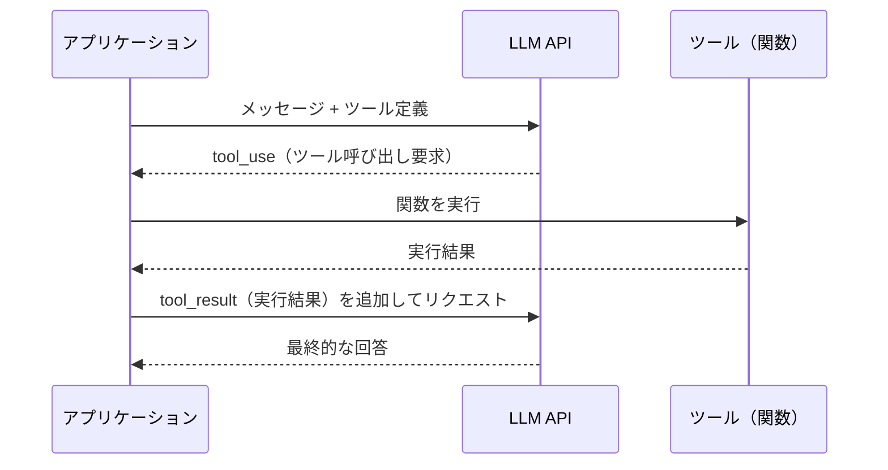

## はじめに：Tool Callingはエージェントの「手」である

LLMは単体では「考える」ことしかできません。外部APIを叩く、データベースを検索する、コードを実行する——こうした「行動」を可能にするのが **Tool Calling（Function Calling）** です。

2025年以降、主要なLLMプロバイダーはすべてTool Callingをネイティブサポートしており、AIエージェント開発においては避けられない基礎技術になっています。しかし、「動くだけの実装」と「本番で信頼できる実装」の間には大きな差があります。

この記事では、Tool Callingの仕組みを深く理解した上で：

- スキーマ設計のベストプラクティス
- 並列ツール呼び出しの活用
- エラーハンドリングとリトライ戦略
- ストリーミングとの組み合わせ
- セキュリティ上の注意点

を、実際に動作するコード例とともに解説します。

---

## Tool Callingの仕組み：LLMの視点から理解する

Tool Callingがどう動くかを「LLMの視点」で理解することが、良い実装への第一歩です。



LLMは実際にツールを「実行」するわけではありません。LLMが行うのは：

1. 「どのツールを、どの引数で呼ぶべきか」を判断してJSON形式で出力する
2. ツールの実行結果を受け取り、最終的な応答を生成する

つまり **ツールの実行はすべてアプリケーション側の責任** です。このことを理解していないと、セキュリティホールや無限ループが生まれます。

### 各プロバイダーのAPI比較

| プロバイダー | 機能名 | 並列呼び出し | ストリーミング |
|---|---|---|---|
| OpenAI (GPT-4o) | Function Calling | ✅ | ✅ |
| Anthropic (Claude 3.7+) | Tool Use | ✅ | ✅ |
| Google (Gemini 2.0+) | Function Calling | ✅ | ✅ |
| Mistral (Mistral Large) | Function Calling | ✅ | ✅ |

---

## スキーマ設計：LLMが迷わないツール定義を書く

Tool Callingで最も重要なのが **ツールのJSONスキーマ設計** です。スキーマの品質が、LLMの判断精度に直結します。

### ❌ 悪い例：曖昧な定義

```python
tools = [
    {
        "name": "search",
        "description": "検索する",
        "input_schema": {
            "type": "object",
            "properties": {
                "q": {"type": "string"}
            }
        }
    }
]
```

この定義の問題点：
- `description`が短すぎてLLMがいつ使うか判断できない
- パラメータ名`q`が不明確
- 必須フィールドが未指定

### ✅ 良い例：詳細で明確な定義

```python
tools = [
    {
        "name": "search_web",
        "description": (
            "最新のウェブ情報を検索します。"
            "LLMの学習データには含まれない最新情報（ニュース、製品情報、価格など）が必要な場合に使用してください。"
            "一般的な知識の質問には使用しないでください。"
        ),
        "input_schema": {
            "type": "object",
            "properties": {
                "query": {
                    "type": "string",
                    "description": "検索クエリ。具体的なキーワードを含む自然言語のクエリを指定してください。例: 'Claude 3.7 Sonnet リリース日'"
                },
                "num_results": {
                    "type": "integer",
                    "description": "取得する検索結果の件数（1〜10）。デフォルトは5。",
                    "minimum": 1,
                    "maximum": 10,
                    "default": 5
                },
                "language": {
                    "type": "string",
                    "description": "検索言語コード（例: 'ja'=日本語, 'en'=英語）。デフォルトは'ja'。",
                    "enum": ["ja", "en", "zh", "ko"],
                    "default": "ja"
                }
            },
            "required": ["query"]
        }
    }
]
```

### スキーマ設計の7つの原則

1. **descriptionは「いつ使うか」を明示する** — LLMはdescriptionを読んでツールを選択します
2. **否定的な使用例も書く** — 「～には使わないでください」が精度向上に効く
3. **パラメータ名は省略せず英語で** — `q`より`query`、`n`より`num_results`
4. **enumで選択肢を制限する** — 自由記述より列挙の方がLLMが迷わない
5. **requiredを必ず設定する** — 必須フィールドを明示しないとLLMが省略する
6. **defaultを設定する** — 省略可能なパラメータのデフォルト値を示す
7. **例示を含める** — `examples`や`description`に具体例を入れると精度が上がる

---

## 並列ツール呼び出し：速度を大幅に改善する

複数のツールが必要な場合、多くの開発者は「1回ずつ順番に呼び出す」実装をしています。しかし、依存関係のないツールは **並列で呼び出す** ことで大幅に高速化できます。

### 並列呼び出しの仕組み

```mermaid
graph LR
    subgraph 直列実行（遅い）
        A1[天気取得\n1秒] --> B1[株価取得\n1秒] --> C1[ニュース取得\n1秒]
        C1 --> D1[回答生成]
    end
    subgraph 並列実行（速い）
        A2[天気取得\n1秒]
        B2[株価取得\n1秒]
        C2[ニュース取得\n1秒]
        A2 & B2 & C2 --> D2[回答生成]
    end
```

合計時間: 直列3秒 → 並列1秒（3倍高速化）

### OpenAI APIでの並列ツール呼び出し実装

```python
import asyncio
import json
from openai import AsyncOpenAI

client = AsyncOpenAI()

# ツール定義
tools = [
    {
        "type": "function",
        "function": {
            "name": "get_weather",
            "description": "指定した都市の現在の天気を取得します",
            "parameters": {
                "type": "object",
                "properties": {
                    "city": {"type": "string", "description": "都市名（例: 東京）"}
                },
                "required": ["city"]
            }
        }
    },
    {
        "type": "function",
        "function": {
            "name": "get_stock_price",
            "description": "指定した銘柄の現在の株価を取得します",
            "parameters": {
                "type": "object",
                "properties": {
                    "ticker": {"type": "string", "description": "証券コード（例: 7203）"}
                },
                "required": ["ticker"]
            }
        }
    }
]

# ツール実装（実際にはAPI呼び出し等）
async def execute_tool(tool_name: str, tool_args: dict) -> str:
    if tool_name == "get_weather":
        await asyncio.sleep(0.5)  # API呼び出しをシミュレート
        return json.dumps({"city": tool_args["city"], "temp": 22, "condition": "晴れ"})
    elif tool_name == "get_stock_price":
        await asyncio.sleep(0.5)
        return json.dumps({"ticker": tool_args["ticker"], "price": 3250, "change": "+1.2%"})
    return json.dumps({"error": "Unknown tool"})

async def run_agent(user_message: str):
    messages = [{"role": "user", "content": user_message}]

    while True:
        response = await client.chat.completions.create(
            model="gpt-4o",
            messages=messages,
            tools=tools,
            tool_choice="auto"
        )

        message = response.choices[0].message
        messages.append(message.model_dump())

        # ツール呼び出しがなければ終了
        if not message.tool_calls:
            return message.content

        # 並列でツールを実行（ここがポイント）
        tool_tasks = []
        for tool_call in message.tool_calls:
            args = json.loads(tool_call.function.arguments)
            tool_tasks.append(execute_tool(tool_call.function.name, args))

        results = await asyncio.gather(*tool_tasks)

        # 結果をメッセージに追加
        for tool_call, result in zip(message.tool_calls, results):
            messages.append({
                "role": "tool",
                "tool_call_id": tool_call.id,
                "content": result
            })

# 実行
result = asyncio.run(run_agent("東京の天気とトヨタ（7203）の株価を教えて"))
print(result)
```

### Anthropic APIでの並列ツール呼び出し

```python
import anthropic
import asyncio
import json

client = anthropic.Anthropic()

async def run_claude_agent(user_message: str):
    messages = [{"role": "user", "content": user_message}]

    tools = [
        {
            "name": "get_weather",
            "description": "指定した都市の現在の天気を取得します",
            "input_schema": {
                "type": "object",
                "properties": {
                    "city": {"type": "string"}
                },
                "required": ["city"]
            }
        }
        # ... 他のツール定義
    ]

    while True:
        response = client.messages.create(
            model="claude-3-7-sonnet-20250219",
            max_tokens=4096,
            tools=tools,
            messages=messages
        )

        messages.append({"role": "assistant", "content": response.content})

        if response.stop_reason != "tool_use":
            # テキストブロックを返す
            return next(
                (block.text for block in response.content if hasattr(block, "text")),
                ""
            )

        # ツールブロックを抽出して並列実行
        tool_use_blocks = [b for b in response.content if b.type == "tool_use"]
        tasks = [execute_tool(b.name, b.input) for b in tool_use_blocks]
        results = await asyncio.gather(*tasks)

        # tool_resultをまとめてメッセージに追加
        tool_results = [
            {
                "type": "tool_result",
                "tool_use_id": block.id,
                "content": result
            }
            for block, result in zip(tool_use_blocks, results)
        ]
        messages.append({"role": "user", "content": tool_results})
```

---

## エラーハンドリング：本番で壊れないエージェントを作る

ツール実行は必ず失敗することがあります。ネットワークエラー、レート制限、不正な引数——これらをLLMに適切に伝え、自律的に対処させることが重要です。

### エラーを伝えるパターン

```python
async def execute_tool_safe(tool_name: str, args: dict) -> tuple[str, bool]:
    """
    Returns: (result_json, is_error)
    """
    try:
        result = await execute_tool(tool_name, args)
        return result, False

    except ValueError as e:
        # 引数が不正 → LLMに引数を修正させる
        return json.dumps({
            "error": "invalid_arguments",
            "message": str(e),
            "suggestion": "引数を確認して再度お試しください"
        }), True

    except RateLimitError:
        # レート制限 → 少し待って再試行を促す
        return json.dumps({
            "error": "rate_limit",
            "message": "APIレート制限に達しました。しばらく後に再試行してください。",
            "retry_after_seconds": 30
        }), True

    except TimeoutError:
        return json.dumps({
            "error": "timeout",
            "message": "ツールの実行がタイムアウトしました。処理が重い可能性があります。"
        }), True

    except Exception as e:
        # 予期しないエラー → エラー情報をLLMに渡す
        return json.dumps({
            "error": "unexpected_error",
            "message": f"予期しないエラーが発生しました: {type(e).__name__}"
        }), True
```

### リトライ戦略：指数バックオフ付き

```python
import asyncio
from tenacity import retry, stop_after_attempt, wait_exponential

@retry(
    stop=stop_after_attempt(3),
    wait=wait_exponential(multiplier=1, min=1, max=10)
)
async def execute_tool_with_retry(tool_name: str, args: dict) -> str:
    return await execute_tool(tool_name, args)
```

### エージェントループのガードレール

```python
MAX_ITERATIONS = 10  # 無限ループ防止

async def run_agent_safe(user_message: str):
    messages = [{"role": "user", "content": user_message}]
    iteration = 0

    while iteration < MAX_ITERATIONS:
        iteration += 1

        response = await client.chat.completions.create(
            model="gpt-4o",
            messages=messages,
            tools=tools,
        )

        message = response.choices[0].message
        messages.append(message.model_dump())

        if not message.tool_calls:
            return message.content

        # ツールを実行
        for tool_call in message.tool_calls:
            result, is_error = await execute_tool_safe(
                tool_call.function.name,
                json.loads(tool_call.function.arguments)
            )
            messages.append({
                "role": "tool",
                "tool_call_id": tool_call.id,
                "content": result
            })

    # 最大反復数に達した場合
    return "申し訳ありません。処理が複雑すぎるため完了できませんでした。"
```

---

## ツール選択の制御：`tool_choice`を使いこなす

LLMのツール選択動作を制御する`tool_choice`パラメータは、見落とされがちですが重要です。

```python
# 1. auto（デフォルト）: LLMが判断
response = client.chat.completions.create(
    model="gpt-4o",
    messages=messages,
    tools=tools,
    tool_choice="auto"
)

# 2. required: 必ずツールを呼び出す（テキスト回答を禁止）
response = client.chat.completions.create(
    model="gpt-4o",
    messages=messages,
    tools=tools,
    tool_choice="required"  # structured outputの代替としても使える
)

# 3. 特定のツールを強制
response = client.chat.completions.create(
    model="gpt-4o",
    messages=messages,
    tools=tools,
    tool_choice={"type": "function", "function": {"name": "get_weather"}}
)

# 4. none: ツールを使用しない
response = client.chat.completions.create(
    model="gpt-4o",
    messages=messages,
    tools=tools,
    tool_choice="none"
)
```

### ユースケース別のtool_choice戦略

| ユースケース | 推奨設定 | 理由 |
|---|---|---|
| 汎用チャットボット | `auto` | LLMが最適判断 |
| データ抽出パイプライン | `required` | 必ずJSONで出力させたい |
| ワークフローの特定ステップ | 特定ツール名を指定 | 処理を確実に実行 |
| 会話の締めくくり | `none` | ツール不要な最終回答 |

---

## ストリーミング対応：ユーザー体験を改善する

Tool Callingをストリーミングと組み合わせると、ユーザーが「待たされている感」を大幅に軽減できます。

```python
import json
from openai import AsyncOpenAI

client = AsyncOpenAI()

async def run_streaming_agent(user_message: str):
    messages = [{"role": "user", "content": user_message}]

    while True:
        tool_calls_buffer = {}
        content_buffer = ""

        # ストリーミングでレスポンスを受信
        async with client.chat.completions.stream(
            model="gpt-4o",
            messages=messages,
            tools=tools,
        ) as stream:
            async for chunk in stream:
                delta = chunk.choices[0].delta if chunk.choices else None
                if not delta:
                    continue

                # テキストチャンクを即座に表示
                if delta.content:
                    print(delta.content, end="", flush=True)
                    content_buffer += delta.content

                # ツール呼び出しチャンクを蓄積
                if delta.tool_calls:
                    for tc in delta.tool_calls:
                        idx = tc.index
                        if idx not in tool_calls_buffer:
                            tool_calls_buffer[idx] = {
                                "id": tc.id or "",
                                "name": tc.function.name or "",
                                "arguments": ""
                            }
                        if tc.id:
                            tool_calls_buffer[idx]["id"] = tc.id
                        if tc.function.name:
                            tool_calls_buffer[idx]["name"] = tc.function.name
                        if tc.function.arguments:
                            tool_calls_buffer[idx]["arguments"] += tc.function.arguments

        # ツール呼び出しがなければ終了
        if not tool_calls_buffer:
            print()  # 改行
            return content_buffer

        # ツール呼び出しを並列実行
        tool_calls = list(tool_calls_buffer.values())
        tasks = [
            execute_tool(tc["name"], json.loads(tc["arguments"]))
            for tc in tool_calls
        ]
        results = await asyncio.gather(*tasks)

        # メッセージに追加
        messages.append({
            "role": "assistant",
            "content": content_buffer or None,
            "tool_calls": [
                {
                    "id": tc["id"],
                    "type": "function",
                    "function": {"name": tc["name"], "arguments": tc["arguments"]}
                }
                for tc in tool_calls
            ]
        })
        for tc, result in zip(tool_calls, results):
            messages.append({
                "role": "tool",
                "tool_call_id": tc["id"],
                "content": result
            })

        print("\n[ツール実行完了、回答を生成中...]\n")
```

---

## セキュリティ：ツール実行の落とし穴

### 1. プロンプトインジェクション対策

外部から取得したデータ（ウェブ検索結果、ユーザー入力など）をツールの結果としてLLMに渡す場合、悪意のある指示が含まれている可能性があります。

```python
import re

def sanitize_tool_result(result: str) -> str:
    """ツール結果からプロンプトインジェクションを除去"""
    # システム指示に見える文字列を無害化
    dangerous_patterns = [
        r"ignore previous instructions",
        r"disregard.*system",
        r"you are now",
        r"new persona",
    ]
    for pattern in dangerous_patterns:
        result = re.sub(pattern, "[FILTERED]", result, flags=re.IGNORECASE)
    return result
```

### 2. ツールの実行権限制限

```python
from enum import Enum
from functools import wraps

class PermissionLevel(Enum):
    READ_ONLY = 1
    READ_WRITE = 2
    ADMIN = 3

# ツールに権限レベルを設定
TOOL_PERMISSIONS = {
    "search_web": PermissionLevel.READ_ONLY,
    "read_file": PermissionLevel.READ_ONLY,
    "write_file": PermissionLevel.READ_WRITE,
    "delete_file": PermissionLevel.ADMIN,
    "execute_command": PermissionLevel.ADMIN,
}

def require_permission(required_level: PermissionLevel):
    def decorator(func):
        @wraps(func)
        async def wrapper(*args, **kwargs):
            current_permission = get_current_permission()  # セッションから取得
            if current_permission.value < required_level.value:
                raise PermissionError(
                    f"このツールには{required_level.name}権限が必要です"
                )
            return await func(*args, **kwargs)
        return wrapper
    return decorator

@require_permission(PermissionLevel.ADMIN)
async def delete_file(path: str) -> str:
    # 実装
    ...
```

### 3. 危険なツールの確認フロー

```python
DANGEROUS_TOOLS = {"delete_file", "execute_command", "send_email"}

async def run_agent_with_confirmation(user_message: str):
    messages = [{"role": "user", "content": user_message}]

    while True:
        response = await client.chat.completions.create(
            model="gpt-4o",
            messages=messages,
            tools=tools,
        )
        message = response.choices[0].message

        if not message.tool_calls:
            return message.content

        # 危険なツールが含まれる場合は確認
        dangerous_calls = [
            tc for tc in message.tool_calls
            if tc.function.name in DANGEROUS_TOOLS
        ]

        if dangerous_calls:
            for tc in dangerous_calls:
                args = json.loads(tc.function.arguments)
                confirm = input(
                    f"\n⚠️  危険な操作: {tc.function.name}({args})\n実行しますか？ [y/N]: "
                )
                if confirm.lower() != "y":
                    return "操作がキャンセルされました"

        # 通常のツール実行...
```

---

## 高度なパターン：ツールチェーンの設計

### パターン1：ファサードパターン（粗粒度ツール）

多数のツールはLLMを混乱させます。複数の細かいAPIを1つの「ファサードツール」にまとめることで、LLMの判断精度が上がります。

```python
# 粒度が細かすぎる（LLMが混乱しやすい）
tools_bad = [
    {"name": "search_by_keyword"},
    {"name": "search_by_category"},
    {"name": "search_by_date"},
    {"name": "search_by_author"},
    {"name": "search_advanced"},
]

# ファサードでまとめる
tools_good = [
    {
        "name": "search_articles",
        "description": "記事を検索します。キーワード、カテゴリ、日付、著者などで絞り込めます。",
        "input_schema": {
            "type": "object",
            "properties": {
                "keyword": {"type": "string", "description": "検索キーワード（省略可）"},
                "category": {"type": "string", "description": "カテゴリ（省略可）"},
                "from_date": {"type": "string", "description": "開始日 YYYY-MM-DD（省略可）"},
                "author": {"type": "string", "description": "著者名（省略可）"},
            }
        }
    }
]
```

### パターン2：動的ツール登録

エージェントが実行中にツールセットを変更するパターン。特定のワークフローのステップに応じて利用可能なツールを切り替えます。

```python
class DynamicToolRegistry:
    def __init__(self):
        self.tools: dict[str, dict] = {}
        self.handlers: dict[str, callable] = {}

    def register(self, schema: dict, handler: callable):
        name = schema["name"]
        self.tools[name] = schema
        self.handlers[name] = handler

    def get_tools_for_phase(self, phase: str) -> list[dict]:
        """フェーズに応じて利用可能なツールを返す"""
        phase_tools = {
            "research": ["search_web", "read_document"],
            "analysis": ["calculate", "query_database"],
            "output": ["write_file", "send_report"],
        }
        allowed = phase_tools.get(phase, [])
        return [self.tools[name] for name in allowed if name in self.tools]

    async def execute(self, name: str, args: dict) -> str:
        handler = self.handlers.get(name)
        if not handler:
            return json.dumps({"error": f"Tool '{name}' not found"})
        return await handler(**args)
```

---

## パフォーマンス最適化

### ツール定義のキャッシュ

Anthropicのプロンプトキャッシングを使うと、ツール定義のトークンコストを削減できます。

```python
# Anthropicでのツール定義キャッシュ
response = client.messages.create(
    model="claude-3-7-sonnet-20250219",
    max_tokens=4096,
    tools=tools,
    # ツール定義をキャッシュするためのbeta header
    extra_headers={"anthropic-beta": "prompt-caching-2024-07-31"},
    messages=messages
)
```

ツール定義が大規模な場合（OpenAPIスペック全体を渡すような場合）、プロンプトキャッシングにより **ツール定義のトークンコストを最大90%削減** できます。詳しくは[プロンプトキャッシング完全ガイド](/2026-04-02-prompt-caching-guide)を参照してください。

### ツール数の最適化

実験的には、ツール数が増えるほどLLMの精度が低下する傾向があります：

| ツール数 | ツール選択精度（目安） |
|---|---|
| 1〜5個 | 高い（95%+） |
| 6〜15個 | 中程度（85〜90%） |
| 16個以上 | 低下が顕著（80%以下も） |

大規模なツールセットが必要な場合は、**ツールルーティング**（まず「どのカテゴリのツールを使うか」を判断させ、そのカテゴリのツールだけを渡す）を検討してください。[LLMルーティング完全ガイド](/2026-03-31-llm-routing-guide)も参考になります。

---

## まとめ：信頼性の高いTool Calling実装チェックリスト

### スキーマ設計
- [ ] `description`に「いつ使うか」を明記した
- [ ] パラメータ名が直感的で説明が充実している
- [ ] `required`フィールドを正しく設定した
- [ ] `enum`で選択肢を制限できる箇所に適用した

### 実装
- [ ] 独立したツール呼び出しを並列実行している
- [ ] エラーを適切にハンドリングし、LLMに伝えている
- [ ] 無限ループ防止のため最大反復数を設定している
- [ ] タイムアウト処理を実装している

### セキュリティ
- [ ] ツール実行前に入力をバリデーションしている
- [ ] 危険なツールには確認フローを設けた
- [ ] 外部データのプロンプトインジェクション対策を検討した
- [ ] ツールの権限レベルを設計した

### パフォーマンス
- [ ] ツール数が多い場合は動的絞り込みを検討した
- [ ] プロンプトキャッシングでツール定義コストを削減した
- [ ] ストリーミングでユーザー体験を改善した

---

## 参考リソース

- [OpenAI Function Calling ドキュメント](https://platform.openai.com/docs/guides/function-calling)
- [Anthropic Tool Use ドキュメント](https://docs.anthropic.com/en/docs/build-with-claude/tool-use)
- [Google Gemini Function Calling](https://ai.google.dev/gemini-api/docs/function-calling)
- [LangChain Tools](https://python.langchain.com/docs/concepts/tools/)

---

*この記事は2026年4月時点の情報に基づいています。各APIのインターフェースは変更される場合があります。*
