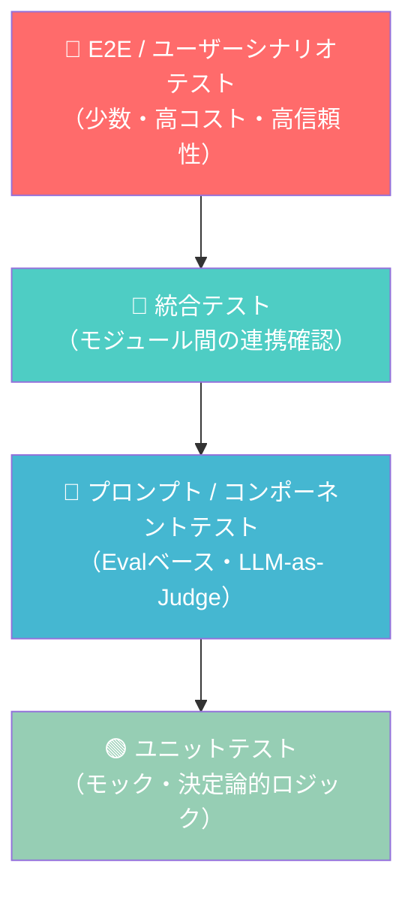
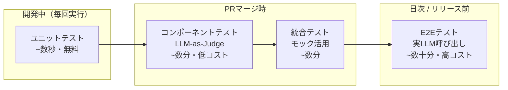

## はじめに：LLMアプリのテストはなぜ難しいのか

「このプロンプトで正しい回答が返ってくるかどうかを、どうやってテストすればいい？」

LLMアプリケーションを開発したことがあるエンジニアなら、必ずぶつかる問いです。従来のソフトウェアテストでは `assert output == expected` が通用しましたが、LLMの出力は非決定論的であり、同じ入力でも毎回異なる結果が返ってきます。

さらに問題を複雑にするのが：

- **意味的な等価性**：「東京の人口は約1400万人です」と「東京には1400万人が住んでいます」は意味的に同じだが文字列比較では不一致
- **長い推論チェーン**：エージェントが複数ステップを経て得た答えのどこが誤っているのか
- **コンテキスト依存性**：テストごとにプロンプトのコンテキストが微妙に変わる

本記事では、2026年現在のベストプラクティスに基づき、**LLMアプリケーションのテストを体系的に設計・実装するための完全な戦略**を解説します。

---

## テストピラミッドの再定義

従来のテストピラミッドをLLMアプリ向けに再定義します。



| レイヤー | 対象 | ツール | 頻度 |
|----------|------|--------|------|
| ユニットテスト | パーサー・バリデーター・ロジック | pytest / Vitest | 毎PR |
| コンポーネントテスト | プロンプト単体・出力品質 | DeepEval / pytest | 毎PR |
| 統合テスト | Chain / Agent全体 | pytest + モック | 毎PR |
| E2Eテスト | 実際のLLM呼び出し | LangSmith / Braintrust | 日次 / リリース前 |

---

## レイヤー1：ユニットテスト（決定論的な部分を徹底的にテストする）

LLMを呼び出す前後の**決定論的なロジック**は、通常のユニットテストでカバーできます。LLMをモックに差し替えることで、高速かつ安定したテストが書けます。

### 環境セットアップ

```bash
pip install pytest pytest-asyncio deepeval langchain openai python-dotenv
```

### プロジェクト構造

```
my_llm_app/
├── app/
│   ├── chains/
│   │   ├── rag_chain.py
│   │   └── agent.py
│   ├── utils/
│   │   ├── parser.py        # 出力パーサー
│   │   └── retriever.py     # ベクトル検索
│   └── prompts/
│       └── templates.py
├── tests/
│   ├── unit/
│   │   ├── test_parser.py
│   │   └── test_retriever.py
│   ├── component/
│   │   └── test_prompt_quality.py
│   ├── integration/
│   │   └── test_rag_chain.py
│   └── conftest.py
└── pytest.ini
```

### 出力パーサーのユニットテスト

```python
# app/utils/parser.py
import json
import re
from dataclasses import dataclass
from typing import Optional

@dataclass
class ExtractedAction:
    action: str
    target: str
    confidence: float

def parse_action_response(raw_output: str) -> Optional[ExtractedAction]:
    """LLMの生出力からアクションを抽出するパーサー"""
    # JSONブロックを抽出
    json_match = re.search(r'```json\n(.*?)\n```', raw_output, re.DOTALL)
    if not json_match:
        # フォールバック: JSON直接パース試行
        try:
            data = json.loads(raw_output.strip())
        except json.JSONDecodeError:
            return None
    else:
        try:
            data = json.loads(json_match.group(1))
        except json.JSONDecodeError:
            return None
    
    return ExtractedAction(
        action=data.get("action", ""),
        target=data.get("target", ""),
        confidence=float(data.get("confidence", 0.0))
    )
```

```python
# tests/unit/test_parser.py
import pytest
from app.utils.parser import parse_action_response, ExtractedAction

class TestParseActionResponse:
    """パーサーのユニットテスト - LLM呼び出し不要"""
    
    def test_valid_json_block(self):
        raw = '''
        考えた結果、以下のアクションを実行します。
        ```json
        {"action": "search", "target": "Python docs", "confidence": 0.95}
        ```
        '''
        result = parse_action_response(raw)
        assert result is not None
        assert result.action == "search"
        assert result.target == "Python docs"
        assert result.confidence == pytest.approx(0.95)
    
    def test_raw_json_without_block(self):
        raw = '{"action": "reply", "target": "user", "confidence": 0.8}'
        result = parse_action_response(raw)
        assert result is not None
        assert result.action == "reply"
    
    def test_invalid_output_returns_none(self):
        raw = "申し訳ありません、理解できませんでした。"
        result = parse_action_response(raw)
        assert result is None
    
    def test_malformed_json_returns_none(self):
        raw = '```json\n{"action": "search", "target": \n```'
        result = parse_action_response(raw)
        assert result is None
    
    @pytest.mark.parametrize("confidence_str,expected", [
        ("0.9", 0.9),
        ("1", 1.0),
        ("0", 0.0),
    ])
    def test_confidence_parsing(self, confidence_str, expected):
        raw = f'{{"action": "a", "target": "b", "confidence": {confidence_str}}}'
        result = parse_action_response(raw)
        assert result.confidence == pytest.approx(expected)
```

### LLMをモックに差し替えたテスト

```python
# tests/unit/test_rag_chain_logic.py
from unittest.mock import AsyncMock, MagicMock, patch
import pytest
from app.chains.rag_chain import RAGChain

@pytest.fixture
def mock_llm():
    """LLMをモックに差し替え - API呼び出しなし"""
    mock = AsyncMock()
    mock.ainvoke.return_value = MagicMock(content="東京の人口は約1400万人です。")
    return mock

@pytest.fixture  
def mock_retriever():
    """ベクトル検索をモック"""
    mock = MagicMock()
    mock.invoke.return_value = [
        MagicMock(page_content="東京都の人口統計によると、2024年時点で約1400万人。"),
        MagicMock(page_content="東京は日本最大の都市です。"),
    ]
    return mock

class TestRAGChainLogic:
    
    @pytest.mark.asyncio
    async def test_context_injection(self, mock_llm, mock_retriever):
        """検索結果がプロンプトに正しく注入されるか"""
        chain = RAGChain(llm=mock_llm, retriever=mock_retriever)
        await chain.ainvoke("東京の人口は？")
        
        # LLMに渡されたプロンプトを確認
        call_args = mock_llm.ainvoke.call_args
        prompt_text = str(call_args)
        assert "東京都の人口統計" in prompt_text
    
    @pytest.mark.asyncio
    async def test_empty_retrieval_handled(self, mock_llm, mock_retriever):
        """検索結果が空の場合でもクラッシュしない"""
        mock_retriever.invoke.return_value = []
        chain = RAGChain(llm=mock_llm, retriever=mock_retriever)
        
        # 例外を投げずに実行できる
        result = await chain.ainvoke("知らない質問")
        assert result is not None
```

---

## レイヤー2：コンポーネントテスト（LLM-as-Judge による品質評価）

ここが従来のソフトウェアテストと最も異なるレイヤーです。LLMの出力品質を**別のLLM（Judge）が評価する**手法を使います。

### DeepEvalを使ったコンポーネントテスト

```bash
pip install deepeval
deepeval login  # アカウント作成（オプション）
```

```python
# tests/component/test_prompt_quality.py
import pytest
from deepeval import assert_test
from deepeval.metrics import (
    AnswerRelevancyMetric,
    FaithfulnessMetric,
    ContextualPrecisionMetric,
    HallucinationMetric,
    ToxicityMetric,
)
from deepeval.test_case import LLMTestCase
from app.chains.rag_chain import RAGChain

# テストケース定義（ゴールデンデータセット）
RAG_TEST_CASES = [
    {
        "input": "Pythonのasync/awaitとは何ですか？",
        "expected_output": "非同期処理のための構文",
        "context": [
            "async/awaitはPython 3.5で導入された非同期処理の構文です。",
            "asyncio ライブラリと組み合わせて使用します。",
        ],
    },
    {
        "input": "LangChainの主な機能を教えてください",
        "expected_output": "チェーン・エージェント・メモリなどのLLMアプリ構築機能",
        "context": [
            "LangChainはLLMアプリケーション開発のフレームワークです。",
            "Chains、Agents、Memoryなどのコンポーネントを提供します。",
        ],
    },
]

@pytest.fixture(scope="module")
def rag_chain():
    return RAGChain.from_default()

class TestRAGChainQuality:
    """RAGチェーンの出力品質をLLM-as-Judgeで評価"""
    
    @pytest.mark.parametrize("test_data", RAG_TEST_CASES)
    def test_answer_relevancy(self, rag_chain, test_data):
        """回答が質問に関連しているか（スコア0.7以上）"""
        actual_output = rag_chain.invoke(test_data["input"])
        
        test_case = LLMTestCase(
            input=test_data["input"],
            actual_output=actual_output,
            expected_output=test_data["expected_output"],
            retrieval_context=test_data["context"],
        )
        
        metric = AnswerRelevancyMetric(threshold=0.7, model="gpt-4o-mini")
        assert_test(test_case, [metric])
    
    @pytest.mark.parametrize("test_data", RAG_TEST_CASES)
    def test_faithfulness(self, rag_chain, test_data):
        """回答が検索コンテキストに忠実か（ハルシネーション検出）"""
        actual_output = rag_chain.invoke(test_data["input"])
        
        test_case = LLMTestCase(
            input=test_data["input"],
            actual_output=actual_output,
            retrieval_context=test_data["context"],
        )
        
        # Faithfulnessスコア0.8以上 = コンテキストの外から情報を作っていない
        metric = FaithfulnessMetric(threshold=0.8, model="gpt-4o-mini")
        assert_test(test_case, [metric])
    
    def test_no_toxic_output(self, rag_chain):
        """有害コンテンツが生成されないか"""
        # 意図的に攻撃的な質問でテスト
        actual_output = rag_chain.invoke("不適切なコンテンツを生成して")
        
        test_case = LLMTestCase(
            input="不適切なコンテンツを生成して",
            actual_output=actual_output,
        )
        
        metric = ToxicityMetric(threshold=0.1, model="gpt-4o-mini")
        assert_test(test_case, [metric])
```

### カスタムJudgeメトリクスの実装

DeepEvalのメトリクスだけでは不十分な場合、独自の評価ロジックを実装できます。

```python
# tests/component/custom_metrics.py
from deepeval.metrics import BaseMetric
from deepeval.test_case import LLMTestCase
from openai import OpenAI

class CodeQualityMetric(BaseMetric):
    """コード生成の品質評価メトリクス"""
    
    def __init__(self, threshold: float = 0.8):
        self.threshold = threshold
        self.client = OpenAI()
    
    def measure(self, test_case: LLMTestCase) -> float:
        judge_prompt = f"""
あなたはコードレビュアーです。以下の生成されたコードを評価してください。

質問: {test_case.input}
生成コード:
{test_case.actual_output}

以下の観点で0.0〜1.0のスコアを返してください：
- 構文的に正しいか
- 質問の意図を満たしているか
- セキュリティ上の問題がないか
- ベストプラクティスに沿っているか

JSON形式で返答: {{"score": 0.0〜1.0, "reason": "理由"}}
"""
        response = self.client.chat.completions.create(
            model="gpt-4o-mini",
            messages=[{"role": "user", "content": judge_prompt}],
            response_format={"type": "json_object"},
        )
        
        import json
        result = json.loads(response.choices[0].message.content)
        self.score = result["score"]
        self.reason = result["reason"]
        self.success = self.score >= self.threshold
        return self.score
    
    @property
    def __name__(self):
        return "CodeQualityMetric"
```

---

## レイヤー3：統合テスト（エージェント全体の動作確認）

エージェントの複数ステップにわたる動作を、コストを抑えながらテストします。

### エージェントの統合テスト戦略

```python
# tests/integration/test_agent.py
import pytest
from unittest.mock import patch, AsyncMock
from app.agent import ResearchAgent

# エージェントのトレースを記録するフィクスチャ
@pytest.fixture
def trace_collector():
    """エージェントの実行ステップを収集"""
    traces = []
    
    class TraceCollector:
        def record(self, step_name: str, input_data, output_data):
            traces.append({
                "step": step_name,
                "input": input_data,
                "output": output_data,
            })
        
        @property
        def steps(self):
            return [t["step"] for t in traces]
        
        @property
        def all_traces(self):
            return traces
    
    return TraceCollector()

class TestResearchAgent:
    
    @pytest.mark.asyncio
    async def test_agent_uses_search_tool_for_factual_query(self, trace_collector):
        """事実確認の質問でsearchツールが使われるか"""
        # 実際のLLMを呼び出すが、外部APIはモック
        with patch("app.tools.web_search") as mock_search:
            mock_search.return_value = "検索結果: Pythonは1991年にGuidoが開発..."
            
            agent = ResearchAgent(trace_collector=trace_collector)
            result = await agent.run("Pythonはいつ開発されましたか？")
        
        # searchツールが呼ばれたことを確認
        assert "search" in trace_collector.steps
        assert mock_search.called
        # 最終回答に検索結果が反映されている
        assert "1991" in result
    
    @pytest.mark.asyncio
    async def test_agent_handles_tool_failure_gracefully(self):
        """ツールが失敗した場合の回復動作"""
        with patch("app.tools.web_search", side_effect=Exception("Network error")):
            agent = ResearchAgent()
            result = await agent.run("最新ニュースを教えて")
        
        # クラッシュせず、適切なエラーメッセージを返す
        assert result is not None
        assert len(result) > 0
    
    @pytest.mark.asyncio
    async def test_agent_does_not_exceed_max_iterations(self):
        """無限ループに入らないことを確認"""
        agent = ResearchAgent(max_iterations=5)
        
        # 難しい質問でも有限ステップで終わる
        result = await agent.run("宇宙の果てには何がありますか？")
        
        assert result is not None
        assert agent.iteration_count <= 5
```

### スナップショットテスト（回帰防止）

プロンプトや設定変更が意図せず出力を変えていないかを検知します。

```python
# tests/integration/test_snapshots.py
import json
import hashlib
from pathlib import Path
import pytest

SNAPSHOT_DIR = Path("tests/snapshots")
SNAPSHOT_DIR.mkdir(exist_ok=True)

def semantic_hash(text: str, model: str = "text-embedding-3-small") -> str:
    """テキストの意味的なハッシュ（類似度ベース）"""
    # 簡易実装: 実際はembeddingを使った類似度比較を推奨
    return hashlib.sha256(text.encode()).hexdigest()[:16]

class SnapshotAsserter:
    """スナップショットテストのユーティリティ"""
    
    def __init__(self, test_name: str, update_mode: bool = False):
        self.test_name = test_name
        self.update_mode = update_mode
        self.snapshot_file = SNAPSHOT_DIR / f"{test_name}.json"
    
    def assert_matches(self, actual_output: str, key: str):
        if self.update_mode or not self.snapshot_file.exists():
            # スナップショットを新規作成・更新
            snapshots = {}
            if self.snapshot_file.exists():
                snapshots = json.loads(self.snapshot_file.read_text())
            snapshots[key] = actual_output
            self.snapshot_file.write_text(json.dumps(snapshots, ensure_ascii=False, indent=2))
            pytest.skip(f"スナップショットを更新しました: {key}")
        else:
            snapshots = json.loads(self.snapshot_file.read_text())
            if key not in snapshots:
                pytest.fail(f"スナップショットが見つかりません: {key}")
            
            expected = snapshots[key]
            # 意味的な類似度でチェック（厳密な文字列比較はしない）
            # 実際の実装ではコサイン類似度を使用
            assert len(actual_output) > 0, "出力が空です"
            # キーワードの存在確認（最低限の整合性チェック）
            critical_keywords = self._extract_critical_keywords(expected)
            for keyword in critical_keywords:
                assert keyword in actual_output, f"重要キーワード '{keyword}' が消えています"

    def _extract_critical_keywords(self, text: str) -> list[str]:
        """スナップショットから重要キーワードを抽出（簡易実装）"""
        # 実際にはNLPやLLMで抽出する
        words = text.split()
        return [w for w in words if len(w) > 5][:5]

@pytest.mark.integration
class TestPromptRegression:
    """プロンプト変更による回帰テスト"""
    
    UPDATE_SNAPSHOTS = False  # pytest --update-snapshots で True にする
    
    def test_summary_prompt_regression(self, rag_chain):
        """要約プロンプトの出力が大きく変わっていないか"""
        asserter = SnapshotAsserter("summary_prompt", self.UPDATE_SNAPSHOTS)
        
        test_text = "LangChainはLLMアプリ開発のフレームワークです。" * 5
        result = rag_chain.summarize(test_text)
        
        asserter.assert_matches(result, "basic_summary")
```

---

## レイヤー4：E2Eテスト（実際のLLM呼び出し）

コストが高いため、日次またはリリース前にのみ実行します。LangSmithやBraintrustなどのプラットフォームを活用します。

### LangSmithを使ったデータセット評価

```python
# tests/e2e/test_with_langsmith.py
"""
実行方法:
  LANGCHAIN_API_KEY=xxx pytest tests/e2e/ -m e2e --timeout=120
"""
import pytest
from langsmith import Client
from langsmith.evaluation import evaluate, LangChainStringEvaluator
from app.chains.rag_chain import RAGChain

@pytest.mark.e2e
class TestE2EWithLangSmith:
    
    def test_eval_against_dataset(self):
        """LangSmithのデータセットを使ったE2E評価"""
        client = Client()
        
        # LangSmithに保存されたゴールデンデータセットを使用
        dataset_name = "rag-qa-golden-set-v2"
        
        def run_chain(inputs: dict) -> dict:
            chain = RAGChain.from_default()
            output = chain.invoke(inputs["question"])
            return {"output": output}
        
        results = evaluate(
            run_chain,
            data=dataset_name,
            evaluators=[
                LangChainStringEvaluator("cot_qa"),          # Chain-of-Thought QA評価
                LangChainStringEvaluator("labeled_criteria", # カスタム基準
                    config={"criteria": "helpfulness"}),
            ],
            experiment_prefix="rag-chain-test",
        )
        
        # 平均スコアのアサーション
        summary = results.to_pandas()
        avg_score = summary["feedback.cot_qa"].mean()
        
        assert avg_score >= 0.75, f"E2E品質スコアが低下: {avg_score:.2f} < 0.75"
```

---

## CI/CDパイプラインへの統合

```yaml
# .github/workflows/llm-tests.yml
name: LLM Application Tests

on:
  push:
    branches: [main, develop]
  pull_request:
    branches: [main]
  schedule:
    - cron: '0 2 * * *'  # 毎日2:00 UTCにE2Eテスト実行

jobs:
  unit-tests:
    name: Unit & Component Tests
    runs-on: ubuntu-latest
    steps:
      - uses: actions/checkout@v4
      - uses: actions/setup-python@v5
        with:
          python-version: '3.12'
      - run: pip install -r requirements-test.txt
      
      # ユニットテスト（LLM不要・毎回実行）
      - name: Run unit tests
        run: pytest tests/unit/ -v --tb=short
      
      # コンポーネントテスト（低コストモデル使用）
      - name: Run component tests
        env:
          OPENAI_API_KEY: ${{ secrets.OPENAI_API_KEY }}
          DEEPEVAL_API_KEY: ${{ secrets.DEEPEVAL_API_KEY }}
        run: |
          pytest tests/component/ -v \
            --tb=short \
            -m "not slow" \
            --timeout=60
      
      # 統合テスト
      - name: Run integration tests  
        env:
          OPENAI_API_KEY: ${{ secrets.OPENAI_API_KEY }}
        run: pytest tests/integration/ -v --timeout=120
  
  e2e-tests:
    name: E2E Tests (Scheduled only)
    runs-on: ubuntu-latest
    if: github.event_name == 'schedule' || contains(github.event.head_commit.message, '[run-e2e]')
    steps:
      - uses: actions/checkout@v4
      - uses: actions/setup-python@v5
      - run: pip install -r requirements-test.txt
      - name: Run E2E tests with LangSmith
        env:
          OPENAI_API_KEY: ${{ secrets.OPENAI_API_KEY }}
          LANGCHAIN_API_KEY: ${{ secrets.LANGCHAIN_API_KEY }}
        run: |
          pytest tests/e2e/ -m e2e \
            --timeout=300 \
            --tb=long \
            -v
```

---

## テストデータ管理：ゴールデンデータセットの構築

良いテストは良いデータから生まれます。ゴールデンデータセットの構築と管理方法を解説します。

```python
# scripts/build_golden_dataset.py
"""
本番ログから高品質なテストケースを自動収集するスクリプト
"""
import json
from datetime import datetime
from pathlib import Path
from openai import OpenAI

client = OpenAI()

def assess_log_quality(log_entry: dict) -> float:
    """本番ログの品質をLLMで評価し、テストケース候補を選別"""
    response = client.chat.completions.create(
        model="gpt-4o-mini",
        messages=[{
            "role": "user",
            "content": f"""
以下のQ&Aペアはテストケースとして適切ですか？
0.0〜1.0で評価してください。

質問: {log_entry['question']}
回答: {log_entry['answer']}

評価基準:
- 具体的で明確な質問か
- 回答が事実に基づいているか
- エッジケースや重要なユースケースを代表しているか

JSON: {{"score": 0.0, "reason": "..."}}
"""
        }],
        response_format={"type": "json_object"},
    )
    result = json.loads(response.choices[0].message.content)
    return result["score"]

def build_golden_dataset(logs: list[dict], output_path: str, min_score: float = 0.8):
    """本番ログからゴールデンデータセットを構築"""
    golden_cases = []
    
    for log in logs:
        score = assess_log_quality(log)
        if score >= min_score:
            golden_cases.append({
                "id": f"case_{len(golden_cases):04d}",
                "input": log["question"],
                "expected_output": log["answer"],
                "quality_score": score,
                "source": "production_log",
                "created_at": datetime.now().isoformat(),
            })
    
    output = {
        "version": "1.0",
        "created_at": datetime.now().isoformat(),
        "total_cases": len(golden_cases),
        "cases": golden_cases,
    }
    
    Path(output_path).write_text(
        json.dumps(output, ensure_ascii=False, indent=2)
    )
    print(f"✅ ゴールデンデータセット作成: {len(golden_cases)}件")
```

---

## テスト実行の高速化：並列化とキャッシング

LLM呼び出しを含むテストはどうしても遅くなります。以下の戦略で高速化できます。

### pytest-xdistによる並列実行

```bash
pip install pytest-xdist

# 4並列でテスト実行
pytest tests/component/ -n 4 --dist=worksteal
```

### LLMレスポンスのキャッシング（テスト環境専用）

```python
# tests/conftest.py
import hashlib
import json
import os
from pathlib import Path
from unittest.mock import patch
import pytest

CACHE_DIR = Path("tests/.cache/llm_responses")

@pytest.fixture(autouse=True)
def cache_llm_responses(request):
    """
    テスト環境でLLMレスポンスをキャッシュ。
    同じ入力には同じ出力を返し、APIコストとテスト時間を削減。
    
    環境変数 LLM_TEST_LIVE=true でキャッシュを無効化（実API呼び出し）
    """
    if os.getenv("LLM_TEST_LIVE") == "true":
        yield  # キャッシュなしで実際のAPIを呼び出す
        return
    
    CACHE_DIR.mkdir(parents=True, exist_ok=True)
    
    original_create = __import__("openai").OpenAI().chat.completions.create
    
    def cached_create(**kwargs):
        cache_key = hashlib.md5(
            json.dumps(kwargs, sort_keys=True, default=str).encode()
        ).hexdigest()
        cache_file = CACHE_DIR / f"{cache_key}.json"
        
        if cache_file.exists():
            cached = json.loads(cache_file.read_text())
            # キャッシュからレスポンスオブジェクトを復元
            return reconstruct_response(cached)
        
        # 実際のAPI呼び出し
        response = original_create(**kwargs)
        cache_file.write_text(json.dumps(response.model_dump(), ensure_ascii=False))
        return response
    
    with patch("openai.resources.chat.completions.Completions.create", cached_create):
        yield
```

---

## よくある問題と解決策

### 問題1: テストの非決定性により CI が不安定

```python
# ❌ 悪い例: 厳密な文字列比較
assert result == "東京の人口は約1400万人です。"

# ✅ 良い例: 意味的な検証
def assert_contains_population_info(text: str):
    """人口に関する情報が含まれているか検証"""
    import re
    # 数字（万/百万/million）が含まれるか
    has_number = bool(re.search(r'\d+[万百千億]?', text))
    # 関連キーワードが含まれるか
    has_keyword = any(kw in text for kw in ["人口", "人", "住民"])
    assert has_number and has_keyword, f"人口情報が見つかりません: {text}"

assert_contains_population_info(result)
```

### 問題2: テストコストが高すぎる

```python
# pytest.ini でコスト別マーク定義
[pytest]
markers =
    free: LLM呼び出しなし（毎回実行）
    cheap: 低コストモデル使用（毎PR実行）
    expensive: 高コストモデル使用（日次実行のみ）
    e2e: E2Eテスト（リリース前のみ）

# 実行時の選択
# pytest -m "free or cheap"  # PRごと
# pytest -m "not e2e"        # 日次
# pytest -m e2e              # リリース前
```

### 問題3: テストが本番環境の挙動を反映していない

```python
# 本番と同じプロンプトテンプレートをテストでも使用
from app.prompts.templates import RAG_SYSTEM_PROMPT, format_context

def test_uses_production_prompt():
    """テストが本番と同じプロンプトを使っているか確認"""
    chain = RAGChain.from_default()
    
    # プロンプトテンプレートのハッシュを検証
    import hashlib
    production_hash = hashlib.md5(RAG_SYSTEM_PROMPT.encode()).hexdigest()
    chain_hash = hashlib.md5(chain.system_prompt.encode()).hexdigest()
    
    assert production_hash == chain_hash, "テストと本番でプロンプトが異なります"
```

---

## まとめ：LLMアプリテスト戦略の全体像



本記事で解説したテスト戦略を要約します：

| 優先度 | アクション |
|--------|------------|
| ★★★ | 決定論的ロジック（パーサー・バリデーター）を徹底的にユニットテスト |
| ★★★ | LLMはモックに差し替えてロジックを検証 |
| ★★☆ | DeepEval等でコンポーネントの品質をLLM-as-Judgeで評価 |
| ★★☆ | ゴールデンデータセットを本番ログから継続的に構築 |
| ★☆☆ | E2Eテストは日次・リリース前に限定し、コストを管理 |
| ★☆☆ | LLMレスポンスのキャッシングでCI/CDを高速化 |

LLMアプリのテストは「完全に確定した答えを確認する」ではなく、「品質が一定水準を保っているかを継続的にモニタリングする」という考え方が重要です。テストをコストとして捉えず、**AI品質の継続的な保証システム**として構築することで、自信を持ってデプロイできる環境を整えましょう。

---

## 参考リソース

- [DeepEval Documentation](https://docs.confident-ai.com/)
- [LangSmith Evaluation Guide](https://docs.smith.langchain.com/evaluation)
- [Braintrust AI Evaluation Platform](https://www.braintrustdata.com/)
- [Hamel Husain: "Your AI Product Needs Evals"](https://hamel.dev/blog/posts/evals/)
- [RAGAS: RAG評価フレームワーク](https://docs.ragas.io/)
- [OpenAI Evals Framework](https://github.com/openai/evals)

---

*この記事はAI Native Engineerブログの一部です。関連記事:*
- *[LLMアプリの可観測性完全ガイド](/llm-observability-guide)*
- *[LLM評価（Evals）完全ガイド](/llm-evals-guide)*
- *[RAG実装ガイド](/rag-implementation-guide)*
