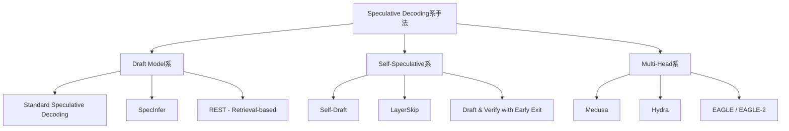
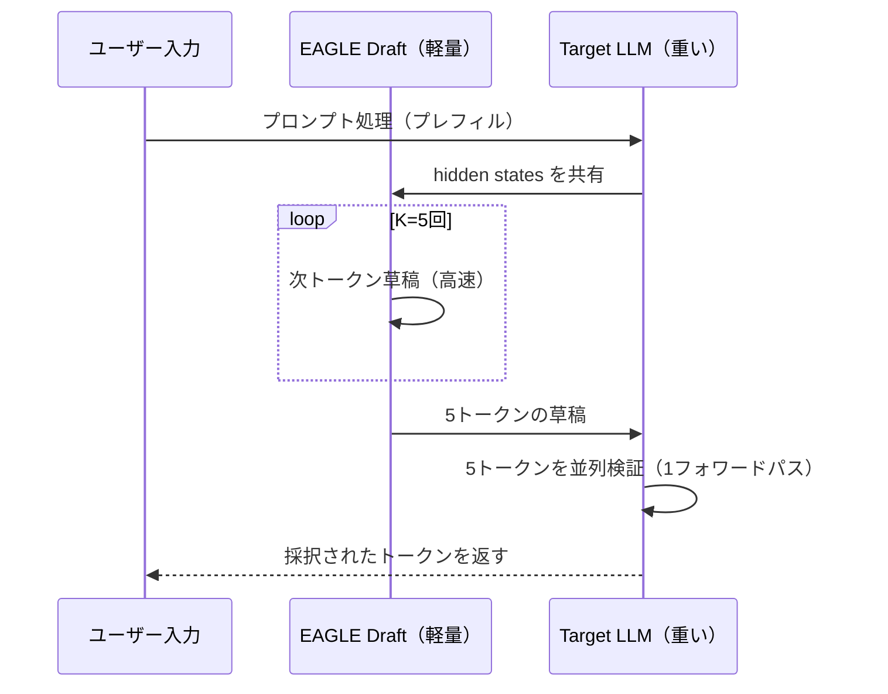

## はじめに：LLM推論のボトルネックはどこにあるか

GPT-4oやClaude 3.5 Sonnetのような大規模言語モデル（LLM）は、なぜ「遅い」のでしょうか。

原因は明快です。LLMは **自己回帰（autoregressive）** な生成を行うため、トークンを1つずつ順番に生成するしかありません。どれだけGPUを増やしても、1トークン生成するたびに巨大なモデルの全重みを参照するという構造的な制約から逃げられないのです。

```
Input: "AIネイティブなエンジニアとは"
→ Token 1: "、"
→ Token 2: "AI"  ← Token 1 が確定しないと生成できない
→ Token 3: "を"  ← Token 2 が確定しないと生成できない
→ ...（逐次的に続く）
```

この問題を根本から解決するアプローチの一つが **Speculative Decoding**（投機的デコーディング）です。2022年にGoogle/DeepMindが提案し、2024〜2025年にかけて主要な推論エンジンに実装が広がったこの手法は、**出力品質を一切落とさずに** 推論を2〜5倍高速化できることで注目を集めています。

この記事では：

- Speculative Decodingの数学的な仕組み
- Draft Model・Self-Speculative・Medusa等の派生手法の比較
- vLLM・llama.cppでの実践設定
- KVキャッシュ最適化との組み合わせ

を、実装コードを交えながら徹底解説します。

---

## Speculative Decodingの直感的な理解

### 問題の本質

LLM推論がMemory-Boundである理由を少し掘り下げます。

70Bのモデルでは、fp16精度で約140GBの重みを持ちます。1トークン生成するたびに、GPUはこの140GBをHBM（高帯域幅メモリ）から読み込みます。最新のH100 GPUでもHBMの帯域幅は約3.35 TB/sですから、1トークンの生成に最低でも以下の時間がかかります：

```
140 GB ÷ 3,350 GB/s ≈ 42 ms
```

つまり理論上の最速でも、70Bモデルは1秒あたり約24トークン（42ms/token）しか生成できません。計算性能（FLOPS）がいくらあっても、メモリ帯域がボトルネックなのです。

### Speculative Decodingの核心アイデア

**「どうせ検証するなら、まとめて並列検証すればいい」**

Speculative Decodingは次の2段階から構成されます：

1. **Draft phase（草稿フェーズ）**: 小さく速いモデル（Draft Model）が、次のK個のトークンを推測する
2. **Verify phase（検証フェーズ）**: 大きく正確なモデル（Target Model）が、K個の草稿トークンを**並列に**検証・採択または棄却する

重要なのは、**Verify phaseではK個のトークンを1回のフォワードパスで並列処理できる**点です。Target ModelはAutoRegressiveな*生成*を行っていますが、*検証*は入力が与えられればすべて並列に計算できます。

```
通常のDecoding:
Target: [t1] → [t2] → [t3] → [t4] → [t5]
（5回のフォワードパス）

Speculative Decoding:
Draft:  [t1_d] → [t2_d] → [t3_d] → [t4_d] → [t5_d]  (小さいモデルで高速に)
Target: 並列検証 [t1_d, t2_d, t3_d, t4_d, t5_d]  (1回のフォワードパス)
        → 全部採択なら5トークン獲得！
```

---

## 数学的な正確性の保証

Speculative Decodingの最もエレガントな性質は、**出力分布がTarget Modelと完全に一致する**ことが数学的に証明されている点です。

### 採択確率の計算

Draft Modelが提案したトークン $\tilde{x}_i$ を採択するかどうかは、以下の確率で決まります：

$$
\alpha_i = \min\left(1, \frac{p(x_i | x_{<i})}{q(x_i | x_{<i})}\right)
$$

ここで：
- $p(x_i | x_{<i})$：Target Modelがトークン $x_i$ に割り当てる確率
- $q(x_i | x_{<i})$：Draft Modelがトークン $x_i$ に割り当てる確率

Draft Modelの予測がTarget Modelと完全に一致するケース（$q = p$）では採択率は1.0となり、ズレがある場合は確率的に棄却されます。棄却された場合は、調整された分布 $p'(x) = \text{norm}(\max(0, p(x) - q(x)))$ からサンプリングすることで、**最終的な出力分布は常にTarget Modelと同一**になります。

```python
import torch
import torch.nn.functional as F

def speculative_sample(
    target_logits: torch.Tensor,  # shape: (K, vocab_size)
    draft_logits: torch.Tensor,   # shape: (K, vocab_size)
    draft_tokens: torch.Tensor,   # shape: (K,)
    temperature: float = 1.0,
) -> tuple[torch.Tensor, int]:
    """
    Speculative Decodingの採択ロジック
    Returns: (accepted_tokens, num_accepted)
    """
    K = draft_tokens.shape[0]
    
    # 確率分布を計算
    p = F.softmax(target_logits / temperature, dim=-1)  # (K, vocab_size)
    q = F.softmax(draft_logits / temperature, dim=-1)   # (K, vocab_size)
    
    accepted_tokens = []
    
    for i in range(K):
        token = draft_tokens[i]
        # 採択確率
        alpha = min(1.0, (p[i, token] / (q[i, token] + 1e-8)).item())
        
        # 確率的採択
        if torch.rand(1).item() < alpha:
            accepted_tokens.append(token)
        else:
            # 棄却：調整分布からリサンプリング
            adjusted = torch.clamp(p[i] - q[i], min=0)
            adjusted = adjusted / adjusted.sum()
            new_token = torch.multinomial(adjusted, 1)
            accepted_tokens.append(new_token.item())
            break  # 棄却されたら以降は使わない
    
    return torch.tensor(accepted_tokens), len(accepted_tokens)
```

---

## 主要な手法の比較



### 1. Standard Speculative Decoding

**概要**: 独立したDraft Modelを使用する最もシンプルな手法

```python
from transformers import AutoModelForCausalLM, AutoTokenizer

# Target Model（大きい、正確）
target_model = AutoModelForCausalLM.from_pretrained(
    "meta-llama/Llama-3.1-70B-Instruct",
    device_map="cuda:0",
    torch_dtype=torch.float16,
)

# Draft Model（小さい、速い）
draft_model = AutoModelForCausalLM.from_pretrained(
    "meta-llama/Llama-3.2-1B-Instruct",  # 同じファミリーの小型版
    device_map="cuda:0",
    torch_dtype=torch.float16,
)
```

**適用条件**:
- Draft ModelとTarget Modelが同じトークナイザーを使用すること
- Draft Modelの出力分布がTarget Modelと十分に相関していること（同じモデルファミリーが理想）

**期待速度向上**: 2〜3倍

### 2. Medusa

**概要**: Medusaは追加のデコードヘッドをTarget Modelに取り付け、Draft ModelなしでSpeculative Decodingを実現します。

```
通常のLLMヘッド:      [hidden_state] → [次トークン予測]

Medusaヘッド:
  Head-1 (2トークン先): [hidden_state] → [t+2予測]
  Head-2 (3トークン先): [hidden_state] → [t+3予測]
  Head-3 (4トークン先): [hidden_state] → [t+4予測]
  Head-4 (5トークン先): [hidden_state] → [t+5予測]
```

```python
# Medusa設定例（vLLM経由）
from vllm import LLM, SamplingParams

llm = LLM(
    model="FasterDecoding/medusa-1.0-vicuna-7b-v1.5",
    speculative_model="[medusa]",  # Medusaモードを指定
    num_speculative_tokens=5,       # 5トークン先まで予測
    use_v2_block_manager=True,
)

sampling_params = SamplingParams(temperature=0.0, max_tokens=256)
outputs = llm.generate(["AIネイティブなエンジニアとは"], sampling_params)
```

**メリット**: 別途Draft Modelが不要でメモリ効率が良い  
**デメリット**: Medusaヘッドのファインチューニングが必要  
**期待速度向上**: 2〜3倍

### 3. EAGLE-2（最新・高性能）

**概要**: 2024年末に登場した手法で、Draft ModelとしてLightweight Feature-level Predictorを使用。EAGLEの改良版で適応的なドラフト生成を実現。



**特徴**:
- Acceptance rateが高い（Llamaで平均4.0+）
- ファインチューニング済みEAGLEモデルが公開されている
- Context-Aware Dynamicドラフト長

**期待速度向上**: 3〜5倍（Llama-3.1-70Bで実測3.8倍）

---

## vLLMでのSpeculative Decoding設定

vLLMは最も本番利用されているLLM推論エンジンの一つで、Speculative Decodingを比較的簡単に有効化できます。

### インストールと基本設定

```bash
pip install vllm>=0.6.0
```

```python
from vllm import LLM, SamplingParams

# Draft Modelを使ったSpeculative Decoding
llm = LLM(
    model="meta-llama/Llama-3.1-70B-Instruct",
    speculative_model="meta-llama/Llama-3.2-1B-Instruct",
    num_speculative_tokens=5,       # 1回に草稿するトークン数
    speculative_draft_tensor_parallel_size=1,  # DraftモデルのTP数
    tensor_parallel_size=4,         # TargetモデルのTP数（4 GPU）
    dtype="float16",
    gpu_memory_utilization=0.9,
)

# 温度0でのGreedy Decodingが最も高速
sampling_params = SamplingParams(
    temperature=0.0,
    max_tokens=512,
)

prompts = [
    "Pythonでシングルトンパターンを実装してください。",
    "マイクロサービスアーキテクチャの長所と短所を説明してください。",
]

outputs = llm.generate(prompts, sampling_params)
for output in outputs:
    print(output.outputs[0].text)
```

### NGRAMベースのSpeculative Decoding（Draft Model不要）

Draft Modelがない場合でも、入力プロンプトのNGRAMパターンから草稿トークンを生成する手法が使えます：

```python
# NGRAM speculative decoding
llm = LLM(
    model="meta-llama/Llama-3.1-70B-Instruct",
    speculative_model="[ngram]",    # NGRAMモード
    num_speculative_tokens=5,
    ngram_prompt_lookup_max=4,      # 最大4-gramで照合
    ngram_prompt_lookup_min=1,
    tensor_parallel_size=4,
)
```

**NGRAMが特に効果的なケース**:
- コードの補完（変数名・関数名の繰り返しが多い）
- 翻訳タスク（入力フレーズがそのまま出力に現れやすい）
- 文書のサマリ（元テキストのフレーズを再利用する傾向）

### OpenAI互換サーバーとして起動

```bash
python -m vllm.entrypoints.openai.api_server \
    --model meta-llama/Llama-3.1-70B-Instruct \
    --speculative-model meta-llama/Llama-3.2-1B-Instruct \
    --num-speculative-tokens 5 \
    --tensor-parallel-size 4 \
    --port 8000
```

```python
# 通常のOpenAI SDKでそのまま使える
from openai import OpenAI

client = OpenAI(base_url="http://localhost:8000/v1", api_key="dummy")

response = client.chat.completions.create(
    model="meta-llama/Llama-3.1-70B-Instruct",
    messages=[{"role": "user", "content": "Speculative Decodingを解説してください"}],
    max_tokens=512,
)
```

---

## llama.cppでのSpeculative Decoding

ローカル環境での推論には`llama.cpp`が広く使われています。

```bash
# Draft Modelと組み合わせて起動
./llama-cli \
    -m ./models/llama-3.1-70b-instruct-Q4_K_M.gguf \
    --draft-model ./models/llama-3.2-1b-instruct-Q4_K_M.gguf \
    -n 512 \
    --draft-max 8 \      # 最大8トークン草稿
    --draft-min 2 \      # 最小2トークン草稿
    --draft-p-split 0.1 \  # 採択率がこれ以下なら草稿数を減らす
    -p "AIネイティブなエンジニアになるには"
```

### Pythonバインディング（llama-cpp-python）

```python
from llama_cpp import Llama

# TargetモデルとDraftモデルを組み合わせ
llm = Llama(
    model_path="./models/llama-3.1-70b-Q4_K_M.gguf",
    draft_model=LlamaState(
        model_path="./models/llama-3.2-1b-Q4_K_M.gguf",
        n_ctx=4096,
    ),
    draft_model_num_pred_tokens=10,  # 草稿トークン数
    n_ctx=4096,
    n_gpu_layers=-1,  # 全レイヤーGPUオフロード
    verbose=False,
)

output = llm(
    "Speculative Decodingとは何ですか？",
    max_tokens=256,
    temperature=0.0,
)
print(output["choices"][0]["text"])
```

---

## パフォーマンス比較と選択ガイド

### 手法別ベンチマーク（Llama-3.1-70B、MT-Benchタスク）

| 手法 | 速度向上比 | Acceptance Rate | 品質劣化 | セットアップの手間 |
|------|-----------|----------------|---------|----------------|
| Baseline（通常） | 1.0x | - | なし | 不要 |
| NGRAM Speculative | 1.3〜1.7x | 30〜50% | なし | 低（パラメータ調整のみ） |
| Standard (1B Draft) | 2.0〜2.8x | 55〜75% | なし | 中（Draft Modelの用意） |
| Medusa | 2.0〜3.0x | 60〜80% | なし | 高（FT必要） |
| EAGLE-2 | 3.0〜4.5x | 75〜90% | なし | 中〜高（FT済みモデル必要） |

### ユースケース別の推奨設定

```
📊 チャットボット・リアルタイム応答
→ EAGLE-2 または Standard Speculative (1B Draft)
  理由：低レイテンシが最優先、Acceptance Rateが高いほど体験が良い

📝 コード生成・補完
→ NGRAM + Standard Speculative の組み合わせ
  理由：コードは繰り返しパターンが多くNGRAMが効きやすい

📄 長文ドキュメント生成・要約
→ Standard Speculative Decoding
  理由：スループット優先、バッチ処理で効率化

🖥️ ローカル推論（MacBook等）
→ llama.cpp の --draft-model オプション
  理由：メモリ制約がある中での最適解
```

---

## Speculative Decodingの限界と注意点

### 高温度サンプリングとの相性

Speculative Decodingは **Temperature=0（Greedy Decoding）** で最も効果を発揮します。

```python
# 温度が高いほどAcceptance Rateが低下する
# temperature=0.0 → acceptance_rate ≈ 80%
# temperature=0.5 → acceptance_rate ≈ 65%
# temperature=1.0 → acceptance_rate ≈ 45%
# temperature=2.0 → acceptance_rate ≈ 25% ← ほぼ効果なし
```

Temperature=1.0以上の創造的なテキスト生成では、Draft Modelの予測が外れやすく、速度向上が限定的になります。

### バッチ処理との組み合わせ

大量のリクエストをバッチ処理する場合、Speculative Decodingの恩恵は薄れます。

```
バッチサイズ=1   → Speculative Decodingが最も効果的（Memory-Bound）
バッチサイズ=32  → 通常デコーディングでもGPUが飽和しSpeedup小
バッチサイズ=128 → Compute-Bound領域。Speculative Decodingは不要
```

実際の本番環境では、リクエストが少ない（≤8バッチ）時だけ有効化し、高負荷時は無効化する**動的切り替え**が推奨されます。

### メモリオーバーヘッド

Draft Modelの追加により、VRAMが増加します：

```
70B Target (fp16):   140 GB
1B Draft (fp16):     + 2 GB
KV Cache (両モデル): + α GB
合計:               ~145 GB
```

A100 80GB × 2〜4枚の構成では問題ありませんが、メモリタイトな環境では4-bit量子化（GPTQ/AWQ）との組み合わせで対応します。

---

## KVキャッシュ最適化との組み合わせ

Speculative Decodingと組み合わせることで、さらなる高速化が可能な技術があります。

### PagedAttention（vLLMの核心技術）

vLLMのPagedAttentionはKVキャッシュをページ単位で管理し、断片化を防ぎます。Speculative Decodingと組み合わせると、草稿トークンの検証時にKVキャッシュの再利用が効率化されます。

```python
# vLLM設定での最適化コンビネーション
llm = LLM(
    model="meta-llama/Llama-3.1-70B-Instruct",
    speculative_model="meta-llama/Llama-3.2-1B-Instruct",
    num_speculative_tokens=5,
    # PagedAttention関連
    use_v2_block_manager=True,     # BlockManager v2（推奨）
    block_size=16,                  # KVキャッシュのブロックサイズ
    gpu_memory_utilization=0.90,   # VRAMの90%をKVキャッシュに使用
    # Prefix Caching（繰り返しプロンプトをキャッシュ）
    enable_prefix_caching=True,
)
```

### Prefix Caching（プロンプトキャッシング）

システムプロンプトや共通のコンテキストをキャッシュすることで、プレフィルフェーズを高速化できます。Speculative Decodingはデコードフェーズの最適化ですが、Prefix Cachingはプレフィルフェーズの最適化です。

```python
# 長いシステムプロンプトはPrefixキャッシュに乗る
system_prompt = """あなたはAIネイティブなエンジニアのための...(長いシステムプロンプト)"""

# 初回：プレフィル実行 + キャッシュ保存
response1 = client.chat.completions.create(
    model="llama-3.1-70b",
    messages=[
        {"role": "system", "content": system_prompt},
        {"role": "user", "content": "質問1"},
    ],
)

# 2回目以降：キャッシュヒットでプレフィルをスキップ → さらに高速
response2 = client.chat.completions.create(
    model="llama-3.1-70b",
    messages=[
        {"role": "system", "content": system_prompt},  # ← キャッシュヒット
        {"role": "user", "content": "質問2"},
    ],
)
```

---

## 実際のプロダクション導入事例と設定チェックリスト

### 本番導入前のチェックリスト

```
□ 使用するLLMのファミリーに適したDraft Modelが存在するか確認
  - Llama 3.x → Llama 3.2 1B/3B
  - Mistral 7B → Mistral 1B（または自前FT）
  - 独自ファインチューニング済みモデル → 同ベースモデルの小型版

□ 推論時のTemperature設定を確認
  - temperature < 0.5 → Speculative Decodingの効果大
  - temperature > 1.0 → NGRAM Speculativeのみ推奨

□ バッチサイズの想定を確認
  - 平均バッチサイズ < 8 → 積極採用
  - 平均バッチサイズ 8〜32 → ベンチマーク後に判断
  - 平均バッチサイズ > 32 → 通常デコーディングと比較

□ VRAMの余裕を確認（Draft Model分が追加で必要）

□ ベンチマーク計測（Acceptance Rate, Throughput, Latency）
```

### ベンチマーク計測スクリプト

```python
import time
import statistics
from vllm import LLM, SamplingParams

def benchmark_inference(llm, prompts, sampling_params, warmup=3, n_runs=10):
    """推論速度のベンチマーク計測"""
    # ウォームアップ
    for _ in range(warmup):
        llm.generate(prompts[:1], sampling_params)
    
    # 計測
    latencies = []
    tokens_generated = []
    
    for _ in range(n_runs):
        start = time.perf_counter()
        outputs = llm.generate(prompts, sampling_params)
        end = time.perf_counter()
        
        latencies.append(end - start)
        total_tokens = sum(
            len(o.outputs[0].token_ids) for o in outputs
        )
        tokens_generated.append(total_tokens)
    
    avg_latency = statistics.mean(latencies)
    avg_tokens = statistics.mean(tokens_generated)
    
    print(f"平均レイテンシ: {avg_latency:.3f}s")
    print(f"平均生成トークン数: {avg_tokens:.1f}")
    print(f"スループット: {avg_tokens / avg_latency:.1f} tokens/sec")
    
    return avg_latency, avg_tokens / avg_latency

# 通常デコーディング vs Speculative Decoding の比較
prompts = ["AIネイティブなエンジニアに必要なスキルセットを教えてください。"] * 4

# 通常
baseline_llm = LLM(model="meta-llama/Llama-3.1-70B-Instruct", tensor_parallel_size=4)
baseline_lat, baseline_tps = benchmark_inference(
    baseline_llm, prompts, SamplingParams(temperature=0.0, max_tokens=200)
)

# Speculative Decoding
spec_llm = LLM(
    model="meta-llama/Llama-3.1-70B-Instruct",
    speculative_model="meta-llama/Llama-3.2-1B-Instruct",
    num_speculative_tokens=5,
    tensor_parallel_size=4,
)
spec_lat, spec_tps = benchmark_inference(
    spec_llm, prompts, SamplingParams(temperature=0.0, max_tokens=200)
)

print(f"\n速度向上比: {spec_tps / baseline_tps:.2f}x")
```

---

## まとめ：Speculative Decodingをいつ使うべきか

Speculative Decodingは**シルバーバレット（万能薬）ではない**ですが、適切な場面では劇的な効果を発揮します。

### 採用すべき場面

- **チャットボット・コードアシスタント**: リアルタイム性が重要で、temperature < 0.5
- **ローカルLLM推論**: VRAMが許す限り、体験が大幅に向上
- **コスト削減が必要な推論サービス**: 同じGPU台数でスループットを2〜4倍に

### 採用を慎重に検討する場面

- 高temperatureのクリエイティブ生成
- 常に高バッチ（32+）で動作している大規模サービス
- Draft Modelが存在しないニッチなモデルファミリー

### 今後の動向

Speculative Decodingは現在も研究が活発で、以下の方向に進化しています：

1. **Cascaded Speculative Decoding**: 複数段階のDraft Modelを使い、さらに高い採択率を目指す
2. **Hardware-Native Speculation**: NVIDIA TensorRT-LLMでのカーネルレベル最適化
3. **Adaptive Draft Length**: リアルタイムに草稿長を調整するRL-based手法

LLM推論の最適化は、AIネイティブなエンジニアにとって今後ますます重要なスキルになります。ぜひ自分の環境でベンチマークを取り、最適な設定を見つけてみてください。

---

## 参考文献

- [Leviathan et al. (2023) "Fast Inference from Transformers via Speculative Decoding"](https://arxiv.org/abs/2211.17192)
- [Chen et al. (2023) "Accelerating Large Language Model Decoding with Speculative Sampling"](https://arxiv.org/abs/2302.01318)
- [Cai et al. (2024) "Medusa: Simple LLM Inference Acceleration Framework"](https://arxiv.org/abs/2401.10774)
- [Li et al. (2024) "EAGLE-2: Faster Inference of Language Models with Dynamic Draft Trees"](https://arxiv.org/abs/2406.16858)
- [vLLM Documentation: Speculative Decoding](https://docs.vllm.ai/en/latest/features/spec_decode.html)
- [llama.cpp: Draft Model Speculative Decoding](https://github.com/ggerganov/llama.cpp/blob/master/examples/speculative/README.md)

---

## 関連記事

- [エンベディング完全ガイド2026：ベクトル検索・類似度計算・RAG強化の実践テクニック](/2026/03/30/embedding-vector-search-guide.html)
- [LLMコスト最適化ガイド2026：APIコストを80%削減する実践テクニック集](/2026/03/27/llm-cost-optimization-guide.html)
- [ローカルLLM完全ガイド2026：llama.cpp・Ollama・LM Studioで自前AI環境を構築する](/2026/03/23/local-llm-complete-guide.html)
