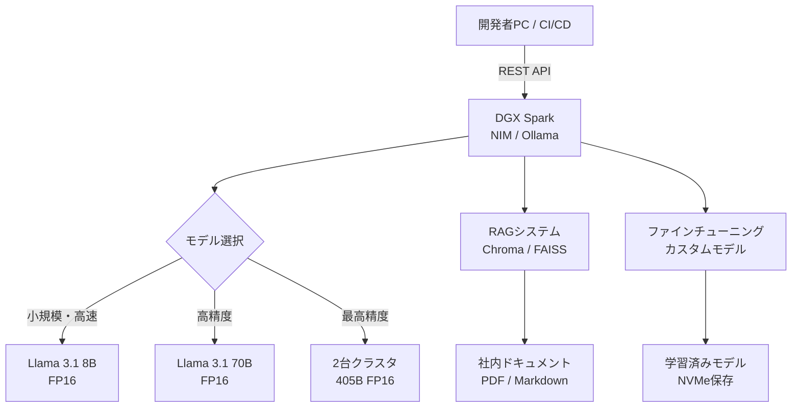

## はじめに：手のひらサイズの「AIスーパーコンピュータ」

2025年、NVIDIAが発表した **DGX Spark** は、データセンター向けのAIコンピューティングを個人の机上に持ち込むという大胆なコンセプトで注目を集めました。

150mm × 150mm × 50.5mm、重さわずか1.2kgというコンパクトな筐体に、128GBの統合メモリとBlackwellアーキテクチャのGPUを搭載。70B〜200Bパラメータのモデルをローカルで動かせるという、これまでのエッジデバイスとは一線を画す性能を持っています。

本記事では以下を解説します。

- DGX Sparkのスペックと位置づけ
- セットアップ手順（初期設定〜開発環境構築）
- エンジニアが実践できる活用アイデア

---

## DGX Sparkとは何か

### スペック一覧

| 項目 | 仕様 |
|------|------|
| CPU | 20コア NVIDIA Grace（Cortex-X925 × 10 + Cortex-A725 × 10） |
| GPU | NVIDIA Blackwell GB10（第5世代Tensor Core、48SM） |
| 統合メモリ | 128GB LPDDR5x（CPU・GPU共有）、273GB/s帯域 |
| ストレージ | 4TB NVMe SSD |
| ネットワーク | ConnectX-7 NIC、10GbE、Wi-Fi 7、Bluetooth 5.3 |
| 映像出力 | HDMI 2.1（最大8K 120Hz） |
| ポート | USB4 Type-C × 4、音声出力 |
| サイズ / 重量 | 150mm × 150mm × 50.5mm / 1.2kg |
| 消費電力 | 170〜240W |
| AI演算性能 | 最大1ペタFLOP（FP4） |
| 価格 | 約$3,000〜 |

### 従来デバイスとの比較

```
+---------------------+----------+----------------+------------------+
| デバイス             | メモリ   | 最大モデル規模  | ローカル推論品質   |
+---------------------+----------+----------------+------------------+
| MacBook Pro M4 Max  | 最大128GB| ~70B (Q4量子化)| 中（量子化必要）  |
| DGX Spark           | 128GB    | ~200B (FP16)   | 高（量子化不要）  |
| RTX 4090 PC         | 24GB     | ~13B (FP16)    | 中小             |
| クラウド A100        | 80GB     | ~70B           | 高（クラウド依存）|
+---------------------+----------+----------------+------------------+
```

DGX Sparkの最大の差別化点は **128GBの統合メモリをCPUとGPUが共有する** アーキテクチャです。PCのGPUとは異なり「VRAM不足」という概念がなく、FP16のまま大規模モデルを動かせます。

2台のDGX Sparkをネットワーク接続すれば、Llama 3.1 405Bクラスのモデルも実行可能です。

### どんな人に向いているか

- 社内データをクラウドに出したくない企業・研究機関
- 大規模モデルをローカルで試したいAI研究者
- プロトタイピングのイテレーション速度を上げたいMLエンジニア
- GGUFの量子化品質に不満があるLLM開発者

---

## セットアップガイド

### ハードウェアの準備

1. 本体を平らで通気性のある場所に置く（排熱スペース確保）
2. 付属のアダプタで電源接続
3. ネットワーク: 有線LANが推奨（大容量モデルのダウンロードやクラスタ構成時に有利）
4. ディスプレイ・キーボード・マウスを接続（初期設定時のみ）

### 初回起動・OS設定

DGX SparkにはUbuntuをベースとした **NVIDIA DGX OS** がプリインストールされています。

```bash
# 起動後、まずシステムアップデートを実行
sudo apt update && sudo apt upgrade -y

# NVIDIAドライバとCUDAが正常に認識されているか確認
nvidia-smi
```

正常に動作していれば以下のような出力が得られます（メモリ表示は統合アーキテクチャのため異なる場合あり）。

```
+---------------------------------------------------------------------------------------+
| NVIDIA-SMI 570.xx    Driver Version: 570.xx    CUDA Version: 12.x                   |
|---------------------------------------------------------------------------------------|
| GPU  Name                 ...                                                         |
| 0    NVIDIA GB10                                                                      |
+---------------------------------------------------------------------------------------+
```

### Dockerとコンテナ環境のセットアップ

DGX OSにはDockerとNVIDIA Container Toolkitがプリインストールされています。

```bash
# Dockerが正常に動作するか確認
docker run --rm --gpus all nvidia/cuda:12.3.0-base-ubuntu22.04 nvidia-smi

# PyTorchコンテナでGPUアクセスを確認
docker run --rm --gpus all nvcr.io/nvidia/pytorch:24.12-py3 python -c "
import torch
print('CUDA available:', torch.cuda.is_available())
print('Device:', torch.cuda.get_device_name(0))
print('Memory:', torch.cuda.get_device_properties(0).total_memory / 1e9, 'GB')
"
```

### SSHとリモート開発環境の構築

実運用ではヘッドレス（ディスプレイなし）での運用が主になります。

```bash
# SSHサーバーの有効化
sudo systemctl enable --now ssh

# ローカルマシンから接続
ssh username@dgx-spark-hostname

# VS Code Remote SSHを使う場合は、~/.ssh/config に以下を追記
# Host dgx-spark
#   HostName 192.168.x.x
#   User yourname
#   IdentityFile ~/.ssh/id_rsa
```

JupyterLabをサーバーとして起動する場合：

```bash
jupyter lab --no-browser --ip=0.0.0.0 --port=8888
# ブラウザから http://dgx-spark-hostname:8888 にアクセス
```

---

## Ollamaで即座にLLMを動かす

最も手軽にモデルを試せるのが **Ollama** です。

```bash
# Ollamaのインストール
curl -fsSL https://ollama.ai/install.sh | sh

# Llama 3.1 70Bを起動（約40GB、DGX Sparkなら量子化不要）
ollama run llama3.1:70b

# DeepSeek-V3 (FP16)
ollama run deepseek-v3

# モデル一覧の確認
ollama list
```

APIサーバーとして使う場合：

```bash
# Ollamaはデフォルトでポート11434でAPIを公開
curl http://localhost:11434/api/generate -d '{
  "model": "llama3.1:70b",
  "prompt": "AIネイティブなエンジニアになるには何が必要ですか？",
  "stream": false
}'
```

---

## NVIDIA NIMで本番グレードの推論サーバーを構築

**NVIDIA NIM（NVIDIA Inference Microservices）** はOpenAI互換APIを提供する最適化済み推論コンテナです。

```bash
# NGC APIキーのセットアップ（https://ngc.nvidia.com でアカウント作成後取得）
export NGC_API_KEY=your_ngc_api_key
echo "$NGC_API_KEY" | docker login nvcr.io --username '$oauthtoken' --password-stdin

# Llama 3.1 8B Instructの起動
docker run --rm --gpus all \
  -e NGC_API_KEY=$NGC_API_KEY \
  -p 8000:8000 \
  nvcr.io/nvidia/nim/meta/llama-3.1-8b-instruct:latest

# OpenAI互換APIとして使用
curl http://localhost:8000/v1/chat/completions \
  -H "Content-Type: application/json" \
  -d '{
    "model": "meta/llama-3.1-8b-instruct",
    "messages": [{"role": "user", "content": "DGX Sparkの特徴を教えてください"}]
  }'
```

既存のOpenAI SDKからそのままDGX Sparkを使えるため、クラウドからの移行コストが非常に低いのが特徴です。

```python
from openai import OpenAI

client = OpenAI(
    base_url="http://localhost:8000/v1",
    api_key="dummy"  # NIMはキー不要
)

response = client.chat.completions.create(
    model="meta/llama-3.1-8b-instruct",
    messages=[{"role": "user", "content": "Pythonでフィボナッチ数列を実装してください"}]
)
print(response.choices[0].message.content)
```

---

## 活用アイデア

### アイデア1：プライベートRAGシステムの構築

社内ドキュメントや機密情報をクラウドに送らずにRAGを構築できるのはDGX Sparkの大きなメリットです。

```python
# 必要なパッケージのインストール
# pip install langchain langchain-community chromadb sentence-transformers

from langchain_community.vectorstores import Chroma
from langchain_community.embeddings import HuggingFaceEmbeddings
from langchain_community.llms import Ollama
from langchain.chains import RetrievalQA
from langchain.document_loaders import DirectoryLoader

# 社内ドキュメントの読み込み
loader = DirectoryLoader("./docs", glob="**/*.pdf")
documents = loader.load()

# ローカルの埋め込みモデルでベクトル化
embeddings = HuggingFaceEmbeddings(
    model_name="intfloat/multilingual-e5-large"
)
vectorstore = Chroma.from_documents(documents, embeddings)

# DGX Spark上のLlamaをLLMとして使用
llm = Ollama(model="llama3.1:70b")

# RAGチェーンの構築
qa_chain = RetrievalQA.from_chain_type(
    llm=llm,
    chain_type="stuff",
    retriever=vectorstore.as_retriever(search_kwargs={"k": 5})
)

# 質問してみる
result = qa_chain.invoke({"query": "昨年のQ3売上の傾向は？"})
print(result["result"])
```

### アイデア2：LLMのファインチューニング

DGX SparkはFP16のままLlama 3.1 8Bのフルファインチューニングが可能です。量子化に起因する品質劣化を心配せずに独自モデルを作れます。

```python
# pip install transformers datasets trl peft

from transformers import AutoModelForCausalLM, AutoTokenizer, TrainingArguments
from trl import SFTTrainer
from datasets import load_dataset

model_name = "meta-llama/Llama-3.1-8B-Instruct"
tokenizer = AutoTokenizer.from_pretrained(model_name)
model = AutoModelForCausalLM.from_pretrained(
    model_name,
    torch_dtype="bfloat16",
    device_map="auto"
)

# 独自データセットの準備
dataset = load_dataset("json", data_files="./my_training_data.jsonl")

training_args = TrainingArguments(
    output_dir="./output",
    num_train_epochs=3,
    per_device_train_batch_size=4,
    gradient_accumulation_steps=8,
    learning_rate=2e-5,
    bf16=True,  # Blackwellで高速なBF16を使用
    logging_steps=10,
    save_strategy="epoch",
)

trainer = SFTTrainer(
    model=model,
    args=training_args,
    train_dataset=dataset["train"],
    tokenizer=tokenizer,
    dataset_text_field="text",
    max_seq_length=4096,
)

trainer.train()
trainer.save_model("./my-finetuned-model")
```

> **補足**: より高速なファインチューニングには [Unsloth](https://github.com/unslothai/unsloth) の活用も推奨されます。DGX Sparkとの組み合わせで検証済みです。

### アイデア3：マルチエージェントシステムのローカル実行

クラウドAPIに依存せず、完全ローカルでエージェントを動かせます。

```python
# pip install langchain langgraph

from langgraph.graph import StateGraph, END
from langchain_community.llms import Ollama
from typing import TypedDict

llm = Ollama(model="llama3.1:70b", temperature=0)

class AgentState(TypedDict):
    task: str
    plan: str
    result: str
    iterations: int

def planner_node(state: AgentState) -> AgentState:
    """タスクを分解してプランを作成する"""
    response = llm.invoke(
        f"以下のタスクを実行するための手順を3ステップで作成してください:\n{state['task']}"
    )
    return {**state, "plan": response}

def executor_node(state: AgentState) -> AgentState:
    """プランに従ってタスクを実行する"""
    response = llm.invoke(
        f"以下のプランを実行して結果を返してください:\n{state['plan']}"
    )
    return {**state, "result": response, "iterations": state["iterations"] + 1}

def should_continue(state: AgentState) -> str:
    if state["iterations"] >= 3:
        return END
    return "executor"

# グラフの構築
workflow = StateGraph(AgentState)
workflow.add_node("planner", planner_node)
workflow.add_node("executor", executor_node)
workflow.set_entry_point("planner")
workflow.add_edge("planner", "executor")
workflow.add_conditional_edges("executor", should_continue)

agent = workflow.compile()

result = agent.invoke({
    "task": "Pythonで簡単なWebスクレイパーを設計してください",
    "plan": "",
    "result": "",
    "iterations": 0
})
print(result["result"])
```

### アイデア4：2台クラスタで405Bモデルを動かす

DGX Sparkは2台をConnectX-7ネットワークで接続し、モデルを分散実行できます。

```
+------------------+        QSFP          +------------------+
|  DGX Spark #1    |<------------------->|  DGX Spark #2    |
|  (128GB mem)     |    高速インターコネクト  |  (128GB mem)     |
+------------------+                     +------------------+
         |                                        |
         +----------------+  合計256GB  +----------+
                          |
                   Llama 3.1 405B
                   (FP16 全量精度)
```

```bash
# vLLMを使った分散推論の例（2台のDGX Sparkで実行）
# ノード1 (Primary)
python -m vllm.entrypoints.openai.api_server \
    --model meta-llama/Llama-3.1-405B-Instruct \
    --tensor-parallel-size 2 \
    --pipeline-parallel-size 1 \
    --distributed-executor-backend ray \
    --host 0.0.0.0 \
    --port 8000
```

### アイデア5：CI/CDパイプラインへのAI品質チェック統合

DGX Sparkをチーム共有の推論サーバーとして設置し、コードレビューやドキュメント生成を自動化できます。

```python
# コードレビューボットの例（GitHub Actions等から呼び出し）
import httpx

async def review_code(diff: str) -> str:
    """DGX Spark上のLLMにコードレビューを依頼"""
    async with httpx.AsyncClient(timeout=120) as client:
        response = await client.post(
            "http://dgx-spark:8000/v1/chat/completions",
            json={
                "model": "meta/llama-3.1-70b-instruct",
                "messages": [
                    {
                        "role": "system",
                        "content": "あなたはシニアエンジニアです。コードの問題点を日本語で指摘してください。"
                    },
                    {
                        "role": "user",
                        "content": f"以下のdiffをレビューしてください:\n\n{diff}"
                    }
                ],
                "max_tokens": 1024
            }
        )
    return response.json()["choices"][0]["message"]["content"]
```

---

## システム構成の全体像



---

## 注意点と現時点での制限

- **エコシステムの成熟度**: 2025年リリースのため、一部のフレームワークでのサポートはまだ発展途上です。公式の[dgx-spark-playbooks](https://github.com/NVIDIA/dgx-spark-playbooks)を定期的に確認することを推奨します。
- **消費電力**: 最大240Wの消費電力は家庭用としては大きめです。UPSや電源容量に注意してください。
- **価格**: $3,000〜という価格はハイエンドクリエイターPC並みですが、クラウドGPUの月額コストと比較すると、中長期的にはコスト優位性があります（月50〜100時間以上の高負荷利用の場合）。
- **ソフトウェアアップデート**: DGX OSのアップデートは定期的に行い、CUDAドライバとコンテナのバージョン整合性を保つことが重要です。

---

## まとめ

| 用途 | DGX Sparkの適性 |
|------|----------------|
| 70B〜200Bのローカル推論 | ◎ 最適 |
| プライベートRAG構築 | ◎ 最適 |
| LLMファインチューニング | ○ 可能（8B〜70B） |
| 405B級モデルの実行 | △ 2台必要 |
| 個人の学習・実験 | △ 価格がネック |

DGX Sparkは「クラウドAPIに依存しないAI開発インフラ」を手元に持ちたいエンジニア・組織にとって、現時点で最も現実的な選択肢のひとつです。

データプライバシーが厳しい業界（医療・金融・法務）や、モデルを内製化してAPIコストをゼロにしたいスタートアップにとっては、導入を真剣に検討する価値があります。

---

## 参考資料

- [NVIDIA DGX Spark 公式ドキュメント](https://docs.nvidia.com/dgx/dgx-spark/index.html)
- [dgx-spark-playbooks（GitHub）](https://github.com/NVIDIA/dgx-spark-playbooks)
- [Unlock Reasoning in Llama 3.1-8B via Full Fine-Tuning on DGX Spark（PyTorch Blog）](https://pytorch.org/blog/unlock-reasoning-in-llama-3-1-8b-via-full-fine-tuning-on-nvidia-dgx-spark/)
- [DGX Spark and Mac Mini for Local PyTorch Development（Sebastian Raschka）](https://sebastianraschka.com/blog/2025/dgx-impressions.html)
