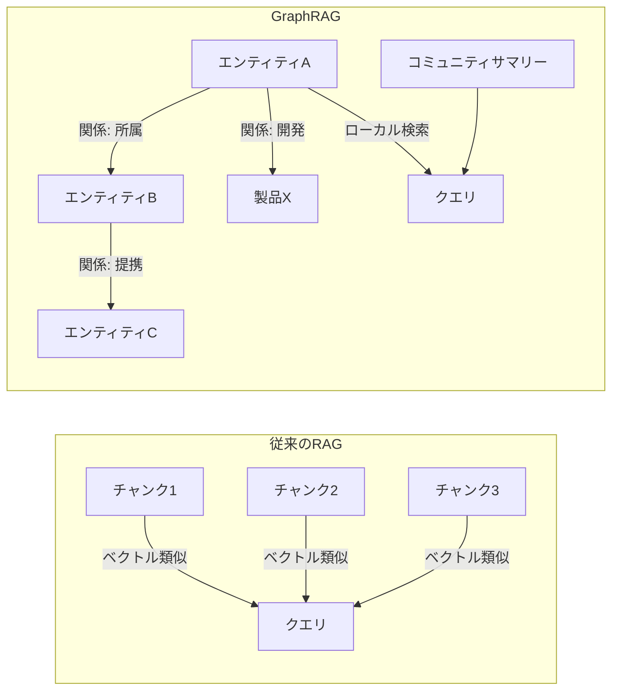
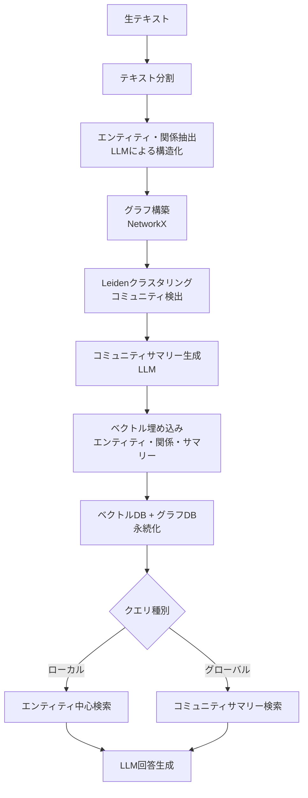
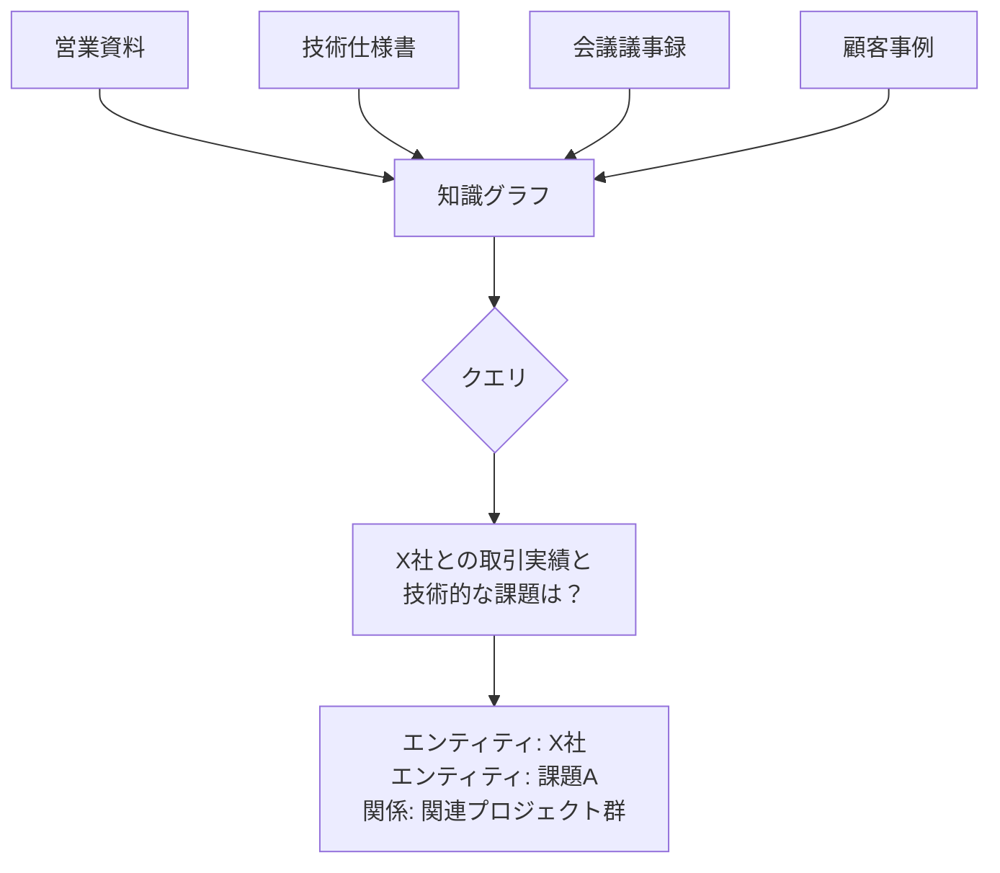
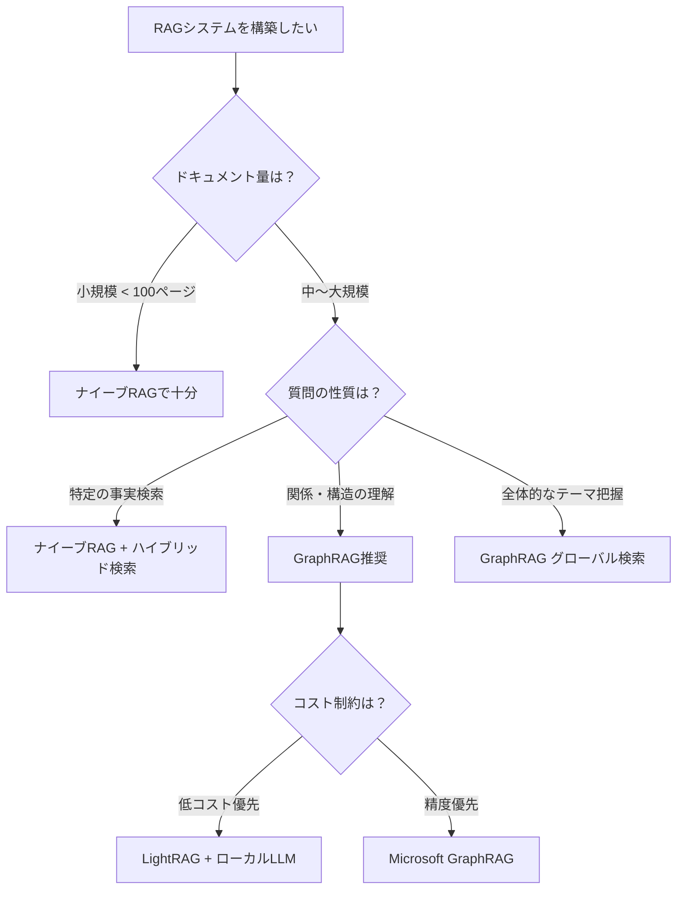

## はじめに：ナイーブRAGの限界

ベクトル検索を使った標準的なRAG（Retrieval-Augmented Generation）は、ドキュメントを固定サイズのチャンクに分割し、意味的に近いチャンクを取得してLLMに渡すアーキテクチャです。

多くのユースケースでは十分ですが、**複雑な質問や文書横断的な情報統合**が求められる場面では、次のような課題が浮き彫りになります。

| 課題 | 具体例 |
|------|--------|
| **チャンク分割による文脈の断絶** | 「A社とB社の関係」が複数ページにまたがっている |
| **グローバルな問いへの対応が苦手** | 「このドキュメント全体を通じたメインテーマは？」 |
| **多段推論の困難さ** | 「Aの原因はBで、BはCによって引き起こされた」という関係を追う |
| **エンティティ間の関係理解** | 同一人物・組織が異なる表記で出現する |

これらの課題を解決するために、2024年にMicrosoftが提案・公開したのが **GraphRAG** です。

## GraphRAGとは

GraphRAGは、**知識グラフ（Knowledge Graph）** とベクトル検索を組み合わせた次世代RAGアーキテクチャです。

従来のRAGが「文書の断片」を検索するのに対し、GraphRAGは文書内の**エンティティ（人物・組織・概念等）とその関係**を抽出してグラフ構造として保持します。



### GraphRAGの主要コンポーネント

1. **エンティティ抽出**: LLMを使ってテキストから人物・組織・概念を抽出
2. **関係抽出**: エンティティ間の関係（動詞・述語）を抽出
3. **コミュニティ検出**: グラフのクラスタリングで関連エンティティをグループ化
4. **コミュニティサマリー**: 各コミュニティの要約をLLMで生成（Leiden Algorithm使用）
5. **2段階検索**: ローカル検索（特定エンティティ周辺）とグローバル検索（コミュニティサマリー活用）

## インデックス構築パイプライン

GraphRAGのパイプラインは大きく「インデックス構築フェーズ」と「クエリフェーズ」に分かれます。



### Microsoft GraphRAGライブラリのセットアップ

```bash
pip install graphrag==1.0.0
```

```bash
# プロジェクト初期化
mkdir my-graphrag-project && cd my-graphrag-project
python -m graphrag init --root .
```

初期化すると以下のような構造が作られます：

```
my-graphrag-project/
├── settings.yaml       # 設定ファイル
├── .env                # APIキー等
└── input/              # ここに分析対象ドキュメントを置く
```

### settings.yaml の主要設定

```yaml
# settings.yaml
llm:
  api_key: ${GRAPHRAG_API_KEY}
  type: openai_chat
  model: gpt-4o-mini       # エンティティ抽出コストを抑えるためmini推奨
  model_supports_json: true
  max_tokens: 4000

embeddings:
  async_mode: threaded
  llm:
    api_key: ${GRAPHRAG_API_KEY}
    type: openai_embedding
    model: text-embedding-3-small

chunks:
  size: 1200
  overlap: 100
  group_by_columns: [id]   # ドキュメントIDでグループ化

entity_extraction:
  ## エンティティタイプを明示することで精度が上がる
  entity_types: [organization, person, concept, event, location, product]
  max_gleanings: 1

community_reports:
  max_length: 2000
  max_input_length: 8000

cluster_graph:
  max_cluster_size: 10

storage:
  type: file
  base_dir: "output/${timestamp}/artifacts"
```

### インデックス構築の実行

```bash
# input/ ディレクトリにテキストファイルを配置後
python -m graphrag index --root .
```

> ⚠️ **コスト注意**: エンティティ抽出はすべてのチャンクにLLMを使うため、大規模ドキュメントではコストが高くなります。1MBのテキストで約$1〜3（GPT-4o-mini使用時）を目安に。

## クエリの実装

### ローカル検索：特定エンティティ周辺の詳細な回答

ローカル検索は特定のエンティティや概念に関する**詳細な情報**を取得するのに最適です。

```python
import asyncio
from graphrag.query.context_builder.entity_extraction import EntityVectorStoreKey
from graphrag.query.indexer_adapters import (
    read_indexer_communities,
    read_indexer_covariates,
    read_indexer_entities,
    read_indexer_relationships,
    read_indexer_reports,
    read_indexer_text_units,
)
from graphrag.query.llm.oai.chat_openai import ChatOpenAI
from graphrag.query.llm.oai.embedding import OpenAIEmbedding
from graphrag.query.llm.oai.typing import OpenaiApiType
from graphrag.query.structured_search.local_search.mixed_context import LocalSearchMixedContext
from graphrag.query.structured_search.local_search.search import LocalSearch
from graphrag.vector_stores.lancedb import LanceDBVectorStore

INPUT_DIR = "./output/TIMESTAMP/artifacts"
LANCEDB_URI = f"{INPUT_DIR}/lancedb"

# LLMとエンベディングの初期化
llm = ChatOpenAI(
    api_key="YOUR_API_KEY",
    model="gpt-4o",
    api_type=OpenaiApiType.OpenAI,
    max_retries=20,
)

text_embedder = OpenAIEmbedding(
    api_key="YOUR_API_KEY",
    api_base=None,
    api_type=OpenaiApiType.OpenAI,
    model="text-embedding-3-small",
    deployment_name="text-embedding-3-small",
    max_retries=20,
)

# データ読み込み
import pandas as pd
entities = read_indexer_entities(
    pd.read_parquet(f"{INPUT_DIR}/create_final_entities.parquet"),
    pd.read_parquet(f"{INPUT_DIR}/create_final_nodes.parquet"),
    2  # コミュニティレベル
)
relationships = read_indexer_relationships(
    pd.read_parquet(f"{INPUT_DIR}/create_final_relationships.parquet")
)
text_units = read_indexer_text_units(
    pd.read_parquet(f"{INPUT_DIR}/create_final_text_units.parquet")
)

# ベクトルストアの設定
description_embedding_store = LanceDBVectorStore(
    collection_name="default-entity-description"
)
description_embedding_store.connect(db_uri=LANCEDB_URI)

# ローカル検索エンジンの構築
context_builder = LocalSearchMixedContext(
    community_reports=read_indexer_reports(
        pd.read_parquet(f"{INPUT_DIR}/create_final_community_reports.parquet"),
        pd.read_parquet(f"{INPUT_DIR}/create_final_nodes.parquet"),
        2
    ),
    text_units=text_units,
    entities=entities,
    relationships=relationships,
    entity_text_embeddings=description_embedding_store,
    embedding_vectorstore_key=EntityVectorStoreKey.ID,
    text_embedder=text_embedder,
)

search_engine = LocalSearch(
    llm=llm,
    context_builder=context_builder,
    token_encoder=None,
    llm_params={
        "max_tokens": 2000,
        "temperature": 0.0,
    },
    context_builder_params={
        "use_community_summary": False,
        "shuffle_data": True,
        "include_community_rank": True,
        "min_community_rank": 0,
        "community_rank_name": "rank",
        "include_entity_rank": True,
        "entity_rank_name": "rank",
        "max_tokens": 12000,
    },
    response_type="multiple paragraphs",
)

# 検索実行
result = asyncio.run(search_engine.asearch("A社のCTO田中氏のキャリアと実績について教えてください"))
print(result.response)
```

### グローバル検索：ドキュメント全体を俯瞰した回答

グローバル検索は「**全体的なテーマ**」「**主要なトレンド**」といった俯瞰的な質問に強みを発揮します。

```python
from graphrag.query.structured_search.global_search.community_context import GlobalCommunityContext
from graphrag.query.structured_search.global_search.search import GlobalSearch

# コミュニティデータの読み込み
reports = read_indexer_reports(
    pd.read_parquet(f"{INPUT_DIR}/create_final_community_reports.parquet"),
    pd.read_parquet(f"{INPUT_DIR}/create_final_nodes.parquet"),
    2
)

# グローバル検索エンジンの構築
context_builder_global = GlobalCommunityContext(
    community_reports=reports,
    entities=entities,
    token_encoder=None,
)

search_engine_global = GlobalSearch(
    llm=llm,
    context_builder=context_builder_global,
    token_encoder=None,
    max_data_tokens=12000,
    map_llm_params={
        "max_tokens": 1000,
        "temperature": 0.0,
        "response_format": {"type": "json_object"},
    },
    reduce_llm_params={
        "max_tokens": 2000,
        "temperature": 0.0,
    },
    allow_general_knowledge=False,
    json_mode=True,
    context_builder_params={
        "use_community_summary": True,   # サマリーを活用
        "shuffle_data": True,
        "include_community_rank": True,
        "min_community_rank": 0,
        "max_tokens": 12000,
    },
    concurrent_coroutines=32,
    response_type="multiple paragraphs",
)

# 俯瞰的な質問はグローバル検索が得意
result = asyncio.run(
    search_engine_global.asearch("このドキュメント群全体を通じて、最も重要な技術的課題は何ですか？")
)
print(result.response)
```

## ナイーブRAGとの精度比較

Microsoftの論文では、GraphRAGがナイーブRAGに対して特に「包括性」と「多様性」において優れることが示されています。

| 評価軸 | ナイーブRAG | GraphRAG (Local) | GraphRAG (Global) |
|--------|-------------|------------------|-------------------|
| **包括性** | 62% | 71% | **82%** |
| **多様性** | 57% | 68% | **86%** |
| **権威性** | 64% | 67% | **72%** |
| **直接性** | **74%** | 67% | 64% |

> 出典: Edge et al., "From Local to Global: A Graph RAG Approach to Query-Focused Summarization" (2024)

**解釈**:
- グローバル検索は包括性・多様性で圧倒的に強い（全体像の把握）
- ナイーブRAGは直接的な事実確認クエリでは依然として有効
- ローカル検索は両者のバランスが取れたアプローチ

## Lightweight GraphRAG：コストを抑えた実装

Microsoft GraphRAGのフルパイプラインはコストが高いため、より軽量なアプローチも紹介します。

### LightRAG：シンプルで高速なグラフRAG実装

```bash
pip install lightrag-hku
```

```python
import asyncio
import os
from lightrag import LightRAG, QueryParam
from lightrag.llm.openai import gpt_4o_mini_complete, openai_embed
from lightrag.utils import EmbeddingFunc

# LightRAGの初期化
rag = LightRAG(
    working_dir="./lightrag_cache",
    llm_model_func=gpt_4o_mini_complete,
    embedding_func=EmbeddingFunc(
        embedding_dim=1536,
        max_token_size=8192,
        func=openai_embed,
    ),
)

# ドキュメントの挿入
async def insert_documents():
    with open("document.txt", "r", encoding="utf-8") as f:
        content = f.read()
    await rag.ainsert(content)

asyncio.run(insert_documents())

# 4つのクエリモード
async def query_demo():
    question = "機械学習プロジェクトにおける主要な課題は何ですか？"

    # naive: 標準ベクトル検索
    result_naive = await rag.aquery(question, param=QueryParam(mode="naive"))

    # local: エンティティ中心の検索
    result_local = await rag.aquery(question, param=QueryParam(mode="local"))

    # global: グラフ構造全体を活用
    result_global = await rag.aquery(question, param=QueryParam(mode="global"))

    # hybrid: local + global の組み合わせ（推奨）
    result_hybrid = await rag.aquery(question, param=QueryParam(mode="hybrid"))

    return result_hybrid

result = asyncio.run(query_demo())
print(result)
```

### LightRAGとMicrosoft GraphRAGの比較

| 項目 | Microsoft GraphRAG | LightRAG |
|------|--------------------|----------|
| **セットアップの容易さ** | 中程度 | 簡単 |
| **インデックスコスト** | 高（全チャンクにLLM） | 中（サンプリングあり） |
| **精度** | 高 | やや低 |
| **カスタマイズ性** | 高 | 中 |
| **ローカルLLM対応** | 一部対応 | ✅ 完全対応 |
| **更新頻度** | 中（再構築必要） | 高（増分追加可能） |
| **適しているケース** | 大規模・高精度要件 | プロトタイプ・小〜中規模 |

## ローカルLLMでのGraphRAG構築

APIコストを気にせずGraphRAGを試したい場合は、OllamaとLightRAGの組み合わせが有効です。

```python
import asyncio
from lightrag import LightRAG, QueryParam
from lightrag.llm.ollama import ollama_model_complete, ollama_embed
from lightrag.utils import EmbeddingFunc

# ローカルLLMを使ったGraphRAG
rag = LightRAG(
    working_dir="./local_graphrag",
    llm_model_func=ollama_model_complete,
    llm_model_name="llama3.1:8b",         # Ollamaで動かすモデル
    llm_model_max_async=4,
    llm_model_max_token_size=32768,
    llm_model_kwargs={
        "host": "http://localhost:11434",
        "options": {"num_ctx": 32768},
    },
    embedding_func=EmbeddingFunc(
        embedding_dim=768,
        max_token_size=8192,
        func=lambda texts: ollama_embed(
            texts,
            embed_model="nomic-embed-text",
            host="http://localhost:11434",
        ),
    ),
)

async def main():
    # ドキュメントを挿入してクエリ
    with open("my_docs.txt", encoding="utf-8") as f:
        await rag.ainsert(f.read())

    result = await rag.aquery(
        "主要な登場人物と彼らの関係を教えてください",
        param=QueryParam(mode="hybrid")
    )
    print(result)

asyncio.run(main())
```

> 💡 **Ollamaのモデル選択ヒント**: エンティティ抽出には `llama3.1:8b` や `mistral:7b` が使いやすいですが、精度を上げるなら `llama3.1:70b` や `qwen2.5:32b` が有効です。詳細は[ローカルLLM完全ガイド](/2026/03/23/local-llm-complete-guide.html)を参照してください。

## GraphRAGが特に効果を発揮するユースケース

### 1. 企業内ナレッジベース

複数の部署・プロジェクトにまたがる情報を横断的に検索できます。



### 2. 法律・医療ドキュメント解析

判例・論文・規制文書など、エンティティ間の関係が重要な文書に最適です。

```python
# 法律文書向けのエンティティタイプ設定例
entity_types_legal = [
    "person",          # 原告・被告・裁判官
    "organization",    # 企業・機関
    "law",             # 法令・条文
    "case",            # 判例
    "concept",         # 法律概念
    "date",            # 重要日付
    "location",        # 裁判所・管轄
]
```

### 3. 研究論文の関係抽出

著者・引用・概念の関係グラフを構築し、研究領域の全体像を把握できます。

## GraphRAGの課題と対策

### 課題1: インデックス構築コストが高い

**対策**: 
- GPT-4o-miniなど軽量モデルでエンティティ抽出
- ドキュメントの優先度付けで重要文書のみグラフ化
- LightRAGの増分更新機能を活用

### 課題2: エンティティ抽出の精度

ドメイン固有の専門用語はLLMが正しく抽出できないことがあります。

```python
# カスタムエンティティ抽出プロンプトの例
ENTITY_EXTRACTION_PROMPT = """
以下のテキストから、医療・製薬ドメインの重要エンティティを抽出してください。

対象エンティティタイプ:
- DRUG: 医薬品名（一般名・商品名）
- DISEASE: 疾患・症状名
- GENE: 遺伝子名・タンパク質名
- CLINICAL_TRIAL: 臨床試験識別子
- INSTITUTION: 研究機関・病院名

テキスト: {input_text}
"""
```

### 課題3: グラフの更新・維持

大規模なグラフの差分更新は難しい問題です。

**実用的なアプローチ**:

```python
# 定期的な再インデックスのスケジューリング例
from apscheduler.schedulers.background import BackgroundScheduler

scheduler = BackgroundScheduler()

@scheduler.scheduled_job('cron', hour=2, minute=0)  # 毎日深夜2時
def rebuild_graph_index():
    """週次の全再構築と日次の差分更新を組み合わせる"""
    import subprocess
    subprocess.run(["python", "-m", "graphrag", "index", "--root", "."])
    print("GraphRAGインデックス再構築完了")

scheduler.start()
```

## まとめ：GraphRAGをいつ使うか



GraphRAGは万能ではありませんが、以下の条件が揃う場合は**強力な選択肢**になります：

- ✅ エンティティ間の複雑な関係を問い合わせる必要がある
- ✅ ドキュメント全体を俯瞰した回答が必要
- ✅ 多段推論が求められるクエリが多い
- ✅ ドメイン知識をグラフとして可視化・活用したい

一方、単純な事実検索には[エンベディングとハイブリッド検索](/2026/03/30/embedding-vector-search-guide.html)で十分なケースも多いです。ユースケースに合わせて使い分けることが、AI Nativeエンジニアとしての重要なスキルです。

## 参考資料

- [Edge et al., "From Local to Global: A Graph RAG Approach to Query-Focused Summarization" (2024)](https://arxiv.org/abs/2404.16130)
- [Microsoft GraphRAG GitHub](https://github.com/microsoft/graphrag)
- [LightRAG GitHub](https://github.com/HKUDS/LightRAG)
- [GraphRAG公式ドキュメント](https://microsoft.github.io/graphrag/)
