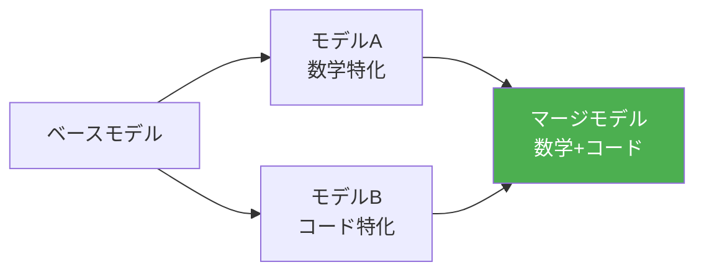
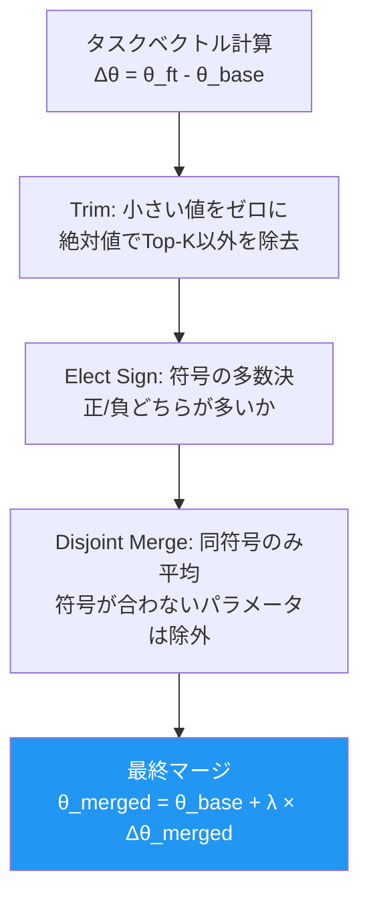
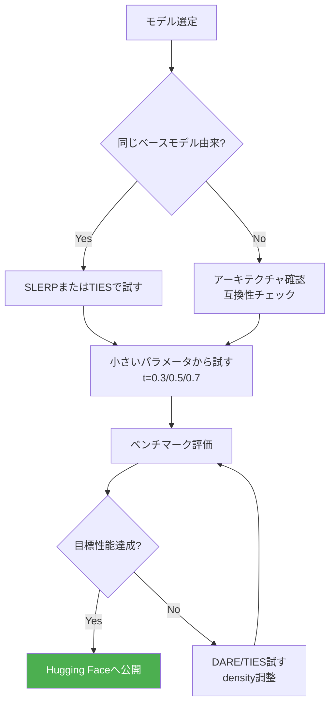

## はじめに：なぜモデルをマージするのか

オープンソースLLMの世界で近年急速に注目を集めている技術が **モデルマージ（Model Merging）** です。

複数のファインチューニング済みモデルの重みを数学的に統合することで、**追加学習なし** で複数の能力を兼ね備えた新しいモデルを生成できます。

| アプローチ | コスト | 能力の統合 | 主な用途 |
|-----------|--------|-----------|---------|
| ファインチューニング | 高（GPU時間・データ） | ✅ 柔軟 | カスタム用途全般 |
| プロンプトエンジニアリング | 低 | ❌ 限定的 | 既存能力の引き出し |
| **モデルマージ** | **極低（CPU可）** | **✅ 広範** | **複数チューニング済みモデルの統合** |

たとえば「数学に強いモデル」と「コーディングに強いモデル」を同じベースから派生させてマージすると、**どちらの能力も持つモデル**が誕生します。Hugging Face上でも `WizardMath`、`Dolphin`、`Nous-Hermes` などの人気モデルが実はマージモデルです。

---

## モデルマージの仕組み：直感的な理解

なぜ重みをブレンドするだけで機能するのでしょうか？

### ニューラルネットワークの線形性モード仮説

LLMのパラメータ空間は **「モード接続性（mode connectivity）」** という性質を持ちます。同じベースモデルからファインチューニングされた複数のモデルは、損失関数の谷（ローカルミニマム）が **線形に繋がっている** ことが多く、その中間点も低い損失を持つことが多いのです。



### タスクベクトルの概念

**Task Arithmetic（2023, Ilharco et al.）** の研究では、ファインチューニングで得られた「能力」をベクトルとして捉えます：

```
タスクベクトル = ファインチューニング後の重み - ベースモデルの重み
```

このベクトルを足したり引いたりすることで、能力の足し算・引き算が可能になります：

```python
# 概念的なコード
math_vector = math_model_weights - base_weights
code_vector = code_model_weights - base_weights

# 両方の能力を持つモデル
merged_weights = base_weights + 0.5 * math_vector + 0.5 * code_vector
```

---

## Mergekit：モデルマージの標準ツール

[**Mergekit**](https://github.com/arcee-ai/mergekit) はArcee AIが開発したオープンソースのモデルマージツールで、事実上の標準ツールとなっています。

### インストール

```bash
pip install mergekit
# または最新版をGitHubから
pip install git+https://github.com/arcee-ai/mergekit.git

# GPU使用時（オプション）
pip install mergekit[vllm]
```

### 基本的な使い方：YAMLでマージレシピを定義

Mergekitはマージ設定をYAMLファイルで定義します：

```yaml
# merge_config.yml
models:
  - model: mistralai/Mistral-7B-v0.1  # ベースモデル
    parameters:
      weight: 1.0  # 通常はbaseを指定

merge_method: slerp  # マージ手法
base_model: mistralai/Mistral-7B-v0.1

slices:
  - sources:
    - model: WizardMath/WizardMath-7B-V1.1
      layer_range: [0, 32]
    - model: deepseek-ai/deepseek-coder-7b-instruct-v1.5
      layer_range: [0, 32]
parameters:
  t: 0.5  # ブレンド比率（0=モデルA、1=モデルB）

dtype: bfloat16
```

```bash
# マージ実行
mergekit-yaml merge_config.yml ./output_model \
  --copy-tokenizer \
  --lazy-unpickle \
  --low-cpu-memory
```

---

## 主要なマージ手法

### 1. SLERP（球面線形補間）

**SLERP（Spherical Linear Interpolation）** は最もシンプルで広く使われる手法です。

2つのモデルの重みを、球面上の弧に沿って補間します。直線補間（LERP）と比べて**重みのノルムを維持**するため、より安定した結果が得られます。

```python
import torch

def slerp(t: float, v0: torch.Tensor, v1: torch.Tensor, dot_threshold: float = 0.9995):
    """
    球面線形補間（SLERP）の実装
    t=0.0 → v0, t=1.0 → v1
    """
    # 単位ベクトルに正規化
    v0_norm = v0 / torch.norm(v0)
    v1_norm = v1 / torch.norm(v1)
    
    dot = torch.clamp(torch.dot(v0_norm.flatten(), v1_norm.flatten()), -1.0, 1.0)
    
    # ほぼ同じ方向なら線形補間にフォールバック
    if abs(dot) > dot_threshold:
        return (1 - t) * v0 + t * v1
    
    theta_0 = torch.acos(dot)
    theta_t = theta_0 * t
    
    sin_theta_0 = torch.sin(theta_0)
    sin_theta_t = torch.sin(theta_t)
    
    s0 = torch.cos(theta_t) - dot * sin_theta_t / sin_theta_0
    s1 = sin_theta_t / sin_theta_0
    
    return s0 * v0 + s1 * v1
```

**YAML設定例：**

```yaml
merge_method: slerp
base_model: mistralai/Mistral-7B-v0.1
models:
  - model: model_A
  - model: model_B
parameters:
  t:
    - filter: self_attn  # AttentionレイヤーはモデルAよりに
      value: 0.3
    - filter: mlp         # MLPレイヤーはモデルBよりに
      value: 0.7
    - value: 0.5          # その他は50/50
dtype: bfloat16
```

---

### 2. TIES（重みの干渉を除去するマージ）

**TIES-Merging（Trim, Elect Sign & Merge、2023）** は、複数モデルをマージする際の**パラメータ干渉問題**を解決します。

3つのステップで構成されます：



```yaml
# TIES マージ設定
merge_method: ties
base_model: mistralai/Mistral-7B-v0.1
models:
  - model: WizardMath/WizardMath-7B-V1.1
    parameters:
      weight: 0.5
      density: 0.7  # 上位70%のパラメータのみ使用（Trim）
  - model: deepseek-ai/deepseek-coder-7b-instruct-v1.5
    parameters:
      weight: 0.5
      density: 0.7
parameters:
  normalize: true  # 重みの正規化
  int8_mask: true  # メモリ効率化
dtype: bfloat16
```

---

### 3. DARE（スパース化によるノイズ除去）

**DARE（Drop And REscale、2024）** は、タスクベクトルのパラメータをランダムにドロップ（ゼロ化）してからスケールアップします。

```python
def dare_transform(task_vector: torch.Tensor, p: float = 0.1) -> torch.Tensor:
    """
    DARE変換: p の割合をランダムにゼロに、残りをスケールアップ
    p: ドロップ率（デフォルト0.1 = 10%をゼロ化）
    """
    # ランダムマスク生成（p の確率でゼロ）
    mask = torch.bernoulli(torch.ones_like(task_vector) * (1 - p))
    
    # マスク適用 + スケールアップ（期待値を保持）
    return task_vector * mask / (1 - p)
```

TIESとDAREは組み合わせて使うことが多く、Mergekitでは `dare_ties` や `dare_linear` として提供されています：

```yaml
merge_method: dare_ties
base_model: meta-llama/Llama-3.1-8B
models:
  - model: math_specialized_model
    parameters:
      weight: 0.4
      density: 0.53  # DARE ドロップ率
  - model: code_specialized_model
    parameters:
      weight: 0.4
      density: 0.53
  - model: instruction_following_model
    parameters:
      weight: 0.2
      density: 0.53
dtype: bfloat16
```

---

### 4. Frankenmerge（レイヤースタッキング）

**Frankenmerge** はSLERPやTIESとは全く異なるアプローチで、異なるモデルのレイヤーを **積み重ねて** 大きなモデルを作る手法です。

たとえば8Bモデルの特定レイヤーを複数コピーして擬似的な70Bを作ることが可能です（**Passthrough** とも呼ばれます）：

```yaml
merge_method: passthrough
dtype: bfloat16
slices:
  # モデルAの前半レイヤー（0-15）
  - sources:
    - model: meta-llama/Llama-3.1-8B-Instruct
      layer_range: [0, 16]
  # モデルBの中盤レイヤー（8-23）
  - sources:
    - model: Qwen/Qwen2.5-7B-Instruct
      layer_range: [8, 24]
  # モデルAの後半レイヤー（16-31）
  - sources:
    - model: meta-llama/Llama-3.1-8B-Instruct
      layer_range: [16, 32]
```

⚠️ **注意**: アーキテクチャが完全に同一（同じベースモデルから派生）でないとレイヤーサイズが合わず失敗します。

---

### 5. Task Arithmetic

**Task Arithmetic** はタスクベクトルを明示的に足し引きする手法で、能力の追加だけでなく**除去**も可能です：

```python
import torch
from safetensors.torch import load_file, save_file

def load_model_weights(path: str) -> dict:
    return load_file(f"{path}/model.safetensors")

# ベースモデルと各ファインチューニング済みモデルの重みを読み込み
base = load_model_weights("base_model")
math_ft = load_model_weights("math_finetuned")
toxic_ft = load_model_weights("toxic_content_model")  # 除去したい能力

# タスクベクトルの計算
math_vector = {k: math_ft[k] - base[k] for k in base}
toxic_vector = {k: toxic_ft[k] - base[k] for k in base}

# 数学能力を追加し、有害コンテンツ生成能力を除去
scaling = 0.7
merged = {
    k: base[k] + scaling * math_vector[k] - scaling * toxic_vector[k]
    for k in base
}

save_file(merged, "merged_model/model.safetensors")
```

---

## 実践レシピ集

### レシピ1：汎用性能+コーディング能力のバランスモデル

```yaml
# recipe_general_coding.yml
merge_method: dare_ties
base_model: meta-llama/Llama-3.1-8B

models:
  - model: meta-llama/Llama-3.1-8B-Instruct  # 汎用指示追従
    parameters:
      weight: 0.6
      density: 0.6
  - model: Qwen/Qwen2.5-Coder-7B-Instruct    # コーディング特化
    parameters:
      weight: 0.4
      density: 0.6

parameters:
  normalize: true
  int8_mask: true

dtype: bfloat16
tokenizer_source: union
```

> ⚠️ **注意**: 異なるトークナイザーを持つモデル（QwenとLlamaなど）のマージは、`tokenizer_source: union` が必要で、語彙の整合性確保が重要です。同じベースモデルから派生したモデルのマージの方が安全です。

---

### レシピ2：日本語+英語能力の強化

```yaml
# recipe_multilingual.yml
merge_method: slerp
base_model: meta-llama/Llama-3.1-8B-Instruct

models:
  - model: meta-llama/Llama-3.1-8B-Instruct   # 英語ベース
  - model: tokyotech-llm/Llama-3.1-Swallow-8B-Instruct  # 日本語強化版

parameters:
  t:
    - filter: embed_tokens  # トークン埋め込みは日本語モデル寄りに
      value: 0.7
    - filter: lm_head        # 出力層も日本語モデル寄り
      value: 0.7
    - value: 0.5             # その他レイヤーは50/50

dtype: bfloat16
```

---

### レシピ3：スパース化で軽量化しつつ能力保持

```yaml
# recipe_efficient_merge.yml
merge_method: dare_linear
base_model: mistralai/Mistral-7B-v0.1

models:
  - model: teknium/OpenHermes-2.5-Mistral-7B
    parameters:
      weight: 1.0
      density: 0.3  # 70%のパラメータをゼロ化→スパースなデルタ

dtype: bfloat16
```

---

## マージ後の評価方法

マージが成功したかどうかを定量的に評価します。

### lm-evaluation-harnessによるベンチマーク

```bash
pip install lm-eval

# 主要ベンチマークで評価
lm_eval --model hf \
  --model_args pretrained=./merged_model \
  --tasks arc_challenge,hellaswag,mmlu,truthfulqa_mc2,winogrande,gsm8k \
  --device cuda \
  --batch_size 8 \
  --output_path ./eval_results
```

### Pythonでの簡易評価スクリプト

```python
from transformers import AutoTokenizer, AutoModelForCausalLM
import torch

def quick_eval(model_path: str, prompts: list[str]) -> None:
    """マージモデルの簡易評価"""
    tokenizer = AutoTokenizer.from_pretrained(model_path)
    model = AutoModelForCausalLM.from_pretrained(
        model_path,
        torch_dtype=torch.bfloat16,
        device_map="auto"
    )
    
    for prompt in prompts:
        inputs = tokenizer(prompt, return_tensors="pt").to(model.device)
        outputs = model.generate(
            **inputs,
            max_new_tokens=200,
            temperature=0.1,
            do_sample=True,
        )
        response = tokenizer.decode(outputs[0][inputs.input_ids.shape[1]:], skip_special_tokens=True)
        print(f"Prompt: {prompt[:50]}...")
        print(f"Response: {response}\n")

# 評価プロンプト例
test_prompts = [
    # 数学能力のテスト
    "次の連立方程式を解いてください：2x + 3y = 12, x - y = 1",
    # コーディング能力のテスト
    "Pythonで二分探索アルゴリズムを実装してください。",
    # 日本語能力のテスト
    "日本の四季それぞれの特徴を簡潔にまとめてください。",
    # 指示追従のテスト
    "次の文章を3つの箇条書きで要約してください：[文章...]"
]

quick_eval("./merged_model", test_prompts)
```

### ベースラインとの比較表

評価結果をスプレッドシートや可視化ツールで比較します：

| モデル | ARC | HellaSwag | MMLU | GSM8K | HumanEval |
|--------|-----|-----------|------|-------|-----------|
| ベースモデル | 60.2 | 81.3 | 63.5 | 52.1 | 34.8 |
| 数学特化モデル | 59.8 | 80.1 | 62.9 | **71.2** | 32.1 |
| コード特化モデル | 61.0 | 80.5 | 63.1 | 54.3 | **62.8** |
| **マージモデル** | **62.1** | **82.0** | **64.2** | **68.5** | **58.4** |

*数字はダミーです。実際のマージ結果は手法・設定により大きく異なります。*

---

## Hugging Faceへのアップロード

満足のいくマージモデルができたらHugging Faceで共有できます：

```python
from huggingface_hub import HfApi, create_repo
import shutil

MODEL_NAME = "your-username/llama3-merged-math-code-8b"

# リポジトリ作成
create_repo(MODEL_NAME, private=False)

# アップロード
api = HfApi()
api.upload_folder(
    folder_path="./merged_model",
    repo_id=MODEL_NAME,
    repo_type="model",
)

print(f"モデルをアップロードしました: https://huggingface.co/{MODEL_NAME}")
```

**READMEのModel Cardには必ず記載すること：**
- 使用したベースモデル名とライセンス
- マージ手法とパラメータ
- 評価結果
- ライセンス継承（ベースモデルのライセンスに従う）

---

## よくある失敗と対処法

### 1. マージ後に出力が崩壊する

**症状**: モデルが意味不明なテキストや繰り返しを生成する  
**原因**: トークナイザーの不一致、またはアーキテクチャの非互換性  
**対処**:
```yaml
# 同じアーキテクチャのモデル同士を選ぶ
# トークナイザーが同一のモデル（同じベースモデル由来）を使用
tokenizer_source: base  # または union
```

### 2. `Out of Memory` エラー

```bash
# CPU マージ（時間はかかるが低VRAM環境でも動作）
mergekit-yaml config.yml ./output \
  --no-cuda \
  --lazy-unpickle \
  --low-cpu-memory
```

### 3. パフォーマンスが向上しない

```yaml
# density パラメータを調整してみる
# 低すぎると能力が失われ、高すぎると干渉が増える
# まず 0.5〜0.7 の範囲で試す
parameters:
  density: 0.6  # デフォルト値から調整
  weight: 0.5
```

### 4. 特定タスクで逆に性能が下がった

タスクベクトル同士の **負の干渉** が起きている可能性があります。TIESのSign Electionが解決策になることが多いです：

```yaml
merge_method: ties  # SLERPからTIESに変更
# または dare_ties で干渉をより積極的に除去
```

---

## 高度なテクニック

### LoRAアダプターのマージ

LoRAアダプターをベースモデルにマージする（適用する）のもMergekitで可能です：

```yaml
merge_method: linear
models:
  - model: meta-llama/Llama-3.1-8B
    parameters:
      weight: 1.0
  - model: path/to/lora_adapter  # LoRAアダプター
    parameters:
      weight: 0.8  # スケール係数（通常 lora_alpha/lora_r に相当）
dtype: bfloat16
```

### Evolutionary Merge（進化的マージ）

Mergekitには遺伝的アルゴリズムを使ってマージパラメータを自動最適化する機能もあります：

```bash
mergekit-evolve \
  --config evo_config.yml \
  --storage-path ./evo_storage \
  --max-fevals 100 \  # 評価回数上限
  --eval-task arc_challenge \
  --num-workers 4
```

```yaml
# evo_config.yml
genome:
  models:
    - mistral_base
    - math_model
    - code_model
  merge_method: ties
  layer_granularity: 8  # レイヤーごとにパラメータを変化させる粒度

# 最適化対象タスク
evaluation:
  tasks: [arc_challenge, gsm8k]
  limit: 200  # 高速化のためサブセットで評価
```

---

## モデルマージのベストプラクティス



1. **同じベースモデルから派生したモデルを選ぶ** — 最も安全で効果が高い
2. **まずSLERPで試す** — シンプルで効果的、パラメータが少ない
3. **t=0.5から始めて調整** — まず50/50からスタート
4. **各レイヤーに異なる比率を設定** — Attention/MLP/Embeddingで役割が違う
5. **小さいモデルで実験** — 7Bで成功してから70Bへスケール
6. **ベンチマークで定量評価** — 主観的な評価だけに頼らない

---

## まとめ

モデルマージは「**ファインチューニングなしの能力拡張**」という強力な手法です。

| 手法 | 強み | 向いているケース |
|------|------|----------------|
| SLERP | シンプル・安定 | 2モデルのブレンド |
| TIES | 干渉除去 | 3モデル以上のマージ |
| DARE | スパース化 | TIESと組み合わせて使用 |
| Task Arithmetic | 能力の加算・減算 | 特定能力の付与・除去 |
| Frankenmerge | モデルサイズ変更 | レイヤー選択的な統合 |

GPUメモリが少ない環境でも、CPU上でマージ自体は実行可能です。まずは小さなモデルで試して、マージの感覚をつかんでみてください。

---

## 参考資料

- [Mergekit GitHub](https://github.com/arcee-ai/mergekit) — メインツール
- [Task Arithmetic (Ilharco et al., 2023)](https://arxiv.org/abs/2212.04089) — タスクベクトルの原論文
- [TIES-Merging (Yadav et al., 2023)](https://arxiv.org/abs/2306.01708) — TIES原論文
- [DARE (Yu et al., 2024)](https://arxiv.org/abs/2311.03099) — DARE原論文
- [Evolutionary Optimization of Model Merging Recipes (Akiba et al., 2024)](https://arxiv.org/abs/2403.13187) — 進化的マージの原論文
- [Mergekit ドキュメント](https://docs.arcee.ai/)
- [Open LLM Leaderboard](https://huggingface.co/spaces/HuggingFaceH4/open_llm_leaderboard) — マージモデルのベンチマーク比較
