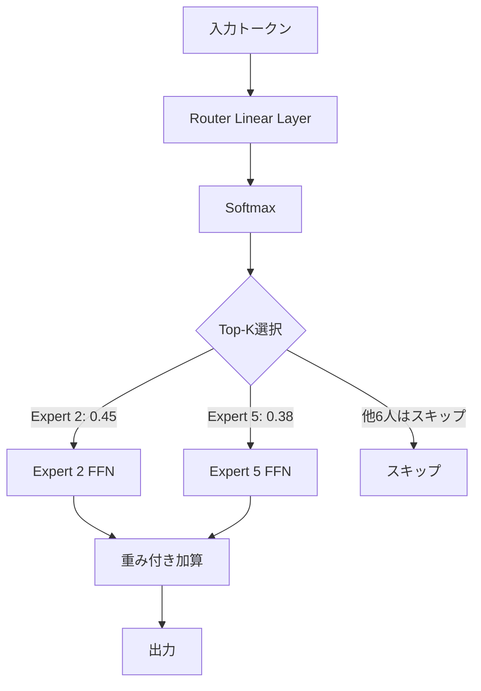
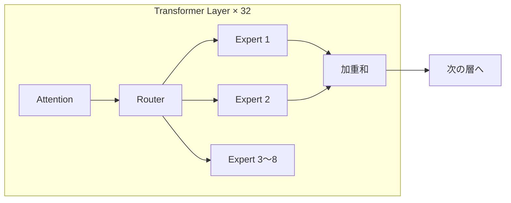
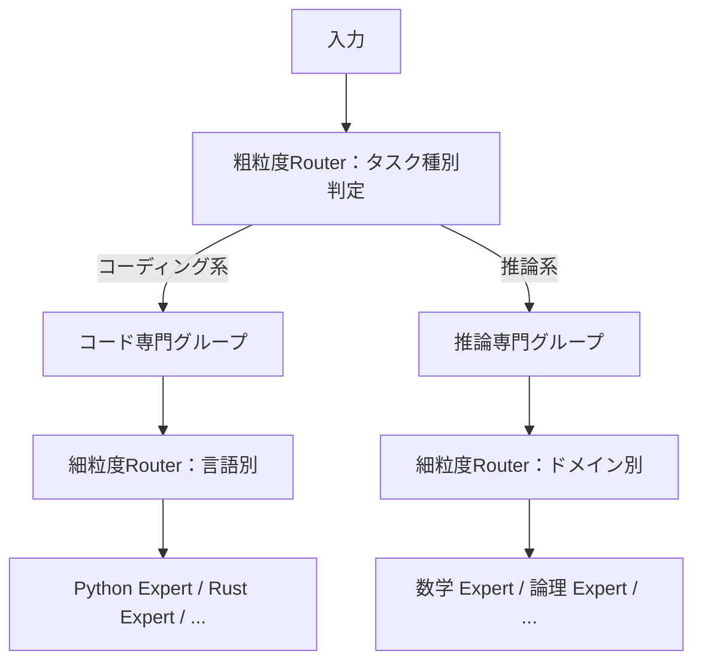

## はじめに：なぜMoEが2026年のLLMを席巻しているのか

2024〜2026年にかけて、主要な大規模言語モデルの多くが **Mixture of Experts（MoE）** アーキテクチャを採用しています。

- **Mixtral 8x7B / 8x22B**（Mistral AI）
- **DeepSeek-V2 / V3**（DeepSeek）
- **Gemini 1.5 / 2.x**（Google DeepMind）
- **GPT-4**（OpenAI、非公式情報）

なぜこれほど多くのモデルがMoEに移行しているのか。その理由は一言で言えば、**「同じ計算コストでより賢いモデルを作れるから」**です。

本記事では、MoEの理論的な仕組みから実装の詳細、エンジニアが実際にMoEモデルを使う際に知っておくべき注意点まで徹底解説します。

## MoEとは何か：密なモデルと疎なモデルの違い

### 従来のDenseモデル

従来のTransformerベースのLLM（GPT-2、LLaMA等）では、入力トークンが**すべてのパラメータ**を通過して処理されます。

```
入力トークン → Attention層 → FFN層（全パラメータ使用） → 出力
```

例えば70Bパラメータのモデルなら、1トークンを処理するたびに70B個のパラメータが活性化されます。

### MoEのアイデア：専門家チームに振り分ける

MoEは、FFN（Feed-Forward Network）層を**複数の「専門家（Expert）」に分割**し、各トークンを**一部の専門家にのみ**ルーティングする仕組みです。

```
入力トークン → Attention層 → Router → [Expert 1, Expert 3のみ] → 出力
                                       [Expert 2, 4, 5, 6, 7, 8はスキップ]
```

| 指標 | Denseモデル（70B） | MoEモデル（8x22B） |
|------|----------------|----------------|
| 総パラメータ数 | 70B | ~140B |
| 推論時の活性化パラメータ | 70B | ~39B（2 experts使用） |
| 推論コスト | 高い | Denseの約55%相当 |
| 性能（同コスト比） | 基準 | 高い |

**ポイント**: MoEモデルはパラメータ数は大きいが、**推論時の計算量はずっと少ない**。

## MoEの核心：ルーターの仕組み

### ゲーティングネットワーク

各トークンをどの専門家に送るかを決めるのが**ゲーティングネットワーク（Router）**です。

```python
import torch
import torch.nn as nn
import torch.nn.functional as F

class MoERouter(nn.Module):
    def __init__(self, d_model: int, num_experts: int, top_k: int = 2):
        super().__init__()
        self.num_experts = num_experts
        self.top_k = top_k
        # ルーター: hidden_dim → num_experts のシンプルな線形層
        self.gate = nn.Linear(d_model, num_experts, bias=False)

    def forward(self, x: torch.Tensor):
        # x: [batch_size, seq_len, d_model]
        # ルーターのロジットを計算
        router_logits = self.gate(x)  # [batch, seq_len, num_experts]
        
        # Top-K専門家を選択
        router_probs = F.softmax(router_logits, dim=-1)
        top_k_probs, top_k_indices = torch.topk(router_probs, self.top_k, dim=-1)
        
        # 選ばれた専門家のスコアを正規化
        top_k_probs = top_k_probs / top_k_probs.sum(dim=-1, keepdim=True)
        
        return top_k_probs, top_k_indices
```

### Top-Kルーティング

代表的な手法は**Top-2ルーティング**で、各トークンを最もスコアの高い2人の専門家に送ります。



## 最重要課題：負荷分散問題

MoEの最大の課題は**特定の専門家に処理が集中してしまう**問題です。

### なぜ負荷が偏るのか

ルーターは学習初期から「評判の良い」専門家を選び続ける傾向があります。すると：

1. 特定の専門家が大量のトークンを受け取る（**Expert Collapse**）
2. その専門家ばかりが学習される
3. 他の専門家は「使われないまま」になる
4. 実質的にMoEがDenseモデルと同じになってしまう

### 解決策1：補助損失（Auxiliary Loss）

最もシンプルな対策は、専門家の利用が均等になるよう**追加の損失関数**を設けることです。

```python
def auxiliary_loss(router_probs: torch.Tensor, top_k_indices: torch.Tensor,
                   num_experts: int, alpha: float = 0.01) -> torch.Tensor:
    """
    各専門家への割り当て率が均等になるよう促す補助損失。
    Mixtral・Switch Transformerで採用されている方式。
    """
    # 各専門家が選ばれた回数（ソフトカウント）
    expert_mask = F.one_hot(top_k_indices, num_experts).float()
    # [batch, seq, top_k, num_experts] → [num_experts]
    expert_load = expert_mask.mean(dim=[0, 1, 2])
    
    # ルーターの平均確率
    mean_probs = router_probs.mean(dim=[0, 1])
    
    # 均等分散からの乖離を最小化
    loss = num_experts * (mean_probs * expert_load).sum()
    return alpha * loss
```

### 解決策2：Expert Capacity（容量制限）

各専門家が処理できるトークン数に**上限（キャパシティ）**を設けます。上限を超えたトークンはスキップされます。

```python
class CapacityConstrainedMoE(nn.Module):
    def __init__(self, num_experts: int, capacity_factor: float = 1.25):
        super().__init__()
        self.num_experts = num_experts
        # 理想的な1専門家あたりのトークン数の何倍まで許容するか
        self.capacity_factor = capacity_factor

    def get_capacity(self, num_tokens: int) -> int:
        # 均等分散の場合の1専門家あたりのトークン数 × capacity_factor
        ideal_tokens_per_expert = num_tokens / self.num_experts
        return int(ideal_tokens_per_expert * self.capacity_factor)
```

### 解決策3：DeepSeekの革新 — 細粒度Expert + SharedExpert

DeepSeek-V2/V3では、より洗練されたアプローチを採用しています。

```python
"""
DeepSeek-V3のMoE設計（概念コード）:
- 256個の細粒度専門家（各専門家は小さい）
- Top-8でルーティング（多くの専門家を少しずつ使う）
- 常時稼働のShared Expert（全トークンが通過する共通専門家）
"""

class DeepSeekMoELayer(nn.Module):
    def __init__(self, d_model: int, num_routed_experts: int = 256,
                 top_k: int = 8, num_shared_experts: int = 1):
        super().__init__()
        # ルーティングされる専門家（スパース）
        self.routed_experts = nn.ModuleList([
            FeedForward(d_model, d_model // 4)  # 小さいFFN
            for _ in range(num_routed_experts)
        ])
        # 全トークンが通過するShared Expert（密）
        self.shared_experts = nn.ModuleList([
            FeedForward(d_model, d_model)
            for _ in range(num_shared_experts)
        ])
        self.router = MoERouter(d_model, num_routed_experts, top_k)

    def forward(self, x):
        # Shared expertは常に実行
        shared_out = sum(e(x) for e in self.shared_experts)
        
        # Routed expertは選択的に実行
        probs, indices = self.router(x)
        routed_out = self._dispatch_and_combine(x, probs, indices)
        
        return shared_out + routed_out
```

## 主要MoEモデルの比較

| モデル | 総パラメータ | 活性化パラメータ | 専門家数 | Top-K | 特徴 |
|--------|------------|----------------|---------|-------|------|
| Mixtral 8x7B | 47B | 13B | 8 | 2 | オープンソース・バランス型 |
| Mixtral 8x22B | 141B | 39B | 8 | 2 | 高性能オープン |
| DeepSeek-V2 | 236B | 21B | 160 | 6 | 細粒度Expert・超高効率 |
| DeepSeek-V3 | 671B | 37B | 256+1 | 8+1 | SOTA性能・Shared Expert |
| Gemini 1.5 Pro | 非公開 | 非公開 | 非公開 | 非公開 | 1Mコンテキスト対応 |

### Mixtral 8x7Bの構造



Mixtralは各Transformer層に8つの専門家を持ち、各トークンは2つを使用。**実効的な計算量はMistral 7Bと同等**でありながら、47Bのパラメータから恩恵を受けます。

### DeepSeek-V3の革新

DeepSeek-V3は以下の工夫でコスト効率を大幅に改善しました：

```python
"""
DeepSeek-V3 の主要な技術的貢献：

1. Multi-head Latent Attention (MLA)
   - KVキャッシュを最大93%削減
   - 低ランク行列でKey/Valueを圧縮

2. Auxiliary-Loss-Free Load Balancing
   - 補助損失なしで負荷分散
   - バイアス項の動的更新で解決

3. FP8 Mixed Precision Training
   - H800 GPU × 2,048台で2.788Mトークン/秒
   - 訓練コスト約560万ドル（GPT-4比で1/10以下と推定）
"""
```

## エンジニアが知るべき：MoEモデルを使う際の注意点

### 1. メモリ要件はDenseより大きい

MoEモデルは推論時の計算量は少ないですが、**すべての専門家のパラメータをメモリに保持する必要**があります。

```python
# Mixtral 8x7B のメモリ試算
params = 46_700_000_000  # 47B
bytes_per_param_fp16 = 2
total_memory_gb = params * bytes_per_param_fp16 / (1024**3)
print(f"fp16での必要VRAM: {total_memory_gb:.1f} GB")
# → 約87 GB（A100 80GB×2台が必要）

# 4bit量子化なら
bytes_per_param_q4 = 0.5
total_memory_q4 = params * bytes_per_param_q4 / (1024**3)
print(f"4bit量子化での必要VRAM: {total_memory_q4:.1f} GB")
# → 約22 GB（RTX 3090単体でも動作可能）
```

### 2. llama.cppでMoEを動かす実践例

```bash
# Mixtral 8x7B Q4_K_M をダウンロード
huggingface-cli download bartowski/Mixtral-8x7B-Instruct-v0.1-GGUF \
  --include "Mixtral-8x7B-Instruct-v0.1-Q4_K_M.gguf" \
  --local-dir ./models/

# llama.cppで推論（MoEはCPUオフロードと相性が良い）
./llama-cli \
  -m ./models/Mixtral-8x7B-Instruct-v0.1-Q4_K_M.gguf \
  -n 512 \
  --n-gpu-layers 24 \   # 一部の層だけGPUに載せる
  --threads 8 \
  -p "[INST] MoEアーキテクチャを3行で説明してください [/INST]"
```

### 3. vLLMでのMoE対応

```python
from vllm import LLM, SamplingParams

# vLLM は Mixtral・DeepSeek-V2/V3 をネイティブサポート
llm = LLM(
    model="mistralai/Mixtral-8x7B-Instruct-v0.1",
    tensor_parallel_size=2,        # 2GPUで専門家を分散
    max_model_len=32768,
    gpu_memory_utilization=0.9,
)

sampling_params = SamplingParams(
    temperature=0.7,
    max_tokens=512,
)

outputs = llm.generate(
    ["MoEモデルの利点を教えてください"],
    sampling_params
)
print(outputs[0].outputs[0].text)
```

> **Tip**: vLLMは複数GPUにまたがって専門家を分散配置（Expert Parallelism）できます。Mixtral 8x7Bなら2xA100 / 4xA10Gで効率的に動作します。

### 4. MoEモデルの推論特性を理解する

```python
"""
MoEモデル使用時に知っておくべき特性：

【バッチサイズの影響】
- Small batch: 同じ専門家が選ばれやすい → GPU利用率が低下
- Large batch: 専門家の並列処理が効く → スループット向上
→ バッチサイズ32以上で効率が出やすい

【トークンの専門家分布の可視化（デバッグ用）】
"""

import torch
import matplotlib.pyplot as plt

def visualize_expert_routing(router_probs: torch.Tensor, tokens: list[str]):
    """
    各トークンがどの専門家にルーティングされたかを可視化。
    専門家の偏りを診断するのに有用。
    """
    probs_np = router_probs.detach().cpu().numpy()
    
    fig, ax = plt.subplots(figsize=(12, 4))
    im = ax.imshow(probs_np.T, aspect='auto', cmap='Blues')
    ax.set_yticks(range(probs_np.shape[1]))
    ax.set_yticklabels([f"Expert {i}" for i in range(probs_np.shape[1])])
    ax.set_xticks(range(len(tokens)))
    ax.set_xticklabels(tokens, rotation=45, ha='right')
    ax.set_title("Expert Routing Distribution")
    plt.colorbar(im, label="Routing Probability")
    plt.tight_layout()
    plt.savefig("expert_routing.png", dpi=150)
```

## MoEを自分でファインチューニングする

オープンソースのMoEモデルをLoRAでファインチューニングする際の注意点を解説します。

### MoEのどの部分をLoRAで学習するか

```python
from peft import LoraConfig, get_peft_model
from transformers import AutoModelForCausalLM

model = AutoModelForCausalLM.from_pretrained(
    "mistralai/Mixtral-8x7B-v0.1",
    device_map="auto",
    torch_dtype=torch.float16,
)

# MoEモデルのLoRA設定
# 専門家のFFN重みにもLoRAを当てることが重要
lora_config = LoraConfig(
    r=16,
    lora_alpha=32,
    # Mixtralの専門家層を含める
    target_modules=[
        "q_proj", "k_proj", "v_proj", "o_proj",  # Attention
        "w1", "w2", "w3",                          # 各Expertの重み
    ],
    lora_dropout=0.05,
    bias="none",
    task_type="CAUSAL_LM",
)

model = get_peft_model(model, lora_config)
model.print_trainable_parameters()
# trainable params: 167M || all params: 46.7B || trainable%: 0.36%
```

### メモリ効率の良い学習設定

```python
from transformers import TrainingArguments
from trl import SFTTrainer

training_args = TrainingArguments(
    output_dir="./mixtral-finetuned",
    per_device_train_batch_size=1,
    gradient_accumulation_steps=16,     # 実効バッチ16
    num_train_epochs=3,
    learning_rate=2e-4,
    fp16=True,
    # MoEでは gradient_checkpointing が特に有効
    gradient_checkpointing=True,        # メモリ40%削減
    logging_steps=10,
    save_strategy="epoch",
    # 専門家層のdropoutは慎重に
    # MoEモデルではrouter logitsの安定性に注意
)

trainer = SFTTrainer(
    model=model,
    args=training_args,
    train_dataset=dataset,
    dataset_text_field="text",
    max_seq_length=2048,
    packing=True,   # MoEではpacking効率が高い
)
```

## MoEアーキテクチャの今後の展望

### 1. より細粒度の専門化

DeepSeekが示した方向性として、専門家数を増やしつつ各専門家を小さくする**細粒度MoE**が主流になっています。これにより：

- ルーティングの多様性が増す
- 専門家間の干渉が減少
- 特定タスクへの特化が進む

### 2. 階層的MoE

異なる粒度（トークン・センテンス・ドキュメント）でルーティングを行う**階層的MoE**が研究されています。



### 3. ルーターの学習不要化

現在のルーターは学習パラメータを持ちますが、**入力の統計的性質に基づく決定論的ルーティング**の研究も進んでいます。

## まとめ

Mixture of Expertsのポイントを整理します：

| 概念 | ポイント |
|------|---------|
| 基本アイデア | FFN層を専門家に分割し、一部だけ使う |
| メリット | 計算量を増やさずパラメータ数を増やせる |
| 最大の課題 | 専門家への負荷の偏り（Expert Collapse） |
| 負荷分散の手法 | 補助損失・容量制限・バイアス調整 |
| メモリ要件 | 全専門家分のパラメータが必要（Denseより大きい） |
| 使いこなしのコツ | バッチサイズを大きく・量子化・Expert Parallelism |

MoEは現代LLMの「コスト効率のフロンティア」であり、今後もこのアーキテクチャを採用するモデルは増え続けるでしょう。エンジニアとして**メモリと計算量のトレードオフ**を理解した上でモデルを選定・運用できると、大きな競争優位になります。

## 参考文献

- [Mixtral of Experts](https://arxiv.org/abs/2401.04088) (Jiang et al., 2024)
- [DeepSeekMoE: Towards Ultimate Expert Specialization in Mixture-of-Experts Language Models](https://arxiv.org/abs/2401.06066) (Dai et al., 2024)
- [DeepSeek-V3 Technical Report](https://arxiv.org/abs/2412.19437) (DeepSeek-AI, 2024)
- [Outrageously Large Neural Networks: The Sparsely-Gated Mixture-of-Experts Layer](https://arxiv.org/abs/1701.06538) (Shazeer et al., 2017) — MoEの原点論文
- [Switch Transformers](https://arxiv.org/abs/2101.03961) (Fedus et al., 2022) — LLMへのMoE適用の先駆け
- [vLLM Documentation: Mixture of Experts](https://docs.vllm.ai/en/latest/)
