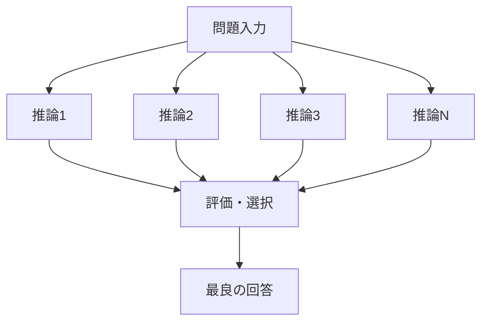
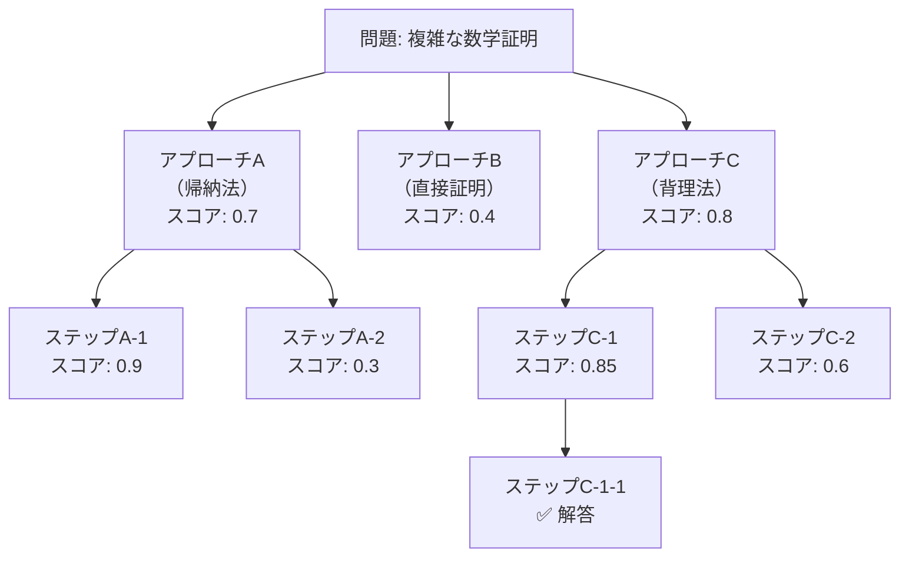
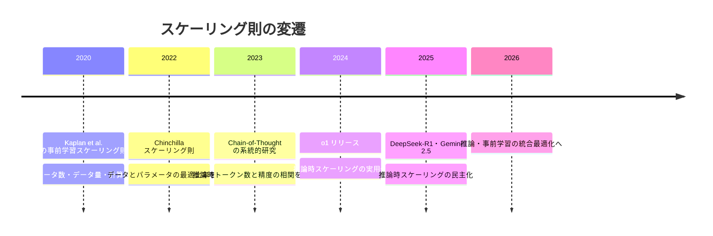
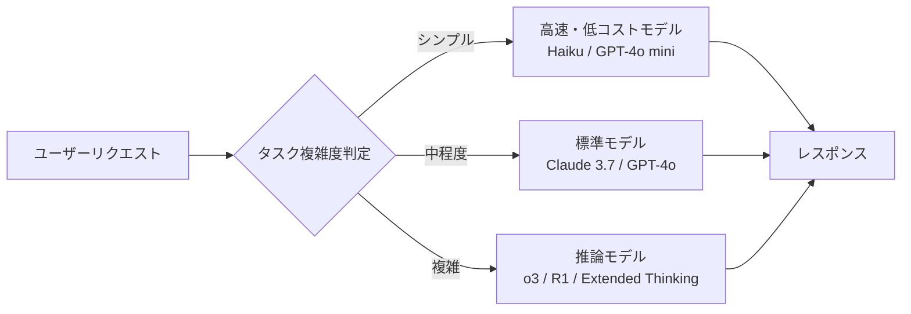

## はじめに：「考える時間」がモデルの性能を変える

2024〜2026年にかけて、LLMの世界に新しいスケーリングパラダイムが登場しました。それが**推論時スケーリング（Test-Time Compute Scaling）**です。

かつてのスケーリング則は「学習データを増やし、パラメータを増やし、計算資源を投じれば性能が上がる」という**事前学習スケーリング**が中心でした。しかし、このアプローチは急速にコスト壁・データ枯渇の問題に直面しつつあります。

そこで注目されたのが「**推論（Inference）の時間・計算量を増やすことで性能を向上させる**」という考え方です。

| スケーリング戦略 | 何を増やすか | 代表例 |
|----------------|-------------|--------|
| 事前学習スケーリング | パラメータ数・学習データ | GPT-4, Llama 3 |
| 推論時スケーリング | 推論ステップ数・サンプル数 | o1, o3, DeepSeek-R1, Claude 3.7 |

OpenAIが2024年9月に発表した **o1** を皮切りに、DeepSeek-R1、Claude 3.7 Sonnet Extended Thinking、Gemini 2.5 Flashと、主要モデルが続々と推論時スケーリングを採用しています。

この記事では、推論時スケーリングの**仕組み・主要技術・実装パターン**をエンジニア視点で解説します。

## 推論時スケーリングの直感的な理解

まず直感的な例から始めましょう。

あなたが試験を受けているとします。

- **戦略A**: 問題を見てすぐに答えを書く
- **戦略B**: 問題を見て、考えてメモを書き、考えをまとめてから答えを書く

戦略Bの方が難しい問題では有利なのは明らかです。しかし、これは「試験時間（推論時間）」をより多く使う戦略です。

LLMも同様です。**同じモデルでも、より多くの計算（トークン）を推論に使えば、より難しい問題を解けるようになります**。

```
 モデルの能力
      ↑
      │          ○ 推論時スケーリング後
      │        ●   
      │      ●     
      │    ●       ← 同じモデル・同じパラメータ
      │  ●         
      └──────────────────→ 推論時計算量
```

## 推論時スケーリングの主要技術

推論時スケーリングには複数のアプローチがあります。以下に代表的な4つを解説します。

### 1. Chain-of-Thought（CoT）：ステップを言語化する

最もシンプルな推論時スケーリングが**Chain-of-Thought（思考の連鎖）**です。

```python
# 通常のプロンプト
prompt_simple = """
問題: ジョンは15個のリンゴを持っていた。友人に5個あげ、
その後スーパーで3個買った。今何個持っているか？
答え:
"""
# モデル出力: "13個"

# Chain-of-Thoughtプロンプト
prompt_cot = """
問題: ジョンは15個のリンゴを持っていた。友人に5個あげ、
その後スーパーで3個買った。今何個持っているか？

ステップごとに考えてください。
答え:
"""
# モデル出力:
# 1. 最初: 15個
# 2. 友人に5個あげた: 15 - 5 = 10個
# 3. 3個買った: 10 + 3 = 13個
# よって、答えは13個
```

なぜCoTが機能するのか？LLMはオートレグレッシブ（左から右へ順番に）テキストを生成します。つまり**中間ステップを生成すること自体が「作業メモリ」として機能**し、後続のトークン生成が改善されます。

#### Zero-Shot CoT vs Few-Shot CoT

```python
# Zero-Shot CoT（「ステップごとに考えて」と指示するだけ）
zero_shot_cot = "...ステップごとに考えてください。"

# Few-Shot CoT（例題を数問見せる）
few_shot_cot = """
例1:
Q: ...
A: まず○○を計算します。次に△△します。よって答えは□□。

例2:
Q: ...
A: ...

本問:
Q: {実際の問題}
A:
"""
```

2022年の研究では、Few-Shot CoTはZero-Shot CoTより正確ですが、**モデルが十分に大きければ（70B+）Zero-Shot CoTも非常に有効**であることが示されています。

### 2. Best-of-N（BoN）：複数の回答から最良を選ぶ

**Best-of-N**は名前の通り、N回の独立した推論を行い、最もよいものを選ぶ手法です。



```python
import anthropic
import asyncio

client = anthropic.Anthropic()

async def best_of_n(problem: str, n: int = 8) -> str:
    """N回推論して最良の答えを選ぶ"""
    
    async def single_inference() -> str:
        response = client.messages.create(
            model="claude-3-7-sonnet-20250219",
            max_tokens=2000,
            messages=[{"role": "user", "content": problem}]
        )
        return response.content[0].text
    
    # N個の推論を並列実行
    tasks = [single_inference() for _ in range(n)]
    candidates = await asyncio.gather(*tasks)
    
    # 多数決（最も頻出の答えを採用）
    # 実際には専用の報酬モデルで評価するのが理想
    return majority_vote(candidates)

def majority_vote(candidates: list[str]) -> str:
    """最終行（答え）で多数決を取る"""
    from collections import Counter
    answers = [c.strip().split('\n')[-1] for c in candidates]
    return Counter(answers).most_common(1)[0][0]
```

Best-of-Nの性能向上は、**サンプル数を増やすにつれて対数的に改善**することが知られています。計算資源が推論時に移るトレードオフですが、特に正解が一意に評価可能な問題（数学・コーディング）では強力です。

### 3. プロセス報酬モデル（PRM）：思考過程を評価する

Best-of-Nでは「最終回答」を評価しますが、**プロセス報酬モデル（Process Reward Model, PRM）**は**各思考ステップの正確さ**を評価します。

```
Outcome Reward Model (ORM):
推論1 → 推論2 → 推論3 → 答え ← ここだけ評価

Process Reward Model (PRM):
推論1 → 推論2 → 推論3 → 答え
  ↑評価    ↑評価    ↑評価     ↑評価
```

PRMの利点：
- 途中で間違ったステップを検出できる
- より細かい学習信号でモデルを改善できる
- 推論プロセスの「解釈可能性」が向上する

```python
# PRM（プロセス報酬モデル）を使ったステップ評価の例
def evaluate_with_prm(reasoning_steps: list[str], prm_model) -> list[float]:
    """各ステップの正確さスコアを返す"""
    scores = []
    context = ""
    
    for step in reasoning_steps:
        # PRMに「ここまでの思考 + このステップ」を評価させる
        score = prm_model.score(context=context, step=step)
        scores.append(score)
        context += f"\n{step}"
    
    return scores

def beam_search_with_prm(problem: str, beam_width: int = 4, max_steps: int = 10):
    """PRM誘導のビームサーチ"""
    beams = [{"steps": [], "score": 1.0}]
    
    for _ in range(max_steps):
        candidates = []
        for beam in beams:
            # 各ビームを拡張
            next_steps = generate_next_steps(problem, beam["steps"], k=beam_width)
            for step in next_steps:
                score = prm_model.score(beam["steps"], step)
                candidates.append({
                    "steps": beam["steps"] + [step],
                    "score": beam["score"] * score
                })
        
        # スコア上位beam_widthを残す
        beams = sorted(candidates, key=lambda x: -x["score"])[:beam_width]
    
    return beams[0]["steps"]
```

### 4. モンテカルロ木探索（MCTS）：思考ツリーを探索する

最も高度な推論時スケーリング手法の一つが**モンテカルロ木探索（Monte Carlo Tree Search, MCTS）**です。ゲームAIで有名なAlphaGoでも使われた技術が、LLMの推論に応用されています。



MCTSは4つのフェーズを繰り返します：

1. **選択（Selection）**: UCT（Upper Confidence Bound for Trees）スコアに従ってノードを選択
2. **展開（Expansion）**: 新しい思考ステップを生成
3. **シミュレーション（Simulation）**: ロールアウトして結果を評価
4. **バックプロパゲーション（Backpropagation）**: スコアを親ノードに伝播

DeepMindの研究では、MCTSを用いた推論が数学オリンピックレベルの問題でも有効であることが示されています。

## 主要モデルの実装アプローチ比較

### OpenAI o1 / o3

OpenAIのo系列は、**強化学習（RL）による大規模CoT訓練**と推論時スケーリングを組み合わせています。

- 推論時に「extended thinking tokens」を内部的に使用
- 外部からはスタンダードなChat APIと同様に使える
- `reasoning_effort` パラメータで計算量を制御可能

```python
from openai import OpenAI

client = OpenAI()

# reasoning_effortで計算量を制御
response = client.chat.completions.create(
    model="o3",
    messages=[
        {
            "role": "user",
            "content": "フィボナッチ数列のn番目の数を求める最もメモリ効率のよい方法を説明し、実装してください。"
        }
    ],
    reasoning_effort="high"  # "low" | "medium" | "high"
)

print(response.choices[0].message.content)
# usage.reasoning_tokens で使用した推論トークン数を確認可能
print(f"推論トークン: {response.usage.completion_tokens_details.reasoning_tokens}")
```

### DeepSeek-R1

DeepSeekが2025年初頭に公開した**DeepSeek-R1**は、推論時スケーリングを実装したオープンソースモデルとして注目を集めました。

特徴的なのは**GRPO（Group Relative Policy Optimization）**という強化学習手法の採用です。

```python
# DeepSeek-R1はThinkingブロックが見える形で出力される
# <think>タグ内が推論プロセス

from openai import OpenAI  # DeepSeek APIはOpenAI互換

client = OpenAI(
    api_key="your_deepseek_api_key",
    base_url="https://api.deepseek.com"
)

response = client.chat.completions.create(
    model="deepseek-reasoner",  # R1モデル
    messages=[
        {"role": "user", "content": "素数を効率的に列挙するアルゴリズムを3つ比較してください。"}
    ]
)

# reasoning_content: 内部思考プロセス（<think>タグの内容）
print("思考プロセス:")
print(response.choices[0].message.reasoning_content[:500], "...")

# content: 最終回答
print("\n最終回答:")
print(response.choices[0].message.content)
```

### Claude 3.7 Sonnet（Extended Thinking）

Anthropicの**Extended Thinking**は、思考バジェット（budget_tokens）という概念で推論量を明示的に制御できます。

```python
import anthropic

client = anthropic.Anthropic()

response = client.messages.create(
    model="claude-3-7-sonnet-20250219",
    max_tokens=16000,
    thinking={
        "type": "enabled",
        "budget_tokens": 10000  # 思考に使えるトークン上限
    },
    messages=[{
        "role": "user",
        "content": "以下のシステムにおける競合状態（Race Condition）を特定し、修正案を提示してください。\n\n```python\nclass BankAccount:\n    def __init__(self, balance):\n        self.balance = balance\n    \n    def withdraw(self, amount):\n        if self.balance >= amount:\n            import time; time.sleep(0.01)  # DB操作の遅延をシミュレート\n            self.balance -= amount\n            return True\n        return False\n```"
    }]
)

# 思考ブロックと回答ブロックを分離
for block in response.content:
    if block.type == "thinking":
        print("🧠 思考プロセス（一部）:")
        print(block.thinking[:300], "...\n")
    elif block.type == "text":
        print("💬 回答:")
        print(block.text)
```

| モデル | 思考の可視性 | 計算量制御 | オープンソース |
|--------|------------|------------|----------------|
| o3 | 非公開 | `reasoning_effort` | ❌ |
| DeepSeek-R1 | `reasoning_content`で公開 | なし（モデル自律） | ✅ |
| Claude 3.7 Extended | `thinking`ブロックで公開 | `budget_tokens` | ❌ |
| Gemini 2.5 Flash | `thinking`で公開 | `thinking_config` | ❌ |

## エンジニアのための実践ガイド：いつ推論モデルを使うべきか

推論時スケーリングは強力ですが、**すべてのタスクに適しているわけではありません**。コストとレイテンシが増加するため、適切な使い分けが重要です。

### 推論モデルが有効なタスク

```
✅ 使うべきケース:
- 数学的な計算・証明
- 複雑なアルゴリズム設計
- バグの根本原因分析
- セキュリティ脆弱性の検出
- 複数ステップの論理推論
- コードの正確性が重要な場面
```

### 推論モデルが不要（または過剰）なタスク

```
❌ 不要なケース:
- 翻訳・要約などのシンプルなタスク
- 定型文の生成
- 単純なQ&A（ファクト検索）
- リアルタイム応答が必要なチャット
- 低コスト・高スループットが求められる処理
```

### コスト比較（2026年4月時点・概算）

| モデル | 入力コスト（/1M tokens） | 出力コスト（/1M tokens） | 推論トークン |
|--------|------------------------|------------------------|------------|
| Claude 3.5 Haiku | $0.80 | $4.00 | なし |
| Claude 3.7 Sonnet | $3.00 | $15.00 | 別途課金 |
| GPT-4o mini | $0.15 | $0.60 | なし |
| o3-mini | $1.10 | $4.40 | 含む |
| o3 | $10.00 | $40.00 | 含む |

## 実践パターン：ルーティングで使い分ける

実際のプロダクションでは、タスクの複雑さに応じてモデルを動的に切り替えるのが費用対効果の高い設計です。

```python
from enum import Enum
import re

class TaskComplexity(Enum):
    SIMPLE = "simple"
    MODERATE = "moderate"  
    COMPLEX = "complex"

def classify_task_complexity(user_query: str) -> TaskComplexity:
    """タスクの複雑さを分類する（簡易版）"""
    
    # 数学・コーディング・論理推論のキーワード
    complex_patterns = [
        r'証明して', r'アルゴリズム.*設計', r'バグ.*原因',
        r'最適化して', r'セキュリティ', r'競合状態', r'O\(n\)',
        r'数学的に', r'証明', r'定理'
    ]
    
    moderate_patterns = [
        r'比較して', r'分析して', r'設計', r'アーキテクチャ',
        r'ベストプラクティス', r'トレードオフ'
    ]
    
    for pattern in complex_patterns:
        if re.search(pattern, user_query):
            return TaskComplexity.COMPLEX
    
    for pattern in moderate_patterns:
        if re.search(pattern, user_query):
            return TaskComplexity.MODERATE
    
    return TaskComplexity.SIMPLE

def get_model_for_task(complexity: TaskComplexity) -> tuple[str, dict]:
    """タスク複雑さに応じたモデルと設定を返す"""
    
    if complexity == TaskComplexity.COMPLEX:
        return "claude-3-7-sonnet-20250219", {
            "thinking": {"type": "enabled", "budget_tokens": 8000}
        }
    elif complexity == TaskComplexity.MODERATE:
        return "claude-3-7-sonnet-20250219", {}
    else:
        return "claude-3-5-haiku-20241022", {}

# 使用例
import anthropic

client = anthropic.Anthropic()

def smart_query(user_input: str) -> str:
    complexity = classify_task_complexity(user_input)
    model, extra_params = get_model_for_task(complexity)
    
    print(f"[Router] タスク複雑度: {complexity.value} → モデル: {model}")
    
    response = client.messages.create(
        model=model,
        max_tokens=4096,
        messages=[{"role": "user", "content": user_input}],
        **extra_params
    )
    
    # Extended Thinkingの場合はtextブロックのみ返す
    for block in response.content:
        if hasattr(block, 'text'):
            return block.text
    
    return response.content[0].text
```

## 推論時スケーリングの理論的背景

### スケーリング則の変遷



### なぜ推論時スケーリングが機能するのか

理論的には、推論時スケーリングの効果は以下のモデルで説明できます：

1. **確率的探索の観点**: LLMは確率的に応答を生成します。Best-of-Nは確率分布の「尾」（rare but correct answers）をサンプリングする戦略です。

2. **Computation Graph の観点**: より多くの中間ステップを生成することは、より深い計算グラフを暗黙的に実行することと等価です。

3. **エラー修正の観点**: 思考ステップを言語化することで、自分の誤りを検出し修正できます（self-correction）。

## 推論時スケーリングの限界と注意点

### 1. コスト爆発のリスク

推論時スケーリングは**トークン消費量が大幅に増加**します。

```python
# 推論コストの見積もり
def estimate_cost(
    input_tokens: int,
    output_tokens: int,
    thinking_tokens: int,
    model: str = "claude-3-7-sonnet"
) -> float:
    pricing = {
        "claude-3-7-sonnet": {
            "input": 3.0 / 1_000_000,
            "output": 15.0 / 1_000_000,
            "thinking": 15.0 / 1_000_000  # 出力と同額
        }
    }
    p = pricing[model]
    return (
        input_tokens * p["input"] +
        output_tokens * p["output"] +
        thinking_tokens * p["thinking"]
    )

# 例: 1000トークン入力、500トークン出力、5000トークン思考
cost = estimate_cost(1000, 500, 5000)
print(f"推定コスト: ${cost:.4f}")  # $0.0825

# 思考なしの場合
cost_no_thinking = estimate_cost(1000, 500, 0)
print(f"思考なし: ${cost_no_thinking:.4f}")  # $0.0105

print(f"コスト比: {cost / cost_no_thinking:.1f}x")  # 約7.9倍
```

### 2. レイテンシの増大

思考プロセスが長くなるほど、最初のトークンが返るまでの時間（TTFT）が増加します。

- リアルタイムチャット: 推論モデルは向かない可能性
- バックグラウンド処理: 推論モデルが適している

### 3. ハルシネーションの残存

推論モデルでも、長い思考プロセスの中で**誤った前提を積み上げていく**ケースがあります。特に以下に注意：

- ファクトチェックが必要な主張（推論モデルも事実を正確に記憶しているとは限らない）
- 現実世界の最新情報（知識カットオフ後の情報）

### 4. 思考の可視化が必ずしも有益でない

DeepSeek-R1やClaude 3.7は思考プロセスを公開しますが、思考内容をユーザーに見せることが適切かは用途次第です。多くのプロダクション環境では思考を内部的に使い、最終回答のみを公開するのが一般的です。

## まとめ

推論時スケーリングは、LLMの性能向上に新しい軸をもたらした重要なパラダイムシフトです。

### 今日から使える実践ポイント

1. **タスクを選ぶ**: 数学・コーディング・複雑な推論には推論モデルを使う
2. **コストを計算する**: 思考トークンのコストを忘れずに見積もる
3. **ルーティングを実装する**: すべてのリクエストに推論モデルを使わない
4. **budget_tokensを調整する**: Claude 3.7では問題の難易度に応じてバジェットを変える
5. **評価指標を設定する**: 推論モデル導入前後でPass@1, Pass@N等の指標で効果測定する



推論時スケーリングは「お金さえかければ性能が出る」という側面がありますが、**どのタスクにいくら計算を投じるか**という設計判断こそがエンジニアの腕の見せ所です。

## 参考文献

- Wei et al. (2022) "[Chain-of-Thought Prompting Elicits Reasoning in Large Language Models](https://arxiv.org/abs/2201.11903)"
- Lightman et al. (2023) "[Let's Verify Step by Step](https://arxiv.org/abs/2305.20050)" (OpenAI PRM研究)
- DeepSeek-AI (2025) "[DeepSeek-R1: Incentivizing Reasoning Capability in LLMs via Reinforcement Learning](https://arxiv.org/abs/2501.12948)"
- Snell et al. (2024) "[Scaling LLM Test-Time Compute Optimally can be More Effective than Scaling Model Parameters](https://arxiv.org/abs/2408.03314)"
- OpenAI (2024) [Learning to Reason with LLMs](https://openai.com/index/learning-to-reason-with-llms/)
- Anthropic (2025) [Claude 3.7 Sonnet System Card](https://www.anthropic.com/claude/claude-3-7-sonnet)
