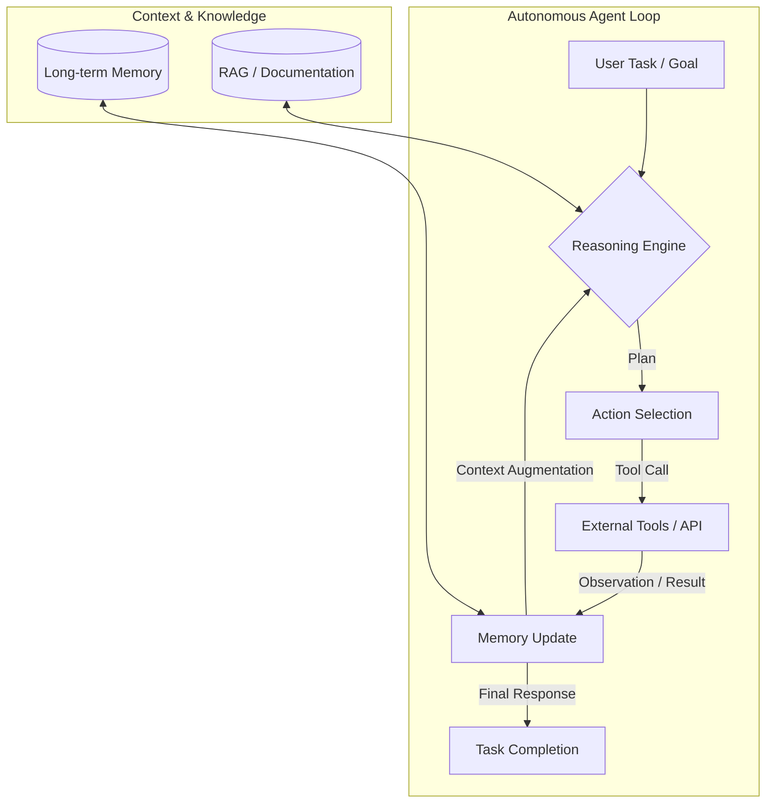

## はじめに

2024年から2025年にかけて、LLM（大規模言語モデル）は「指示に応答するチャットボット」から、「自律的にタスクを計画・実行するエージェント」へとその役割を劇的に変化させました。

現在、エンジニアが直面しているのは、単にプロンプトを最適化するフェーズではなく、**エージェントの「推論の深さ（Reasoning）」と「長期的な記憶（Memory）」をどのように制御し、信頼性を担保するか**というアーキテクチャ設計のフェーズです。

本記事では、AIエージェントの自律化における最新の技術トレンドと、本番環境への導入を阻む技術的課題について、エンジニア向けに深く掘り下げます。

## 1. 自律化を駆動する2つのコア・トレンド

エージェントの自律性を高める鍵は、**Reasoning（推論）**と**Memory（記憶）**の高度化にあります。

### 1.1 Reasoning-centric Workflow の台頭
従来の「一発回答」型プロンプトから、モデル自体が思考プロセス（Chain-und-Thought, Tree-of-Thoughts）を内包する、[reasoning-models](reasoning-models) の活用へとシフトしています。エージェントは、タスクをサブタスクに分解し、実行結果を振り返って次の行動を決定する「自己修正ループ」を回すことが標準となっています。

### 1.2 高度な Memory System の構築
エージェントが過去の試行錯誤を学習し、ユーザーの好みを維持するためには、単なる RAG（Retrieval-Augmented Generation）を超えた [memory-system](memory-system) の設計が不可欠です。
- **Short-term Memory**: 現在のコンテキストウィンドウ内での作業履歴。
- **Long-term Memory**: 過去の成功・失敗事例や、エージェントの「経験」を保存するベクトルデータベースやグラフ構造を用いた知識層。

## 2. エージェントの自律的ループ・アーキテクチャ

自律的なエージェントの基本サイクルは、以下の図のような「感知 $\rightarrow$ 思考 $\rightarrow$ 行動 $\rightarrow$ 観察」のループとして定義できます。



## 3. 実装例：ReActパターンを用いたエージェントの基本構造

以下に、Pythonを用いた、ツール呼び出しと自己修正を模したエージェントの簡略化された実装例を示します。

```python
# 必要なパッケージのインストール
# pip install openai typing

import json
from typing import List, Dict, Any

class SimpleAutonomousAgent:
    def __init__(self, tools: Dict[str, callable], memory: List[str]):
        self.tools = tools
        self.memory = memory
        self.max_iterations = 5

    def execute(self, task: str):
        print(f"🚀 Starting Task: {task}")
        current_task = task
        
        for i in range(self.max_iterations):
            print(f"\n--- Iteration {i+1} ---")
            
            # 1. Reasoning Step (Simulated LLM Call)
            # 実際にはここで OpenAI や Anthropic の API を呼び出し、
            # [reasoning-models] の力を借りて思考プロセスを生成します。
            thought = self._generate_thought(current_task)
            print(f"🧠 Thought: {thought}")

            # 2. Action Step
            action_info = self._parse_action(thought)
            if not action_info:
                print("✅ Task completed or no action needed.")
                break

            tool_name = action_info["tool"]
            tool_args = action_info["args"]

            # 3. Action Execution
            if tool_name in self.tools:
                print(f"🛠️ Executing Tool: {tool_name}({tool_args})")
                observation = self.tools[tool_name](**tool_args)
                print(f"👁️ Observation: {observation}")
                
                # 4. Memory Update
                self.memory.append(f"Action: {tool_name}, Result: {observation}")
                current_task = f"Based on observation '{observation}', continue the task: {task}"
            else:
                print(f"❌ Error: Tool {tool_name} not found.")
                break

        return "Final result achieved through loop."

    def _generate_thought(self, task: str) -> str:
        # 本来は LLM が思考を生成。ここではデモ用に固定の思考を返却。
        # 実際には Chain-of-HTML 等のプロンプトエンジニアリングが重要。
        return '{"thought": "I need to check the weather to plan the trip.", "action": "get_weather", "args": {"location": "Tokyo"}}'

    def _parse_action(self, thought_json: str) -> Dict[str, Any]:
        try:
            data = json.loads(thought_json)
            return {"tool": data["action"], "args": data["args"]}
        except:
            return None

# --- Tool Definition ---
def get_weather(location: str):
    return f"The weather in {location} is sunny and 25°C."

# --- Execution ---
if __name__ == "__main__":
    agent = SimpleAutonomousAgent(
        tools={"get_weather": get_weather},
        memory=[]
    )
    agent.execute("Plan a trip to Tokyo.")
```

## 4. 実装における3つの大きな課題

エージェントを実験環境から本番環境へ移行するには、以下の課題を解決する必要があります。

### 4.1 評価の困難性 (Evaluation)
エージェントの出力は決定論的ではなく、エージェントの「一連の行動（Trajectory）」全体を評価する必要があります。単一の応答に対する精度ではなく、[llm-evals](llm-evals) を用いて、ゴール到達率（Success Rate）や、中間ステップの正当性を体系的に測定する仕組みが求められています。

### 4.2 観測可能性とデバッグ (Observability)
エージェントが複雑な推論ループを回すと、どこで「迷走」したのかを特定するのが困難になります。そのため、各ステップのプロンプト、ツール呼び出し、メモリの遷移を可視化する [observability-guide](observability-guide) に基づくトレーサビリティの構築が、運用において極めて重要です。

### 4.3 効率性とコストの最適化 (Optimization)
自律的なループは、API呼び出し回数を劇的に増加させ、レイテンシとコストを押し上げます。特定のタスクに特化させるために、[finetuning-lora](finetuning-lora) を用いて、軽量なモデルでも高度なツール利用ができるようモデルを最適化するアプローチが、今後のデプロイ戦略の主流となるでしょう。

## まとめ

AIエージェントの自律化は、単なる「賢いLLM」の追求から、「高度な推論、記憶、そして検証可能な実行ループ」の設計へと進化しています。

エンジニアとしては、以下のステップを意識することが推奨されます：
1.  **Reasoning** のためのプロンプト・アーキテクチャの確立。
2.  **Memory** を活用したコンテキスト管理の設計。
3.  **Observability & Evaluation** を前提とした、信頼性の高いパイプラインの構築。
