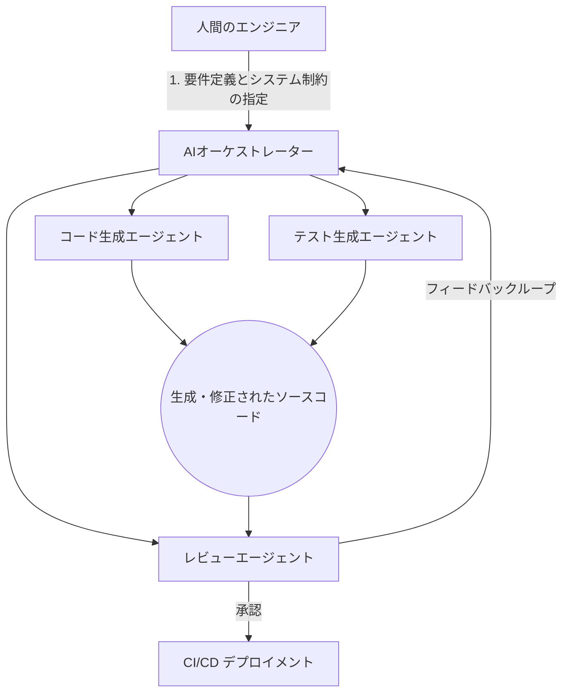

## はじめに

現代のソフトウェア開発において、生成AIを使用することはもはや「補助」ではなく「前提」となりました。コードの自動生成にとどまらず、設計やデバッグ、さらにはプロジェクト全体の管理に至るまで手助けしてくれる時代です。

本記事では、単なるプロンプト入力やコード補完を超え、自律型AIエージェントと共に複雑なシステムを構築する**「AIネイティブエンジニア」**になるための実践的Tipsと、知っておくべき最新のAIの仕組みについて解説します。

## 1. プロンプトから「コンテキスト・エンジニアリング」へ

上級者向けのAI活用として今最も重要なのが、「コンテキスト・エンジニアリング」です。
AIに対して単一の指示を出す（Prompting）のではなく、AIが推論を行うために必要な背景知識や制約条件（Context）を適切にシステム的に与える技術です。

### 良い例と悪い例の実践比較

AIにコードの最適化を依頼するケースを考えてみましょう。

```python
# 悪い例：コンテキストが欠如したリクエスト
# ❌ 「以下の関数を最適化して」

def calculate_total(items):
    total = 0
    for item in items:
        total += item.price * item.quantity
    return total
```
これでは、メモリ使用量を減らすべきか、実行速度を上げるべきか、あるいは可読性を重視すべきかAIには判断できません。

```python
# 良い例：コンテキストを精密に定義したリクエスト
# ⭕ 「この計算処理は毎秒数万回呼ばれるパフォーマンスクリティカルなパスです。
# ジェネレータやC拡張（Cython等）の利用も視野に入れ、実行速度を最優先にしたアーキテクチャ案を3つ提案し、
# そのうち最も高速なものを実装してください。」
```

AIネイティブエンジニアは、「要求」だけでなく**「非機能要件と背景」**をつねにセットにしてAIに渡すことで、高品質なアウトプットを引き出します。

## 2. AIエージェントとの協調アーキテクチャ

単発のプロンプト入力から進化し、現在ではファイル群を横断して自律的にタスクを遂行するエージェントを活用するケースが増えています。人間とAIプログラマーがどのように役割分担をするべきか、システム構成図を見てみましょう。



エージェントとの協調では、人間の役割は「コーダー」から「レビュアー」や「プロダクトマネージャー」へとシフトします。ここでのベストプラクティスは、**AIが迷わないようにマニュアル（ルール）をプロジェクト内に配置すること**です。

## 3. 最新LLMの仕組みと動向

AIネイティブエンジニアとして、裏側の仕組みを理解しておくことは、デバッグの効率化やAPIコストの最適化に直結します。ここ最近のアーキテクチャの進化を整理しましょう。

### MoEとグラウンデッドRAGの進化

現在、最高水準のアウトプットを出す巨大な言語モデル群は、内部的に多様な技術を組み合わせています。

| 技術 | 概要 | エンジニアが得る恩恵 |
| ---- | ---- | -------------- |
| **MoE (Mixture of Experts)** | タスクに応じて最適な「専門家」ニューラルネットワークがモデル内部で動的にルーティングされる仕組み | コーディングからロジック設計まで多様なタスクの高精度化と、推論の高速化 |
| **Grounded RAG** | 通常のRAG（検索拡張生成）を超え、出力に対する信頼性（出典情報）を逐次検証する仕組み | ハルシネーション（嘘）の劇的な減少と、最新のAPIリファレンスに基づいた正確なコードの生成 |
| **Agentic Workflow** | モデルが自ら「計画」「思考」「行動（ツール呼び出し）」のステップを踏むパラダイム | リポジトリ全体のマイグレーションなど、長期的で複雑な開発タスクの自動化 |

## 4. よくある問題と解決策

AIをチーム開発に導入する上で、よく直面する問題とその解決アプローチを紹介します。

**問題:** 「AIが独自のコーディング規約や古いライブラリ記述を使ってしまう」
**解決策:** 
リポジトリのルートに `.cursorrules` や `AGENTS.md` のようなAI向けのシステムプロンプト設定ファイルを作成します。そこで、プロジェクト固有のアーキテクチャ規約、優先すべきライブラリのバージョンを明文化し、AIに強制させます。

**問題:** 「コンテキストウィンドウが溢れてしまい、動作が遅くなる」
**解決策:** 
質問に関連するファイルのみをAIに提供するか、複雑すぎるモジュールは「インタフェース（型定義）」のみをコンテキストに含め、実装詳細は隠蔽するようにします。

## まとめと次のステップ

AIネイティブなエンジニアになるためには、「AIに何をどう書かせるか」だけでなく、**「AIが働きやすいシステムやドキュメントをどう設計・提供するか」**という一段上の抽象化の視点が必要です。

**次のステップとして推奨するアクション:**
1. 現在のプロジェクトのルートディレクトリにAI向けの開発ガイドライン（`rules.md` など）を配置する。
2. CI/CDパイプラインに、AIを用いた自動コードレビューのステップを試験的に導入してみる。
3. コードを書く前に、必ずAIに「実装設計の提案と代替案の出力」を求めてからコーディングを進める癖をつける。

AIは人間の創造性を代替するものではなく、スケールさせるための最強のツールです。これらのTipsを活用して、ぜひ生産性を次のレベルへと引き上げてください。
