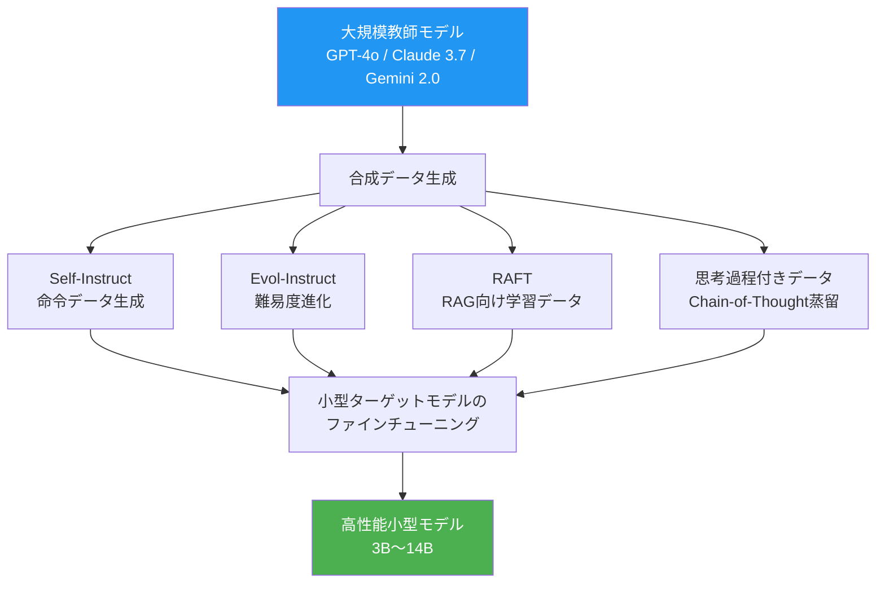
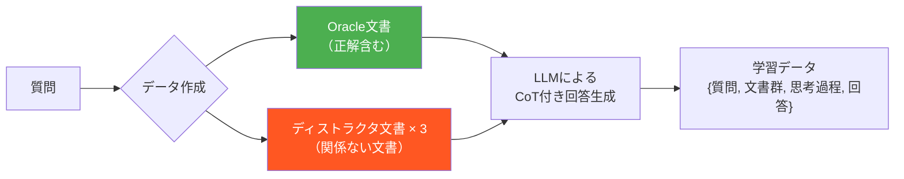
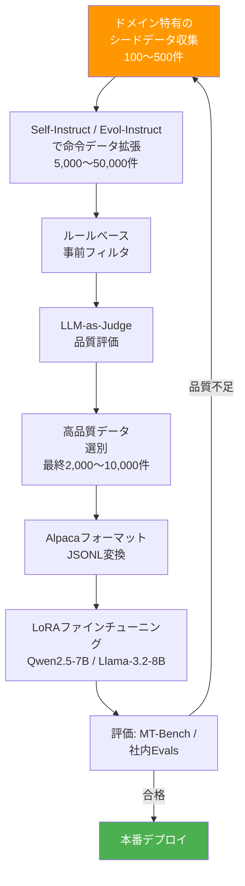

## はじめに：「データがない」は言い訳にならない時代

LLMのファインチューニングや独自モデル構築を検討したとき、多くのエンジニアが最初にぶつかる壁が**「良質なトレーニングデータが足りない」**という問題です。

しかし、2024〜2026年にかけての最も重要な発見の一つは、**LLM自身を使って高品質なトレーニングデータを生成できる**という事実です。

- **Phi-4**（Microsoft, 2024）：合成データを徹底活用して、パラメータ数14Bながら70B超のモデルと互角のベンチマーク性能を達成
- **DeepSeek-R1**：思考過程を示す合成データでReasoning能力を大幅に強化
- **Llama 3**（Meta）：Llama 2を使って生成した合成データでLlama 3を学習

「大きなモデルに小さなモデルを教師として鍛えさせる」——これが**知識蒸留（Knowledge Distillation）**と**合成データ生成**の核心です。

本記事では、この技術体系を実装レベルで解説します。

---

## 1. 合成データ生成の全体像

合成データ生成にはいくつかのアプローチがあります。それぞれの位置づけを整理しましょう。



| 手法 | 特徴 | 主な用途 |
|------|------|---------|
| **Self-Instruct** | シードから多様な命令データを自動生成 | 汎用的な指示追従能力 |
| **Evol-Instruct** | 既存命令を難易度・複雑さで進化させる | 難しいタスクへの対応力 |
| **RAFT** | ドキュメントと妨害文書を組み合わせた学習 | RAGシステムの回答精度向上 |
| **CoT蒸留** | 大モデルの思考過程を小モデルに転移 | Reasoning能力の獲得 |
| **リジェクションサンプリング** | 品質フィルタで高品質データだけ選別 | データ品質の担保 |

---

## 2. Self-Instruct：命令データを自己増殖させる

**Self-Instruct**（Wang et al., 2023）は、少量のシードとなる命令データからLLMを使って大量の命令データを生成する手法です。

### 基本的な実装

```python
from openai import OpenAI
import json
import random

client = OpenAI()

# シードとなる命令データ（少量でよい）
SEED_INSTRUCTIONS = [
    {"instruction": "Pythonでフィボナッチ数列を実装してください", "category": "coding"},
    {"instruction": "機械学習とディープラーニングの違いを説明してください", "category": "explanation"},
    {"instruction": "以下のJSONデータをCSVに変換するスクリプトを書いてください", "category": "data_transform"},
]

def generate_new_instructions(seeds: list[dict], n: int = 10) -> list[dict]:
    """シードを参考に新しい命令データを生成"""
    seed_examples = "\n".join([
        f"- [{s['category']}] {s['instruction']}"
        for s in random.sample(seeds, min(5, len(seeds)))
    ])

    prompt = f"""以下はプログラミングや技術に関する命令の例です：
{seed_examples}

上記と同様のスタイルで、異なるトピックや難易度の命令を{n}個生成してください。
各命令はユニークで、明確で、実行可能なものにしてください。

以下のJSON形式で出力してください：
{{
  "instructions": [
    {{"instruction": "命令文", "category": "カテゴリ"}}
  ]
}}"""

    response = client.chat.completions.create(
        model="gpt-4o",
        messages=[{"role": "user", "content": prompt}],
        response_format={"type": "json_object"},
        temperature=0.9  # 多様性のために高めに設定
    )

    return json.loads(response.choices[0].message.content)["instructions"]

def generate_response(instruction: str) -> str:
    """命令に対する高品質な回答を生成"""
    response = client.chat.completions.create(
        model="gpt-4o",
        messages=[
            {
                "role": "system",
                "content": "あなたは優秀なソフトウェアエンジニアです。質問や課題に対して、正確で実践的な回答を提供してください。"
            },
            {"role": "user", "content": instruction}
        ],
        temperature=0.3  # 回答は一貫性重視で低めに設定
    )
    return response.choices[0].message.content

def build_dataset(n_rounds: int = 5, n_per_round: int = 20) -> list[dict]:
    """Self-Instructデータセットを構築"""
    all_data = list(SEED_INSTRUCTIONS)  # シードデータから開始
    dataset = []

    for round_num in range(n_rounds):
        print(f"Round {round_num + 1}/{n_rounds}: {len(all_data)} 命令からデータ生成中...")

        # 新しい命令を生成
        new_instructions = generate_new_instructions(all_data, n=n_per_round)

        # 各命令に対する回答を生成
        for item in new_instructions:
            response = generate_response(item["instruction"])
            dataset.append({
                "instruction": item["instruction"],
                "input": "",
                "output": response,
                "category": item["category"]
            })
            all_data.append(item)  # 次のラウンドのシードに追加

    return dataset
```

---

## 3. Evol-Instruct：難易度を「進化」させて思考力を鍛える

**WizardLM**で採用された**Evol-Instruct**（Xu et al., 2023）は、既存の命令データを段階的に難化・複雑化させて、より高度な問題解決能力を引き出す手法です。

### 進化の種類

```python
EVOL_STRATEGIES = {
    "add_constraints": "以下の命令に、複数の制約や要件を追加して、より挑戦的にしてください",
    "deepen": "以下の命令を、より深い専門知識を要求するように書き換えてください",
    "concretize": "以下の命令を、より具体的な実装の詳細を求めるように変換してください",
    "increase_reasoning": "以下の命令を、複数ステップの推論や分析を必要とするように発展させてください",
    "breadth": "以下の命令に基づいて、全く新しい視点やドメインからの発展的な命令を作成してください",
}

def evolve_instruction(instruction: str, strategy_key: str) -> str:
    """命令を指定の戦略で進化させる"""
    strategy_prompt = EVOL_STRATEGIES[strategy_key]

    response = client.chat.completions.create(
        model="gpt-4o",
        messages=[
            {
                "role": "user",
                "content": f"""{strategy_prompt}

元の命令：
{instruction}

進化させた命令のみを出力してください（説明不要）。"""
            }
        ],
        temperature=0.8
    )
    return response.choices[0].message.content.strip()

def is_quality_instruction(original: str, evolved: str) -> bool:
    """進化した命令の品質チェック（ルールベース）"""
    # 短すぎるものは除外
    if len(evolved) < len(original) * 0.8:
        return False
    # 元の命令と同一のものは除外
    if evolved.strip() == original.strip():
        return False
    # 拒否フレーズを含む場合は除外
    rejection_phrases = ["I cannot", "申し訳", "不可能です", "できません"]
    if any(phrase in evolved for phrase in rejection_phrases):
        return False
    return True

def evol_instruct_pipeline(base_instructions: list[str], n_iterations: int = 3) -> list[dict]:
    """Evol-Instructパイプライン"""
    current_instructions = base_instructions.copy()
    all_evolved = []

    for iteration in range(n_iterations):
        next_instructions = []
        for inst in current_instructions:
            strategy = random.choice(list(EVOL_STRATEGIES.keys()))
            evolved = evolve_instruction(inst, strategy)

            if is_quality_instruction(inst, evolved):
                response = generate_response(evolved)
                all_evolved.append({
                    "instruction": evolved,
                    "output": response,
                    "evolution_depth": iteration + 1,
                    "strategy": strategy
                })
                next_instructions.append(evolved)
            else:
                next_instructions.append(inst)  # 品質不足なら元を保持

        current_instructions = next_instructions
        print(f"Iteration {iteration + 1}: {len(all_evolved)} 命令生成済み")

    return all_evolved
```

---

## 4. RAFT：RAGシステムに特化した合成学習データ

**RAFT（Retrieval Augmented Fine-Tuning）**（Zhang et al., 2024）は、RAGシステムで使う小型モデルのために設計された合成データ生成手法です。

通常のRAGでは、検索されたドキュメントのすべてが正解とは限りません。RAFTの発想は**「関係ないドキュメント（ディストラクタ）が混ざった状態でも正しく回答できるよう訓練する」**ことです。



```python
from typing import Optional
import random

def create_raft_sample(
    question: str,
    oracle_doc: str,
    distractor_docs: list[str],
    p_oracle: float = 0.8
) -> dict:
    """RAFTの学習サンプルを1件生成"""

    # 80%の確率でoracle文書を含める（残り20%はoracleなし）
    include_oracle = random.random() < p_oracle

    if include_oracle:
        all_docs = [oracle_doc] + random.sample(distractor_docs, min(3, len(distractor_docs)))
    else:
        all_docs = random.sample(distractor_docs, min(4, len(distractor_docs)))

    random.shuffle(all_docs)

    # 文書を番号付きでフォーマット
    context = "\n\n".join([f"[文書{i+1}]\n{doc}" for i, doc in enumerate(all_docs)])

    # CoT（Chain-of-Thought）付きの回答を生成
    prompt = f"""以下の文書群と質問をもとに、段階的な思考過程を示しながら回答してください。

文書群：
{context}

質問：{question}

回答の形式：
<thinking>
回答に使える関連情報を文書から特定し、推論過程を示してください。
</thinking>
<answer>
最終的な回答
</answer>"""

    response = client.chat.completions.create(
        model="gpt-4o",
        messages=[{"role": "user", "content": prompt}],
        temperature=0.2
    )

    return {
        "question": question,
        "context": context,
        "response": response.choices[0].message.content,
        "has_oracle": include_oracle
    }
```

---

## 5. 品質フィルタリング：データの「量」より「質」

合成データの最大の落とし穴は**品質のバラつき**です。大量生成して無選別で学習すると、むしろ性能が落ちることもあります。

### LLM-as-Judgeによる自動品質評価

```python
def evaluate_quality(instruction: str, response: str) -> dict:
    """LLM-as-Judgeでデータ品質を1〜5点で評価"""

    prompt = f"""以下の命令と回答のペアを、品質基準に従って評価してください。

命令：{instruction}
回答：{response}

以下の基準でそれぞれ1〜5点で評価し、JSON形式で返してください：
- accuracy: 事実的に正確か
- completeness: 要求された内容を網羅しているか
- clarity: 明確で理解しやすいか
- usefulness: 実際に役立つ情報か

{{
  "accuracy": 点数,
  "completeness": 点数,
  "clarity": 点数,
  "usefulness": 点数,
  "overall": 点数,
  "reason": "評価の理由"
}}"""

    response_obj = client.chat.completions.create(
        model="gpt-4o-mini",  # コスト削減のため軽量モデルを使用
        messages=[{"role": "user", "content": prompt}],
        response_format={"type": "json_object"}
    )

    return json.loads(response_obj.choices[0].message.content)

def filter_dataset(dataset: list[dict], min_score: float = 3.5) -> list[dict]:
    """品質スコアでデータセットをフィルタリング"""
    filtered = []
    for item in dataset:
        scores = evaluate_quality(item["instruction"], item["output"])
        if scores["overall"] >= min_score:
            item["quality_scores"] = scores
            filtered.append(item)

    print(f"フィルタリング: {len(dataset)} → {len(filtered)} ({len(filtered)/len(dataset)*100:.1f}%)")
    return filtered
```

### ルールベースの事前フィルタ（低コスト）

LLM評価は高コストなので、まずルールベースで明らかに低品質なデータを除外します。

```python
import re
from langdetect import detect

def rule_based_filter(item: dict) -> bool:
    """ルールベースの事前フィルタ"""
    instruction = item.get("instruction", "")
    output = item.get("output", "")

    # 1. 長さチェック
    if len(instruction) < 10 or len(output) < 20:
        return False
    if len(output) > 8000:  # 極端に長い回答を除外
        return False

    # 2. LLMの拒否フレーズ検出
    refusal_patterns = [
        r"申し訳.{0,20}(できません|不可能)",
        r"I (cannot|can't|am unable to)",
        r"As an AI",
        r"私はAIです",
    ]
    for pattern in refusal_patterns:
        if re.search(pattern, output, re.IGNORECASE):
            return False

    # 3. コードブロックの整合性チェック
    code_open = output.count("```")
    if code_open % 2 != 0:  # 開きっぱなしのコードブロック
        return False

    # 4. 言語チェック（日本語データの場合）
    try:
        lang = detect(instruction)
        if lang not in ["ja", "en"]:  # 想定外の言語を除外
            return False
    except Exception:
        pass

    return True
```

---

## 6. 実践：小型モデルのファインチューニングパイプライン全体像



### Alpacaフォーマットへの変換

```python
def to_alpaca_format(item: dict) -> dict:
    """汎用フォーマットをAlpaca（LLaMAファインチューニング標準）形式に変換"""
    return {
        "instruction": item["instruction"],
        "input": item.get("input", ""),
        "output": item["output"]
    }

def save_as_jsonl(dataset: list[dict], output_path: str):
    """JSONLファイルとして保存（多くのファインチューニングフレームワークが対応）"""
    import jsonlines
    with jsonlines.open(output_path, mode='w') as writer:
        for item in dataset:
            writer.write(to_alpaca_format(item))
    print(f"{len(dataset)} 件のデータを {output_path} に保存しました")
```

---

## 7. 合成データのコスト試算

実際にどの程度のコストで合成データを生成できるかを試算します。

| フェーズ | 使用モデル | 1件あたりコスト | 10,000件の総コスト |
|---------|-----------|--------------|-----------------|
| 命令生成（Self-Instruct） | gpt-4o-mini | $0.0002 | **$2** |
| 回答生成 | gpt-4o | $0.005 | **$50** |
| 品質評価（LLM-as-Judge） | gpt-4o-mini | $0.0003 | **$3** |
| **合計** | | **$0.0055** | **$55（約8,000円）** |

GPUでのファインチューニングコスト（7B, A100で4時間）を加えても、総コストは**1〜2万円程度**で高性能な業務特化モデルが構築できます。

---

## 8. 最新動向：合成データ生成の最前線

### 8.1 Phi-4のアプローチ（Microsoft, 2024）

Phi-4は**14Bモデルながらほぼすべての学習データが合成データ**という大胆なアプローチを採用しました。特徴的なのは：

- **Multi-Agent Synthetic Data**: 複数のAIが議論・批評し合いながらデータを生成
- **Diverse Seeds**: 教科書、コード、Webテキスト、問題集など多様な種類のシードを使用
- **Iterative Refinement**: 生成したデータで学習したモデルでさらに高品質なデータを生成する繰り返しプロセス

### 8.2 DeepSeek-R1の思考過程蒸留

DeepSeek-R1は`<think>...</think>`タグで囲まれた長い思考過程をデータとして学習しています。この手法を使えば、GPT-4oの思考過程を蒸留して、小型モデルにReasoning能力を付与できます：

```python
def generate_reasoning_data(problem: str) -> dict:
    """思考過程付きのトレーニングデータを生成"""

    response = client.chat.completions.create(
        model="o1",  # Reasoningモデルを教師として使用
        messages=[
            {
                "role": "system",
                "content": "問題を解く際は、<think>タグで詳細な思考過程を示してから、<answer>タグで最終回答を述べてください。"
            },
            {"role": "user", "content": problem}
        ]
    )

    return {
        "problem": problem,
        "full_response": response.choices[0].message.content,
        # 思考過程と回答を分離
        "has_reasoning": "<think>" in response.choices[0].message.content
    }
```

### 8.3 Constitutional AI（CAI）による安全な合成データ

Anthropicが提唱した**Constitutional AI**のアプローチでは、LLMに「憲法（principles）」を与え、自己批評・修正させることで、安全で倫理的な回答のデータを自律生成します。

```python
CONSTITUTION = """
以下の原則に従って回答を評価してください：
1. 人体への危害を促す内容を含まないこと
2. 個人のプライバシーを侵害しないこと
3. 特定の個人・集団を差別・中傷しないこと
4. 事実と意見を明確に区別すること
"""

def constitutional_refinement(instruction: str, initial_response: str) -> str:
    """Constitutionalアプローチで回答を安全に改善"""

    # ステップ1：自己批評
    critique_response = client.chat.completions.create(
        model="gpt-4o",
        messages=[
            {"role": "user", "content": f"""以下の回答を評価してください。

{CONSTITUTION}

命令：{instruction}
回答：{initial_response}

この回答に問題がある場合は具体的に指摘してください。問題がなければ「問題なし」と述べてください。"""}
        ]
    )
    critique = critique_response.choices[0].message.content

    if "問題なし" in critique:
        return initial_response

    # ステップ2：改善
    revised_response = client.chat.completions.create(
        model="gpt-4o",
        messages=[
            {"role": "user", "content": f"""以下の批評をもとに回答を改善してください。

批評：{critique}
元の回答：{initial_response}

改善された回答のみ出力してください。"""}
        ]
    )
    return revised_response.choices[0].message.content
```

---

## まとめ：合成データ生成を活用するための判断基準

合成データ生成は強力ですが、万能ではありません。どのような場面で使うべきか整理します。

### ✅ 合成データが有効なケース

- **ドメイン特化**：法律・医療・金融など特定分野の命令データが少ない
- **言語特化**：英語データは豊富だが日本語データが不足している
- **コスト削減**：GPT-4oのAPI呼び出しを減らして、社内ホスティングしたい
- **プライバシー**：顧客データをクラウドAPIに送れない環境でファインチューニングしたい

### ⚠️ 注意が必要なケース

- **教師モデルの利用規約確認**：OpenAI、AnthropicなどのAPIで生成したデータは、そのモデルの競合製品の学習には使えない（利用規約を要確認）
- **知識のフレッシュネス**：教師モデルの知識は学習カットオフで止まっている
- **ハルシネーション伝播**：教師モデルの誤りも学習してしまう

### 学習のロードマップ

1. [LoRAファインチューニング完全ガイド](/2026-03-24-llm-finetuning-lora-guide) でファインチューニングの基礎を理解する
2. 本記事の手法でドメイン特化データを生成する（まず100件から始める）
3. [LLM評価手法ガイド](/2026-03-14-llm-evals-guide) でファインチューニングの成果を定量評価する
4. 品質不足なら、データ生成戦略を改善して繰り返す

合成データ生成は「データがない」問題を解決する強力な武器です。ぜひ小さく実験を始めてみてください。

---

## 参考文献

- Wang et al., "Self-Instruct: Aligning Language Models with Self-Generated Instructions" (2023) — [arxiv.org/abs/2212.10560](https://arxiv.org/abs/2212.10560)
- Xu et al., "WizardLM: Empowering Large Language Models to Follow Complex Instructions" (2023) — [arxiv.org/abs/2304.12244](https://arxiv.org/abs/2304.12244)
- Zhang et al., "RAFT: Adapting Language Model to Domain Specific RAG" (2024) — [arxiv.org/abs/2403.10131](https://arxiv.org/abs/2403.10131)
- Microsoft Research, "Phi-4 Technical Report" (2024) — [arxiv.org/abs/2412.08905](https://arxiv.org/abs/2412.08905)
- Bai et al., "Constitutional AI: Harmlessness from AI Feedback" (2022) — [arxiv.org/abs/2212.08073](https://arxiv.org/abs/2212.08073)
