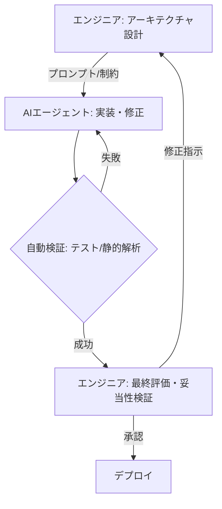

## はじめに

2026年現在、AIエージェントが自律的にコードを生成し、CI/CDパイプラインを回し、バグを修正することは、もはや驚くべきことではなくなりました。かつて「コパイロット」として補助的だったAIは、今や「エージェント」として開発プロセスの主導権を握りつつあります。

しかし、この圧倒的な開発スピードの裏側で、私たちは新たな、そして深刻な課題に直面しています。それが **「認知的負債（Cognitive Debt）」** です。

本記事では、AIネイティブな開発スタイルにおいてエンジニアがどのようにシステム思考を取り戻し、技術的な整合性を保ちながらAIの恩恵を最大化できるかを考察します。

---

## 認知的負債とは何か

認知的負債とは、**「開発者がシステム全体の挙動や特定のコードの意図を完全に理解できなくなることで生じる、メンタルモデルと実際のシステムの乖離」** を指します。

従来の「技術的負債（Technical Debt）」が、納期の優先などにより最適ではない実装を選択することで生じるのに対し、認知的負債は「自分が書いていない、あるいは理解が追いつかないスピードで生成されたコード」によって生じます。

### なぜAIエージェントが負債を加速させるのか

1.  **自律的な広域変更**: エージェントは一度の指示で数十個のファイルを横断的に変更します。人間がそのすべての変更の副作用をレビューするのは極めて困難です。
2.  **「動けば良い」という誘惑**: AIが生成したコードがテストをパスすると、内部構造を精査せずにマージしてしまう傾向が強まります。
3.  **コンテキストの断絶**: 3ヶ月前にAIが修正した箇所の「なぜこの構造にしたのか」という背景知識が、人間に残っていないケースが増えています。

---

## コード記述からシステム設計・検証への役割変化

2026年のエンジニアに求められる価値は、**「シンタックス（文法）」から「システム思考（構造）」** へと完全にシフトしました。

AIネイティブ・エンジニアの役割は、個別の関数を書くことではなく、システム全体のアーキテクチャを定義し、AIエージェントがその制約の中で正しく動くための「ガードレール」を設計することにあります。



---

## 実践的アプローチ：認知的負債を管理する3つの柱

### 1. AIエージェントのためのADR (Architecture Decision Records) の徹底

AIにコードを書かせる前に、必ず「なぜその設計にするのか」を人間が定義し、文書化させる必要があります。AIエージェント自身にADRを書かせ、それを人間がレビューするフローを構築しましょう。

以下は、AIエージェントがADRを生成するためのツール定義（JSON Schema）の例です。

```json
{
  "name": "generate_adr",
  "description": "システム設計の重要な決定を記録するADR（Architecture Decision Record）を生成します。",
  "parameters": {
    "type": "object",
    "properties": {
      "title": { "type": "string", "description": "決定内容の簡潔なタイトル" },
      "context": { "type": "string", "description": "なぜこの決定が必要になったかの背景" },
      "decision": { "type": "string", "description": "採用した解決策とアーキテクチャ" },
      "consequences": { "type": "string", "description": "この決定によって生じるメリットとリスク" }
    },
    "required": ["title", "context", "decision", "consequences"]
  }
}
```

### 2. DORAメトリクスの再定義（AI-Native Edition）

Delivery速度（Deployment Frequency）はAIにより飽和状態にあります。今注視すべきは、**理解可能性（Understandability）と回復性（Resilience）** です。

| メトリクス | AIネイティブな解釈 |
| :--- | :--- |
| **Change Failure Rate** | AI生成コードのデプロイ失敗率だけでなく、人間による「手戻り」率を見る |
| **MTTR** | AIが障害を自動検知し、安全にロールバック・修正できるまでの時間 |
| **Cognitive Traceability** | 特定の機能が、どのアーキテクチャ方針に基づいているかの明示率 |

### 3. 「契約による設計（Design by Contract）」の復活

AIエージェントは曖昧さに弱いため、インターフェースの境界を明確にする「契約」が必要です。厳格な型定義、事前条件・事後条件の明示、そしてTDD（テスト駆動開発）は、AI時代の最高のリスクヘッジになります。

---

## まとめ：指揮者としてのエンジニア

AIは優れた演奏家ですが、オーケストラの指揮者がいなければ不協和音を生み出します。認知的負債を恐れてAIを制限するのではなく、**「AIが理解しやすい、そして人間が俯瞰しやすいシステム構造」** を設計する能力を磨きましょう。

2026年のエンジニアリングとは、コードを書くことではなく、**「意志を構造に変換すること」** に他なりません。

---

### 関連記事

- [AIコーディングエージェント完全活用ガイド：Claude Code・Cursor・GitHub Copilotを使いこなす上級テクニック](/ai-agents/2026/03/15/ai-coding-agents-guide.html)
- [AIネイティブエンジニアへの道：生成AIを極める実践的Tipsと最新動向](/ai-agents/prompt-engineering/2026/04/13/ai-native-engineer-advanced-tips.html)

---

### 参考文献

- *Technology Radar Vol. 34 (April 2026)*: "Managing Cognitive Debt in the Generative Era"
- *The AI-Native SDLC Framework*: O'Reilly Media (2025)
- *Systems Thinking for Software Architects*: IEEE Software
