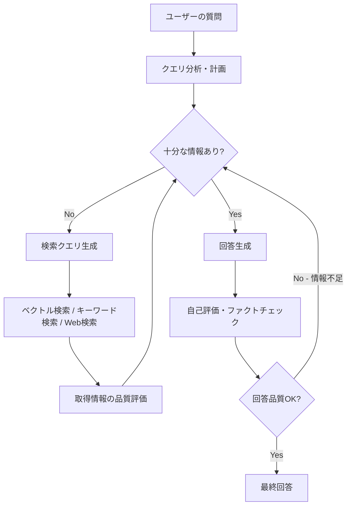
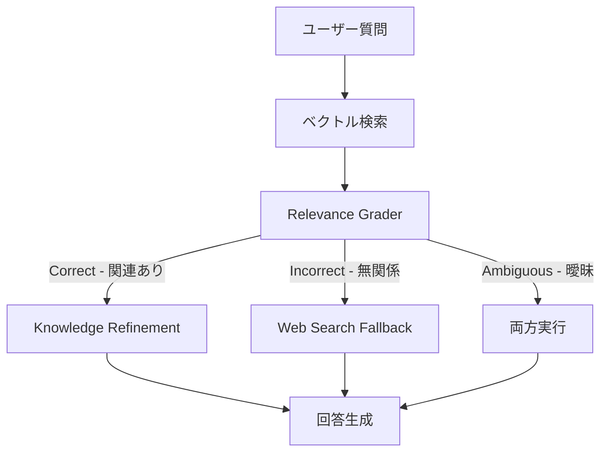
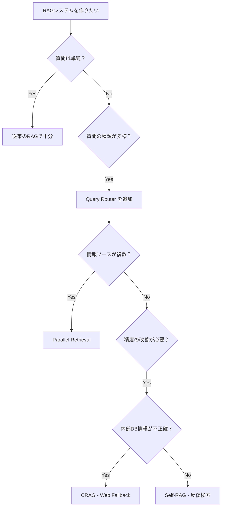

## はじめに：なぜ「普通のRAG」では限界なのか

RAG（Retrieval-Augmented Generation）はLLMの知識限界を補う強力なアーキテクチャパターンとして広く普及しました。しかし、本番環境で複雑な質問を処理しようとすると、従来のRAGには致命的な弱点があることがわかります。

**従来のRAGが失敗するシナリオ：**

- 「競合他社A社とB社のQ1売上を比較して、過去3年のトレンドも踏まえて分析して」（複数ソース・複数観点が必要）
- 「このバグの根本原因を探って、関連コードを全部確認して」（反復的な調査が必要）
- 「最新の製品仕様書を元に、既存のFAQと矛盾点がないか確認して」（クロスリファレンスが必要）

これらは、**一度の検索クエリで必要な情報をすべて取得することが構造的に不可能**なケースです。従来のRAGは「クエリ → 検索 → 生成」という直線的パイプラインであるため、複雑な情報ニーズに対応できません。

そこで登場したのが **Agentic RAG** です。

---

## Agentic RAGとは

Agentic RAGとは、**LLMエージェントが検索戦略そのものを自律的に計画・実行・改善するアーキテクチャ**です。

固定パイプラインではなく、エージェントが：

1. 質問を分析して検索計画を立てる
2. 必要に応じて複数回・複数ソースへの検索を実行する
3. 取得した情報の品質を自己評価する
4. 情報が不十分なら検索クエリを改善して再試行する
5. 十分な情報が揃ったら回答を生成する



### 従来のRAGとAgentic RAGの比較

| 観点 | 従来のRAG | Agentic RAG |
|------|----------|-------------|
| 検索回数 | 1回固定 | 必要に応じて複数回 |
| クエリ戦略 | 固定 | 動的に生成・改善 |
| 情報ソース | 単一 | 複数（DB・Web・APIなど）|
| 品質評価 | なし | 自己評価ループあり |
| 複雑な質問への対応 | 弱い | 強い |
| レイテンシ | 低い | やや高い |

---

## コアパターン1：Query Router（クエリルーター）

最もシンプルなAgentic RAGの始まりは、クエリの種類を判別してルーティングすることです。

```python
from openai import OpenAI
from typing import Literal
from pydantic import BaseModel

client = OpenAI()

class QueryRoute(BaseModel):
    route: Literal["vector_db", "web_search", "sql_database", "direct_answer"]
    reason: str
    rewritten_query: str  # 検索に最適化されたクエリ

def route_query(user_question: str) -> QueryRoute:
    """
    質問の種類を判別して最適な検索ルートを選択する。
    - 社内ドキュメントに関する質問 → vector_db
    - 最新ニュースや現在の情報 → web_search
    - 数値集計・レポート系 → sql_database
    - 一般知識・定義 → direct_answer（検索不要）
    """
    response = client.beta.chat.completions.parse(
        model="gpt-4.1",
        messages=[
            {
                "role": "system",
                "content": """あなたは質問を分析し、最適な情報ソースにルーティングするエージェントです。
                
                利用可能なルート:
                - vector_db: 社内ドキュメント、マニュアル、過去の会議録、仕様書
                - web_search: 最新ニュース、現在の価格、リアルタイム情報、2025年以降の出来事
                - sql_database: 売上データ、ユーザー統計、在庫情報などの構造化データ
                - direct_answer: LLMの知識で直接回答可能（一般定義、歴史的事実など）
                
                rewritten_queryは検索精度を最大化するために最適化してください。"""
            },
            {"role": "user", "content": user_question}
        ],
        response_format=QueryRoute,
    )
    return response.choices[0].message.parsed

# 使用例
question = "先月の東日本エリアの売上トップ5製品と、それぞれの前月比を教えて"
route = route_query(question)
print(f"ルート: {route.route}")
print(f"最適化クエリ: {route.rewritten_query}")
# → ルート: sql_database
# → 最適化クエリ: 東日本エリア 売上 上位5製品 月次比較 前月比
```

---

## コアパターン2：Self-RAG（自己評価型RAG）

取得した情報の関連性を自己評価し、不十分なら再検索を行うパターンです。2023年の論文「Self-RAG: Learning to Retrieve, Generate, and Critique through Self-Reflection」で提案された手法を実装に落とし込みます。

```python
from dataclasses import dataclass
from typing import Optional

@dataclass
class RetrievalResult:
    chunks: list[str]
    relevance_scores: list[float]
    query_used: str

@dataclass
class RAGState:
    original_question: str
    current_query: str
    retrieved_chunks: list[str]
    iteration: int
    answer: Optional[str] = None
    is_sufficient: bool = False

def evaluate_relevance(question: str, chunks: list[str]) -> dict:
    """取得したチャンクの質問への関連性を評価する"""
    response = client.chat.completions.create(
        model="gpt-4.1",
        messages=[
            {
                "role": "system",
                "content": """取得したテキストチャンクが質問に答えるのに十分かどうか評価してください。
                JSONで回答:
                {
                  "is_sufficient": bool,  // 回答生成に十分か
                  "missing_info": str,    // 不足している情報（ある場合）
                  "refined_query": str,   // 次の検索クエリの改善案（不十分な場合）
                  "relevance_score": float  // 0.0〜1.0
                }"""
            },
            {
                "role": "user",
                "content": f"質問: {question}\n\n取得チャンク:\n" + "\n---\n".join(chunks[:3])
            }
        ],
        response_format={"type": "json_object"}
    )
    import json
    return json.loads(response.choices[0].message.content)

def agentic_rag_pipeline(question: str, vector_store, max_iterations: int = 3) -> str:
    """
    自己評価ループを持つAgentic RAGパイプライン。
    情報が不十分なら最大max_iterations回まで再検索する。
    """
    state = RAGState(
        original_question=question,
        current_query=question,  # 初回は原文クエリを使用
        retrieved_chunks=[],
        iteration=0
    )
    
    while state.iteration < max_iterations and not state.is_sufficient:
        # 検索実行
        results = vector_store.search(state.current_query, top_k=5)
        new_chunks = [r.text for r in results]
        state.retrieved_chunks.extend(new_chunks)
        state.iteration += 1
        
        # 自己評価
        evaluation = evaluate_relevance(question, state.retrieved_chunks)
        state.is_sufficient = evaluation["is_sufficient"]
        
        print(f"[反復{state.iteration}] 関連度スコア: {evaluation['relevance_score']:.2f}")
        
        if not state.is_sufficient:
            print(f"  不足情報: {evaluation['missing_info']}")
            state.current_query = evaluation["refined_query"]
            print(f"  次のクエリ: {state.current_query}")
    
    # 最終回答生成
    context = "\n\n".join(state.retrieved_chunks)
    response = client.chat.completions.create(
        model="gpt-4.1",
        messages=[
            {"role": "system", "content": "以下のコンテキストのみを根拠に質問に回答してください。情報が不足している場合は正直に述べてください。"},
            {"role": "user", "content": f"コンテキスト:\n{context}\n\n質問: {question}"}
        ]
    )
    return response.choices[0].message.content
```

---

## コアパターン3：マルチエージェント検索（Parallel Retrieval）

複雑な質問を分解して並列検索するパターンです。LangGraphを使った実装例を示します。

```python
import asyncio
from langgraph.graph import StateGraph, END
from typing import TypedDict, Annotated
import operator

class AgenticRAGState(TypedDict):
    question: str
    sub_questions: list[str]           # 分解されたサブ質問
    retrieved_contexts: Annotated[list[str], operator.add]  # 並列取得結果をマージ
    final_answer: str

async def decompose_question(state: AgenticRAGState) -> AgenticRAGState:
    """複雑な質問をサブ質問に分解する"""
    response = client.chat.completions.create(
        model="gpt-4.1",
        messages=[
            {
                "role": "system",
                "content": """質問を回答に必要な独立したサブ質問に分解してください。
                JSONで["サブ質問1", "サブ質問2", ...]形式で返してください。
                単純な質問なら分解不要（1要素のリスト）。"""
            },
            {"role": "user", "content": state["question"]}
        ],
        response_format={"type": "json_object"}
    )
    import json
    result = json.loads(response.choices[0].message.content)
    state["sub_questions"] = result if isinstance(result, list) else list(result.values())[0]
    return state

async def parallel_retrieve(state: AgenticRAGState, vector_store) -> AgenticRAGState:
    """サブ質問に対して並列で検索を実行する"""
    async def retrieve_one(sub_q: str) -> str:
        # ベクトル検索（実際はasyncに対応したクライアントを使う）
        results = await asyncio.to_thread(
            vector_store.search, sub_q, top_k=3
        )
        return f"[{sub_q} への検索結果]\n" + "\n".join(r.text for r in results)
    
    # 全サブ質問を並列実行
    contexts = await asyncio.gather(
        *[retrieve_one(q) for q in state["sub_questions"]]
    )
    state["retrieved_contexts"] = list(contexts)
    return state

async def synthesize_answer(state: AgenticRAGState) -> AgenticRAGState:
    """複数の検索コンテキストを統合して最終回答を生成する"""
    all_context = "\n\n".join(state["retrieved_contexts"])
    response = client.chat.completions.create(
        model="gpt-4.1",
        messages=[
            {
                "role": "system",
                "content": "複数の情報ソースを統合して、元の質問に対する包括的な回答を生成してください。"
            },
            {
                "role": "user",
                "content": f"元の質問: {state['question']}\n\n収集した情報:\n{all_context}"
            }
        ]
    )
    state["final_answer"] = response.choices[0].message.content
    return state

# LangGraphでフローを定義
def build_agentic_rag_graph(vector_store):
    graph = StateGraph(AgenticRAGState)
    graph.add_node("decompose", decompose_question)
    graph.add_node("retrieve", lambda s: asyncio.run(parallel_retrieve(s, vector_store)))
    graph.add_node("synthesize", synthesize_answer)
    
    graph.set_entry_point("decompose")
    graph.add_edge("decompose", "retrieve")
    graph.add_edge("retrieve", "synthesize")
    graph.add_edge("synthesize", END)
    
    return graph.compile()
```

---

## 上級テクニック：Corrective RAG（CRAG）

2024年に発表されたCorrective RAG（CRAG）は、取得した情報が「誤り」「無関係」「関連あり」の3種類に分類し、誤りや無関係の場合はWeb検索にフォールバックする手法です。



```python
from enum import Enum

class RelevanceGrade(str, Enum):
    CORRECT = "correct"       # 質問に直接関連
    INCORRECT = "incorrect"   # 無関係・有害
    AMBIGUOUS = "ambiguous"   # 部分的に関連

def grade_document_relevance(question: str, document: str) -> RelevanceGrade:
    """
    取得したドキュメントが質問に対して関連性があるかを採点する。
    これがCRAGのコア判定ロジック。
    """
    response = client.chat.completions.create(
        model="gpt-4.1",
        messages=[
            {
                "role": "system",
                "content": """取得したドキュメントが質問への回答に役立つか評価してください。
                - correct: 質問に直接答えられる情報が含まれている
                - incorrect: 質問と無関係、または誤解を招く情報
                - ambiguous: 部分的に関連するが不完全
                
                "correct", "incorrect", "ambiguous"のいずれかのみを返してください。"""
            },
            {
                "role": "user",
                "content": f"質問: {question}\n\nドキュメント: {document[:500]}"
            }
        ]
    )
    grade = response.choices[0].message.content.strip().lower()
    return RelevanceGrade(grade)

def crag_pipeline(question: str, vector_store, web_search_fn) -> str:
    """CRAG（Corrective RAG）パイプライン"""
    # Step 1: 通常のベクトル検索
    retrieved = vector_store.search(question, top_k=5)
    
    # Step 2: 各ドキュメントを採点
    grades = [grade_document_relevance(question, doc.text) for doc in retrieved]
    
    correct_docs = [doc for doc, g in zip(retrieved, grades) if g == RelevanceGrade.CORRECT]
    ambiguous_docs = [doc for doc, g in zip(retrieved, grades) if g == RelevanceGrade.AMBIGUOUS]
    
    contexts = []
    
    # Step 3: correctなドキュメントは知識精製（重要部分の抽出）
    for doc in correct_docs:
        refined = refine_knowledge(question, doc.text)  # 要点抽出
        contexts.append(refined)
    
    # Step 4: incorrectが多い、またはambiguousが多い場合はWeb検索
    incorrect_count = grades.count(RelevanceGrade.INCORRECT)
    if incorrect_count > len(grades) / 2 or len(correct_docs) == 0:
        web_results = web_search_fn(question)
        contexts.extend(web_results)
        print(f"[CRAG] Web検索にフォールバック（不適切率: {incorrect_count}/{len(grades)}）")
    elif ambiguous_docs:
        # ambiguousはWeb検索で補完
        web_results = web_search_fn(question)
        contexts.extend(web_results)
    
    # Step 5: 最終回答生成
    return generate_answer(question, contexts)
```

---

## 実装時の落とし穴と対策

### 1. 無限ループの防止

自己評価ループを持つシステムで最も注意すべきは**無限ループ**です。

```python
MAX_ITERATIONS = 3  # 必ず上限を設定
CONFIDENCE_THRESHOLD = 0.75  # 十分と判断するスコアの閾値

# タイムアウトも設定する
import asyncio

async def safe_agentic_rag(question: str, timeout_seconds: int = 30):
    try:
        return await asyncio.wait_for(
            agentic_rag_pipeline_async(question),
            timeout=timeout_seconds
        )
    except asyncio.TimeoutError:
        return "検索に時間がかかりすぎました。質問をより具体的にしてみてください。"
```

### 2. コストとレイテンシの管理

Agentic RAGは反復実行によりコストが増大します。

| パターン | API呼び出し回数 | 想定コスト（相対比） |
|---------|---------------|-------------------|
| 従来のRAG | 1回 | 1x |
| Self-RAG（3反復） | 最大7回 | 3〜5x |
| Parallel RAG（5サブ質問） | 6〜11回 | 4〜8x |
| CRAG | 2〜5回 | 2〜4x |

**コスト削減の鉄則：採点・評価モデルには軽量モデルを使う**

```python
# ルーティング・評価には軽量モデル
grader_model = "gpt-4.1-mini"  # または Claude Haiku

# 最終回答生成だけ高精度モデル
answer_model = "gpt-4.1"
```

### 3. オブザーバビリティの確保

Agentic RAGは動作が非決定的なため、ロギングが重要です。

```python
import structlog

log = structlog.get_logger()

def logged_retrieval(question: str, query: str, iteration: int, results: list):
    log.info(
        "agentic_rag.retrieval",
        original_question=question,
        search_query=query,
        iteration=iteration,
        chunks_retrieved=len(results),
        top_score=results[0].score if results else 0,
    )
```

---

## まとめ：どのパターンを選ぶか



| ユースケース | 推奨パターン |
|-----------|------------|
| シンプルなFAQbot | 従来のRAG |
| 複数DBを持つ社内ツール | Query Router |
| 調査・レポート生成 | Parallel RAG + Self-RAG |
| 最新情報が重要な用途 | CRAG |
| エンタープライズ向け汎用 | Query Router + Self-RAG + CRAG の組み合わせ |

Agentic RAGは「複雑な質問を確実に処理する」ための強力なアーキテクチャです。ただし、コスト・レイテンシ・複雑性が増すトレードオフもあります。システムの要件と利用者の期待に合わせて、必要最小限のパターンから始め、段階的に自律性を高めていくことを推奨します。

---

## 関連記事

- [エンベディング完全ガイド2026：ベクトル検索・類似度計算・RAG強化の実践テクニック](/embedding-vector-search-guide)
- [マルチエージェントシステムの設計パターン](/multi-agent-system-design-patterns)
- [LLMオブザーバビリティ：本番LLMシステムの監視・デバッグ戦略](/llm-observability-guide)
- [AIエージェントの自律化における最新トレンドと課題](/trends-in-autonomous-ai-agents)
