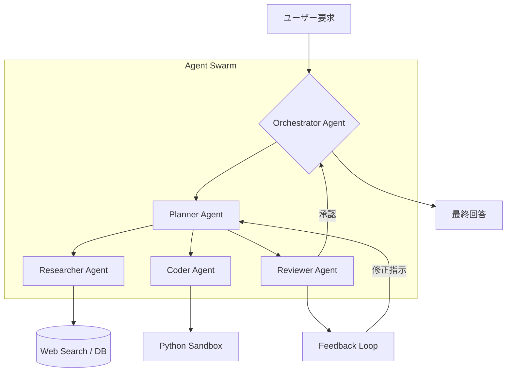

## はじめに

2024年から2025年にかけて、LLM（大規模言語モデル）は「人間の問いに答えるツール」から「自律的にタスクを遂行するエージェント」へと劇的な進化を遂げました。現在、エンジニアに求められているのは、単にプロンプトを操ることではなく、複数のエージェントを組み合わせ、複雑なワークフローを構築する**エージェント・オーケストレーション**の設計能力です。

本記事では、2026年現在の最新トレンドである「Reasoning-driven Planning」と、自律化エージェントを実装する際に直面する、評価・観測性・最適化という3つの大きな技術的課題について解説します。

## AIエージェントの進化：Reasoning-centric な設計へ

これまでのエージェントは、ReAct（Reasoning and Acting）プロンプレキングに代表されるように、一歩ずつ「思考」と「行動」を繰り返す手法が主流でした。しかし、最新のトレンドは、**Reasoning Models（推論モデル）**をプランニングの核に据えた設計へと移行しています。

以前のモデルでは、複雑なタスクに対してエージェントが迷走（Looping）する問題が頻発していました。しかし、[reasoning-models](../reasoning-models.md) の普及により、エージェントは実行前に「長期的な計画」を立て、自己批判（Self-Correction）を行う能力を格段に向上させています。

### マルチエージェント・オーケストレーションの構造

現在の主流は、単一の強力なエージェントではなく、特定の役割（Role）を持った複数のエージェントが協調する**Multi-Agent Systems (MAS)** です。



このアーキテクチャでは、Orchestratorが全体の進捗を管理し、各エージェントが専門的なツール（Web Search, Code Interpreter等）を使い分けます。また、エージェント間のコンテキスト維持には、高度な[memory-system](../memory-system.md) の設計が不可欠です。

## 実装例：ReActパターンのエージェント・ループ

以下に、Pythonを用いた、自律的な思考と実行の最小構成（ReActパターン）を示します。このコードは、モデルが「思考(Thought)」「行動(Action)」「観察(Observation)」を繰り返すプロセスを模倣しています。

```python
import json
from typing import List, Dict

# 実行環境のモック
class ToolEnvironment:
    def execute_python(self, code: str) -> str:
        # 実際の実装では、安全なサンドボックス環境で実行する
        try:
            return f"Successfully executed: {code}"
        except Exception as e:
            return f"Error: {str(e)}"

class AutonomousAgent:
    def __init__(self, model_client, tools: Dict):
        self.model = model_client
        self.tools = tools
        self.memory: List[str] = []

    def run(self, prompt: str, max_steps: int = 5):
        self.memory.append(f"User Task: {prompt}")
        
        for step in range(max_steps):
            print(f"\n--- Step {step + 1} ---")
            
            # 1. Thought & Action Generation
            # 実際にはLLM APIへのリクエスト（prompt + memory）
            response = self.model.generate_action(self.memory)
            thought = response['thought']
            action = response['action']
            action_input = response['action_input']
            
            print(f"Thought: {thought}")
            print(f"Action: {action}({action_input})")
            
            self.memory.append(f"Thought: {thought}")
            self.memory.append(f"Action: {action}({action_input})")

            if action == "finish":
                print(f"Final Result: {action_input}")
                break

            # 2. Tool Execution
            if action in self.tools:
                observation = self.tools[action](action_input)
                print(f"Observation: {observation}")
                self.memory.append(f"Observation: {observation}")
            else:
                error_obs = f"Error: Tool {action} not found."
                print(error_obs)
                self.memory.append(f"Observation: {error_obs}")
        else:
            print("Agent reached max steps without finishing.")

# --- Usage Example ---
class MockLLM:
    def generate_action(self, history: List[str]) -> Dict:
        # 本来はここにLLMのAPIコールが入る
        # step 1 のレスポンスをシミュレート
        if "User Task" in history[0] and len(history) < 3:
            return {
                "thought": "I need to check the current status using the python tool.",
                "action": "python_exec",
                "action_input": "print('Status: Active')"
            }
        return {
            "thought": "I have obtained the status. Task complete.",
            "action": "finish",
            "action_input": "The system status is Active."
        }

# 実行
env = ToolEnvironment()
tools = {"python_exec": env.execute_python}
agent = AutonomousAgent(model_client=MockLLM(), tools=tools)
agent.run("Check the system status.")
```

## 自律化における3つの技術的課題

エージェントの自律性が高まるにつれ、開発者は以下の3つの深刻な課題に直面します。

### 1. 信頼性の評価（Evaluation）
エージェントの動作は非決定的であり、従来の単一プロンプトの評価では不十分です。エージェントの「軌跡（Trajectory）」全体を評価する必要があります。
そのためには、[llm-evals](../llm-evals.md) の手法を用い、エージェントが「正しいステップを踏んだか」「ツールを正しく使用したか」をステップごとにスコアリングする、LLM-as-a-Judgeの仕組みを構築することが重要です。

### 2. 観測性とデバッグ（Observability）
マルチエージェント・システムでは、どのエージェントがどのタイミングで誤った判断を下したのかを追跡するのが極めて困難です。
[observability-guide](../observability-guide.md) で詳述しているように、OpenTelemetryなどの標準規格を用いたトレースの実装が必須となります。エージェントの思考プロセス（Chain-of-Thought）を可レートなログとして可視化し、LangSmithやArize Phoenixのようなツールでスパン（Span）を追跡できる環境を構築しなければなりません。

### 3. コストとパフォーマンスの最適化
自律的なループは、1つのタスクに対して数十回のLLM呼び出しを発生させます。これはコストとレイテンシの爆発を意味します。
この課題に対し、単純なプロンプトエンジニアリングだけでなく、特定のタスクに特化した[finetuning-lora](../finetuning-lora.md) を活用し、軽量なモデルでも高度な指示に従えるようにモデルを最適化するアプローチが、実用的なエージェント開発の鍵となります。

## まとめ

AIエージェントの自律化は、ソフトウェアエンジニアリングのあり方を根本から変えつつあります。これからのエンジニアには、単なる「コードの記述」ではなく、「エージェントの思考プロセス、ツール、記憶、評価系を統合したシステムアーキテクチャの設計」が求められます。

**次のステップへの推奨事項:**
- まずは単一エージェントのReActループを実装し、[memory-system](../memory-system.md) を組み込んでみること。
- 評価パイプラインを構築し、[llm-evals](../llm-evals.md) の概念をエージェントの検証に適用すること。

---
**参考文献・出典:**
- *OpenAI: Reasoning models and the future of planning (2024)*
- *Research Paper: "Agentic Workflow: The New Frontier of LLM Applications"*
- *LangChain Documentation: Multi-agent Orchestration Patterns*