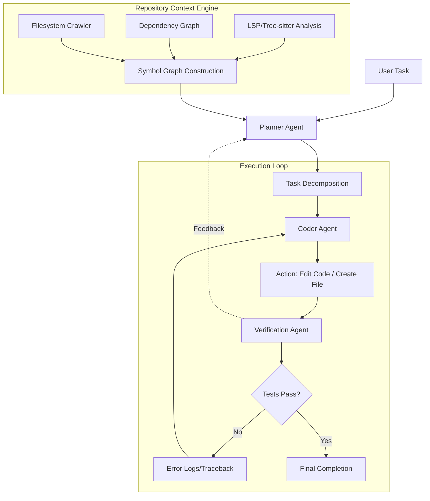

## はじめに

2024年から2025年にかけて、AIによるコーディングは「スニペットの生成」から「ファイル単位の編集」へと進化しました。CursorやClaude Codeといったツールの登場により、エンジニアは単一の関数やクラスのロジックをAIに任せることが可能になりました。

しかし、真に生産性を変革する**LLM-driven Software Engineering (LLM4SE)**の領域は、まだ始まったばかりです。次なるフロンエントは、リポジトリ全体の依存関係、ディレクトリ構造、ビルドパイプライン、さらには設計思想（Architecture Decision Records）を深く理解し、**「リポジトリ全体にわたる大規模なリファクタリング」や「アーキテクチャの変更」を自律的に遂行するエージェント**の構築です。

本記事では、中級〜上級エンジニアに向けて、大規模なコードベースをコンテキストとして扱うためのエージェント設計パターンと、LSP（Language Server Protocol）を活用した高度なコンテキストエンジニアリングの手法を解説します。

## LLM4SEの核心：Repository-scale Context Engineering

エージェントがリポジトリ全体を操作する際の最大の障壁は、**コンテキスト・ウィンドウの限界**と**ノイズの混入**です。リポジトリ内の全ファイルをプロンプトに投入することは、コストと精度の両面で不可能です。

成功するLLM4SEエージェントには、以下の3つのレイヤーが必要です。

1.  **Structural Layer (静的解析)**: ファイル構成、ディレクトリ構造、シンボル（クラス・関数）の定義。
2.  **Relational Layer (依存関係)**: インポートグラフ、呼び出しグラフ（Call Graph）。
3.  **Semantic Layer (意味論的理解)**: 各モジュールが担う責務、ドキュメント、ビジネスロジックの意図。

これらを統合的にエージェントに提示する「Repository-scale Context Engineering」が、[コンテキストエンジニアリング：LLMのパフォーマンスを最大化するコンテキスト設計術](_posts/2025-01-10-context-engineering-guide.md)の究極形となります。

## エージェントの設計アーキテクチャ

リポジトリ全体を操作するエージェントは、単なる「チャットボット」ではなく、**「Plan-Act-Verify」のループ**を持つ自律的なシステムとして設計する必要があります。



### 1. Planner Agent（計画層）
ユーザーの抽象的な要求（例：「既存のREST APIをGraphQLに移行せよ」）を、具体的なファイル編集リストとステップに分解します。この際、[推論モデル完全活用ガイド](_posts/2025-02-15-reasoning-models-guide.md)で述べた、o3やDeepSeek-R1のような「思考型モデル」をPlannerに割り当てることが重要です。

### 2. Coder Agent（実行層）
分解されたタスクに基づき、実際にコードを書き換えます。ここでは、[LLM Tool Calling上級ガイド](_posts/2025-03-20-llm-tool-calling-guide.md)で解説した、ファイル読み書きや検索ツールの正確な呼び出しが求められます。

### 3. Verification Agent（検証層）
変更後のコードが、既存のテストを破壊していないか、型定義に違反していないかを検証します。`pytest`や`jest`の実行結果、およびLSPによる静的解析エラーをフィードバックします。

## 実践：LSPを活用したシンボル・インジェクション

エージェントにリポジトリの構造を教える際、最も効果的なのは**LSP（Language Server Protocol）の出力を構造化して注入すること**です。これにより、エージェントは「どの関数がどこで定義され、どこから呼ばれているか」を、全ファイルを読まずとも把握できます。

以下に、Pythonを用いたエージェント用コンテキスト抽出の簡易的な実装例を示します。

```python
import subprocess
import json

class RepositoryContextEngine:
    """
    リポジトリ内のシンボル情報を抽出し、
    エージェントが理解しやすい形式で提供するエンジン
    """
    def __init__(self, repo_path: str):
        self.repo_path = repo_path

    def get_symbol_definitions(self, file_path: str):
        """
        tree-sitterやLSPの出力をシミュレートし、
        指定されたファイルのクラス・関数定義を抽出する
        """
        # 本来はpyrightやclangdなどのLSPサーバーに問い合わせる
        # ここではデモとして、簡易的な正規表現ベースの抽出を行う
        definitions = []
        try:
            with open(f"{self.repo_path}/{file_path}", 'r') as f:
                lines = f.readlines()
                for i, line in enumerate(lines):
                    if line.strip().startswith(("def ", "class ")):
                        definitions.append({
                            "line": i + 1,
                            "symbol": line.strip(),
                            "context": "".join(lines[max(0, i-2):i+1]) # 前後の文脈を含める
                        })
        except Exception as e:
            print(f"Error parsing {file_path}: {e}")
        
        return definitions

    def build_context_prompt(self, target_file: str):
        """
        エージェントに送るための、高度に構造化されたコンテキストを作成
        """
        symbols = self.get_symbol_definitions(target_file)
        
        prompt_segments = [
            f"### File: {target_file}",
            "### Symbol Definitions (extracted via LSP-like analysis):"
        ]
        
        for s in symbols:
            prompt_segments.append(f"- Line {s['line']}: {s['symbol']}\n  Context: `{s['context'].strip()}`")
            
        return "\n".join(prompt_segments)

# --- 使用例 ---
if __name__ == "__main__":
    # 擬似的なリポジトリ構造の準備
    engine = RepositoryContextEngine(repo_path=".")
    
    # エージェントに渡すための、リポジトリ構造を凝縮したプロンプトを生成
    # ターゲットとするファイルに対して、シンボル情報のみを抽出して注入
    enhanced_context = engine.build_context_prompt("app/main.py")
    
    print("--- Generated Context for Agent ---")
    print(enhanced_context)
```

この実装のポイントは、**「ファイルの中身を全部見せるのではなく、重要な『目印（Symbols）』とその『文脈』だけを、構造化して見せる」**点にあります。これにより、[LLMコスト最適化](_posts/2025-04-10-llm-cost-optimization-guide.md)を実現しつつ、高精度な編集が可能になります。

## LLM4SEにおける課題と解決策

### 1. 依存関係の連鎖的破壊
一つのファイルを修正すると、その関数に依存している他のファイルが壊れる問題（Regression）。
* **解決策**: [LLMアプリケーションのテスト戦略](_posts/202s-03-25-llm-testing-strategy.md)を、エージェントのワークフローに組み込む。修正のたびに、影響範囲（Impact Analysis）をLSPで特定し、関連するテストケースを自動実行する。

### 2. コンテキストの断片化
大規模なリファクタリングでは、複数のファイルにまたがる変更が必要。
* **解決策**: [マルチエージェントシステム設計パターン](_posts/2025-02-01-multi-agent-patterns.md)を採用し、「変更計画を立てるエージェント」「実装を行うエージェント」「検証を行うエージェント」に役割を分離する。

## まとめ

LLM-driven Software Engineeringは、単なるコード生成の自動化ではなく、**「ソフトウェアの設計意図を理解し、構造を維持したまま進化させる」**プロセスです。

エンジニアが目指すべきは、LLMを単なる「書き手」として使うのではなく、LSPやグラフ構造といった**「リポジトリの構造的知見」をLLMに注入する、高度なオーケストレーター**として扱うことです。

次のステップとして、[Agentic RAG完全ガイド](_posts/2025-05-20-agentic-rag-guide.md)で扱われるような、コードベース特化型の検索・抽出技術を学習することをお勧めします。

---
**参考文献・関連リンク**
- [Model Context Protocol (MCP) 完全ガイド](_posts/2025-01-01-mcp-guide.md)
- [LLM-as-a-Judge による自動評価パイプライン構築](_posts/2025-04-05-llm-as-a-judge-guide.md)
