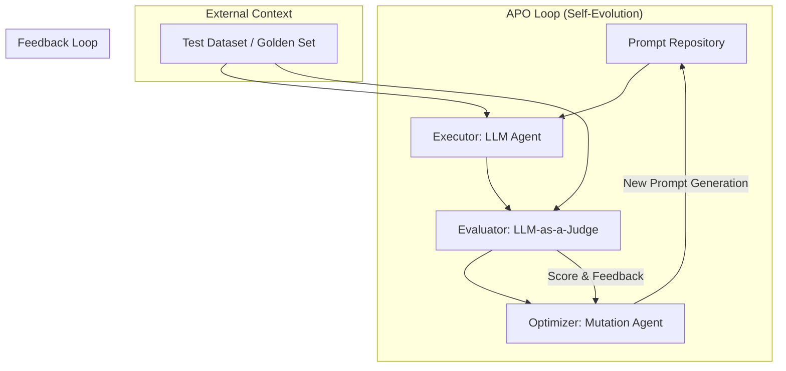

プロンプトエンジニアリングの歴史において、2026年は「人間による手動の試行錯誤」が終焉を迎えた年として記憶されることになるでしょう。

これまでのプロンプトエンジニアリングは、エンジニアがLLMの出力を観察し、指示（Instruction）を微調整する、極めて反復的で職人芸的なプロセスでした。しかし、**Self-Evolving Prompt Optimization (APMT/APO)** の台頭により、プロンプトは「書くもの」から、報酬関数（Reward Function）に従って「進化させるもの」へと変貌を遂げました。

本記事では、AIエージェントが自律的にプロンプトを改善・最適化する技術、APOの核心的なメカニズム、アーキテクチャ、および実装へのアプローチを、中〜上級エンジニア向けに深く掘り下げます。

## 1. APOの本質：プロンプトの「勾配なき最適化」

従来のディープラーニングにおける重み更新は、誤差逆伝播法（Backpropagation）による勾配を利用します。一方、プロンプトは離散的なテキストデータであるため、微分不可能です。

APOは、この微分不可能な領域において、**「LLM-as-a-Judge」** と **「Iterative Mutation」** を組み合わせることで、擬似的な勾配更新を実現する技術です。エージェントは、プロンプトの変更（Mutation）が、評価指標（Metric）をどれだけ向上させたかをフィードバックとして受け取り、次世代のプロンプトを生成します。

### APOの基本アーキテクチャ

APOのシステムは、主に以下の4つのコンポーネントで構成されます。



1.  **Executor (実行器)**: 現在のプロンプトを用いて、テストデータセットに対して推論を実行します。
2.  **Evaluator (評価器)**: 実行結果を、正解データ（Golden Set）または評価基準に基づき、スコアリングおよび定性的なフィードリレー（何が足りないか）を生成します。
3.  **Optimizer (最適化器)**: 評価結果を解析し、既存のプロンプトをどのように書き換えるべきかを決定する、いわば「プロンプトの勾配」を計算する役割を担います。
4.  **Prompt Repository (管理層)**: 最適化されたプロンプトの履歴（Version Control）を保持します。

## 2. 実装：Pythonによる自律的プロンプト最適化のプロトタイプ

以下に、Pythonを用いて「抽出タスクのプロンプトを自律的に改善する」極めてシンプルなAPOエージェントのコード例を示します。ここでは、OpenAIのAPIを利用した構成を想定しています。

```python
import openai
import re
from typing import List, Dict

class PromptOptimizerAgent:
    def __init__(self, api_key: str, model: str = "gpt-4o"):
        self.client = openai.OpenAI(api_key=api_key)
        self.model = model
        self.history = []

    def evaluate(self, prompt: str, test_cases: List[Dict[str, str]]) -> float:
        """
        評価器 (Evaluator): 実行結果を正解データと比較し、正解率を算出する
        """
        correct_count = 0
        for case in test_abilities:
            response = self.client.chat.completions.create(
                model=self.model,
                messages=[{"role": "system", "content": prompt},
                          {"role": "user", "content": case["input"]}]
            )
            output = response.choices[0].message.content.strip()
            # 簡易的な一致確認（実際にはJSONパースやF1スコアを用いる）
            if output == case["expected"]:
                correct_count += 1
        
        return correct_count / len(test_cases) if test_cases else 0

    def mutate(self, current_prompt: str, feedback: str) -> str:
        """
        最適化器 (Optimizer): フィードバックに基づきプロンプトを書き換える
        """
        mutation_instruction = (
            f"Current Prompt: {current_prompt}\n"
            f"Feedback: {feedback}\n"
            "Task: Rewrite the prompt to improve accuracy based on the feedback. "
            "Return only the new prompt text."
        )
        
        response = self.client.chat.completions.create(
            model=self.model,
            messages=[{"role": "user", "content": mutation_instruction}]
        )
        return response.choices[0].message.content.strip()

    def run_evolution_loop(self, initial_prompt: str, test_cases: List[Dict[str, str]], iterations: int = 3):
        """
        進化ループの実行
        """
        current_prompt = initial_prompt
        best_score = 0.0
        
        for i in range(iterations):
            print(f"--- Iteration {i+1} ---")
            score = self.evaluate(current_prompt, test_cases)
            print(f"Current Score: {score}")

            if score > best_score:
                best_score = score
                self.history.append((current_prompt, score))
            
            # 評価に基づいたフィードバック生成（簡易化のため、スコアのみをフィードバックとする）
            feedback = f"The current accuracy is {score}. Improve the instructions to handle edge cases."
            
            # プロンプトの進化
            current_prompt = self.mutate(currentrightarrow, feedback)
            print(f"New Prompt Generated: {current_prompt[:100]}...")

        return self.history[0] # 最も良かったプロンプトを返す（簡易実装）

# --- 使用例 ---
if __name__
if __name__ == "__main__":
    # テストデータセット (Golden Set)
    test_abilities = [
        {"input": "Apple is a fruit.", "expected": "fruit"},
        {"input": "Python is a programming language.", "expected": "language"},
        {"input": "Tokyo is a city.", "expected": "city"}
    ]

    # 初期プロンプト（意図的に不完全なもの）
    initial_p = "Extract the main subject from the text."

    # 実行 (APIキーは環境変数から取得)
    import os
    optimizer = PromptOptimizerAgent(api_key=os.getenv("OPENAI_API_KEY"))
    best_result = optimizer.run_evolution_loop(initial_p, test_abilities, iterations=3)

    print("\n[Optimization Complete]")
    print(f"Best Prompt Found: {best_result[0]}")
    print(f"Achieved Score: {best_result[1]}")
```

## 3. 実装における高度なテクニック

実運用レベルのAPOを構築する場合、単なる「書き換え」だけでは不十分です。以下の要素を組み込むことが、2026年における標準的なアーキテクチャです。

### 3.1 DSPy的アプローチ：プログラムとしてのプロンプト
[DSPy](https://github.com/stanfordnlp/dspy) の概念に倣い、プロンプトを「Instruction」だけでなく、「Signature（入力と出力の型定義）」として扱う手法が主流です。これにより、Optimizerはテキストの書き換えだけでなく、論理的なステップ（Chain-of-Thought）の追加や、Few-shot例の選択（Dynamic Example Selection）を行うことが可能になります。

### 3.2 評価指標の多角化 (Multi-Metric Evaluation)
Accuracy（正解率）だけでは、LLMの「ハルシネーション」や「出力形式の崩れ」を検知できません。
- **Format Adherence**: JSON形式が維持されているか。
- **Semantic Similarity**: BERTScoreなどを用いた、意味的な類似性。
- **Robustness**: 入力にノイズ（誤字脱字）が含まれていても耐えられるか。

### 3.3 探索と活用（Exploration vs. Exploitation）
最適化プロセスには、既存の成功パターンを強化する「Exploitation」と、全く新しい指示を試す「Exploration」のバランスが必要です。シミュレーテッド・アニーリング（Simulated Annealing）のアルゴリズムを導入し、初期段階では大胆な変更を許容し、後半では微細な調整に移行する制御が有効です。

## 4. 課題と今後の展望

APOは非常に強力ですが、エンジニアが留意すべき「負の側面」も存在します。

1.  **Evaluation Drift（評価のドリフト）**: 
    評価器（LLM-as-a-Judge）自体のバイアスが、プロンプトの進化を誤った方向（例：長い回答を好む、など）へ導くリスクがあります。
2.  **Cost & Latency**: 
    数千回の反復試行は、莫大なAPIコストと時間を消費します。Small Language Models (SLM) をOptimizerとして活用し、コストを抑えるアーキテクチャへの移行が進んでいます。
3.  **Optimization Collapse**: 
    特定のテストケースに対してのみ過学習（Overfitting）し、未知のデータに対して性能が低下する現象。

## まとめ

Self-Evolving Prompt Optimization (APO) は、AIエージェントの自律性を一段上のレベルへと引き上げる技術です。プロンプトを「静的な指示書」としてではなく、「動的なパラメータ」として捉え直すことで、私たちはより堅牢で、自己修復可能なAIシステムを構築できるようになります。

次世代のAIエンジニアには、プロンプトを書くスキル以上に、**「進化を管理するアーキテクチャを設計するスキル」**が求められています。

---
*関連する関連記事:*
- [LLM-as-a-Judge: 信頼できる自動評価器の設計手法]
- [Agentic Workflowにおける反復的推論の最適化]
